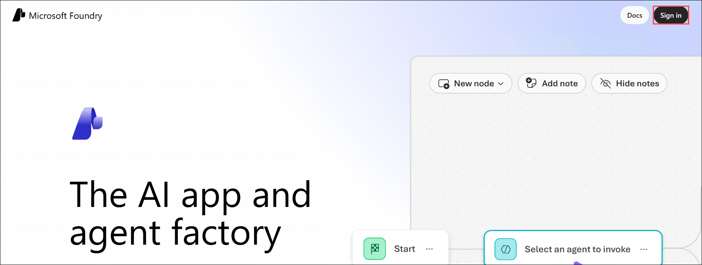

# Lab 2a: Explore Content Safety in Microsoft Foundry

Azure AI services empower users to build intelligent applications using pre-built and customizable APIs and models. In this exercise, you'll explore Azure AI Content Safety, a service that enables moderation of text and image content. Using the Microsoft Foundry portal, Microsoft's platform for creating intelligent applications, you'll utilize Azure AI Content Safety to categorize text and assign severity scores.

> **Note**: This exercise aims to provide a general understanding of how Azure AI services are provisioned and utilized. Content Safety is used as an example; comprehensive knowledge of content safety is not required for this exercise.

## Lab Overview

In this lab, you will create an Microsoft Foundry project, configure resources, and explore how to moderate text content using Azure AI Content Safety.

## Lab Objectives

By the end of this lab, you will be able to:

- Task 1: Create and configure a project in Microsoft Foundry.
- Task 2: Use Azure AI Content Safety to moderate text content.

## Exercise 1: Explore Content Safety in Microsoft Foundry

### Task 1: Create a project in the Microsoft Foundry portal

In this task, we are creating an Microsoft Foundry project and configuring necessary resources to explore AI language capabilities in the Language Playground.

1. Open the **Microsoft Foundry** portal by navigating to the following link in a new browser tab: [Microsoft Foundry](https://ai.azure.com?azure-portal=true) `https://ai.azure.com?azure-portal=true`.

1. On the **Microsoft Foundry** home page, look at the top right corner and click the **Sign in** button to log in.

   

1. If prompted to sign in, enter your credentials.
 
   - **Email/Username:** <inject key="AzureAdUserEmail"></inject>
 
   - **Password:** <inject key="AzureAdUserPassword"></inject>
 
1. If prompted to stay signed in, you can click **No**.

   .png)

1. On the **Microsoft Foundry** homepage, click on the **New Foundry** toggle.

   .png)

1. In the **Select a project to continue** dialog, click on the **drop-down (1)** icon and select **Create a new project (2)**.

   .png)

1. On the **Create a project** pane, enter project name **Myproject<inject key="DeploymentID" enableCopy="false" /> (1)** and then select **Advanced options (2)**.

1. On the **Create a project** pane, Configure it with the following settings:

   - **Subscription**: Use existing Azure subscription **(3)**
   - **Resource group**: Select **AI-900-Module-02 (4)**
   - **Microsoft foundry resource**: Leave default **(5)**
   - **Location**: Select **<inject key="location" enableCopy="false"/> (6)**
   - Click on **Create (7)**

      .png)

1. On the **Microsoft Foundry** (preview) page, toggle off the **New Foundry** tab.

   .png)

   >**Note:** If Feedback pop-up window appears, click on **Continue without feedback**.

### Task 2: Try Out Text Moderation with Content Safety in Microsoft Foundry Portal

In this task, you will test text moderation using Azure AI Content Safety to categorize and assess the severity of different text samples.

1. Now on the Project home page, from the left navigation menu, select **Guardrails + controls (1)** and then click on **Try it out (2)**.

   .png)

1. On the **Guardrails + Controls** page, under **Filter text content**, select **Moderate text content**.

   .png)

1. On the Moderate text content page, under the Try it out section, select the **Azure AI Services (1)** resource you just created from the drop-down menu. Then, under **Run a simple test**, click the **Safe content (2)** tile. You’ll see the text appear in the box below.

   .png)

1. Click **Run test**. Running a test calls the Content Safety Service's deep learning model, which has been trained to recognize unsafe content.

   .png)

1. In the **View results (2)** panel, inspect the results. There are four severity levels from safe to high, and four types of harmful content.

1. Now, select **Violent content with misspelling** box. 

   .png)

1. Make sure the selected content appears in the box below, then click **Run test (1)**. Inspect the results in the **View results (2)** panel again.

   .png)

You can run tests on all the samples provided and inspect the results to understand how the Content Safety service evaluates different types of content.

## Review

In this lab, you have completed the following tasks:

- Created a project in the Microsoft Foundry portal and configured necessary resources.
- Explored the Content Safety service within the Microsoft Foundry portal.
- Performed text moderation tests on sample content using Azure AI Content Safety.

### You have successfully completed this lab.