# Lab 07: Use Question Answering with the Language Studio

## Lab overview
In this exercise, you will use Language Studio to create and train a knowledge base of questions and answers. Content for the knowledge base will come from an existing FAQ page on the website of Margie’s Travel, a fictitious travel agency. You will then use Language Studio to see how it would work when used by customers.

Azure AI Language includes *question answering* capabilities, which you will use to create a knowledge base. Knowledge bases can be created either by entering question and answer pairs manually or from an existing document or web page. Margie’s Travel wants to use its existing FAQ document.

The Language service's question answering feature enables you to quickly create a knowledge base, either by entering question and answer pairs or from an existing document or web page. It can then use some built-in natural language processing capabilities to interpret questions and find appropriate answers.

## Lab Objectives

In this lab, you will perform:

- Task 1: Create a *Language* resource
- Task 2: Create a new project
- Task 3: Edit the knowledge base
- Task 4: Train and test the knowledge base
- Task 5: Create a bot for the knowledge base

## Exercise 1: Use Question Answering model with Language Studio

### Task 1: Create a *Language* resource

In this task, you will learn how to create a **Language** resource to enable AI-powered text analysis and language processing capabilities.

To use question answering, you need a **Language** resource.

1. In azure portal, click the **&#65291;Create a resource** button.

   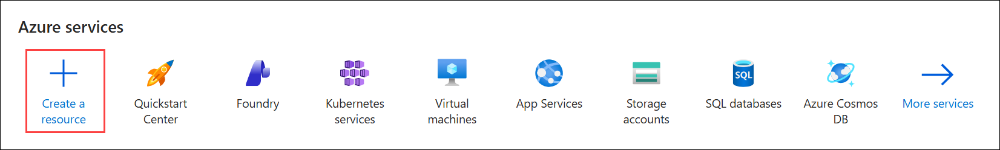

1. In the Marketplace page search for **Language service (1)**, press **Enter** and then select **Language service (2)** tile.

   

1. Click on **Create**.

   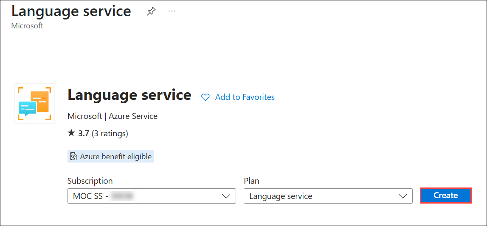

1. You will be taken to a page to **Select additional features**. Use the following settings:

    - **Select Additional Features**:
        - **Default features**: *Keep the default features*.
        - **Custom features**: Select **Custom question answering** by clicking on **Select (1)**.
     - Click on **Continue to create your resource (2)**

       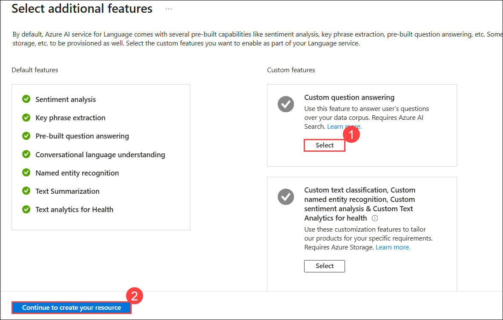

1. On the **Create Language** page, specify the following settings:
    - **Project Details**
        - **Subscription**: *Your Azure subscription* **(1)**
        - **Resource group**: Select **AI-900-Module-07-<inject key="DeploymentID" enableCopy="false" />** **(2)**
    - **Instance Details**
        - **Region**: Select **<inject key="location" enableCopy="false"/>** **(3)**     
        - **Name**: Enter **language<inject key="DeploymentID" enableCopy="false" />** **(4)**
        - **Pricing tier**: **S** (1K Calls per minute) **(5)**
    - **Responsible AI Notice**
        - **By checking this box, I certify that I have reviewed and acknowledge the terms in the Responsible AI Notice**: *Selected* **(6)**

        - Click on **Review + create (7)**

          

1. Under the **Review + create** tab, click on **Create**. Wait for the deployment of the Language service that will support your custom question answering knowledge base.

   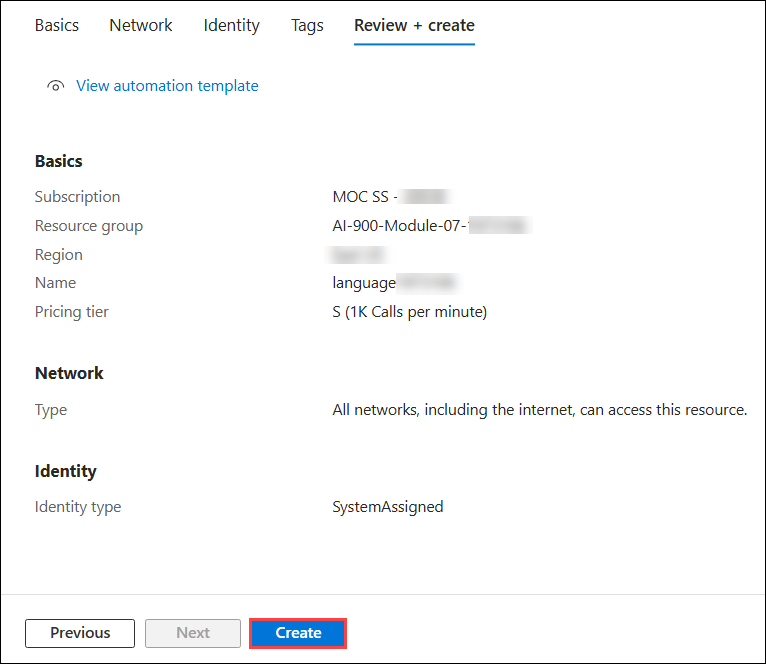

### Task 2: Create a new project

In this task, you will learn how to create a new project in the **Language** resource to start leveraging AI models for text analysis and natural language processing.

1. Right click on [https://language.azure.com](https://language.azure.com?azure-portal=true) link, select **Copy link** from the context menu, then paste it into a new tab to access the Language studio portal.

1. From the top right corner, click on **Sign in**.

    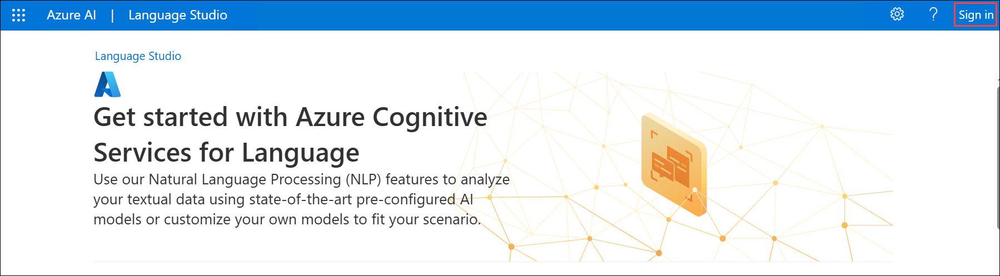

2. If prompted, sign in using the following username and password.
    
    * Email/Username: **<inject key="AzureAdUserEmail"></inject>**
    
    * Password: **<inject key="AzureAdUserPassword"></inject>**

1. Close the **Welcome to the new Language
Studio** pop up by clicking on the **X**. 

   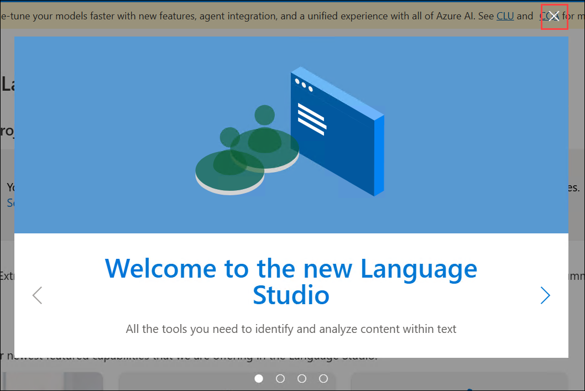
   
1. If prompted to select an Azure resource, ensure the following settings and click on **Done (5)**:
    - **Azure directory**: *The Azure directory containing your subscription* **(1)**
    - **Azure subscription**: *Your Azure subscription* **(2)**
    - **Resource type**: *Language* **(3)**
    - **Resource name**: *Select the Language service resource you just created* **(4)**

      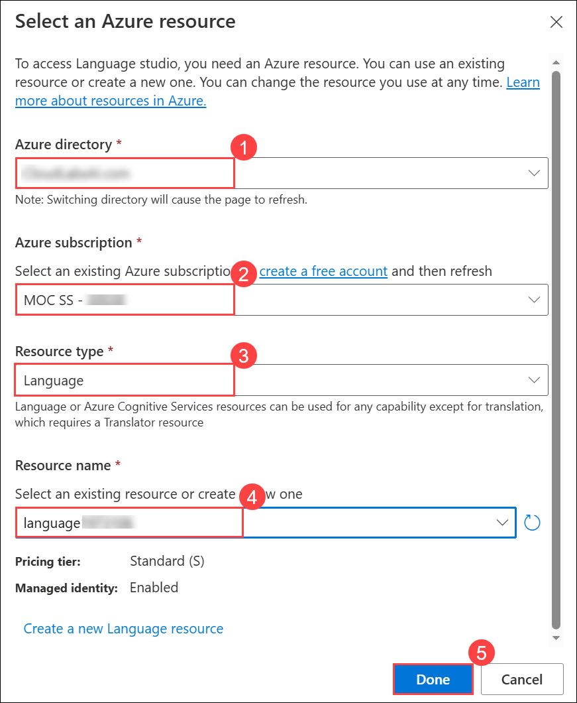

   >**Note:** If you are ***not*** prompted to choose a language resource, it may be because you have multiple Language resources in your subscription; in which case:
   >
   > - On the bar at the top of the page, select **Settings (&#9881;)**.
   >   
   > - On the **Settings** page, view the **Resources** tab.
   >    
   > - Select the language resource you just created, and make sure the managed identity tab is **enabled.**
   >    
   > - At the top of the page, select **Language Studio** to return to the Language Studio home page.

1. At the top of the Language Studio portal, in the **Create new (1)** menu, select **Custom question answering (2)**.

    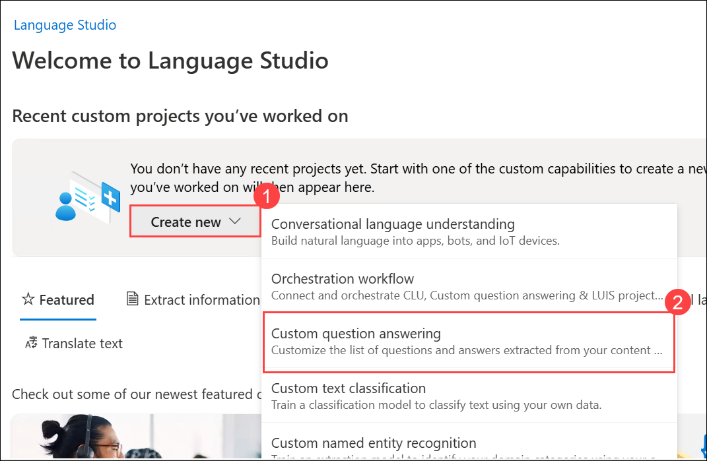

1. On the **Connect to Azure search** pop-up, click on **Connect to Azure search**. 

   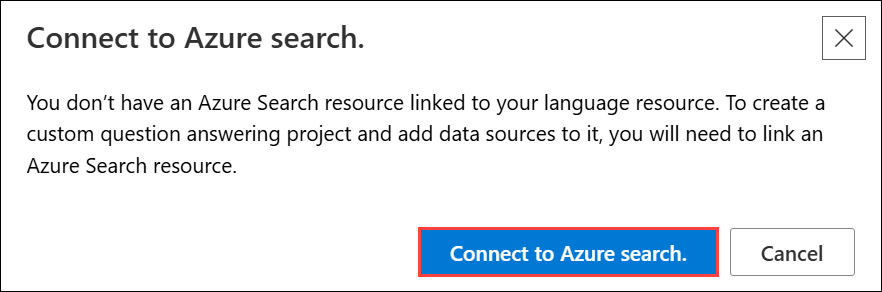

1. On the Azure Search page, click on **Select Azure Search resource (1)** drop-down and then select **Add Arure Search resource (2)**.

   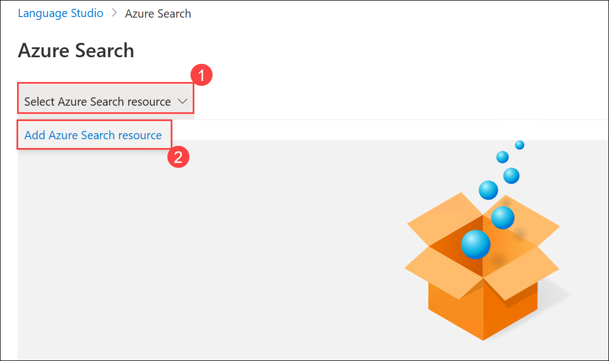

1. On the **Create Azure Search** window:

      - **Azure Search Service name**: **search<inject key="DeploymentID" enableCopy="false"/> (1)**
      - **Azure search region**: Select **<inject key="location" enableCopy="false"/> (2)**
      - **Azure search pricing tier**: **Free F (3)** (3 Indexes) - (*If this tier is not available, select Basic*)
      - Click on **Create (4)**.

         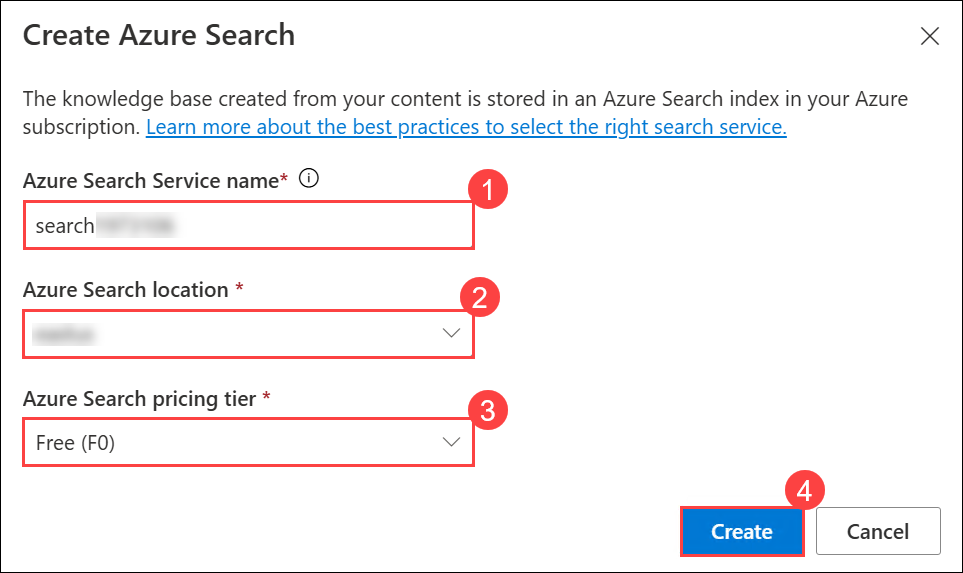

1. On the **Are you sure you want to select search<inject key="DeploymentID" enableCopy="false"/> ?** dialog, click on **Select resource and delete projects**.

   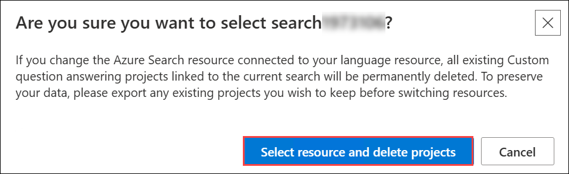

1. Now, click on the **Language Studio** from the top.

   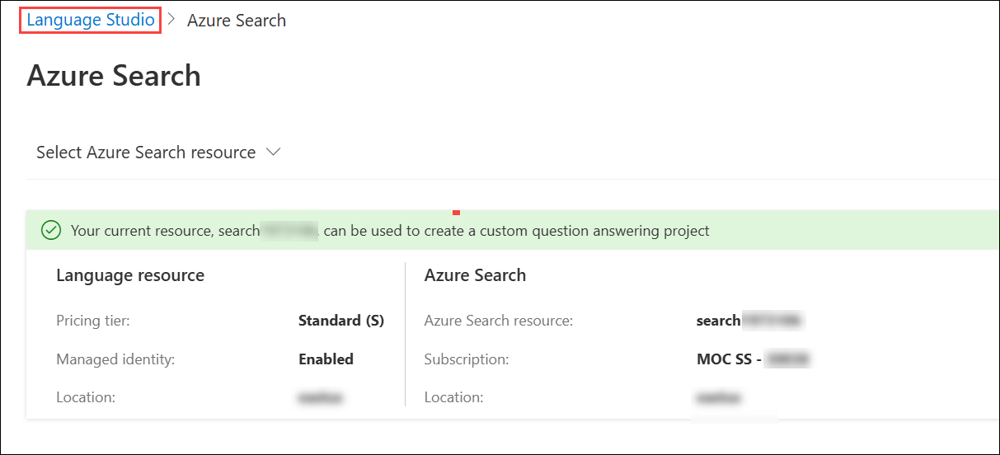

1. Again from the home page, click on the **Create new (1)** menu, and select **Custom question answering (2)**.

    

1. On the **Choose language setting for the resource language<inject key="DeploymentID" enableCopy="false" />** page, select **I want to select the language when I create a project in this resource** **(1)** and click **Next (2)**.

    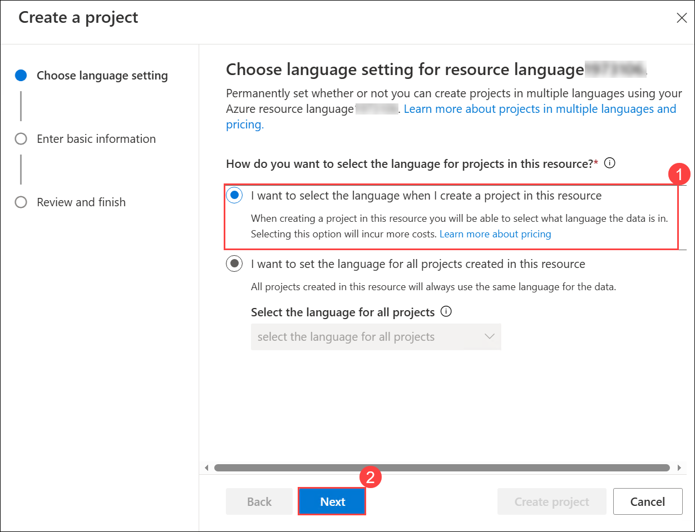

1. On the **Enter basic information** page, enter the following details and click **Next (5)**:  

   - **Language resource**: *Choose your language resource* (**if not already chosen**) 
   - **Azure search resource**: *Choose your Azure search resource* (**if not already chosen**)
   - **Name**: `MargiesTravel`  **(1)**
   - **Description**: `A simple knowledge base`  **(2)** 
   - **Source language**: **English (3)**  
   - **Default answer when no answer is returned**: `No answer found`  **(4)**
   
      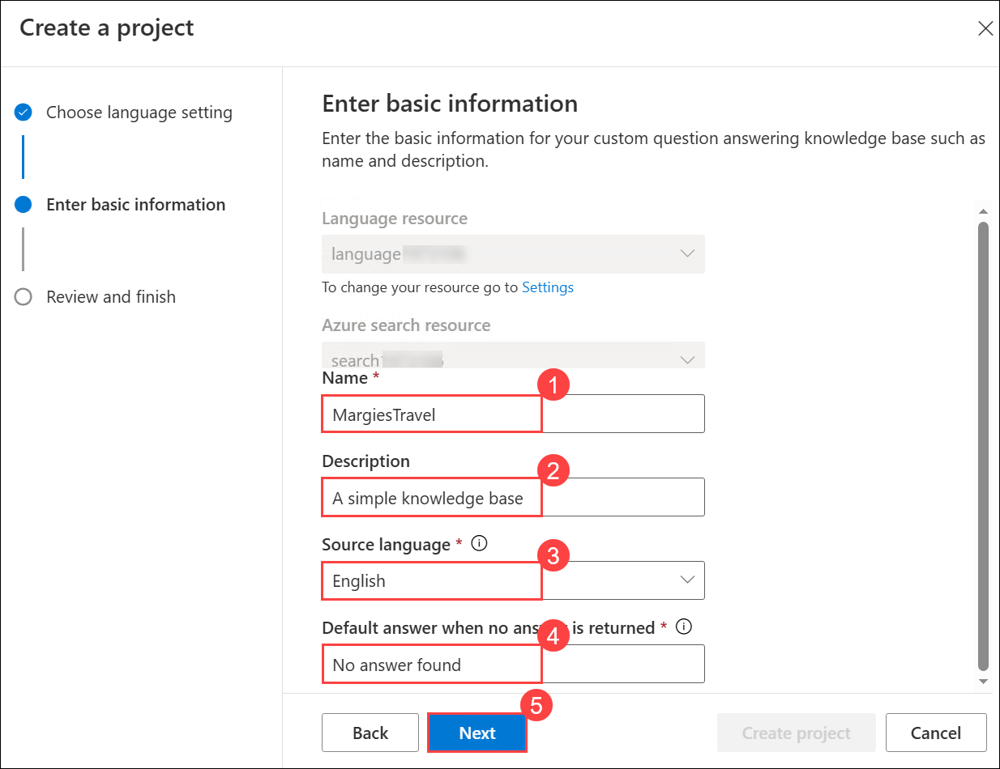  

1. On the **Review and finish** page, click **Create project**. 

   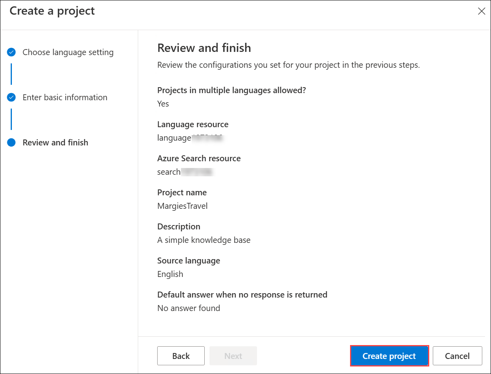
   
1. Use the **>> (1)** icon, to expand the navigation pane on the left. Select **Manage sources (2)** page. Select **&#65291;Add source (3)** and select **URLs (4)**.

   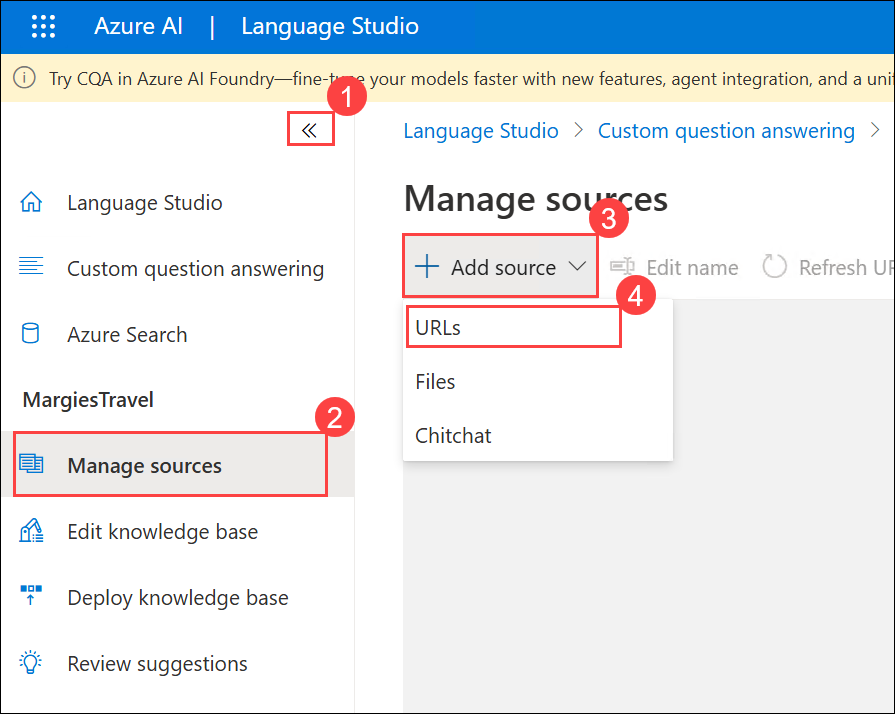
   
1. In the **Add URLs** box, select **+ Add url (1)**. Provide the following details:

    - **URL name**: `MargiesKB` **(2)**
    - **URL**: `https://raw.githubusercontent.com/MicrosoftLearning/mslearn-ai-fundamentals/main/data/natural-language/margies_faq.docx` **(3)**
    - **Classify file structure**: *Auto-detect* **(4)**
    - Select **Add all (5)**:

      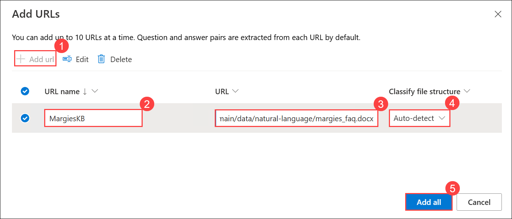
      
### Task 3: Edit the knowledge base

In this task, you will learn how to edit the knowledge base in your **Language** resource to refine and update the information for improved AI-driven insights.

Your knowledge base is based on the details in the FAQ document and some pre-defined responses. You can add custom question-and-answer pairs to supplement these.

1. Expand the left panel and select **Edit knowledge base (1)**. Then select **+ (2)** to add a new question pair.
   
    
   
1. In the **Add a new question answer pair** dialog box, in the **Question** type `Hello` **(1)**, and in the **Answer** type `Hi` **(2)**, then select **Done (3)**.

    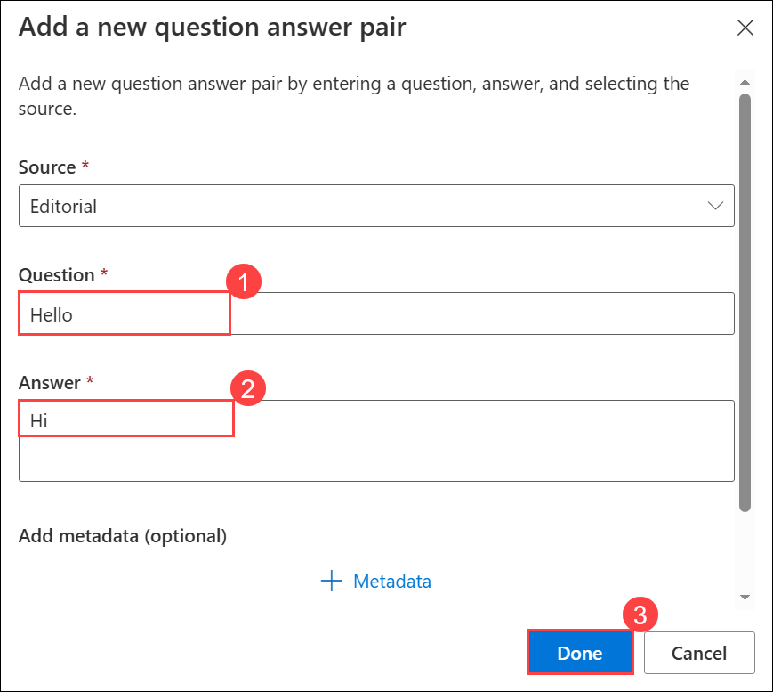

1. Expand **Alternate questions (1)** and select **+ Add alternate question (2)**. Then enter `Hiya` **(3)** as an alternative phrasing for "Hello".

   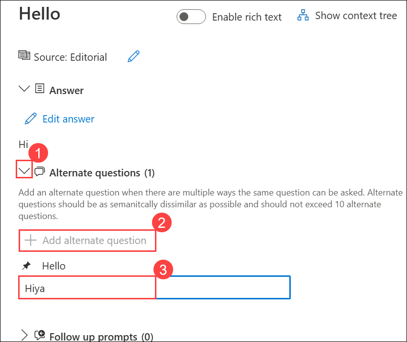
   
1. On the left side of the **screen**, select **Save** to save your knowledge base.

   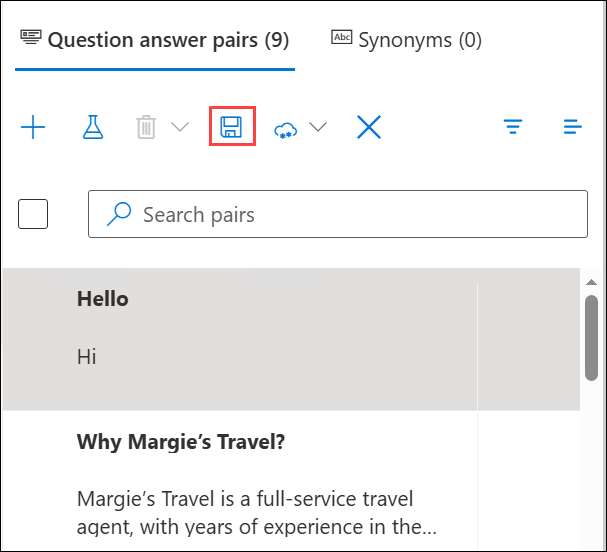

### Task 4: Train and test the knowledge base

In this task, you will learn how to train and test the knowledge base in your **Language** resource to enhance its ability to understand and respond accurately.

Now that you have a knowledge base, you can test it.

1. Below of the **Question answer pairs** pane, select **Test** to test your knowledge base.

   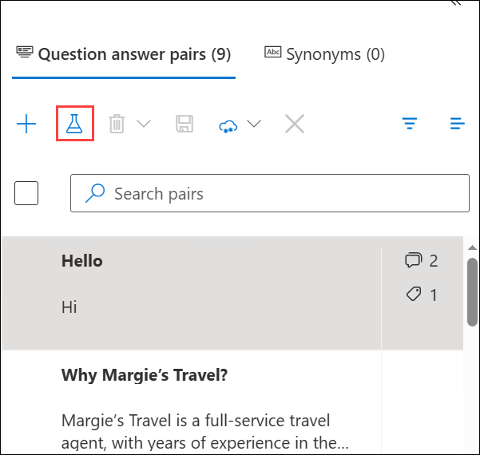
   
1. In the test pane, at the bottom, enter the message `Hi` and press Enter. 

   

1. The response `Hi` should be returned.   

   
   
1. In the test pane, at the bottom, enter the message `I want to book a flight` and press Enter. An appropriate response from the FAQ should be returned.

   

    > **Note**: The response contains both a short answer and a detailed answer passage. The passage provides the full text from the FAQ document for the closest matched question, while the short answer is intelligently extracted from it. You can control the inclusion of the short answer by using the **Include short answer** checkbox at the top of the test pane.

1. Try another question, such as `How can I cancel a reservation?` and press Enter.

   

1. When you're done testing the knowledge base, click **X** to close the test pane.

   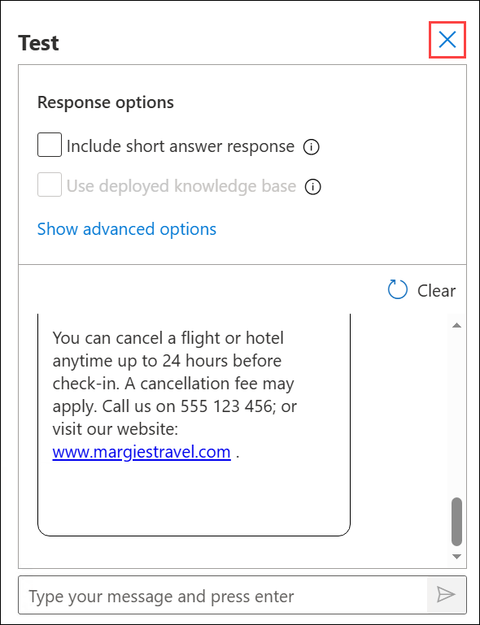

### Task 5: Deploy your project

In this task, you will learn how to deploy your project in the **Language** resource to make it available for use in real-world applications and services.

You can deploy the knowledge base as a client application to answer questions

1. In the left panel, select **Deploy knowledge base (1)**. At the top of the page, select **Deploy (2)**.

   

1. A dialogue box will ask if you want to deploy the project. Select **Deploy**.

   
   
## Validation

> **Congratulations** on completing the task! Now, it's time to validate it. Here are the steps:
 
- Hit the Validate button for the corresponding task. You will receive a success message. 
- If not, carefully read the error message and retry the step, following the instructions in the lab guide.
- If you need any assistance, please contact us at cloudlabs-support@spektrasystems.com. We are available 24/7 to help you out.

   <validation step="11faa70c-17f5-4a89-8275-059ac6273139" />
  
## Learn more

- To learn more about the Question Answering service, view [the documentation](https://docs.microsoft.com/azure/cognitive-services/language-service/question-answering/overview).

### Review
In this lab, you have completed the following tasks:
- Created a *Language* resource
- Created a new project
- Edited the knowledge base
- Trained and tested the knowledge base
- Created a bot for the knowledge base
  
## You have successfully completed this lab.
