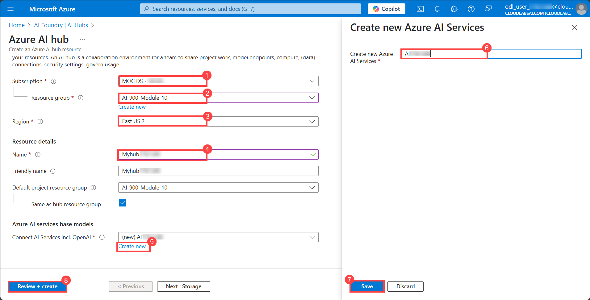

# Lab 10: Extract data from documents in the Microsoft Foundry portal

## Lab overview

**Azure AI Document Intelligence** service enables you to analyze and extract information from forms and documents, and then identify field names and data. 

How does Document Intelligence build upon optical character recognition (OCR)? While OCR can read printed or handwritten documents, OCR extracts text in an unstructured format which is difficult to store in a database or analyze. Document intelligence makes sense of the unstructured data by capturing the structure of the text, such as data fields and information in tables. 

In this exercise, you will use Azure AI Document Intelligence's prebuilt models in the Azure AI Foundry portal, Microsoft's platform for creating intelligent applications, to recognize data from a receipt. 

## Lab Objectives

In this lab, you will perform:
- Task 1: Create a project in the Microsoft Foundry portal
- Task 2: Analyze a receipt with Azure AI Document Intelligence in Microsoft Foundry

## Task 1: Create a project in the Microsoft Foundry portal

In this task, we are creating an Microsoft Foundry project and setting up AI resources to explore Vision and Document capabilities.

1. On the Azure Portal page, in the **Search resources, services, and docs (G+/)** box at the top of the portal, enter **Foundry (1)**, and then select **Microsoft Foundry (2)** under **Services**.

     

1. In the left navigation pane for the AI Foundry, select **AI Hubs (2)** under **Use with AI Foundry (1)**. On the AI Hubs page, click on **+ Create (3)** and select **Hub (4)** from the drop-down.

     

1. On the **Create an AI hub resource** pane, enter the following details:

    - Subscription: **Leave default subscription (1)** 
    - Resource Group : Select **AI-900-Module-10-<inject key="Deployment ID" enableCopy="false"></inject> (2)** 
    - Region : **<inject key="location" enableCopy="false"></inject>** **(3)**
    - Name : Use the format **Myhub-<inject key="Deployment ID" enableCopy="false"></inject> (4)** 
    - Connect AI Services incl. OpenAI : Click on **Create New (5)**
    - Create new Azure AI Services: Provide a name to the AI Service, Use the format **AI<inject key="Deployment ID" enableCopy="false"></inject> (6)**  
    - Click on **Save (7)**.
    - Click on **Review + Create (8)**

       .png) 

1. Click on the **Create** button to begin the deployment process.

    

1. Once the deployment completes, click on **Go to resources**.

1. Click on **Launch Azure AI Foundry**.

    

1. Within the **Microsoft Foudry** portal, scroll down and select **+ New project**.

    

1. Provide the Project name as **Myproject<inject key="DeploymentID" enableCopy="false" /> (1)** and then **Create (2)**.   

    

1. Wait for your project to be created.

1. When the project is created, you will be taken to an **Overview** page of the project details. Select **AI services** on the left-hand menu.

> **Congratulations** on completing the task! Now it's time to validate it. Follow the steps below:

- Hit the **Validate** button for the corresponding task. If you receive a success message, you may proceed to the next task.  
- If not, carefully read the error message and retry the step by following the instructions in the lab guide.  
- If you need any assistance, please contact us at **cloudlabs-support@spektrasystems.com** — we are available 24/7 to help.

<validation step="348e3976-3f47-4302-b53a-c2bd7195d99b" />

---

## Task 2: Analyze a Receipt with Azure AI Document Intelligence in Microsoft Foundry

In this task, you will use Azure AI Foundry to analyze a receipt image using prebuilt AI models, extracting key details such as merchant information, transaction date, and total amount.

You are now ready to analyze a fictitious receipt from the Northwind Traders retail company.

1. In the **Overview (1)** page of your project, select **AI Services (2)** from the left-hand menu.

   

   > **Note:** If a pop-up appears, please click **Close**.

1. On the **AI Services** page, select the **Vision + Document** tile to try out Azure AI Vision and Document capabilities.

    .png)

1. On the **Vision + Document** page, scroll down and select **Document (1)**. Under **Prebuilt models for specific documents**, select the **Receipts (2)** tile.

    .png)

1. On the Receipts page, select **Connect to or create an Azure AI Services resource** (1). From the dropdown, choose **AI<inject key="DeploymentID" enableCopy="false" />** (2) under Azure AI Services, and then click **Connect** (3).

    

1. Open a new tab and go to [**https://aka.ms/mslearn-receipt**](https://aka.ms/mslearn-receipt) to view a sample image of a receipt.

1. Right-click on the image and choose **"Save image as"** to save it in your Downloads folder or to your Desktop.

   

1. Click on **Save**.

   
 
1. Go back to the Microsoft Foundry portal and upload the **receipt.jpg** image by clicking **Browse files (1)**. Then, navigate to the **C:\Users\azureuser\Downloads (2)** folder, select **receipt (3)**, and click **Open (4)**.

   

1. Click **Run analysis** to process the document.

   

1. When the analysis has run, the results are returned. Notice that the service has recognized specific data fields such as the merchant’s name, address, phone number, and transaction date and time, as well as the line items, subtotal, tax, and total amounts. Next to each field is a percentage probability that the field is correct.

    

### Review

In this Module, you have used Azure AI Document Intelligence's prebuilt receipts model in the Microsoft Foundry portal. From the results that were returned, you saw how Document Intelligence was able to identify specific fields, enabling data from everyday documents to be more easily processed. Before you close the demo, why not try some of the sample receipts, including those in different languages?

In this Module, you have completed the following tasks:
- Created a project in the Microsoft Foundry portal
- Analyzed a receipt with Azure AI Document Intelligence in Microsoft Foundry 

## Learn more

This lab demonstrated only some of the capabilities of the AI Document Intelligence service. To learn more about what you can do with this service, see the [Document Intelligence](https://learn.microsoft.com/azure/ai-services/document-intelligence/overview?view=doc-intel-3.1.0) page.

## You have successfully completed this lab.
