# Lab 13: Azure AI Foundry

## Lab overview

In this exercise, you will explore the Azure AI Foundry portal and learn how to create, manage, and deploy generative AI models within the Azure ecosystem. You will gain hands-on experience working with Azure AI hubs, projects, and deploying AI models like GPT-40.

## Lab objectives

In this exercise, you will perform:

- Task 1: Naviagte to Microsoft Foundry and create a project
- Task 2: Deploy and test a generative AI model

## Exercise 1: Explore the components and tools of Microsoft Foundry

### Task 1: Naviagte to Microsoft Foundry and create a project

In this task, you will gain hands-on experience in setting up a collaborative workspace for AI projects and configuring essential resources.

1. On the Azure Portal page, in the Search resources, services, and docs (G+/) box at the top of the portal, enter **Microsoft Foundry (1)**, and then select **Microsoft Foundry (2)** under **Services**.

      

1. In the left navigation pane for the Microsoft Foundry, select **Foundry (1)** under **Use with Foundry** and click on **Create (2)**.

   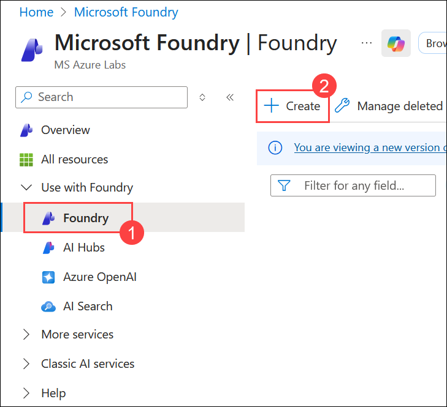

1. On the **Create a Foundry resource** pane, enter the following:

   - Subscription: **Leave default subscription** 
   - Resource group: **AI-900-Module-13-<inject key="DeploymentID" enableCopy="false" />** **(1)**
   - Name:  **MyFoundry<inject key="DeploymentID" enableCopy="false" /> (2)**
   - Region: **<inject key="Location" enableCopy="false"></inject>** **(3)**
   - Default project name **Myproject<inject key="DeploymentID" enableCopy="false" /> (4)**
   - Click **Review+Create** **(5)**	

     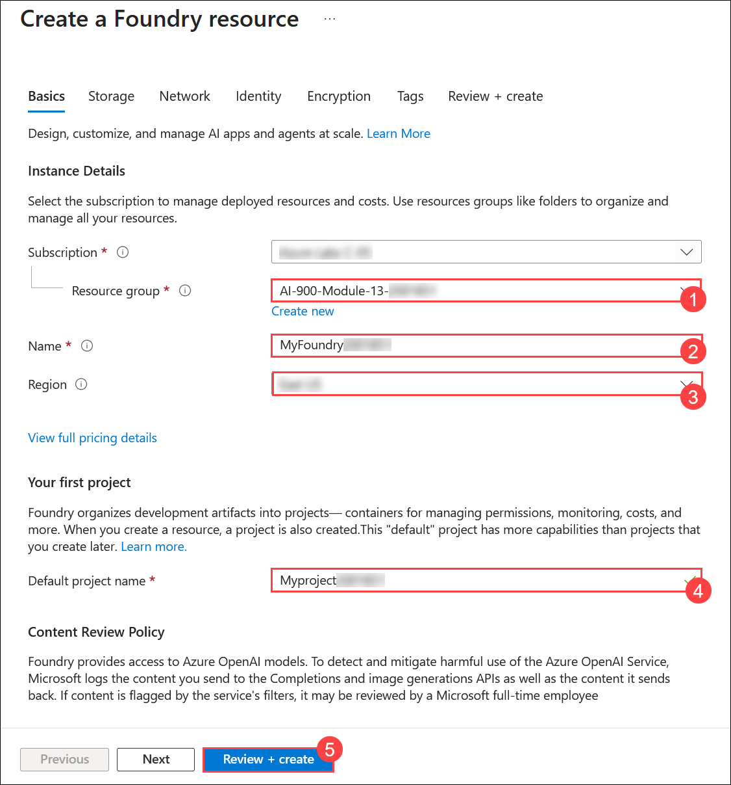

1. Click **Create**

   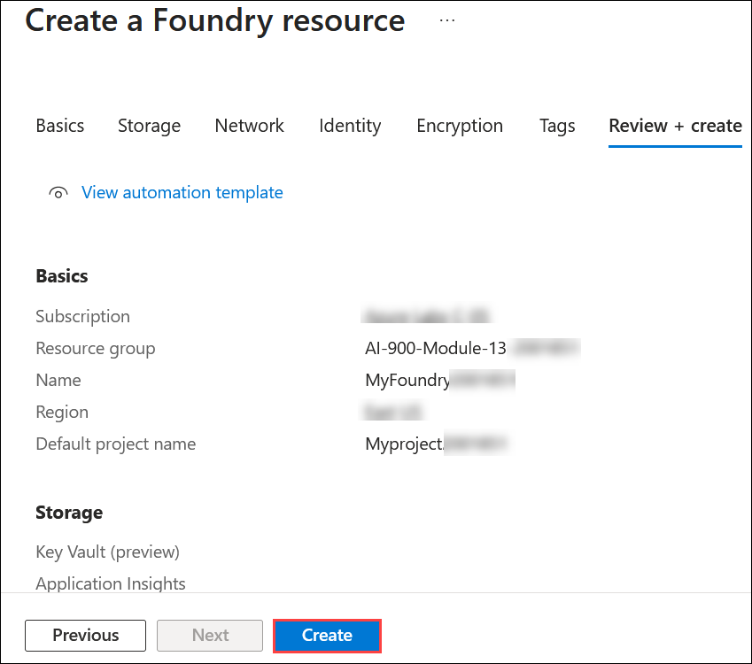

1. Wait for the deployment to be completed, and then click on **Go to resource.**

   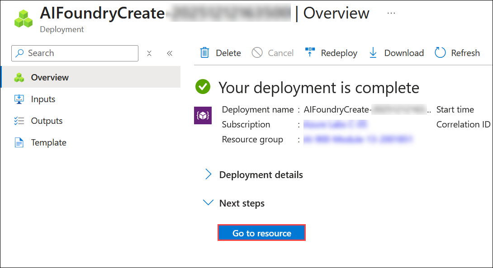

1. On the **Overview** pane, click on **Go to Foundry portal** to navigate to the **Microsoft Foundry** portal.

   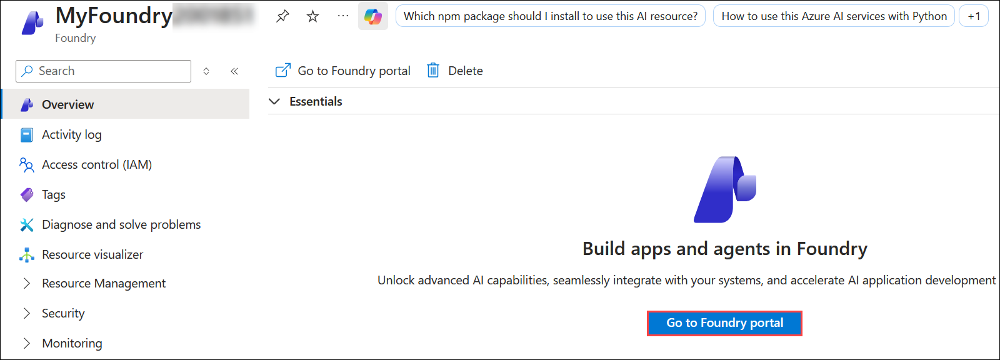

1. Close any tips that are displayed and review the project page in the Microsoft Foundry portal, which should look similar to the following image. Review the **Endpoints and keys** section.

   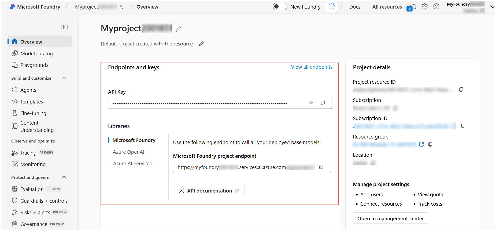

1. At the bottom of the navigation pane on the left, select **Management center**. The management center is where you can configure settings at both the resource and project levels, which are both shown in the navigation pane.

   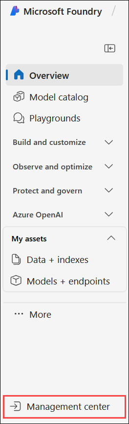

   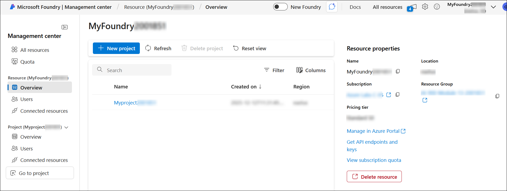

1. In the Azure Microsoft Foundry project, go to the **My assets** section, then select **Models + endpoints (1)**. Click **+ Deploy model (2)** and choose **Deploy base model (3)** from the drop-down to continue.  

   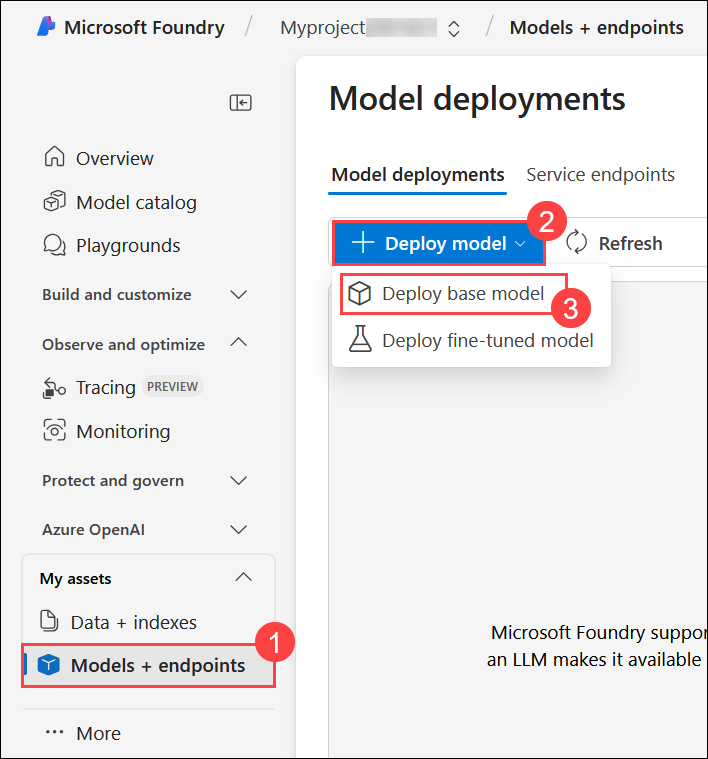

1. Search **gpt-4o (1)** for and select the **gpt-4o model (2)** and click on **Confirm** (3).

   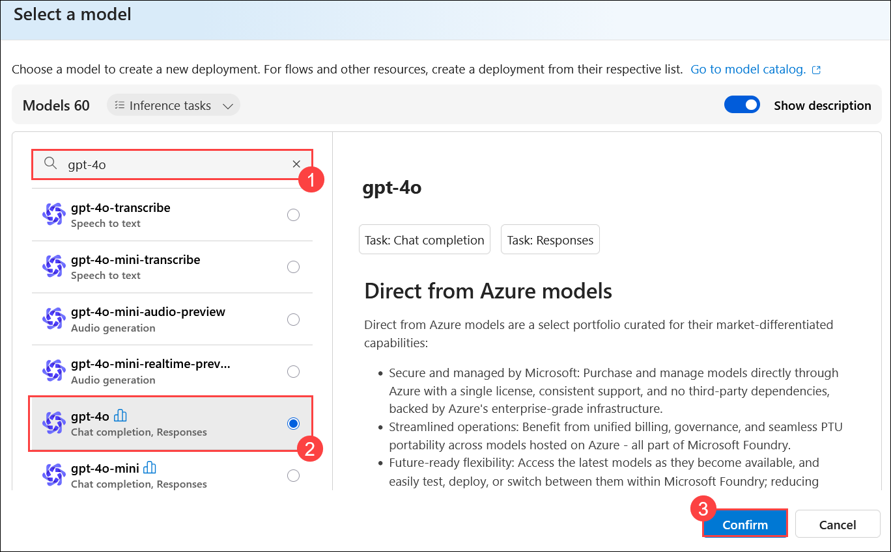

1. Click on **Customize**

   

1. In the window that appears, reduce the token to **50 K (1)** and click on **Deploy (2)**.
   
   

1. After deployment, click **Model + Endpoints (1)** under **My assets** to view the deployed **gpt-4o (2)** model.

   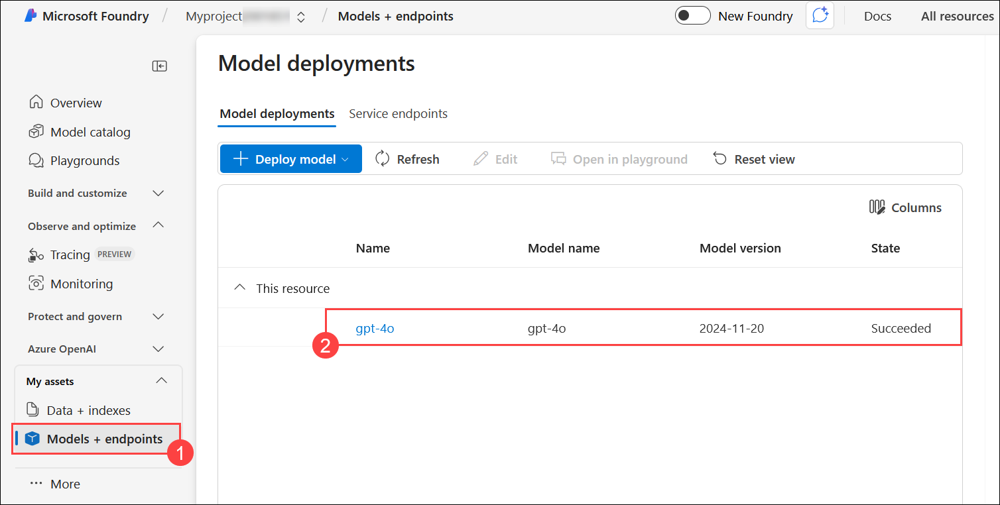

1. While keeping the Azure Foundry tab open in the Edge browser, open another tab within the same Edge browser and navigate to the Azure portal.

1. Browse to the resource group **AI-900-Module-13-<inject key="DeploymentID" enableCopy="false" />** , and view the Azure resources that have been created.

    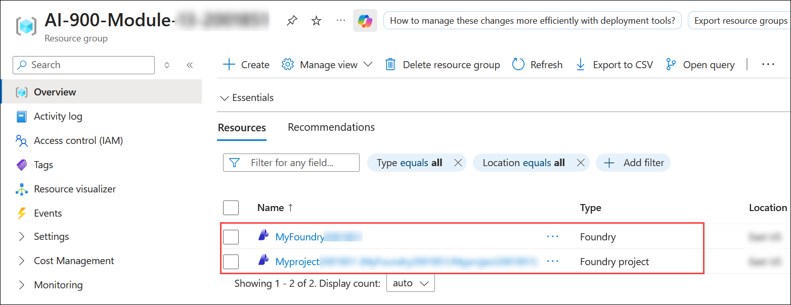

1. Return to the Microsoft Foundry browser tab.

## Task 2: Deploy and test a generative AI model

1. In the navigation pane on the left for your project, select **Playgrounds (1)** and click on  **Try the Chat Playground (2)**.

   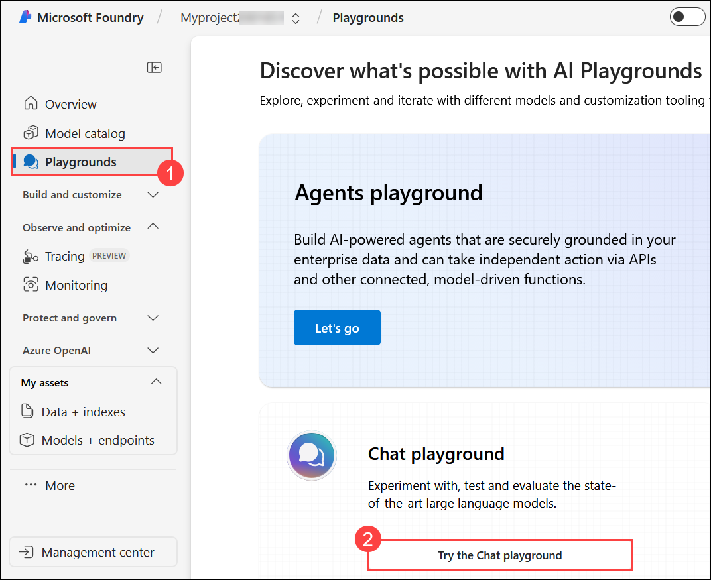

1. In the window that appears, ensure that your **gpt-4o (1)** model deployment is selected.

1. In the Setup pane, in the Give the model instructions and context box, enter the instruction as: **You are a history teacher who can answer questions about past events all around the world. (2)** and click on **Apply Changes (3)**

   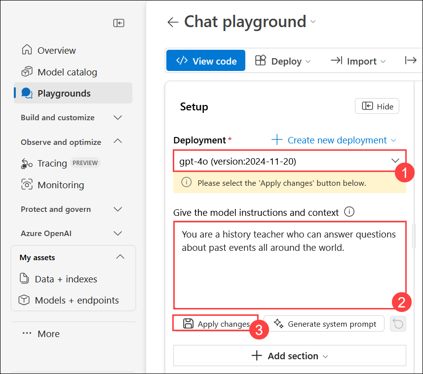

1. For the **Update system message?** prompt, click on **Continue**

   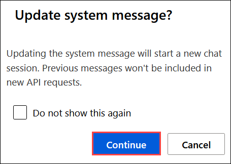

1. In the chat window, enter a query such as **What are the key events in the history of Scotland? (1)**  and press **send button (2)** to view the response.

   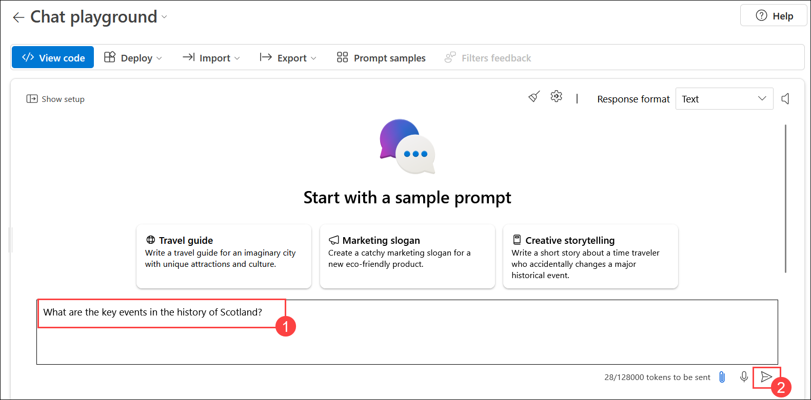

   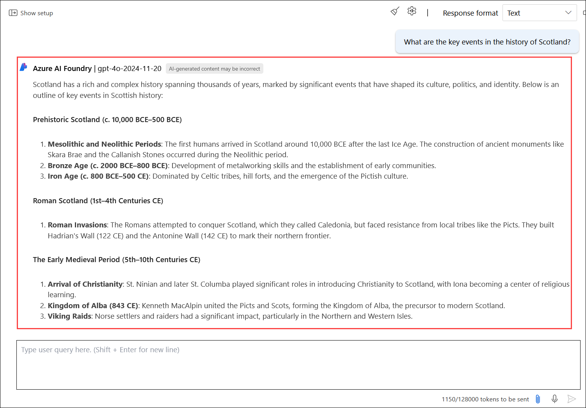

   >**Note**: The output may vary for the query.

> **Congratulations** on completing the task! Now, it's time to validate it. Here are the steps:
> - Hit the Validate button for the corresponding task. you will receive a success message.
> - If not, carefully read the error message and retry the step, following the instructions in the lab guide. 
> - If you need any assistance, please contact us at cloudlabs-support@spektrasystems.com. We are available 24/7 to help you out.

  <validation step="6b5cc888-bc2a-47c8-b31c-e65157a50f66" />

### Summary

In this exercise, you’ve explored Azure AI Foundry and seen how to create projects and explore Azure AI Services and Azure OpenAI models in the Azure AI Foundry portal.

### Review

In this exercise, you have completed the following tasks:
- Naviagted to Microsoft Foundry and created a project  
- Deployed and tested a generative AI model

##   You have successfully completed this lab.
