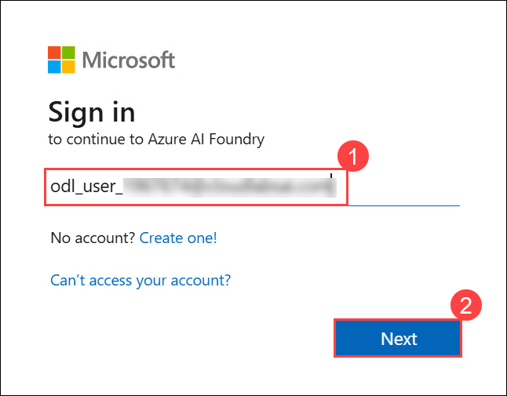

# AI-900: Microsoft Azure AI Fundamentals Workshop

Welcome to your AI-900: Microsoft Azure AI Fundamentals workshop! We're excited to guide you through hands-on learning with Azure AI services. Let’s continue by diving deeper into content moderation.

# Module 2a: Explore Content Safety in Microsoft Foundry

### Overall Estimated Timing: 30 minutes

## Overview

In this lab, you will explore Azure AI Content Safety within the Microsoft Foundry portal. You’ll begin by creating and configuring a Foundry project, and then use the built-in Guardrails and Controls to test text moderation capabilities. By trying out different text samples, you will see how Azure AI Content Safety evaluates content, assigns severity levels, and categorizes potential risks. This lab provides a hands-on introduction to provisioning AI resources and using Content Safety as an example service to understand how moderation features can be applied in intelligent applications.

## Objectives

By the end of this lab, you will be able to:

1. **Create and configure a project in Microsoft Foundry**: Set up a Foundry project and the required Azure AI resources to enable content moderation capabilities.

2. **Use Azure AI Content Safety to moderate text content**: Submit sample text inputs and observe how the service analyzes, categorizes, and assigns severity scores to different types of content.

3. **Interpret severity levels and content categories**: Understand how Content Safety evaluates text across various harm categories—such as violence, hate, and sexual content—and how to read the resulting safety assessments.

4. **Navigate and use Guardrails + Controls in Microsoft Foundry**: Explore the Foundry interface to access Content Safety tools, run tests, and review moderation output within the built-in testing environment.

## Pre-requisites

* Basic knowledge of Azure Portal.
* Familiarity with AI concepts related to content moderation.

## Architecture

This lab architecture illustrates how Azure AI Content Safety operates within the Microsoft Foundry environment to evaluate and moderate text content:

1. **Microsoft Foundry Project**:
   The lab begins with creating a project in the Microsoft Foundry portal. This project provides the workspace and integrates the necessary Azure AI resources used for testing and moderation.

2. **Azure AI Services (Content Safety) Resource**:
   Within the Foundry project, an Azure AI Services resource is created or selected. This resource includes access to Azure AI Content Safety, which processes text inputs and assigns severity scores based on harmful content categories.

3. **Guardrails + Controls in Microsoft Foundry**:
   The Foundry portal provides a built-in interface, Guardrails + Controls—where you can interact with Content Safety. This interface lets you run sample text moderation tests without writing code.

4. **Content Analysis Pipeline**:
   When a text sample is submitted in the Foundry interface, it is sent to the Azure AI Content Safety model, which classifies the content, determines risk categories (such as violence, hate, sexual content), and returns severity ratings.

5. **Results Visualization in Foundry**:
   The moderation results, including severity levels and content categories, are rendered directly in the Foundry portal, allowing you to review and understand the evaluation before applying these capabilities in real applications.

## Architecture Diagram

## Explanation of Components

1. **Microsoft Foundry Project**:
   Serves as the workspace where Azure AI resources—such as Content Safety—are configured and accessed. The project provides the environment needed to test and explore AI-driven moderation features.

2. **Azure AI Content Safety (Text Moderation)**:
   A service within Azure AI that analyzes text inputs to identify harmful or sensitive content. It evaluates content across categories such as violence, hate, sexual content, and self-harm to support responsible and safe application development.

3. **Severity Scoring**:
   Content Safety assigns severity levels to each detected category, indicating the potential risk or harmfulness of the text. These scores help users interpret the results and determine the appropriate moderation action.

4. **Guardrails + Controls in Microsoft Foundry**:
   The built-in Foundry interface used in the lab to try out Content Safety. It provides a simple, hands-on environment to submit sample text, view moderation results, and understand how the service behaves before integrating it into an application.

# Getting Started with lab
 
Welcome to your AI-900: Microsoft Azure AI Fundamentals workshop! We've prepared a seamless environment for you to explore and learn about machine learning and AI concepts and related Microsoft Azure services. Let's begin by making the most of this experience:
 
## Accessing Your Lab Environment
 
Once you're ready to dive in, your virtual machine and **Guide** will be right at your fingertips within your web browser.
 

### Virtual Machine & Lab Guide
 
Your virtual machine is your workhorse throughout the workshop. The lab guide is your roadmap to success.

## Exploring Your Lab Resources
 
To get a better understanding of your lab resources and credentials, navigate to the **Environment** tab.
 

## Lab Guide Zoom In/Zoom Out
 
To adjust the zoom level for the environment page, click the **A↕: 100%** icon located next to the timer in the lab environment.

## Utilizing the Split Window Feature
 
For convenience, you can open the lab guide in a separate window by selecting the **Split Window** button from the Top right corner.
 

## Managing Your Virtual Machine
 
Feel free to **start, stop, or restart (2)** your virtual machine as needed from the **Resources (1)** tab. Your experience is in your hands!
 

## Lab Duration Extension

1. To extend the duration of the lab, kindly click the **Hourglass** icon in the top right corner of the lab environment. 

    

    >**Note:** You will get the **Hourglass** icon when 10 minutes are remaining in the lab.

2. Click **OK** to extend your lab duration.
 
   

3. If you have not extended the duration prior to when the lab is about to end, a pop-up will appear, giving you the option to extend. Click **OK** to proceed.

## Let's Get Started with Azure Portal
 
1. On your virtual machine, click on the Azure Portal icon as shown below:
 
   .png)

2. You'll see the **Sign into Microsoft Azure** tab. Here, enter your credentials and click on **Next (2)**:
 
   - **Email/Username:** <inject key="AzureAdUserEmail"></inject> **(1)**
 
       
 
3. Next, provide your password and click on **Sign in (2)**:
 
   - **Password:** <inject key="AzureAdUserPassword"></inject> **(1)**
 
      .png)
 
4. If prompted to stay signed in, you can click **No**.

   .png)
 
7. If a **Welcome to Microsoft Azure** pop-up window appears, simply click **Cancel**.

## Support Contact
 
The CloudLabs support team is available 24/7, 365 days a year, via email and live chat to ensure seamless assistance at any time. We offer dedicated support channels explicitly tailored for both learners and instructors, ensuring that all your needs are promptly and efficiently addressed.
 
Learner Support Contacts:
 
- Email Support: cloudlabs-support@spektrasystems.com
- Live Chat Support: https://cloudlabs.ai/labs-support

Click on **Next** from the lower right corner to move on to the next page.

   .png)

## Happy Learning !!
