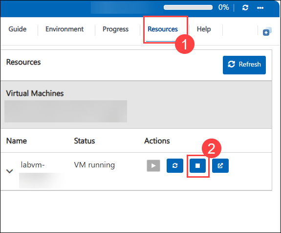
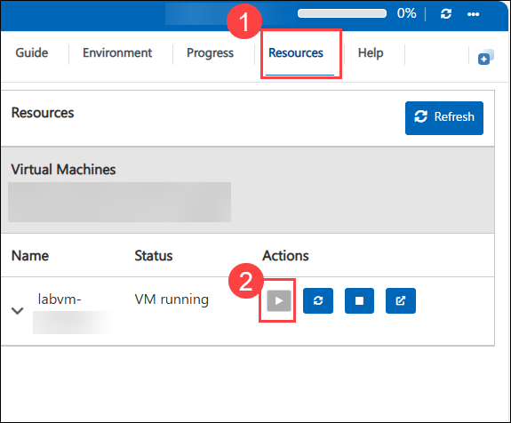
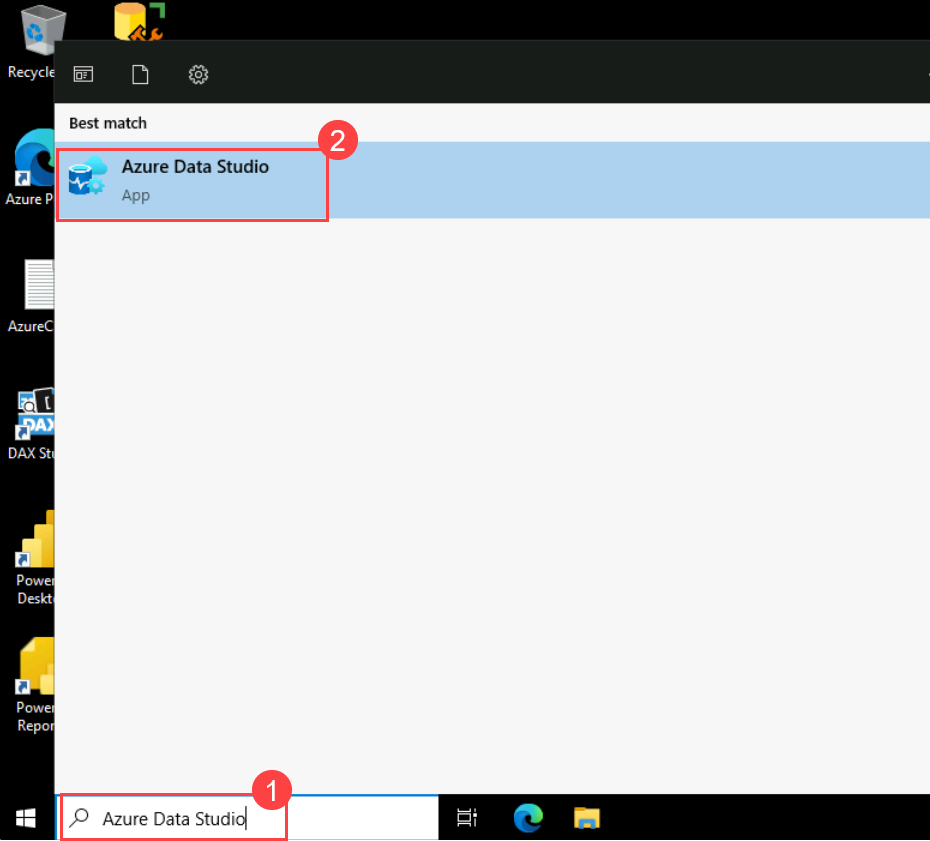
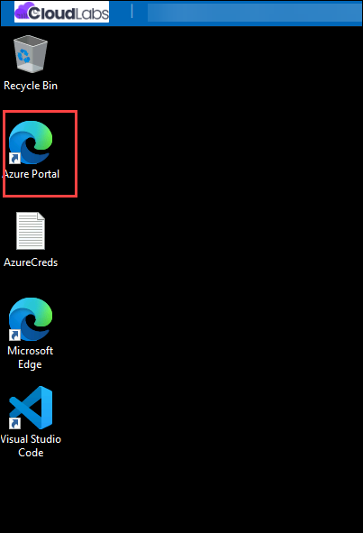
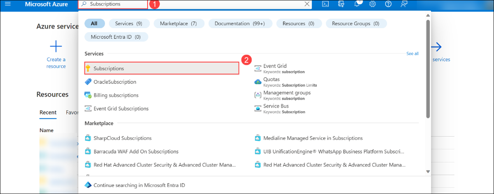
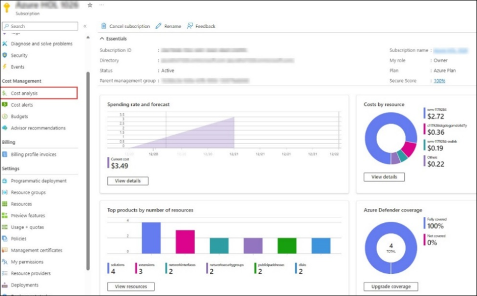
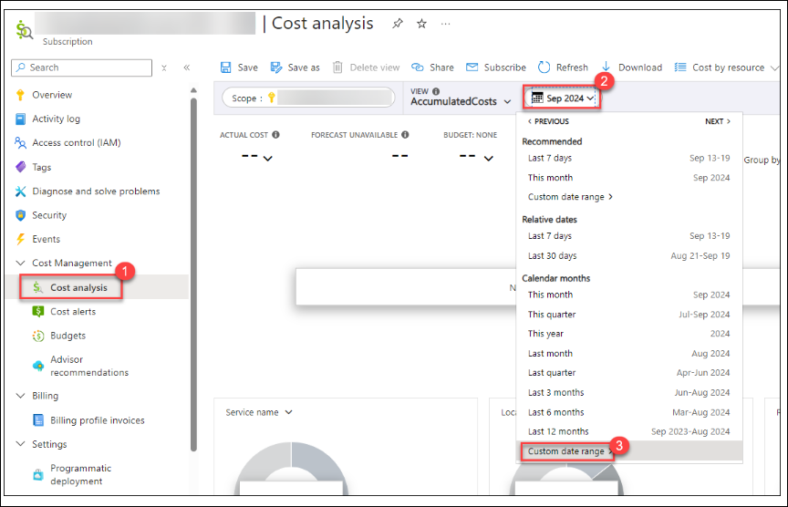
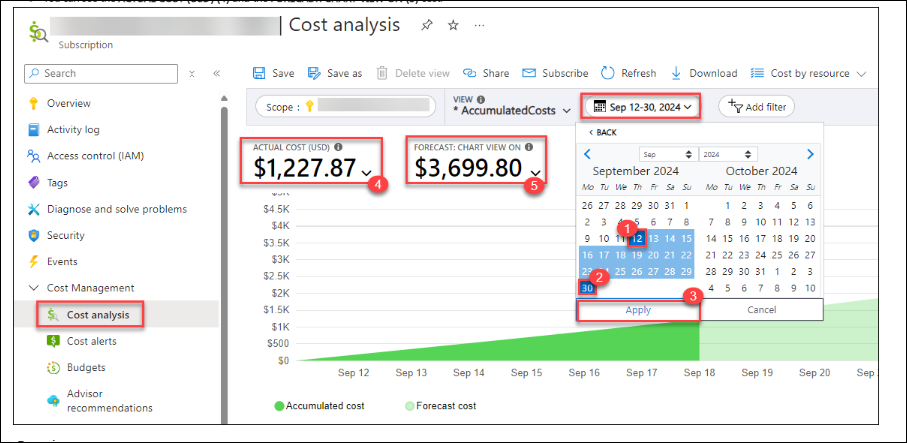

# SREB Year-2 Labs design

Using this environment, you’ll be able to explore complete features and offerings offered by below services. Please find the detailed overview of the Lab environment below.

## About the Lab Environment

| Resources | Value | Remarks |
|  -- | -- | -- |
| Enabled Services | `Visual Studio, Ssms, Azure Data Studio, DAX Studio, Power BI Desktop, Power BI Report` | You can explore these services |
| Azure Entra ID User | Pre-created Entra ID user account  | You will get one Entra ID User Account. |
| Azure Subscription Permissions | Contributor role privilege over Subscription |You will get Contributor role access on a Subscription.  |
| Azure Credit | $100 USD | The consumption limit is set on Azure spend to $100 USD per team |
| Credit Alerts	 | Credit Alerts are set on consumption of 25%, 50%, 75%, 80%, 95%, and 100% of total Azure credits. | Make sure to check your registered email's inbox for any alert-related mails. Alerts give you a head start to keep your Azure spending in control and to plan out the remaining credits in the best way possible. |
| Environment Duration | Until Azure Consumption Credits are exhausted. | Once the Azure consumption credits are exhausted, resources will be deallocated. Please inform our team if you need additional credits. |
| Resource deallocation | You can stop the VM when not in use | To reduce unnecessary costs, you can stop the VM from the Lab Guide’s Resource tab by selecting the Stop button when it is not in use|

### Steps to Deallocate/Stop VM

Please follow the below steps to **Deallocate/Stop** the Lab VM.

1. Navigate to **Resource (1)** tab from the lab guide and then select **Stop (2)** button

        

### Steps to Start the  VM

Please follow the below steps to **Start** the Lab VM.

1. Navigate to **Resource (1)** tab from the lab guide and then select **Start (2)** button.

     

### Steps to access Azure Data Studio

1. Search for **Azure Data Studio (1)** from the Lab VM Search bar and then select **Azure Data Studio (2)**.

     

### Notes:

- You will be assigned a dedicated hands-on environment. The Azure credit consumption includes all the resources which you will be deploying while using the lab environment for your testing.

- You will have Contributor privilege access on the Azure subscription, you can freely explore the features of required services and are recommended to use it only for testing purposes.

- The environment has a fixed budget/cap of $100 USD, kindly do not deploy any other resources that are not related to the testing as they can consume the Azure credit leading to the automatic deallocation of the environment as soon as the credit limit is reached.

### Cost Monitoring:
To monitor and analyse your Azure credit spend, you can navigate to the Azure Subscription page by following the steps mentioned below.

1. On your virtual machine, click on the **Azure Portal** icon as shown below:
 
   

2. You'll see the **Sign into Microsoft Azure** tab. Here, enter your credentials:
 
   - **Email/Username:** <inject key="AzureAdUserEmail"></inject>
 
       
 
3. Next, provide your password:
 
   - **Password:** <inject key="AzureAdUserPassword"></inject>
 
     
 
4. If prompted to stay signed in, you can click **No**.

5. If **Action required** pop-up window appears, click on **Ask later**.
   
    

1. From the Azure portal home page, search for **Subscriptions (1)** using the search bar and select the same from the suggestions.

     

1. Select the **Cost Analysis** tab from the Cost Management pane. You can access a comprehensive breakdown of your Azure spending, offering a granular view of costs associated with various services, and resources.

     

1. To get the accurate consumed cost by you, select the **Calendar (2)** from **Cost analysis (1)** then **Custom date Range (3)**.

     

1. Now, select the custom dates.

    - **Start Date: (1)** The date when you redeemed voucher and launch the Sandbox environment.
    - **End Date: (2)** Current or future date. If you select the future date, you can also get the forecasted cost based on the current resources you deployed and then **Appy (3)**
    - You can see the **ACTUAL COST (USD) (4)** and the **FORECAST: CHART VIEW ON (5) cost**.

           

### Best Practices:

1. **Resources usage:** Please stop the virtual machines resources when not in use to minimize the Azure spend.
1. **Azure Cost Analysis:** Maintain a practice of regularly checking the Cost Analysis report for the assigned Azure subscription to ensure the sustainability of the environment over an extended period.
1. **Alert notifications:** Make sure to check your registered email's inbox for any alert-related emails. Alerts give you can head start to keep your Azure spending in control and to plan out the remaining credits in the best way possible.    

## Support Contact
 
The CloudLabs support team is available 24/7, 365 days a year, via email and live chat to ensure seamless assistance at any time. We offer dedicated support channels explicitly tailored for both learners and instructors, ensuring that all your needs are promptly and efficiently addressed.
 
Learner Support Contacts:
 
- Email Support: cloudlabs-support@spektrasystems.com
- Live Chat Support: https://cloudlabs.ai/labs-support

