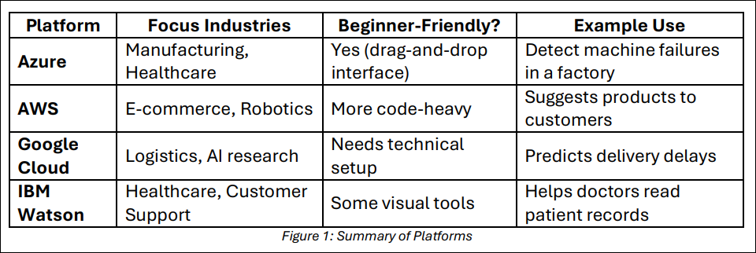
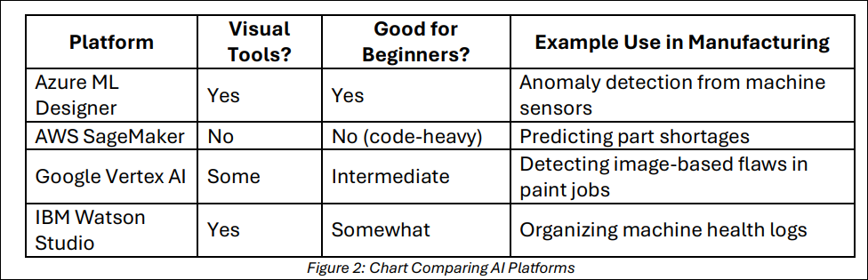

# Lesson 4: Using Machine Learning to Detect Anomalies in Manufacturing

## Lesson Description:

Students will explore how real-world manufacturing problems—such as detecting 
machine failures—can be solved using machine learning tools. They will use Azure ML 
Designer to build a pipeline that detects anomalies in a dataset from a factory floor. 
Students will also explore external data storage options and simulate how a robot might 
act on the detected anomalies.

## Main Learning Goal:

Students will build a machine learning pipeline, analyze manufacturing data, and 
demonstrate how decision-making can be enhanced with ML and robotics.

## Essential Question:

How can machine learning and robotics improve problem-solving and efficiency in a 
manufacturing environment?

## Standards:

- 1.3: Identify and use applications, libraries, and packages utilized in AI and ML 
industries. 
- 4.4: Evaluate the use of a large dataset to explore a real-world scenario.

## Objectives:
- Identify and compare popular ML platforms (Azure, AWS, Google Cloud). 
- Build a ML pipeline using Azure ML Designer with a real manufacturing dataset. 
- Visualize the output of ML pipelines using Azure Explore. 
- Discuss tradeoffs of different Azure storage types. 
- Write pseudocode and Arduino code for a basic robotic system that responds to ML 
predictions.

#### Total Duration : 110 Minutes

### Exploring AI Tools in Industry (15 Minutes)

#### Introducing Industry AI Platforms 

Goal: Understand what cloud platforms are, why they are used in AI, and how different 
companies use them in the real world. 

#### What Is an AI/ML Platform? 

An AI platform is a set of tools that helps businesses work with large amounts of data, build smart systems, and make decisions using AI models. These platforms are usually hosted on the cloud, which means they are accessed through the internet and do not require any installation on a local computer. 

#### Think of it like this: 

Imagine you have thousands of temperature readings from machines in a factory. You 
cannot look at them one by one. An AI platform helps you sort, analyze, and understand this data automatically—so you know when something goes wrong before it break.

### 1. Azure (Microsoft)

**Industries Using It:** 

Manufacturing, Healthcare, Banking 

**Key Tools:**

- Azure ML Designer – A visual tool where you build AI pipelines by dragging and 
connecting blocks. No coding needed. 
- Blob Storage – A way to save large amounts of data, like files or images. 
- AutoML – Automatically builds and tests different models for you. 
- Data Explorer – A tool to view and search through datasets easily. 

**Real Example:** 

A car factory places sensors on machines to record vibrations. If a machine vibrates 
too much, it could mean something is about to break. Azure ML Designer analyzes this sensor data in real time and alerts the factory before the machine fails. This 
helps avoid delays and saves money.

### 2. AWS (Amazon Web Services) 

**Industries Using It:** 

E-commerce, Robotics, Logistics 

**Key Tools:**

- SageMaker – A powerful tool that helps data scientists write code and train ML 
models. 
- Lambda – Automatically runs small pieces of code when an event happens (like 
when a customer places an order). 
- S3 Storage – Used to store any kind of data (files, videos, logs) at a large scale. 

**Real Example:** 

Amazon keeps track of what you look at, buy, or leave in your cart. AWS SageMaker 
analyzes this data to recommend other items you might like. That is why after you 
buy a book, it suggests similar ones.

### 3. Google Cloud Platform (GCP)

**Industries Using It:**

Transportation, Media, Search Engines 

**Key Tools:** 

- Vertex AI – Used to create smart systems like voice assistants or language 
translators. 
- BigQuery – Helps search and filter large datasets very quickly. 
- TensorFlow – A tool for building powerful deep learning models (used in voice 
recognition and image classification). 

**Real Example:** 

A food delivery app uses Google Cloud to predict which orders might be late based 
on the time, traffic, and weather. It shows alerts so restaurants and drivers can take 
action to deliver on time.

### 4. IBM Watson 

**Industries Using It:** 

Healthcare, Insurance, Customer Service 

**Key Tools:**

- Watson Studio – Helps users build and test AI models. 
- AutoAI – Automates the process of choosing the best model for a task. 
- Cloud Object Storage – Keeps large files organized and accessible from 
anywhere. 

**Real Example:**

In a hospital, doctors do not have time to read every patient’s history in detail. IBM 
Watson can scan records quickly, identify risk factors, and highlight urgent issues. It supports doctors in making faster and more accurate diagnoses

### Summary

Please, see Figure 1 below for a comparison of the different platforms.

     

### How AI Tools Work in Real Manufacturing
#### Real-World Scenario: Predicting Machine Failure in a Car Factory

**Background**: Imagine you are working at an automobile factory. On the assembly line, robots and machines perform tasks like welding car frames, attaching doors, or painting vehicles. Each machine has **sensors** that monitor how it is operating—things like temperature, vibration, and pressure. 

Now, suppose one of the welding machines **stops working suddenly**. Production halts. Workers are idle. Every hour of downtime costs thousands of dollars.   

**The Challenge:** 

**Q1: How can we predict this failure before it happens so we can fix or replace the machine in time?**

### How Machine Learning Helps 

Machine Learning (ML) allows us to train a model to understand what's “normal” machine 
behavior and identify when something looks unusual (an anomaly). 

Here is how it works: 

#### Step 1: Collect Sensor Data 

The machines continuously collect data every second: 

- Temperature: 72°C, 75°C, 90°C… 
- Vibration: 0.8 Hz, 1.0 Hz, 4.2 Hz… 
- Pressure: 30 psi, 31 psi, 60 psi… 

This data is saved in large files—called **time-series data**.

#### Step 2: Choose a Platform 

We want to use a cloud-based ML platform to analyze this data. Let us pick Azure ML 
Designer because: 

- It uses visual blocks (no coding required) 
- We can drag-and-drop components to build a machine learning pipeline 
- We can easily visualize the results

#### Step 3: Build the Pipeline in Azure 

Here is what we will do: 

- Upload the sensor data into Azure 
- Clean missing or bad values 
- Use a built-in PCA-based anomaly detection model 
- Export the results (which data points are anomalies) 
- Visualize which machines are likely to fail soon

#### Step 4: What the Model Predicts 

The model scans thousands of data points and flags anything unusual. Maybe it finds:

- Machine 7 had a sudden spike in vibration
- Machine 12 is heating up faster than usual 

These are anomalies—early signs of failure.

#### Step 5: Take Action 

The maintenance team checks Machines 7 and 12 before they fail. Problem avoided. Money saved.

### Why Cloud Platforms Like Azure Help 

- They process huge amounts of data 
- They let you build models without writing code 
- They store and manage sensor data in cloud storage like Azure Blob Storage 
- They provide visual dashboards to explore the results 

### Choose and Justify the Best AI Tool

Scenario: A robot on the factory floor places windshields onto cars. Recently, the robot has been misaligning the glass, causing delays. The company added sensors to monitor its pressure and movement speed. Your job is to recommend a platform that can: 

- Detect when something unusual happens 
- Visualize the problem clearly 
- Be used by someone with little to no coding skills 

**Instructions:**

- Review the chart below comparing AI platforms. 

- Pick one platform to recommend. 
- Answer the questions that follow.

Please, refer to Figure 2 below for a guide to the activity

  

### Reflection Questions:

- Q1: Which platform did you choose? Why? 
- Q2: What kind of data is the robot generating? 
- Q3: Why is it important to see the prediction results in a dashboard or chart? 
- Q4: How can catching misalignments early help the factory? 
- Q5: If the robot starts misaligning glass again next week, how can ML help fix 
the issue faster?

### Build and Run the Anomaly Detection Pipeline (80 Minutes)

#### Components used: 

- **Dataset** (preloaded manufacturing sensor data) 
- **Clean Missing Data** (to handle any gaps in the readings) 
- **Select Columns in Dataset** (optional filtering of needed features) 
- **Split Data**
- **PCA-Based Anomaly Detection** (Azure built-in module) 
- **Convert to Dataset** (so output can be registered and visualized) 
- **Export Data** (optional: saves results to Azure Blob Storage) 

**Outcome:** When the pipeline is run, it produces a new dataset with fields like:

- Scored Labels → 0 for normal, 1 for anomaly
- Scored Probabilities → confidence of anomaly
- Possibly other fields from the original dataset like timestamp, machine ID

