## Hands-On-Lab: Using Machine Learning to Detect Anomalies in Manufacturing

In this lab, you will build and deploy a machine‑learning pipeline in Azure Machine Learning Designer that detects anomalies in factory‑floor sensor data using Principal Component Analysis (PCA), connects to external data storage for scalable ingest, and triggers simulated robotic responses when potential machine failures are identified.

## Lab Objectives

In this lab, you will be able to complete the following tasks:

- Task 1: Create Azure ML Workspace
- Task 2: Upload Our Dataset
- Task 3: Preprocessing our Data
- Task 4: Split Data
- Task 5: Adding Detection Models 
- Task 6: Convert and View Results
- Task 7: Configure Pipeline Job Basics 
- Task 8: Explore the Output with Azure's Built-In Visualization Tools

### Task 1: Create Azure ML Workspace

In this task you will set up an Azure Machine Learning workspace where all your machine learning assets and experiments will be organized and run. You will learn how to create a workspace in the Azure ML Studio, select the appropriate region and resource group, and navigate to the Designer interface to start building your pipeline.

1. Open a new tab in the brower, **Log in** to [Azure Machine Learning Studio](https://ml.azure.com/) when prompted provide below credentials.

    - **Email/Username:** <inject key="AzureAdUserEmail"></inject>

    - **Password:** <inject key="AzureAdUserPassword"></inject>
   
1. On the **Create a new workspace to get started with Azure ML** fill in the following fields:

    - **Name**: Enter `PCA_Anomaly_Model`  **(1)**
    - **Friendly Name**: *(Optional)*  
      Azure will auto-fill this based on the name.
    - **Hub (Optional)**: Leave this as **None** unless instructed otherwise **(2)**
    - **Advanced Settings**:
    - **Subscription**: Select the appropriate Azure subscription from the dropdown **(3)**
    - **Resource Group**: Select **ODL-SREB-U4L4** **(4)**
    - **Region**: Select **East US 2 (5)** for better performance.
    - After filling out all the required fields, click the **Create (6)** button.

       

       >**Note**: If you **did not** see the page like Figure 1, simply click **“Create Workspace”** on your dashboard and fill out the fields as described in Step 2.

1. Now navigate to your newly created workspace. On the **left-hand menu**, click **Workspaces (1)**. Select the workspace you just created `PCA Anomaly Model` **(2)**.

      
   
1. This will take you inside the workspace where you can build and run machine learning experiments.

     

1. Once you are inside your workspace PCA Anomaly Model, look at the left hand side menu and select the **Designer** tab under the **Authoring** section. 

     

     >**Note**:  This will open the Azure Machine Learning Designer interface where you can  begin creating your machine learning pipeline by dragging and dropping components.

1. Once the **Designer** page is loaded, make sure that you’re on the **Classic prebuilt (1)** tab under the “New pipeline” section. From here, click on the box with a plus sign that says, **Create a new pipeline using classic prebuilt components** **(2)**.

     

> **Congratulations** on completing the task! Now, it's time to validate it. Here are the steps:
- Hit the Validate button for the corresponding task. If you receive a success message, you can proceed to the next task. 
- If not, carefully read the error message and retry the step, following the instructions in the lab guide.
- If you need any assistance, please contact us at cloudlabs-support@spektrasystems.com. We are available 24/7 to help you out.
 
   <validation step="e7587121-668b-41b5-abc2-ec1d3900848d" />    

### Task 2: Upload Our Dataset

In this task you will upload the manufacturing sensor data to your Azure ML workspace. You will create a tabular dataset from a local CSV file, configure the data source, and add it to your pipeline canvas for further processing.

1. On the **left panel**, under the **Data (1)** tab, click the **➕ (plus icon) (2)** to upload a dataset.  

     

1. On **Create data asset** page enter the following data.

    - Name: Enter **`anomaly_dataset_manufacturing` (1)**  
    - Select type: **Tabular (2)**  
    - Click **Next (3)**  

           

1. On the **Choose a source for your data asset** page, choose **From local files (1)** the click on **Next (2)**. 

     

1. On the **Select a datastore** page select the following option:  
    
    - Under **Datastore type**, select **Azure Blob Storage (1)**  
    - Choose the datastore named: **`workspaceblobstore` (2)**  
    - Click **Next (3)**  

       

1. On the **Choose a file or folder** page, select **Upload files or folder (1)** from the dropdown, then select **Upload files (2)**.

      

1. **File or Folder Selection**  

    - In the file browser, select the file: `anomaly_data.csv` **(1)** 
    - Wait for the file to appear under “Upload list”  
    - Click **Next (2)**  

       

1. On the **Settings** page, review the fields and ensure they match the expected format then click **Next**  

     

1. On the **Schema** page, ensure the schema fields are correctly recognized then click **Next**  

     

1. On the **Review** page, click **Create** to finalize the dataset upload

     

1. Under the **Data** tab, locate the uploaded dataset named **`anomaly_dataset_manufacturing`**.  

              

1. Click on the dataset card. **Drag it from the left panel** and **drop it onto the empty space in the pipeline canvas on the right (1)** and then **Save (2)**.

          

> **Congratulations** on completing the task! Now, it's time to validate it. Here are the steps:
- Hit the Validate button for the corresponding task. If you receive a success message, you can proceed to the next task. 
- If not, carefully read the error message and retry the step, following the instructions in the lab guide.
- If you need any assistance, please contact us at cloudlabs-support@spektrasystems.com. We are available 24/7 to help you out.
 
   <validation step="2bbe0a28-d6c1-4fd6-b4d3-63ff8be787f2" />          

### Task 3: Preprocessing our Data

Now it’s time to add the clean missing data component.

1. Switch to the **Component (1)** tab and search for **"Clean Missing Data" (2)** by Microsoft. Click on the **Clean Missing Data (3)** data component,  
    
     

1. Then drag it from the left panel and drop it below the **Dataset card** in the pipeline canvas on the right.

     

1. Now connect the Dataset to the Cleaning Component, hover over the small **circle at the bottom** of the dataset block labeled **Data output (1)**. Click and **drag a line** to the **left circle** of the Clean Missing Data component labeled **Dataset (2)**. Save your progress by clicking **Save (3)** at the top right of the canvas.

         

1. Now you will Configure the Clean Missing Data component. Double-click the **Clean Missing Data (1)** block on the canvas. Then click the blue **Edit column (2)** link next to **Columns to be cleaned**. This will open a pop-up window.  

     

1. Select only **sensor_reading (1)** - Do **not** include columns like `timestamp`, `machine_id`, or `anomaly_flag`. Click **Save (2)** in the pop-up,

     

1. Click **Save** again on the main screen.  

         

### Task 4: Split Data

Now it’s time to add the Split Data component.

1. Switch to the **Component (1)** tab, search for **Split Data (2)** by Microsoft and then drag it from the left panel and drop it below **Clean Missing Data** in the pipeline canvas on the right **(3)**.

         

1. Connect the **Cleaning Component** to the **Split Data** Component by hovering over the small circle at the bottom of the **Clean Missing Data**. Then, **click and drag a line to the circle of the Split Data component**

      

1. Save your progress by clicking **Save** at the top right of the canvas.

1. Double-click the **Split Data block (1)** on your canvas. The settings panel will appear on the right-hand side.

    - Under **Splitting mode**, make sure **Split Rows (2)** is selected. (This means the data will be divided by rows, not by columns)
    - In the field labeled **Fraction of rows in the first output dataset**, type:
`0.7` **(3)**. This means 70% of your data will be used for training, and the remaining 30% 
for testing.
    - Ensure **Randomized split** is set to: **True (4)** (This ensures a random and fair mix of rows in each set)
    - In the **Random seed** field, type: `42` **(5)**. This ensures that every time you run the pipeline, the data is split the same way. This is useful for consistency across student runs
    - Confirm **Stratified split** is set to: **False (6)**
    - Click **Save (7)** at the top of the page to lock in your configuration

          

### Task 5: Adding Detection Models 

1. On the **Component (1)** tab, search for **PCA-Based Anomaly Detection (2)**. Then **Drag** the **PCA-Based Anomaly Detection** component into the canvas **(3)**.

    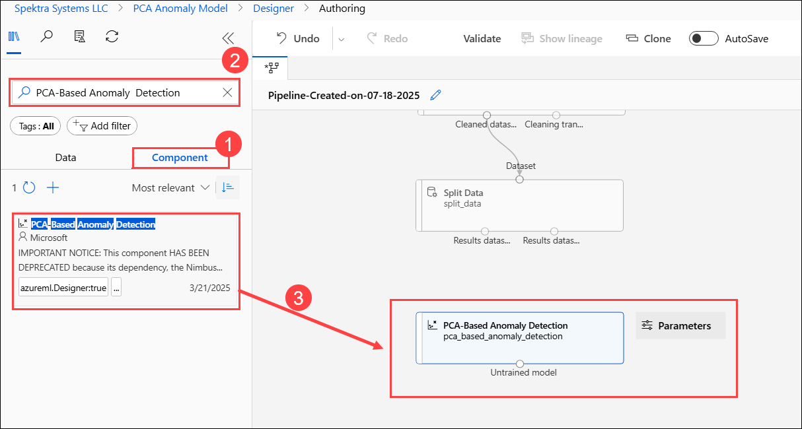
   
     >**Note**: This is a built-in model that detects outliers in time-series data using **Principal Component Analysis**.

1. Now that the **PCA-Based Anomaly Detection model** has been added, the next step is to train that model using your cleaned dataset. For this, you’ll add the **Train Anomaly Detection Model** component. This component will receive:

    - Your untrained model (from the PCA component)
    - The cleaned data (from the Clean Missing Data component)     

1. In the **Component (1)** tab, search for **Train Anomaly Detection Model (2)**. Select the **Train Anomaly Detection Model (3)**. Drag the component into your canvas, placing it below the **PCA-Based Anomaly Detection** block **(4)**.  

      

1. Once added, 
    - You’ll connect the **Untrained model output** from the **PCA-Based Anomaly Detection** to the **Model input** of **Train Anomaly Detection Model** **(1)**

    - The **left output of Split Data** to the respective **Dataset input 
ports of this Train Anomaly Detection Model** component **(2)**     

    - Then select **Save (3)**

      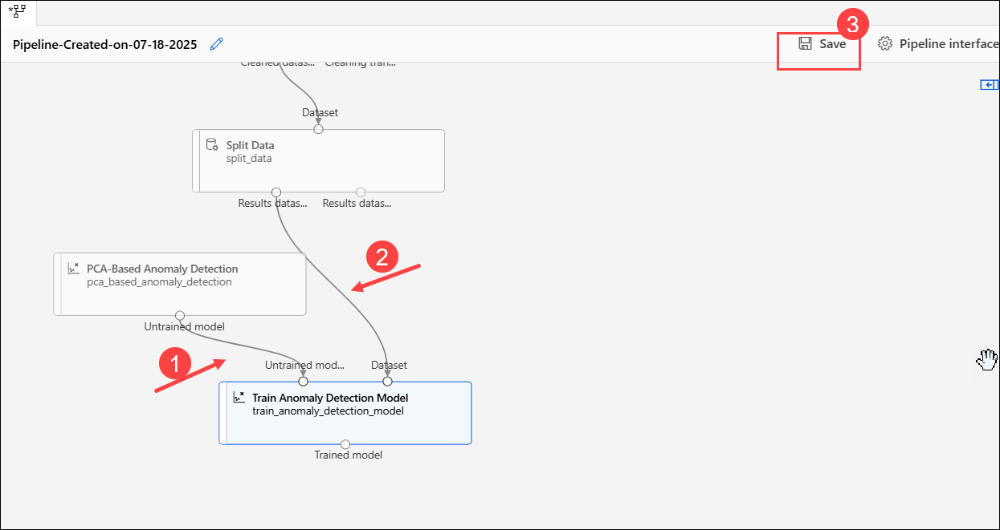

1. The next step is to score the dataset. For this, we’ll use the **Score Model**. The Score Model runs predictions using your **trained anomaly detection model**. It will output:

    - Predicted labels (normal or anomaly)
    - Confidence scores or probabilities, depending on the model type

    - These results will be used in the next step for visualizing and interpreting model performance     

1. In the left pane under the **Component (1)** tab, search for **“Score Model” (2)** by Microsoft. Drag the **Score Model** component into your canvas and place it below the **Train Anomaly Detection Model** component **(3)**. 

    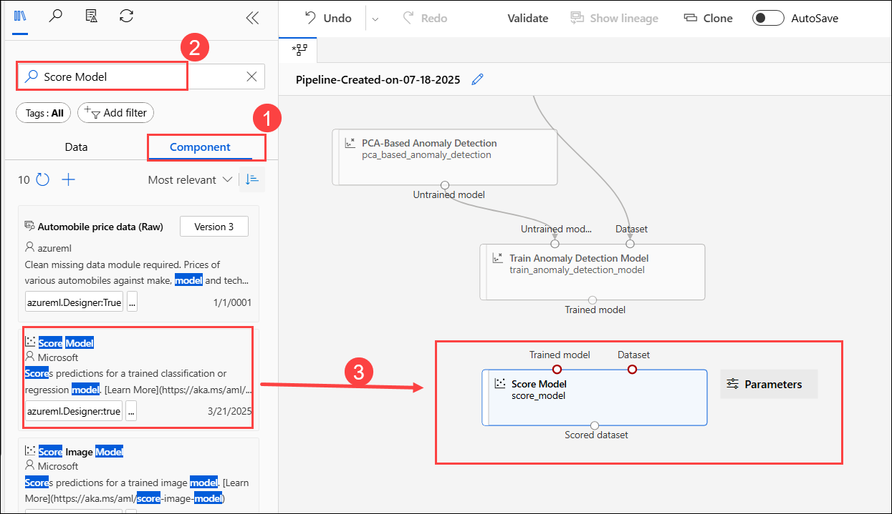 

1. Connect:

    - Connect the **“Trained model”** output from the **Train Anomaly Detection Model** component to the **“Trained model”** input of the **Score Model** **(1)**  

    - Connect the **“Right”** output from the **Split Data** component to the **“Dataset”** input of the **Score Model (2)**

      >**Note**: This ensures that your newly trained model is being used to score the test data

    - Select **Save (3)**

      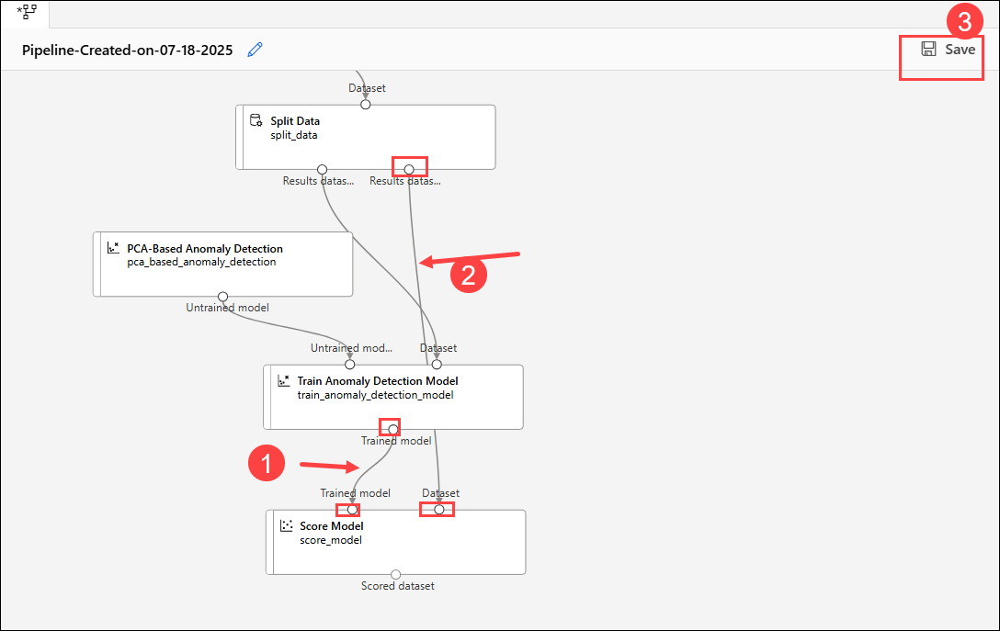 

### Task 6: Convert and View Results

We can’t visualize the output directly using the Score Model component, so we’ll need to 
convert the scored results into a visual-friendly format. To do so, we’ll use a component 
called **“Convert to Dataset”**.

1. In the left-side pane under the **Component (1)** tab, search for the **Convert to Dataset (2)** Component by Microsoft. This tool takes the output from the model and converts it to a format that can be visualized in the Designer.

    - Drag the **Convert to Dataset** component onto the canvas and place it under the **Score Model component (3)**

      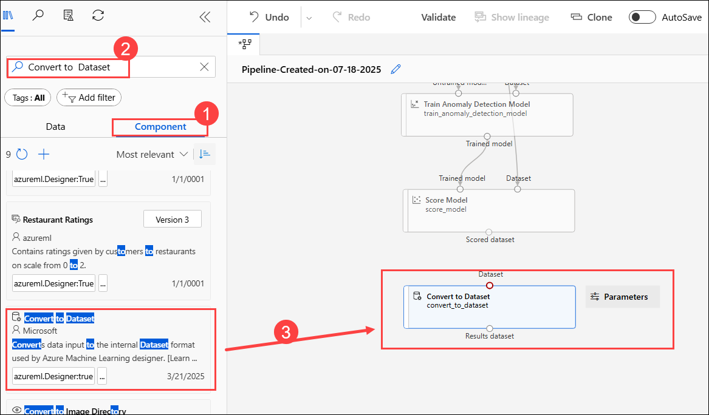 

1. Connect the **Scored dataset output** from the **Score Model** to the **Dataset input** of 
the **Convert to Dataset** component **(1)**. Once connected, click **Save (2)** at the top to preserve your updated pipeline.

    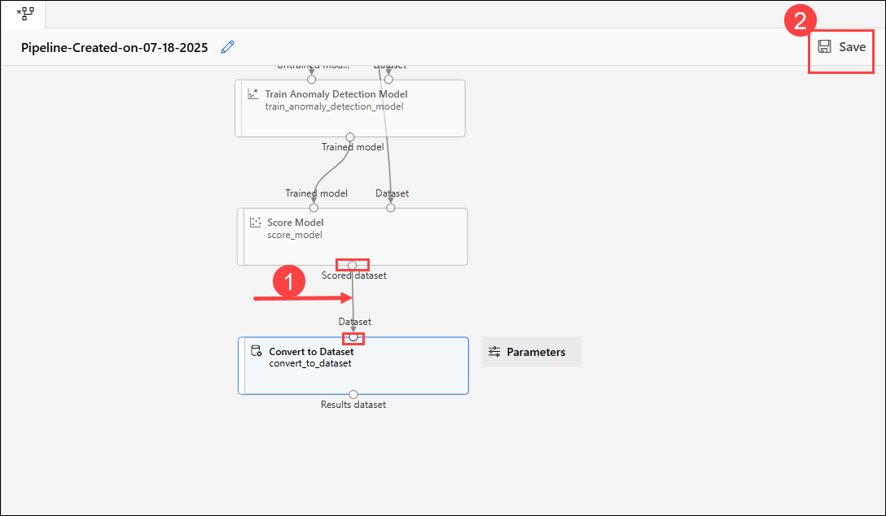 

1. Now that the pipeline is fully built with all the components connected—from data intake to anomaly scoring—we're ready to run it to view our results.

    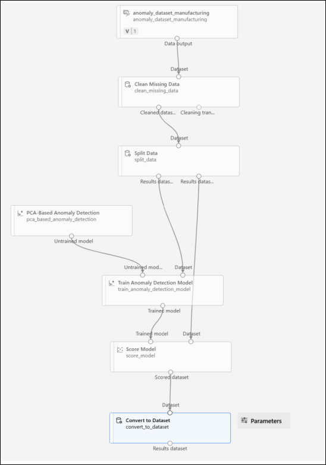 

1. First, let’s make sure all components are connected as shown. Confirm that:

    - The dataset flows through **Clean Missing Data**.
    - The **Split Data** connects to both:
        - Train Anomaly Detection Model
        - Score Model

    - **PCA-Based Anomaly Detection** is connected to the **Train
component**.
    - **Score Model** connects to **Convert to Dataset**.

1. Save your pipeline, if not auto-saved already.

1. Click the **Configure & Submit** button in the top-right corner.   

    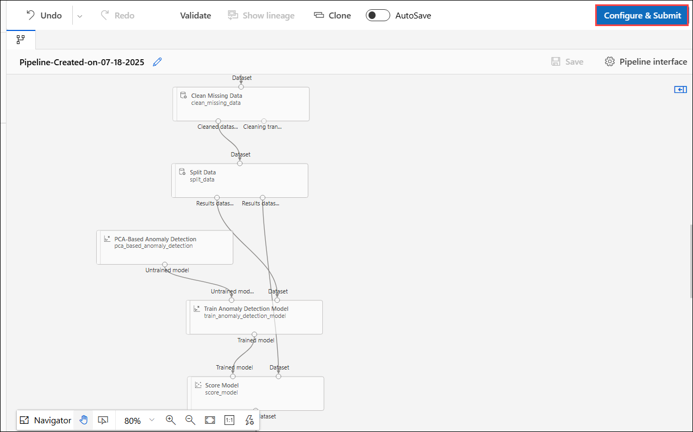 

### Task 7: Configure Pipeline Job Basics    

We now need to configure a bit more detail before running your pipeline in Azure ML 
Designer.

1. On the **Basics**: First, for easy tracking, we’ll set up a new experiment.

    - Under **Experiment name**, select **Create new** **(1)**
    - In the field labeled **“New experiment name”**, type 
**Test_Anomaly_Manufacturing (2)**
    - The **Job Display Name** is automatically generated based on today’s date.
    - You may skip the Optional Fields section.
    - Click the blue **Next (3)** button at the bottom-right corner of the screen

      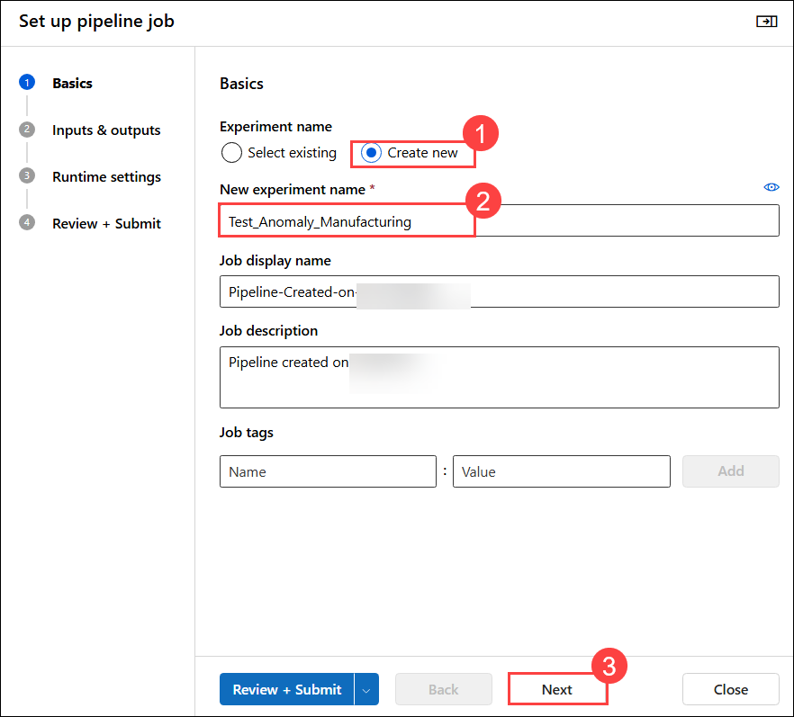    

1. **Inputs & Outputs**: We'll skip the section by clicking **Next**.

    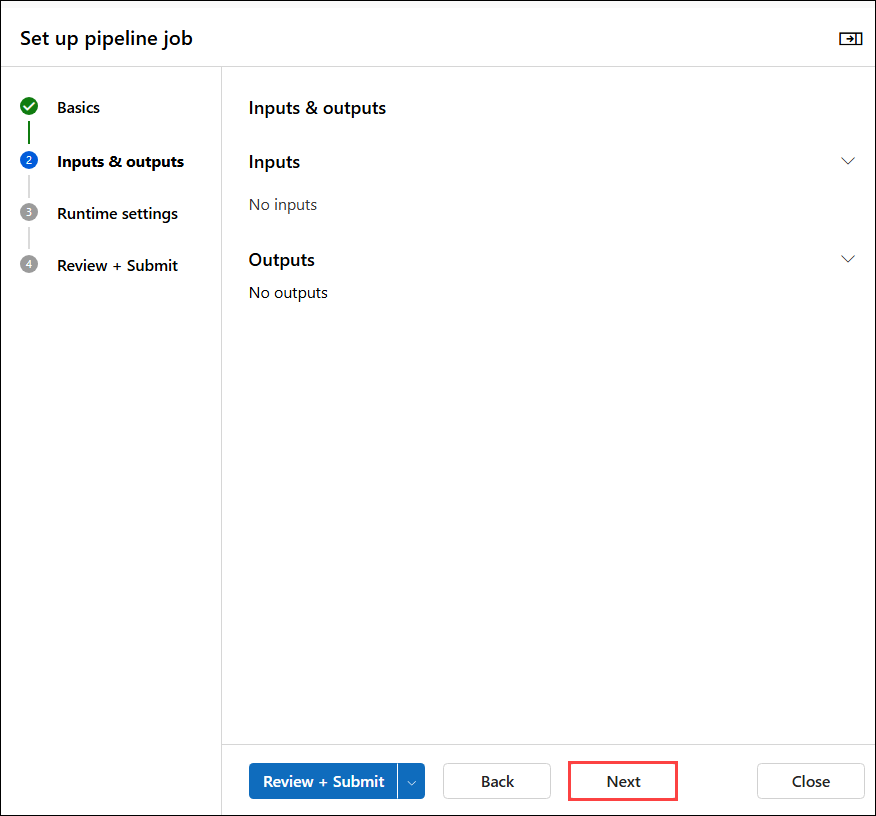 

1. On the **Runtime Settings**, provide the following details:

    - **Select Compute Type** section, select **Compute 
Cluster** from the drop down **(1)**

    - Since no cluster is currently available, we’ll need to create one. Click on 
**Create Azure ML Compute Cluster (2)**.        

      >**Note**: This will open a new pane or pop-up for 
you to configure your compute cluster

       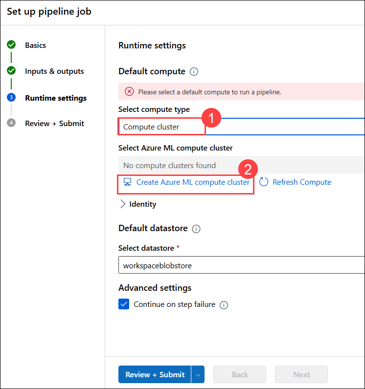 

1. **Virtual Machine**: 

    - **Location**: Confirm that the selected region is the same as your 
workspace (**East US 2**) **(1)**
    - **Virtual Machine Tier**: Leave as default. (do not select 
"Dedicated" or "Low priority" unless specified otherwise for 
cost-saving purposes) **(2)**
    - **Virtual Machine Type**: Keep this as **CPU (3)** 
    - **Virtual Machine Size**: Choose **Standard_DS11_v2 (4)**
    - Click **Next (5)**  

      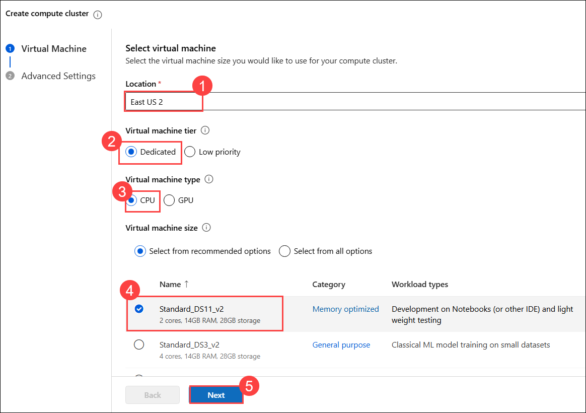     

1. **Advanced Settings**: Give a Compute Name as **Test (1)** and leave everything 
default. Then click **Create (2)**.

    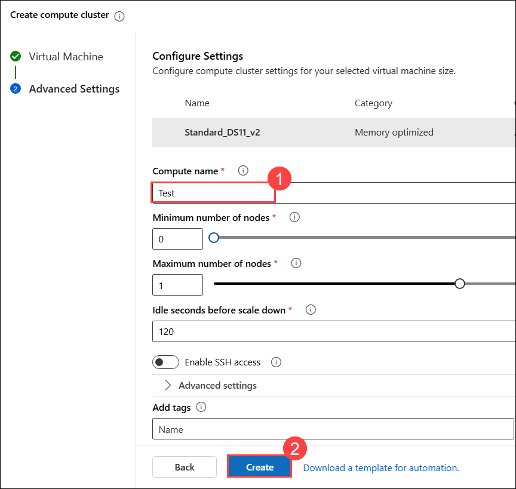 

1. Select the Compute Created **Test (1)** and click **Next (2)**.   

    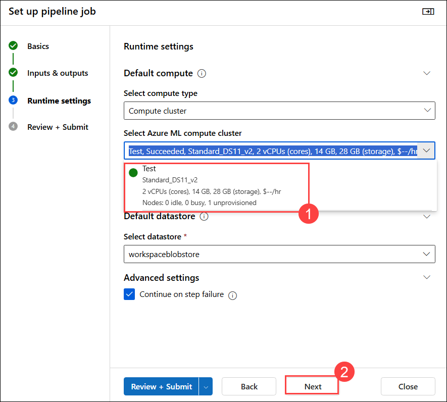 

     >**Note**: It may take a few attempts to get selected. Please keep trying — you'll be able to proceed once the **Test** status turns **green**.

1. Once on the **final** page, click **Submit**.     

    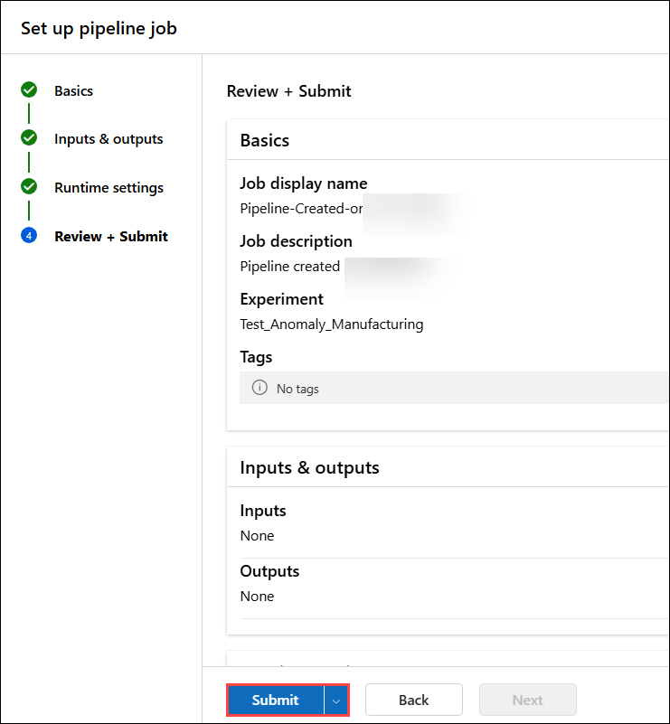 

1. Once submitted, a success notification appears at the top of the page. Click on **'View details'** to monitor the pipeline. It may take some time for the pipeline to complete.

    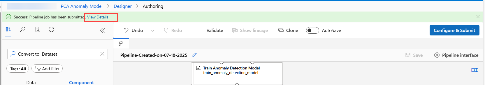    

1. Please wait for the pipeline to complete, which may take approximately `10–15 `minutes. Once it's finished successfully, the status will show as **Completed**.

    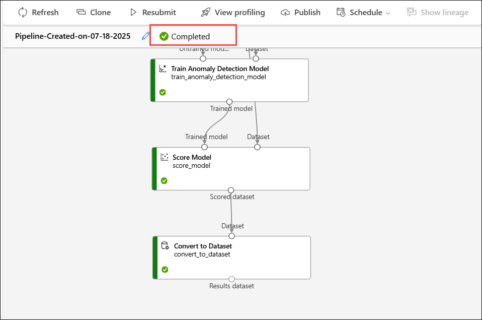  

1. Right-click on the **Convert to Dataset** component **(1)**. Hover over **Preview data (2)** to click on **Results dataset (3)**.

     
    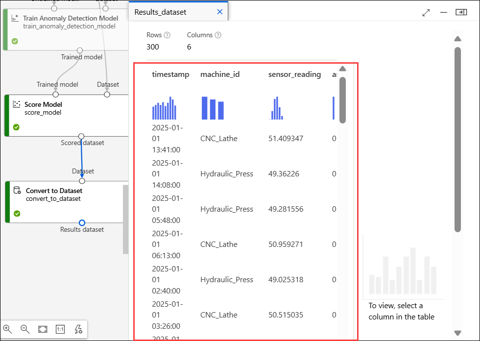 

### Task 8: Explore the Output with Azure's Built-In Visualization Tools

1. On the left-hand menu under the **Assets** section, click on **Jobs (1)**. Click on the experiment name **Test_Anomaly_Manufacturing (2)**.

   This is where you can view all the pipeline runs, including their: 
    - Status (e.g., completed, failed, running) 
    - Start time and duration 
    - Output data 
    - Visualizations and logs

      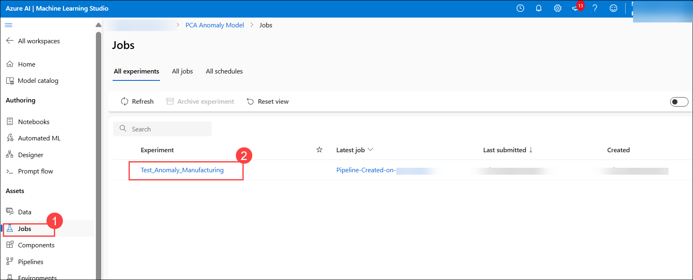 

1. You will see the most recent pipeline execution. Click on your latest pipeline job run.

    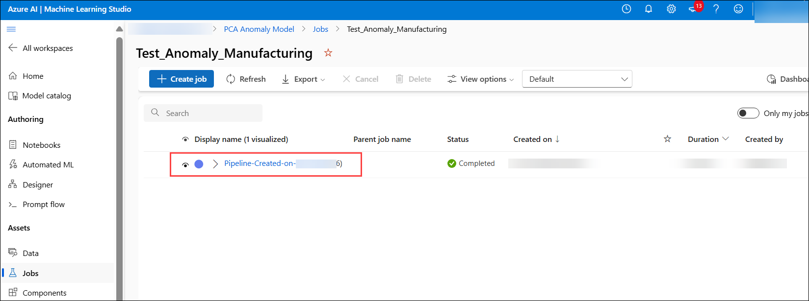

1. You can see the Successfully completed Pipeline.

    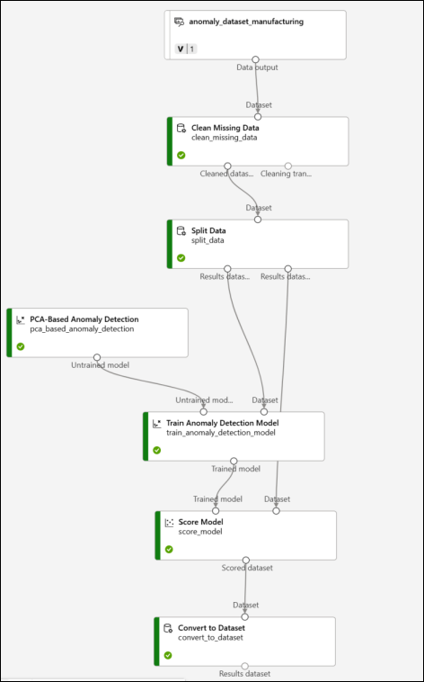

1. Scroll to the bottom of your pipeline diagram where the **Convert to Dataset** and 
**Score Model** output is `connected`. You will see the output labeled as **Results dataset**.    

    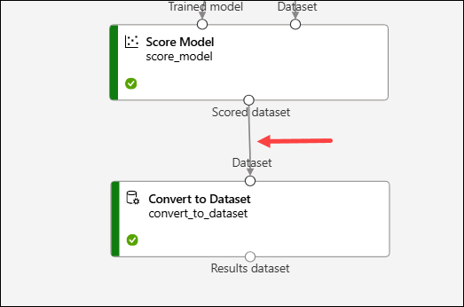

1. Right-click on the **circular output port** (the small white dot at the bottom of the 
**Convert to Dataset** component) **(1)**. From the right-click menu, hover over **“Register data” (2)** and then select **“Results dataset.” (3)**.   

    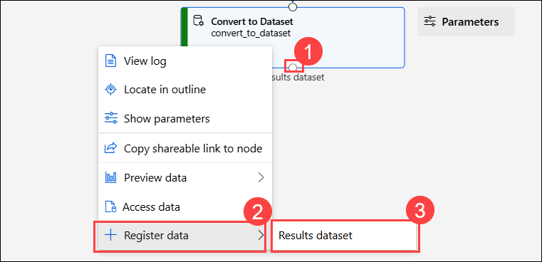

    What This Does:

    - Registering the dataset makes it available under **Assets > Data > Datasets** in your 
Azure workspace. 
    - Once registered, you can explore it, reuse it in other pipelines, or visualize it using 
Azure ML’s built-in tools.

1. On the **Register as Dataset**,

    - Select **New data asset (1)**
    
    - **New data asset name** field, type
**Model Output (2)**

    - In the **Data asset** type dropdown, choose **Tabular (3)**

    - Select **Save (4)**

      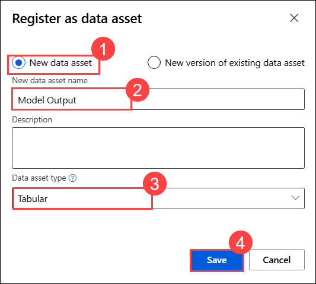

1. **What Happens Next**: 

    - Your model output is now registered as a dataset asset. 
    - You can find it under the left-hand panel: **Assets > Data > Datasets** 
    - This lets you **explore, reuse, or visualize** the output in other ML experiments.      

1. From the left navigation pane, select **Data (1)** under **Assets**. Under **Datasets (2)** tab select **Model Output (3)** Data.

    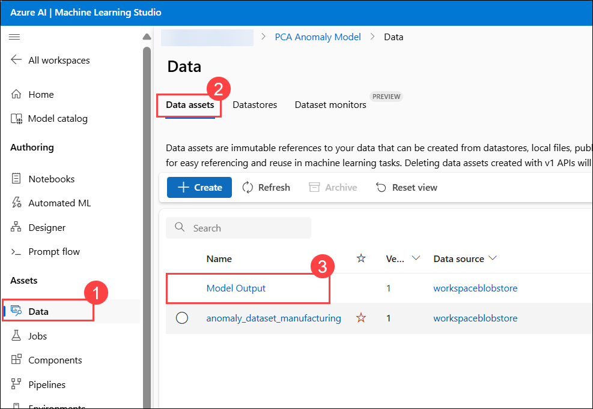

1. Select **Explore** tab, where you will see the table of your dataset. Select **Preview (2)**. This Preview view shows **(3)**: 
    - First 50 rows (out of your total dataset, like 1000 rows).
    - Columns like `timestamp, machine_id, sensor_reading, anomaly_flag, Scored 
Labels`, and `Scored Probabilities`.

      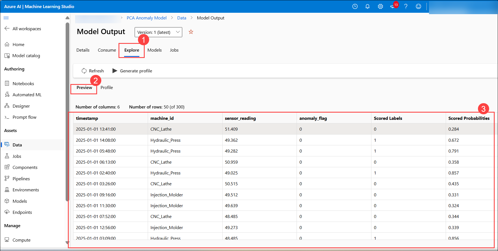

      **The dataset includes**: 

      - `timestamp`: Time the sensor reading was recorded.
      - `machine_id`: Machine identifier (like CNC_Lathe, Injection_Molder).
      - `sensor_reading`: Numeric values from machine sensors.
      - `anomaly_flag`: Ground truth labels (0 = normal, 1 = anomaly).
      - `Scored Labels`: Predicted label from the model.
      - `Scored Probabilities`: Confidence of the model's prediction.  

1. At the top of the table, next to Preview, click **Profile**. This switches the view from basic table preview to deeper visual and statistical 
analysis of each column.

    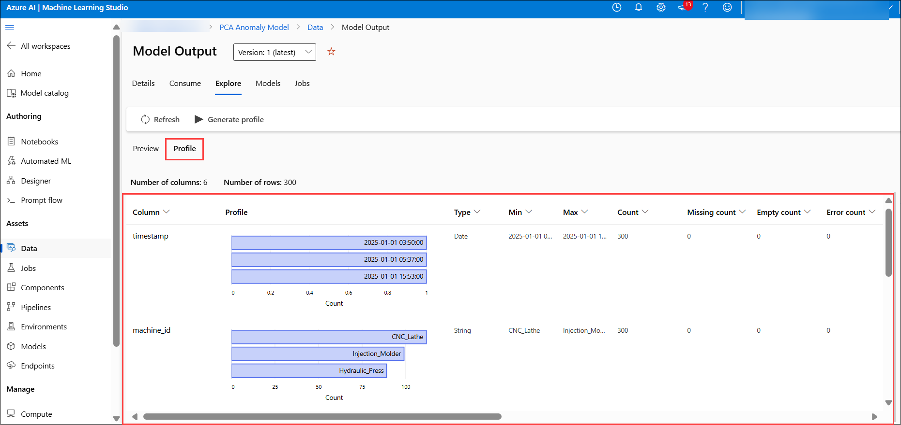

    **For each column, you see**: 
    - `Distribution Graphs` (bars showing how values are spread). 
    - `Type`: What kind of data it is (e.g., String, Integer, Date, Decimal). 
    - `Min/Max`: Minimum and maximum values. 
    - `Count`: How many entries (should match total rows, here 1000). 

1. Scroll down to the column you want to analyze. Select the **“Scored 
Labels”** column **(1)**. After selecting the column, a panel will appear on the right. From the dropdown at the top of that panel, choose **“Box and whisker plot.” (2)**.

    What This Does **(3)**: 

    **Box and whisker plots** help you understand the distribution of the column's values. 
    You will see: 
    - Minimum and maximum values 
    - Quartiles (Q1, Median, Q3) 
    - Mean (average)

      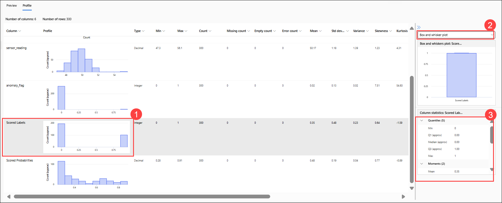

1. You can also View **Histogram** of **“Scored Labels”** in Azure ML Studio.

1. Scroll down and click on the **“Scored Labels (1)”** column. 

    - On the right-side panel, locate the dropdown menu labeled with the current 
visualization type (e.g., **"Box and whisker plot"**). 

    - Click the dropdown and select **“Histogram.” (2)**

    - The histogram will now display the distribution of the model's predictions (0 for 
normal, 1 for anomaly).

      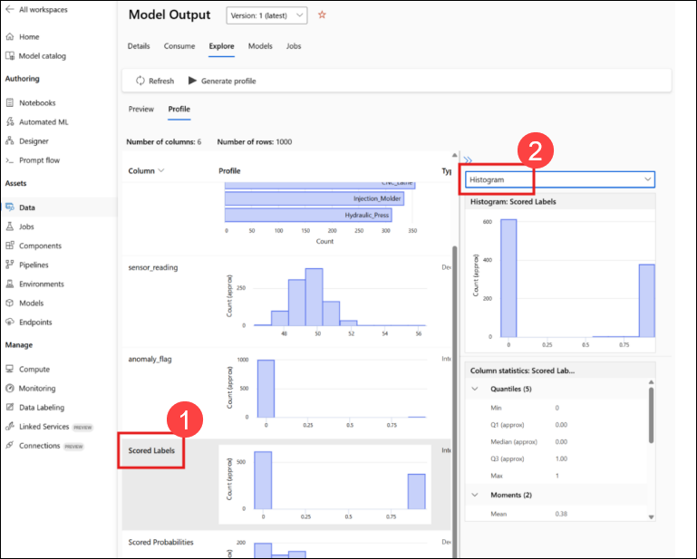
      

## Review

In this lab, you have completed the following tasks:

- Created Azure ML Workspace
- Uploaded Dataset
- Preprocessed our Data
- Split Data
- Added Detection Models 
- Converted and View Results
- Configured Pipeline Job Basics 
- Explored the Output with Azure's Built-In Visualization Tools

## You have successfully completed the lab