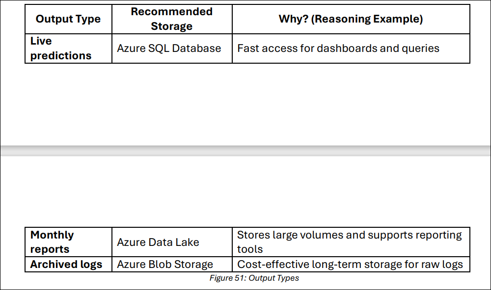

## Custom Visualizations (Using Python Code) 

If you want to go deeper—for example, to: 

- Plot time series of sensor readings 
- Overlay anomaly predictions with machine types 
- Visualize trends over time
- 
You can use a **custom Python script** inside Azure ML Designer. By adding a **"Execute Python Script"** component, you can write code using libraries like:

- matplotlib
- seaborn
- plotly
- pandas (for data processing)
  
This gives you more control over how data is visualized and interpreted.

## Advanced Visualization Tools (Power BI)

For interactive dashboards, live filtering, and publishing visuals: 

- You can export your pipeline output to Azure Blob Storage
- Then connect Power BI to this storage
- Create professional-level dashboards to present insights to stakeholders or decision-makers
- 
Power BI is especially useful in industrial settings where teams need **automated reports** or **real-time anomaly tracking**.

## Summary

Refer to Figure 50 below.

 

By choosing the right visualization method, you can better understand model outputs
and communicate findings effectively, which is a key skill in real-world AI and ML 
projects.

## Choosing the Right Storage in Azure
When building a machine learning pipeline in a factory setting, storing data properly is just as important as building the model. Think of it like organizing tools in a workshop—you do not want to throw everything into one drawer. 

Let us learn about three types of Azure storage and when to use each: 

#### 1. Azure Blob Storage 

- What it is: A cloud-based “file folder” that stores large chunks of data like logs, 
videos, or images. 
- Speed: Medium (not meant for fast, frequent querying) 
- Cost: Low (great for saving money when storing large amounts of data) 
- Best For: 

    i. Full raw sensor logs from machines 

    ii. Archived CSV files 

    iii. Backups that are not accessed often 

- Real Example: You store 1 million rows of hourly machine sensor data in Blob 
Storage. You do not need to access it every day, but it is there for audits or deeper 
analysis.

#### 2. Azure SQL Database 

- What it is: A relational database—ideal for structured, searchable, and frequently 
updated data. 

- Speed: High (fast queries and updates) 
- Cost: Medium (depends on usage and scaling) 
- Best For: 

    i. Live dashboards showing the latest predictions 

    ii. Filtering data by machine ID or time 

    iii. Quick reports and updates 

- Real Example: Your dashboard shows which machines had an anomaly in the last 
2 hours. You store this in SQL Database so the dashboard can query it quickly. 

#### 3. Azure Data Lake 

- What it is: A large-scale repository for storing all kinds of structured or unstructured 
data (like JSON, CSV, images, etc.) 
- Speed: High (especially for analytics and big data processing) 
- Cost: Medium 
- Best For: 

    i. Long-term data storage 

    ii. Large datasets used in advanced analytics 

    iii. Feeding models that use months or years of data 

- Real Example: You collect daily predictions for 2 years and store them in Data Lake. A data scientist uses this data to find seasonal patterns in machine failures. 

### Storage Recommendations (10 Minutes)

**Scenario:**

You are the data engineer at a smart manufacturing plant. Your anomaly detection 
pipeline runs every 10 minutes, checking for unusual sensor readings. 

Your team needs to: 

- View recent predictions on a live dashboard
- Create monthly reports on system performance 
- Store logs for 2 years to meet regulatory compliance 

### Group Task: 

Work in teams and answer: 

1. What storage would you use for…
Refer to Figure 51 below.

    

1. **Prepare to present:** 

    Use the sentence format: 

    “We chose [storage type] for [output type] because…” 

    Examples:

    - “We chose Blob Storage for archived logs because it’s cheaper and we don’t access the logs daily.” 

    - “We chose SQL for live predictions because dashboards need fast data access.” 
    
**Reflection Questions** 

After the group presentations, reflect on the following questions:

- Q1: What patterns did you see when you explored the prediction results? 
- Q2: How do visualizations help you better understand ML output?
- Q3: Why is it important to choose the right kind of storage?
- Q4: How would your storage strategy change if the pipeline ran every second 
instead of every 10 minutes? 

Complete the Handout
Please, complete the `SREB_U4_L4_Handout`.   
