# Hands-On-Lab: Analyzing Manufacturing Feedback with Text Data

In this hands-on lab, you will explore how manufacturers use customer feedback—gathered from surveys, warranty claims, and product reviews—to identify product issues and drive quality improvements. You will work with real-world textual data and build a machine learning pipeline using Azure ML Designer to predict customer satisfaction and uncover patterns such as common defects or recurring complaints.

### Task 1: Setting up the Project

1. **Log in** to [Azure Machine Learning Studio](https://ml.azure.com/) when prompted provide below credentials.

    - **Email/Username:** <inject key="AzureAdUserEmail"></inject>

    - **Password:** <inject key="AzureAdUserPassword"></inject>

1. 1. On the **Create a new workspace to get started with Azure ML** fill in the following fields:

    - Name: Enter **Customer_Feedback_Analysis (1)**

    - Friendly Name: Leave default 

    - Hub (Optional): You can leave this as **None (2)**

    - **Advanced Settings**:

        - Subscription: Leave the default Azure subscription **(3)**
        - Resource Group: Select **anomaly-rg (4)**
        - Region: **East US 2 (5)**
    - After filling out all fields, click the **Create (6)** button.

      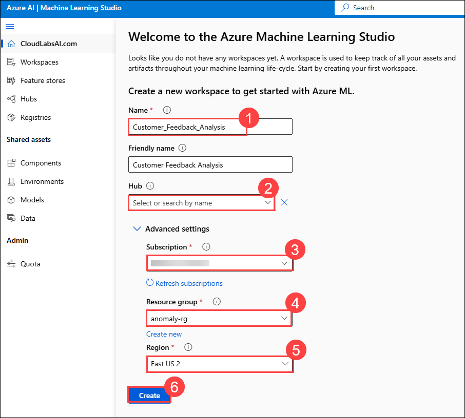 

       >**Note**: If you **did not** see the page like Figure 1, simply click **“Create Workspace”** on your dashboard and fill out the fields as described in Step 2.

1. Wait for the workspace to create, it may take around 2-3 minutes.

1. On the left-hand menu, find and click 
**Workspaces (1)** and then select the workspace named **Customer Feedback Analysis (2)** the one which you have just created. 

     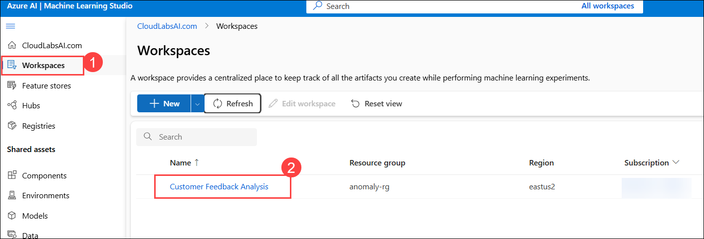 

      >**Note**: This will take you inside the workspace where you can build and run machine 
learning experiments.

1. From the left-hand side menu to find the **Designer (1)** tab under the **Authoring** section. 

    - Make sure that you’re on the **Classic prebuilt**
tab under the “New pipeline” section. From here, click on the box with a **plus sign (2)** 
that says, `Create a new pipeline using classic prebuilt components`.

      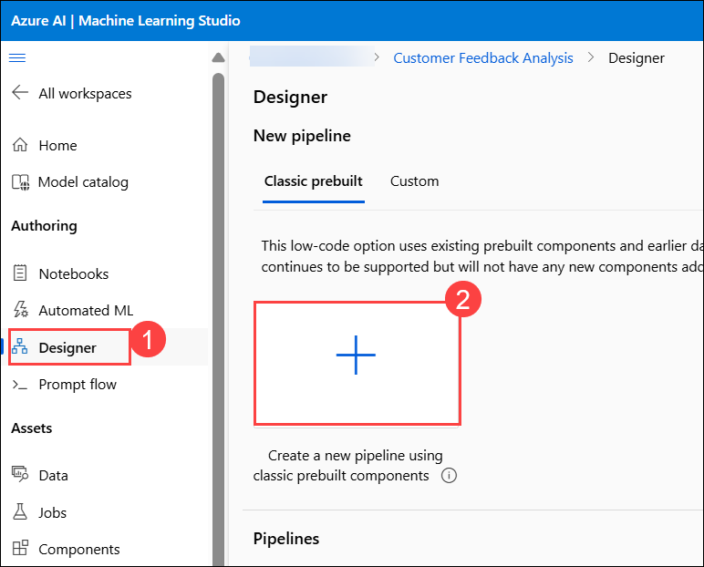 

### Task 2: Uploading the Dataset

1. On the left panel, under the **Data (1)** tab, click the **+ (plus icon) (2)** to upload a dataset.

     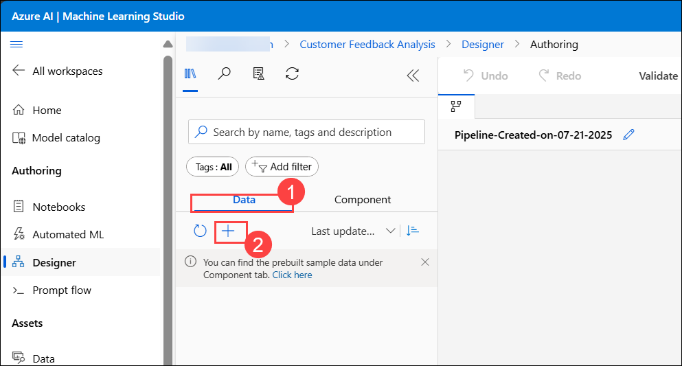 

1. On the **Data type**, provide the following details:

    - Name: Enter **Customer_Feedback_dataset (1)**
    - Make sure 
the type is **Tabular (2)**
    - Click **Next (3)**  

      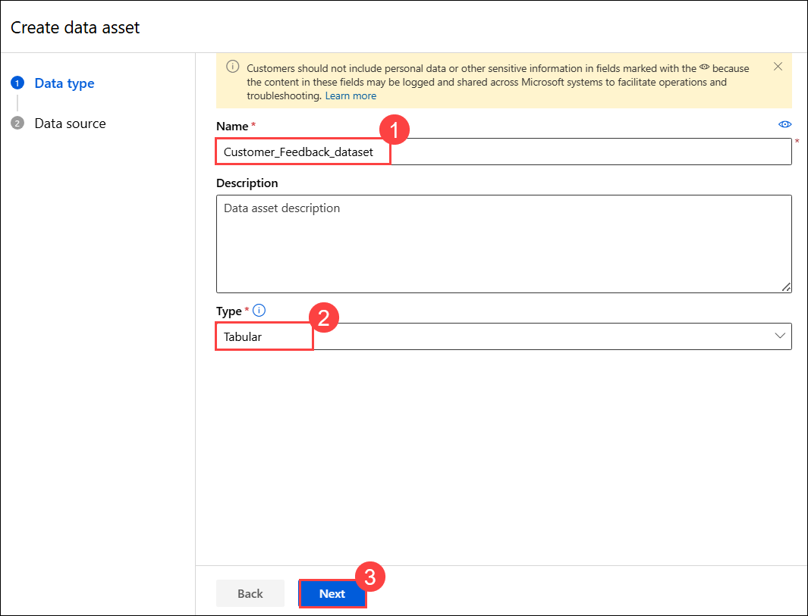   

1. On the **Choose a source for your data asset** page, choose **From local files (1)** the click on **Next (2)**. 

     

1. On the **Select a datastore** page select the following option:  
    
    - Under **Datastore type**, select **Azure Blob Storage (1)**  
    - Choose the datastore named: **`workspaceblobstore` (2)**  
    - Click **Next (3)**  

       

1. On the **Choose a file or folder** page, select **Upload files or folder (1)** from the dropdown, then select **Upload files (2)**.

      

1. **File or Folder Selection**  

    - In the file browser, select the file: `Manufacturing_Customer_Feedback.csv` **(1)** 
    - Wait for the file to appear under “Upload list”  
    - Click **Next (2)**  

      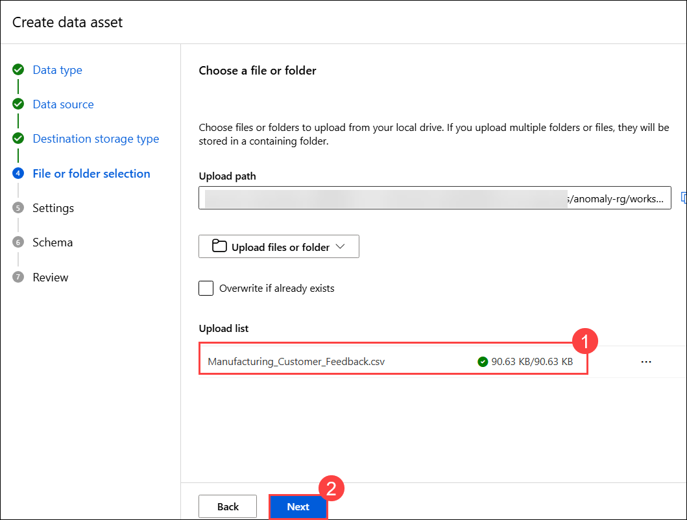  

1. On the **Settings** page, review the fields and ensure they match the expected format then click **Next**  

    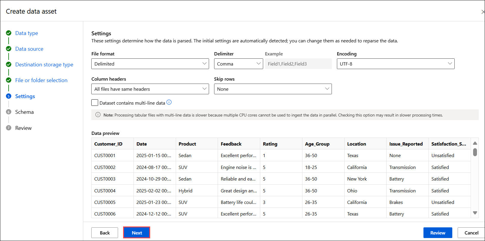 

1. On the **Schema** page, ensure the schema fields are correctly recognized then click **Next**  

    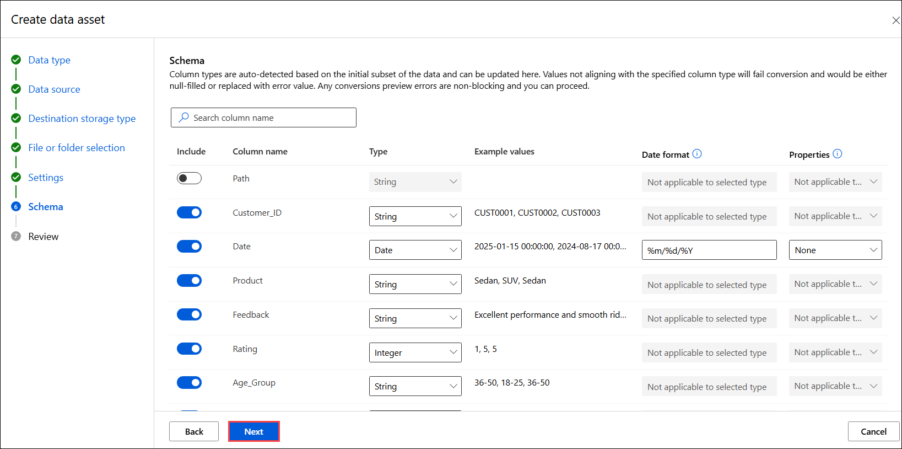 

1. On the **Review** page, click **Create** to finalize the dataset upload

    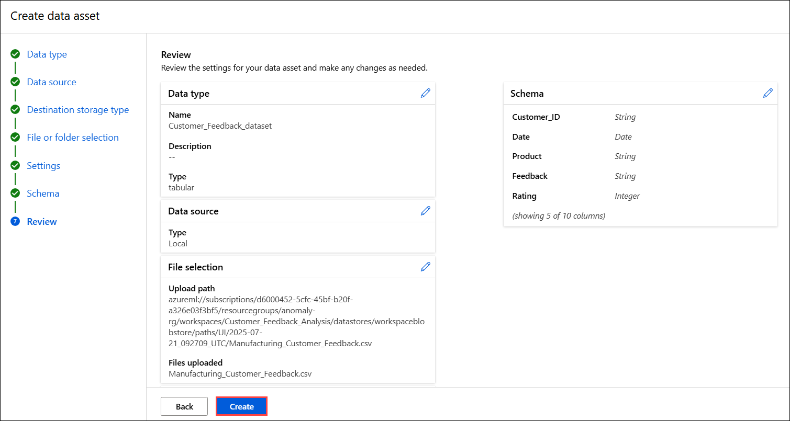 

1. Under the **Data** tab, locate the uploaded dataset named **`Customer_Feedback_dataset` (1)**. Click on the dataset card. **Drag it from the left panel** and drop it onto the empty space in the pipeline canvas on the right **(2)** 

    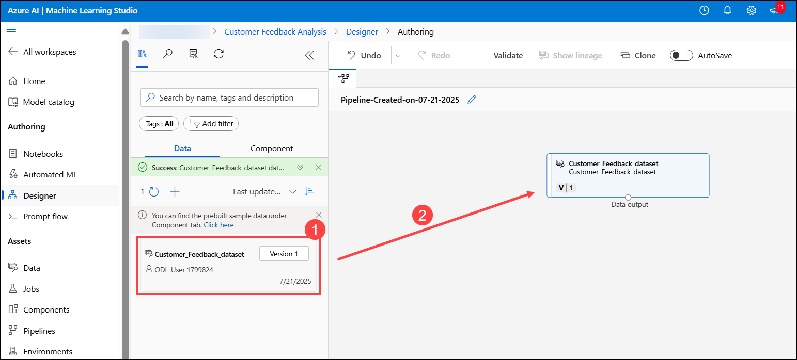          

1. Then **Save**.

    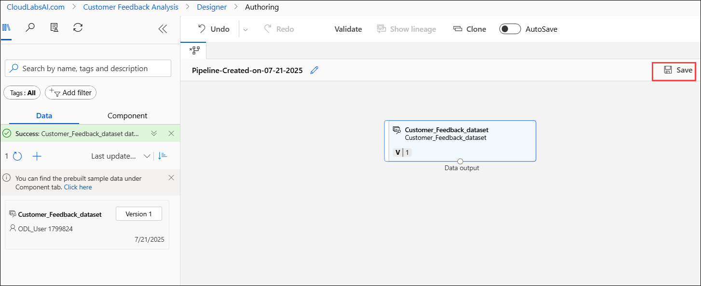                

### Task 3: Preprocess the Text

Now it’s time to add the clean missing data component.

1. In the **Component (1)** tab (left panel), search for the **Preprocess Text (2)** module by Microsoft. Drag the **Preprocess Text** module into your pipeline workspace **(3)**.

    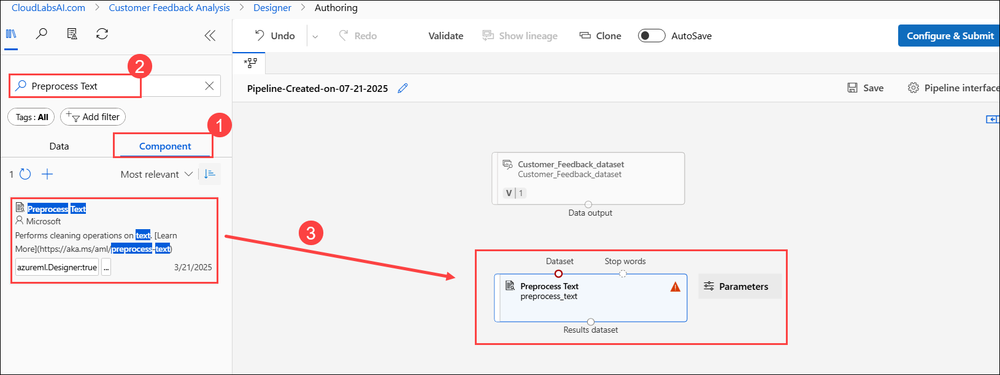 

1. Connect the dataset to the module by clicking on the **small circle** at the bottom of 
**Customer_Feedback_dataset**. Then, drag a connection line to the **top-left circle** of the **Preprocess Text** module 
named **Dataset**

    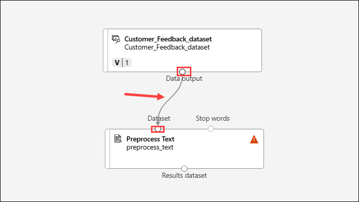 

    Now we need to tell Azure ML which column (in your dataset) contains the customer feedback that needs to be cleaned for machine learning.

1. Double click on the **Preprocess Text** module **(1)** and scroll down to the field 
labeled **Text column to clean**. Click **Edit Column (2)**.

    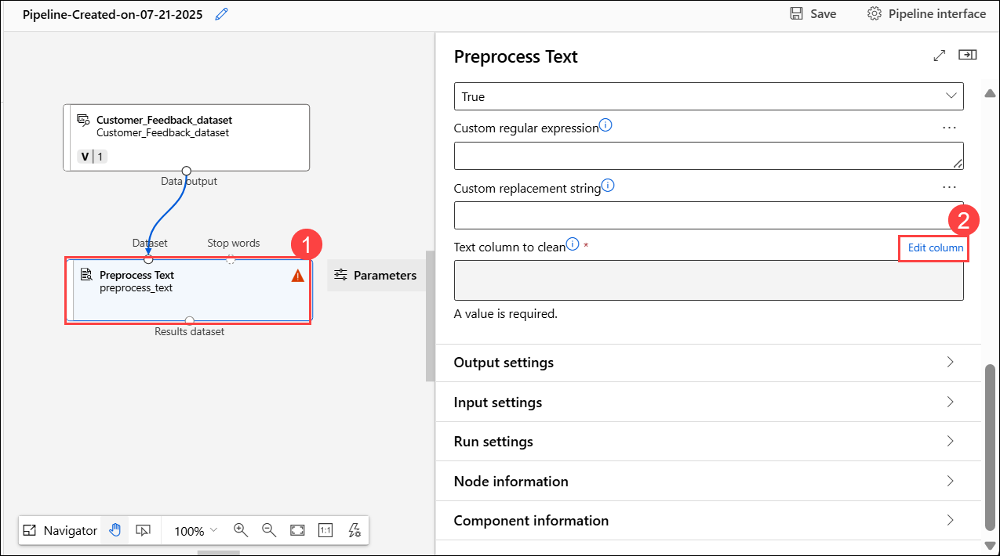 

1. From here, select the column named **Feedback (1)** and then click **Save (2)**.

    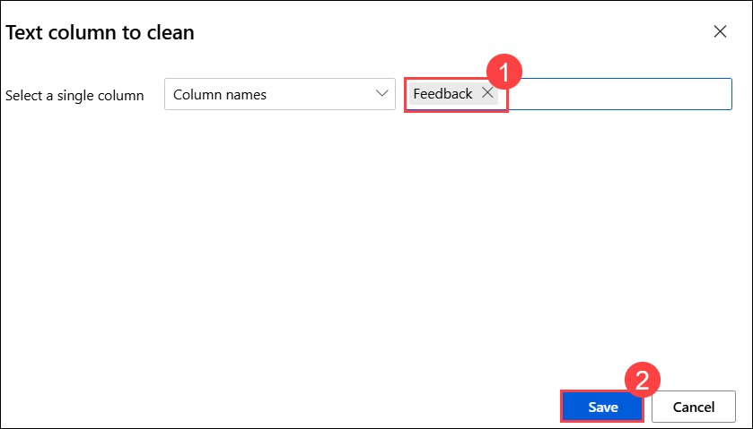 
    
1. Select **Save**.

    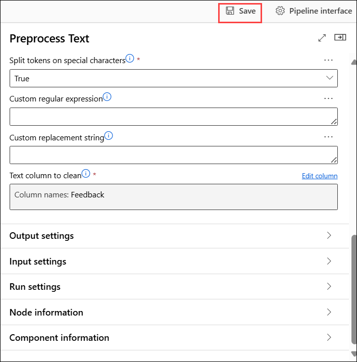 

### Task 4: Extract N-Gram Features

This step transforms the cleaned customer feedback into numerical features that a 
machine learning model can understand.

1. Navigate to the **Component (1)** tab, search for **Extract N-Gram Features from Text (2)**. Drag the Extract N-Gram Features from Text module onto the canvas **(3)**.

    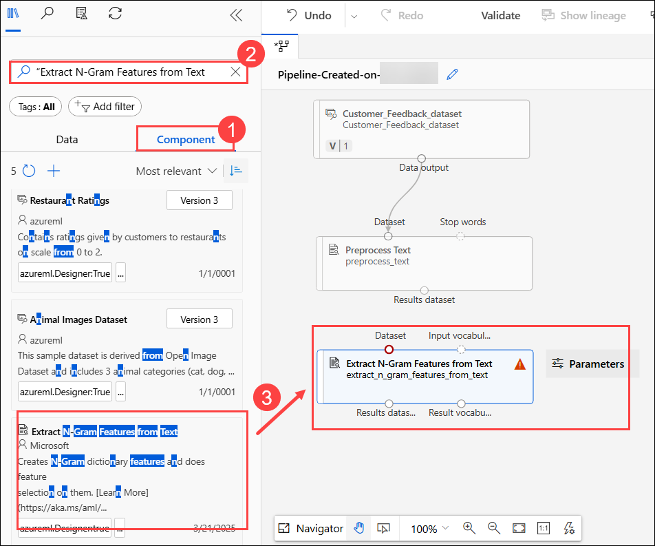 

1. Drag a line from the bottom circle of the **Preprocess Text** 
module to the **top-left input** of the **N-Gram Features** module (labeled "Dataset").

    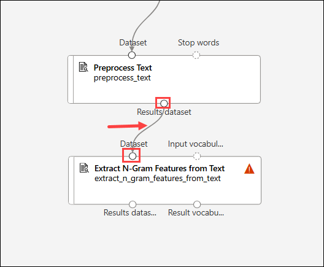 

1. Next step is to configure the extract N-Gram Features from Text module.
    
1. Double-click the **Extract N-Gram Features from Text** module **(1)**. Click **“Edit column” (2)** next to 
the **Text column** field.

    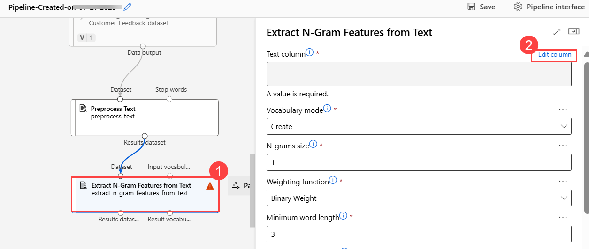

1. From the list of available columns, enter **Feedback (1)**. Click **Save (2)**.

    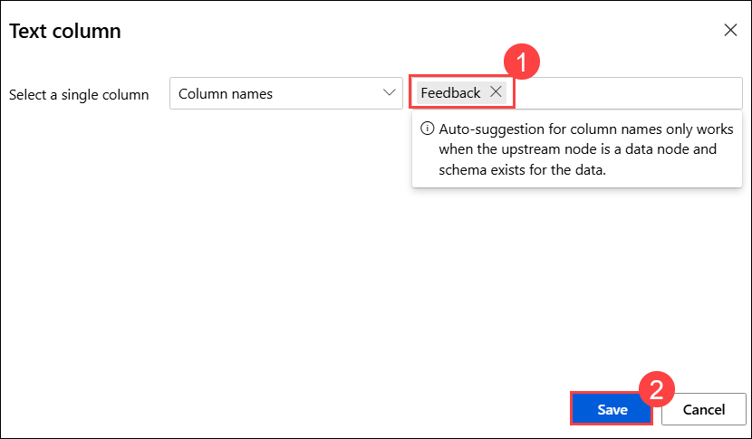

1. On the **Extract N-Gram Features from Text**, set the following fields and then **Save (9)**:

    - `Vocabulary Mode`: Leave it as **Create (1)**. 
    - `N-Grams Size`: Change the value to `2` **(2)**. 
    - `Weighting Function`: Change from Binary Weight to **TF (Term Frequency) (3)**. 
    - `Minimum Word Length`: Change from 3 to `1` **(4)**. 
    - `Maximum Word Length`: Leave it as `25` (default is fine) **(5)**.
    - `Minimum N-Gram Document Absolute Frequency`: Leave it as `5` (default) **(6)**.

    - `Maximum N-Gram Document Ratio`: Leave it as `1` (default, meaning ngrams can appear in all documents) **(7)**.

    - `Normalize N-Gram Feature Vectors`: Leave this as **False (8)**.

      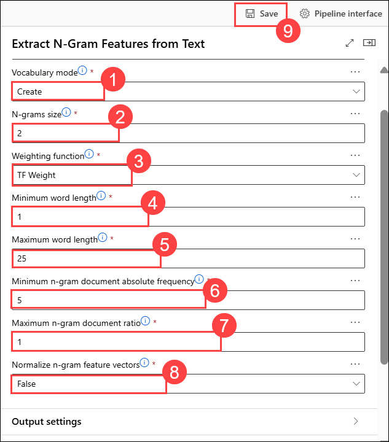

### Task 5: Split the Data

1. In the **Component (1)** tab on the left, search for the **Split Data (2)** module. Drag it onto the 
canvas **(3)**.

    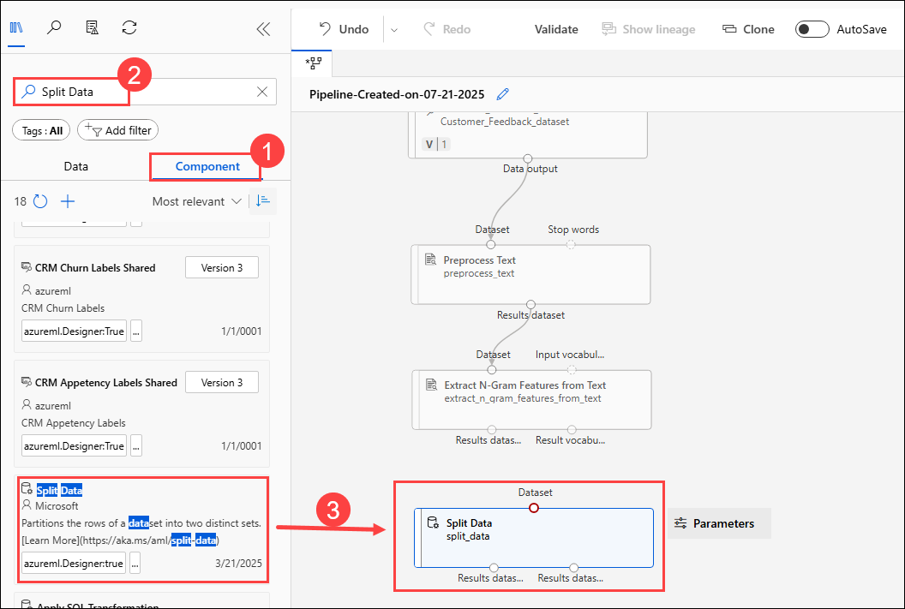

1. From the left **Result dataset** of the **Extract N-Gram Features from Text** module, drag a 
line to the **Dataset** of the **Split Data module**.

    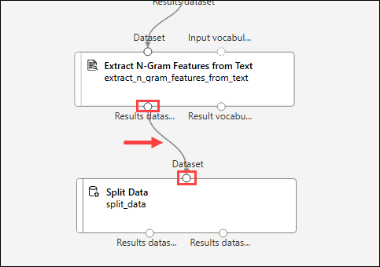

1. Double click the **Split Data module** to open 
the Parameters panel on the right.

    - Splitting mode: **Split Rows (1)**
    - Fraction of rows in the first output: **0.7 (2)**
        - This means 70% of the data will be used for training
        - The remaining 30% will be used for testing
    - Randomized split: **True (3)**
    - Random seed: Enter `42` **(4)** 
    - Stratified split: **False (5)**
    - Click **Save (6)** at the top of the screen.

      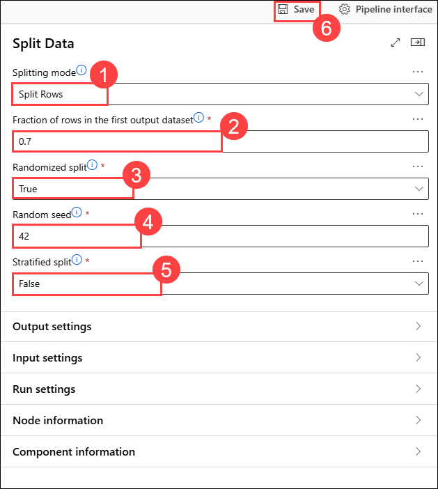    

### Task 6: Add Logistic Regression and Trace the Model

1. In the **Component (1)** tab on the left, search for **Two-Class Logistic Regression (2)**. Drag 
it onto your pipeline canvas **(3)**.

    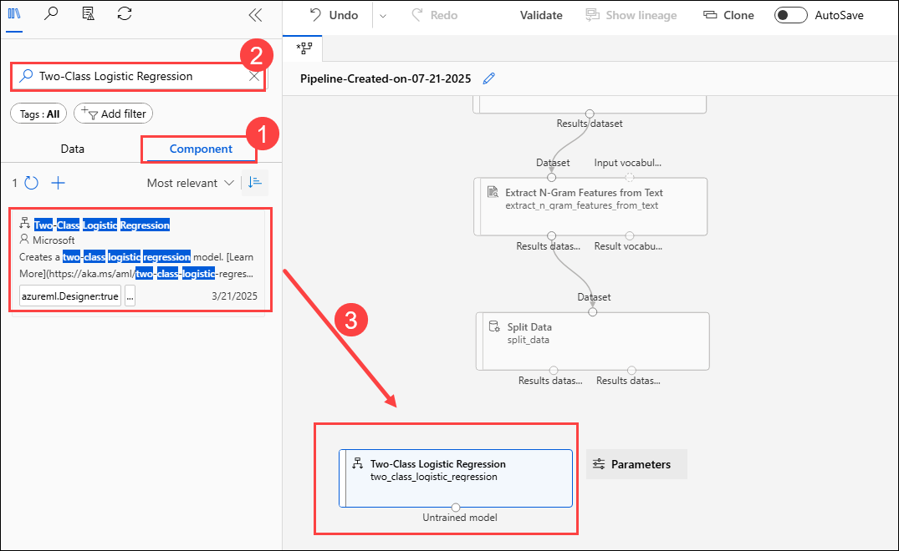

1. In the **Component (1)** tab on the left, search for **Train Model (2)**. drag it below the logistic regression module **(3)**.     

    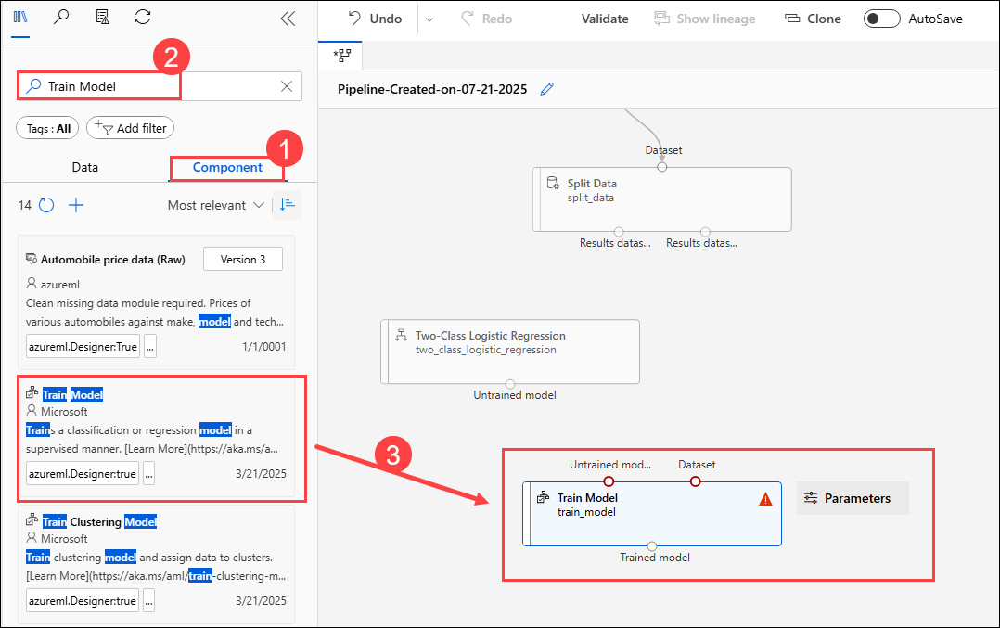

1. Connect the Modules:
    - Connect the **output of the Two-Class Logistic Regression** module to the **left 
input of the Train Model** module (labeled “Untrained model”) **(1)**.
    - From the **Split Data** module, connect the **left output port** (training set, 70%) 
to the **right input of the Train Model** module (labeled “Dataset”) **(2)**.
 
      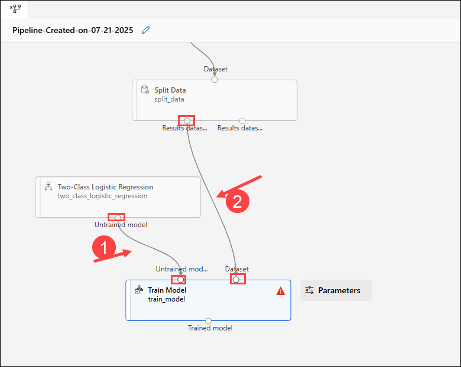

1. Double Click the **Train Model** box to open its Parameters panel **(1)**. Click **“Edit column”** under **Label column (2)**.

    

1. Type **Satisfaction_Score (1)** — this is the column your model will learn to 
predict and then **Save (2)**.

    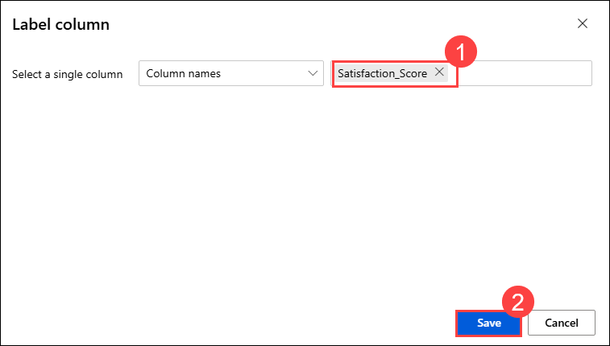

1. Click **Save** in the top toolbar.    

    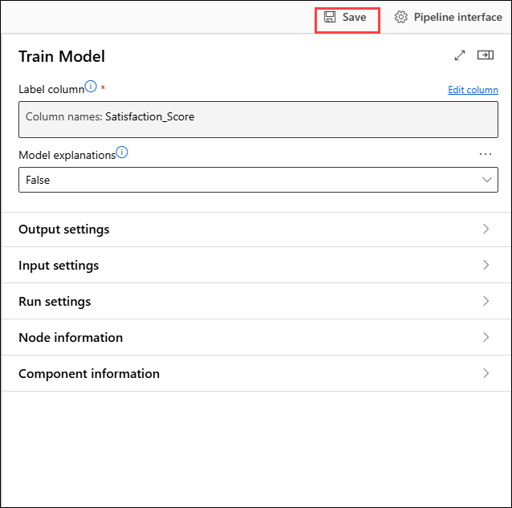
      
### Task 7: Score the Model

This module runs your trained model on unseen reviews and generates predictions. These predictions will be compared to actual satisfaction labels in the next step to evaluate model performance.

1. In the **Component (1)** tab, search for **Score Model (2)**. Drag it onto the canvas **(3)**.

    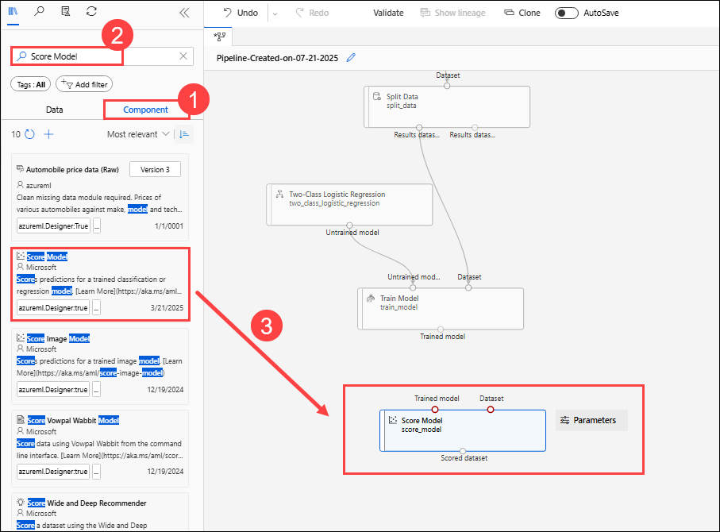

1. Connect the Modules:
    - Connect the **output of the Train Model** module to the **left input of the Score 
Model** module (labeled “Trained model”) **(1)**.
    - From the **Split Data** module, connect the **right output port** (30% testing data) 
to the **right input of the Score Model** module (labeled “Dataset”) **(2)**.  

    - Click **Save (3)** at the top of the screen

      

### Task 8: Evaluate the Model

This component gives you the key metrics to assess the model’s performance, including:
- Accuracy: How often the model is correct
- Precision: How often predicted positives are actually positive
- Recall: How many actual positives the model captured
- F1 Score: A balance between precision and recall
- Confusion Matrix: A table that breaks down true/false positives and negatives
- ROC Curve: Shows how well the model separates the two classes

Once this is complete, you'll be able to run the pipeline and preview your model's 
evaluation results.

1. In the **Component (1)** tab, search for **Evaluate Model (2)**. Drag it onto the canvas **(3)**.

    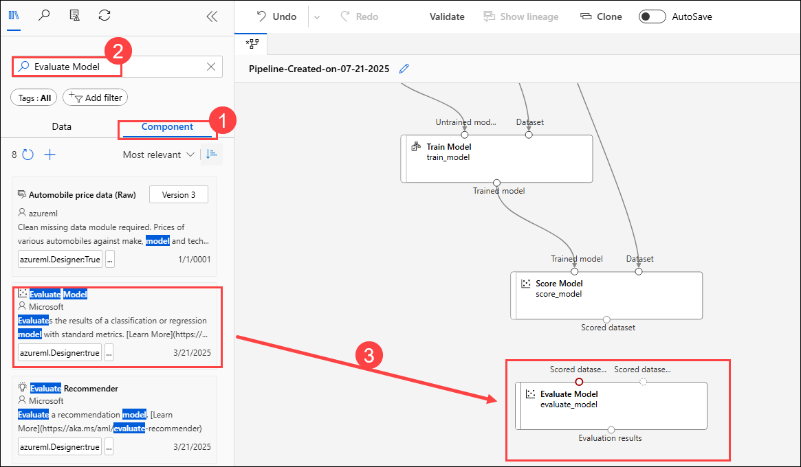

1. From the **bottom circle of the Score Model** module, connect it to the **left input of the 
Evaluate Model** module **(1)** and then **Save (2)**.

    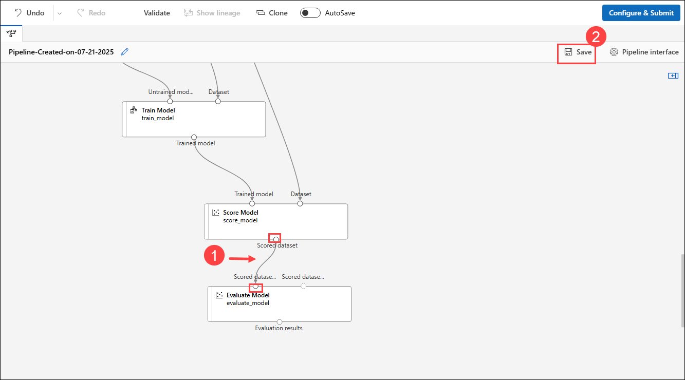

### Task 9: Run the Pipeline  

Now that your pipeline is fully built with all the components connected—from data 
ingestion to anomaly scoring—you’re ready to run it.

1. Click on **Configure & Submit**.

    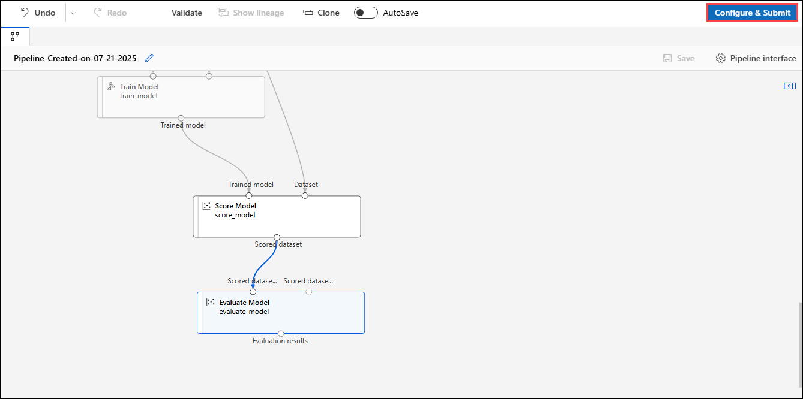

1. On the **Basic** tab,

    -  **Experiment name**: Select **Create new (1)**

    - **New experiment name**: Enter **Test_Customer_Feedback (2)**

    - Click **Next (3)**

      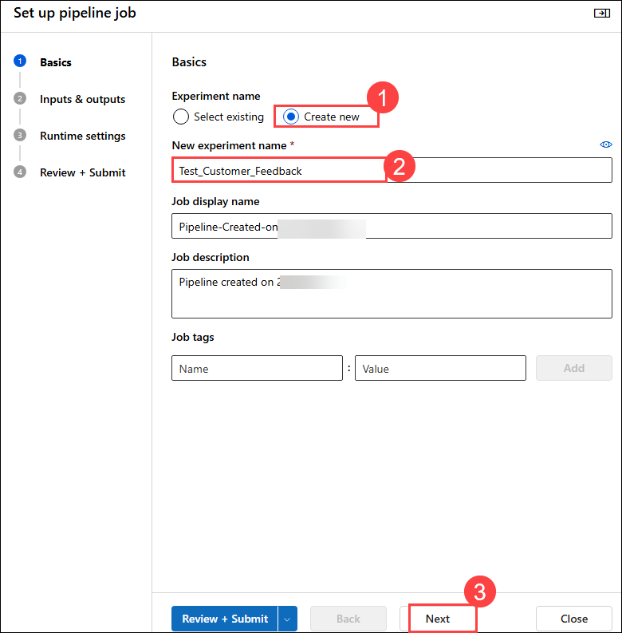

1. Click **Next** on **Inputs & 
Outputs**.

    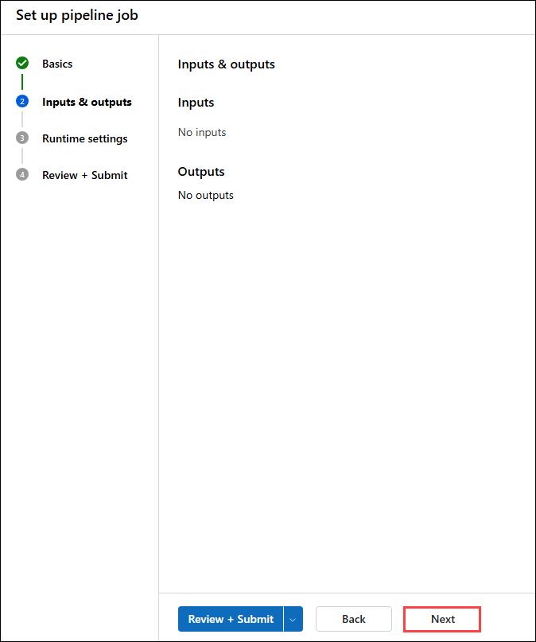

1. Now we’re on the **Runtime settings** step of the pipeline submission process. This is where you choose the **computer (called a compute cluster)** that Azure will use to run your 
pipeline.

    - Select Compute Type: From the 
dropdown, select **Compute cluster (1)**.

    - Click on **Create Azure ML compute cluster (2)**

      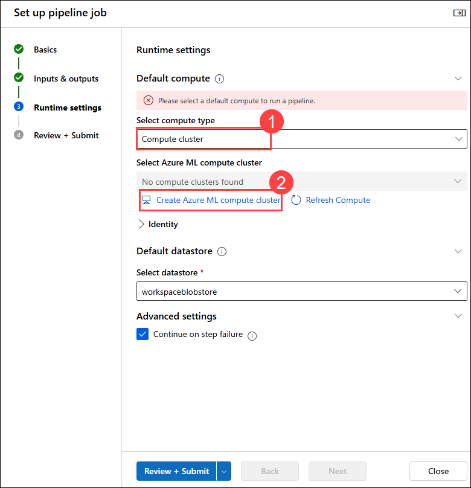  

1. You are now in the **Virtual Machine** tab for setting up a compute cluster. This step helps 
Azure decide which kind of machine to use for running your pipeline.

    - **Location**: Confirm that the selected region is the same as your 
workspace (**East US 2**) **(1)**
    - **Virtual Machine Tier**: Leave as default. (do not select 
"Dedicated" or "Low priority" unless specified otherwise for 
cost-saving purposes) **(2)**
    - **Virtual Machine Type**: Keep this as **CPU (3)** 
    - **Virtual Machine Size**: Choose **Standard_DS11_v2 (4)**
    - Click **Next (5)**  

      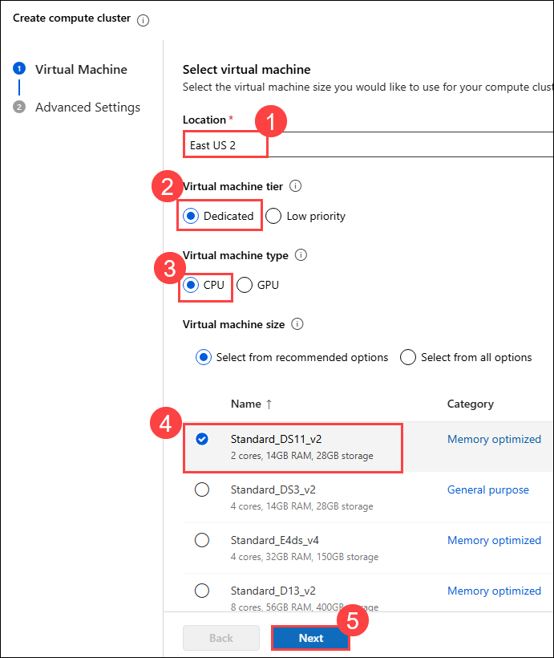  

1. **Advanced Settings**: Give a Compute Name as **Test (1)** and leave everything 
default. Then click **Create (2)**.

    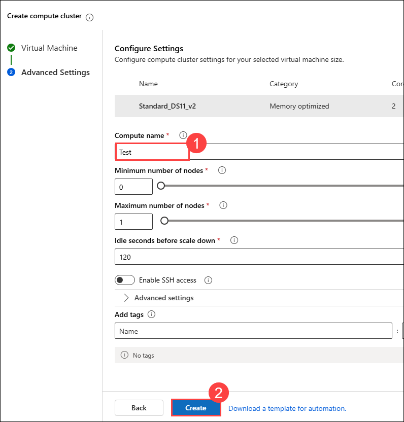 

1. Select the Compute Created **Test (1)** and click **Next (2)**.   

    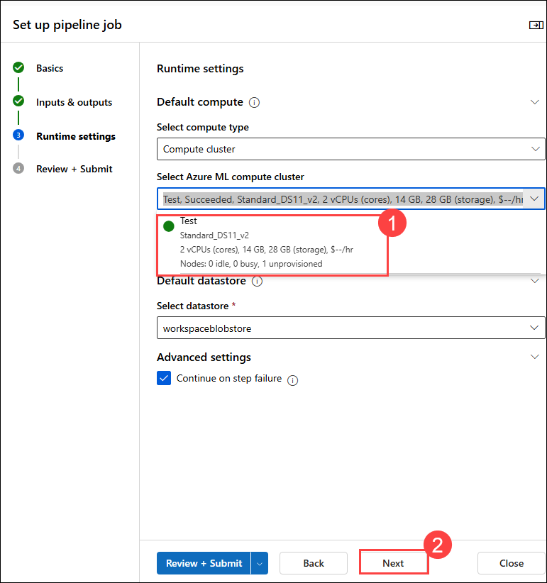 

     >**Note**: It may take a few attempts to get selected. Please keep trying — you'll be able to proceed once the **Test** status turns **green**.

1. Once on the **final** page, click **Submit**.     

    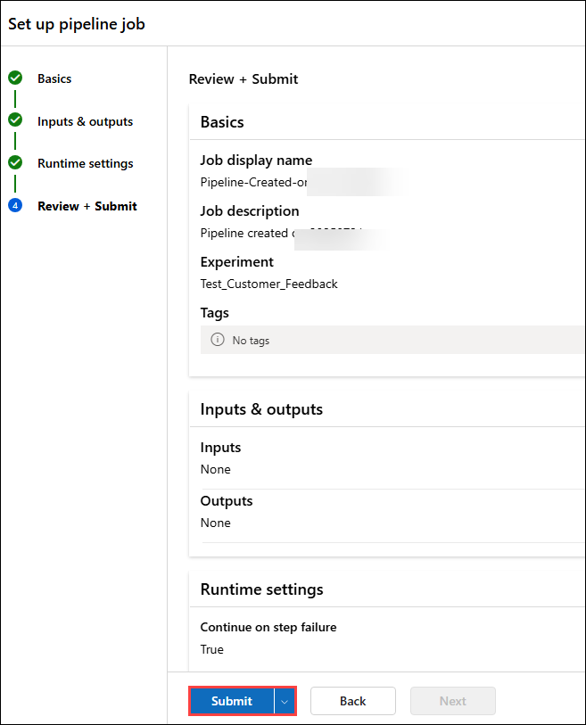 

1. Once submitted, a success notification appears at the top of the page. Click on **'View details'** to monitor the pipeline. It may take some time for the pipeline to complete.

    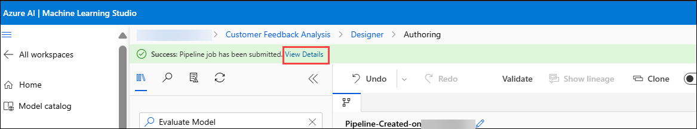    

1. Please wait for the pipeline to complete, which may take approximately `10–15 `minutes. Once it's finished successfully, the status will show as **Completed**.

    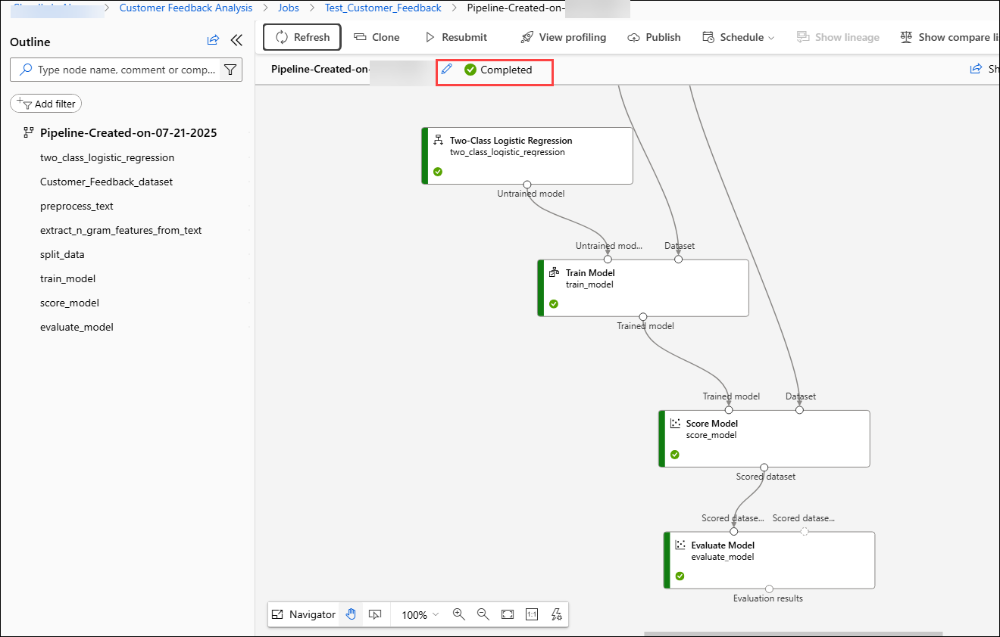   

### Task 10: View Preview Results

To view how well your model performed we can use evaluation results in Azure ML 
Designer.

1. Right-click on the **Evaluate Model (1)** box. Select **Preview data (2)** > **Evaluation results (3)**.

    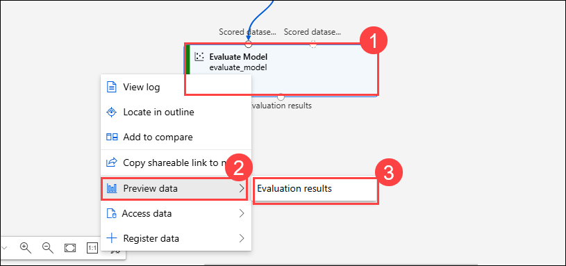 

1. After training a model, it’s important to evaluate how well it performs. The evaluation results include charts and metrics that show how accurately the model made predictions on test data.

    - **ROC Curve**:  The **ROC** (Receiver Operating Characteristic) curve helps us see how well the 
model separates positive and negative cases. 

       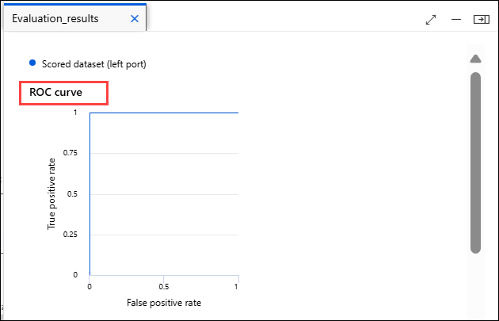 

        - The horizontal axis shows the false positive rate (wrongly predicting 
"yes"). 
        - The vertical axis shows the true positive rate (correctly predicting 
"yes"). 
        - A perfect model would have a curve that reaches the top-left corner 
— which this model does. That means the model never confused a 
negative example for a positive one

    - **Precision-Recall Curve**:  

       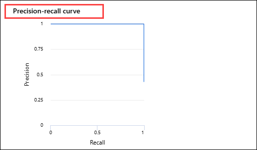 

    - This chart explains how well the model identifies positive cases.
        - Precision is how many of the model’s positive predictions were 
correct.
        - Recall is how many of the actual positive cases the model found.
        - A curve that reaches the top-right corner means the model found all 
positives without making any mistake 

    - **Lift Curve**: The lift curve shows whether the model ranks the most important predictions 
(true positives) higher than others.

        - A steep curve means the model successfully puts the most important cases at the top. In this case, the curve rises sharply, showing that the model ranks positive examples very effectively.    

            

    - **Threshold Slider**: The threshold is the cutoff point the model uses to decide between predicting "Delayed" or "On Time." In this case, a value of 0.5 means that any shipment with a predicted probability of delay equal to or greater than 0.5 is classified as "Delayed." The model is performing strongly even at this threshold, showing it makes confident and consistent predictions.

      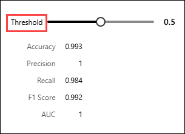   

    - **Confusion Matrix**

      This matrix shows how the model's predictions compared to actual 
outcomes:

      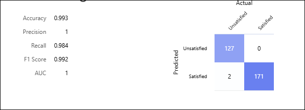 

        - `127 True Negatives`: The model correctly predicted shipments that 
were on time.
        - `171 True Positives`: The model correctly predicted shipments that 
were delayed.
        - `2 False Positives`: The model incorrectly predicted some on-time 
shipments as delayed.
        - `0 False Negatives`: The model did not miss any delayed shipments.     

    - This confusion matrix shows extremely high performance with only two 
errors, and no missed delays.

      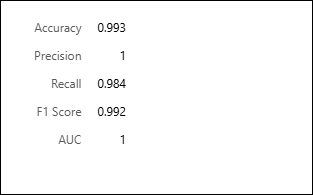 

        - `Accuracy`: 0.993 — The model made correct predictions for 99.3% of the test 
data.
        - `Precision`: 1.0 — Every prediction of “Delayed” was correct.
        - `Recall`: 0.984 — The model successfully identified 98.4% of all actual delays.
        - `F1 Score`: 0.992 — This score balances both precision and recall, confirming 
overall quality.
        - `AUC`: 1.0 — The model perfectly separates “Delayed” from “On Time” 
shipments.
        - These are the highest possible scores and indicate perfect performance

    - **Summary Metrics**     

      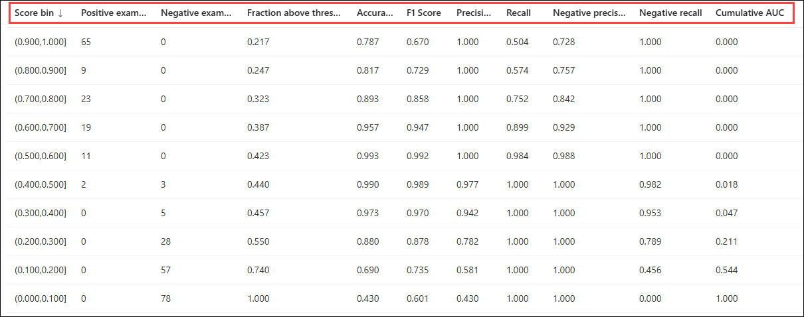       

    - **Score Bin Table**
        - This table breaks down the model’s performance across different 
confidence levels. Each row represents a score bin, which groups 
predictions by how confident the model was in making them. It helps identify 
how well the model performs at various confidence thresholds.
        - `Score bin`: Shows the model’s confidence range for predictions. For 
example, (0.900, 1.000] includes predictions where the model was between 
90% and 100% confident.
        - `Positive examples`: The number of actual delayed shipments (label 1) that fall 
in this confidence range.
        - `Negative examples`: The number of on-time shipments (label 0) predicted in 
this confidence range.
        - `Fraction above threshold`: Shows what portion of the predictions in this bin 
are above the classification threshold (default is 0.5). This reflects how many 
examples are confidently predicted.
        - `Accuracy`: Proportion of correct predictions in that bin. A value closer to 1 
means more accurate predictions in that confidence range.
        - `F1` Score: A combination of precision and recall that balances correctness 
with completeness. Closer to 1 means better overall performance    
        - `Precision`: Out of all predictions made in that bin for delayed shipments, how 
many were actually delayed? A perfect precision of 1.0 means there were no 
false alarms.
        - `Recall`: Out of all actual delayed shipments, how many did the model catch 
in that score bin?
        - `Negative precision / Negative recall`: These metrics measure how well the 
model predicts the on-time (negative) class. High values mean the model 
rarely mislabels on-time shipments.
        - `Cumulative AUC`: Tracks the model’s overall ability to rank predictions as we 
move through the score bins. This value increases as bins with high 
separation power are included.    
          

        

    

    

    
    

    

