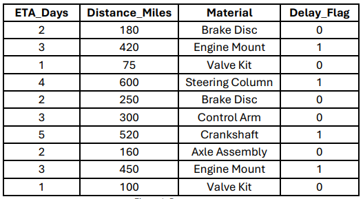

# Lesson 7: Optimizing Inventory with Logistics Data: A Supply Chain Simulation

## Lesson Description:
In this lesson, students will learn how delays in shipments can affect a factory’s 
production. They will use real data and Azure ML Designer to create a model that predicts 
whether a shipment will arrive on time or be delayed. The goal is to show how predicting 
delays can help make smarter decisions to keep production running smoothly.

### Main Learning Goal:
Students will analyze a manufacturing logistics dataset to identify delivery delays and build 
a classification model using Azure ML Designer. They will explore how machine learning 
supports inventory planning and improves supply chain decision-making.

### Essential Question:
How can data about shipping, distance, and delivery delays help a manufacturing 
company predict inventory needs more effectively?

### Standards:
- Standard 4.4: Evaluate the use of a large data set to explore a real-world scenario 
- Students use Azure ML Designer to uncover shipment patterns and train a model to classify on-time vs delayed shipments.

## Objectives:
- Interpret and describe key fields in a logistics dataset. 
- Use Azure ML Designer to clean, analyze, and visualize delivery data. 
- Build and evaluate a two-class classification model to predict shipment delays. 
- Use predictions to make data-driven inventory planning recommendations

### Why Shipments Matter

**Real-World Scenario**

You have just been hired as a junior supply chain analyst at a company that manufactures car parts. Your job is to help ensure that the factory floor always has the materials it needs 
to keep production moving. But lately, your warehouse team has been running into a serious problem—too many critical parts are arriving late. The brake disc shipment that was supposed to come Monday did not show up until Thursday. A shipment of engine mounts got delayed two full days. Now, assembly line workers are standing around with nothing to build, and your boss wants answers.

**a. Q1: Why do you think a shipment might be delayed, even if it was planned to be on time?** 

**b. Q2: What happens to a factory if just one part doesn’t arrive on schedule?**

**c. Q3: Who in the company feels the impact of a late shipment? Is it just the warehouse team?**

Now, let’s make it personal and visual: 

`Supplier → Shipping → Warehouse → Factory → Car Assembly` 
   
A single delay in this chain can stall the entire production process. It is like a domino effect. When a brake disc shipment is delayed, it does not just inconvenience one person—it could idle an entire assembly line.

### Analogy to Build Conceptual Understanding

Think of it like cooking dinner for guests. You have planned to make pasta, salad, and dessert. But the store delivery arrives late—and the pasta ingredients are missing. Even if you have the salad and dessert ready, you cannot serve a full meal. Your plan falls apart because just one critical piece did not show up.

Now, let’s relate this back to manufacturing:

In the same way, a factory cannot build a car with only 95% of the parts. A single missing shipment causes downtime, lost money, and unhappy customers.”

### Introducing the Data Angle 

The company collects a lot of data about every shipment: how far it had to travel, the material it contained, how many days it was expected to take, and whether it actually arrived on time or not. But no one has analyzed that data yet to find patterns. That is where you come in.

Today, you are going to work with real-world logistics data from a simulated factory. Your job is to build a machine learning model that can help predict whether a future shipment will be on time or delayed—before it even leaves the warehouse.

### Data Spark: Examining Raw Rows

Look at the 3–5 rows from the dataset provided by your teacher, either in your handout or projected on the screen.

Look at the data provided and think out loud about the following questions:
  
  a. Q1: Do longer shipments always mean more delays?

  b. Q2: Are some materials more prone to being delayed?

  c. Q3: Is there a connection between ETA and how likely a shipment is to arrive 
  late?

Remember that there are no wrong answers at this stage.

### Student Brainstorm

Consider this challenge: If you were the warehouse manager responsible for ordering parts next week, what would you want to know in advance? What kind of predictions would help you make better decisions? 

**Examples might include:** 
  
i. I’d want to know which materials are at highest risk of delay.
  
ii. I’d want to see which suppliers tend to be late.
  
iii. I’d want to plan ahead by ordering more of certain parts early.

### End of Engage Activity: Shipment Delay Scenario

Below are three short supply chain scenarios. Based on what you have learned so far, decide which shipment you would be most concerned about arriving late. Circle one and explain your reasoning in 1–2 sentences.

**Scenario 1**
  
- Material: Engine Mount 
  
- Distance: 460 miles 
  
- ETA: 3 days 

**Scenario 2**
  
- Material: Valve Kit 
  
- Distance: 80 miles 
  
- ETA: 1 day 

**Scenario 3** 
  
- Material: Brake Disc 
  
- Distance: 190 miles 
  
- ETA: 2 days 

Now let’s analyze the following question:

**Q1: Which shipment would you prioritize for closer tracking and why?** 

Use what you noticed in the sample data (like distance or material type) to support your answer. 

### Transition to Explore*

In real manufacturing companies, data like this is not just stored—it is analyzed to guide smarter decisions. Supply chain teams use machine learning tools to predict which 
shipments are most likely to arrive late and then adjust inventory orders to reduce risk.

You will now step into that role. Using Azure ML Designer, you will build a prediction model that classifies shipments as either ‘on time’ or ‘delayed.’ Then you will interpret the results and make a recommendation to improve inventory planning.

### Analyze Logistics Data Using Azure ML Designer

Now that you have explored the business problem and reviewed sample shipment data, it is time to take on the role of a data analyst in a manufacturing company. 

**Your goal:** 

Use Microsoft Azure ML Designer, a no-code machine learning tool, to build a prediction model. This model will help your team decide whether an upcoming shipment is likely to be on time or delayed, based on features like distance, ETA, and material type.

### Understanding the Dataset

This dataset captures logistics records for shipments in a U.S.-based manufacturing supply chain. Each row includes real operational details about a single shipment of car parts from supplier to factory. 

**Key columns include:** 
  
  i.   Shipment_ID: A unique identifier for each shipment 
  
  ii.  Material: The type of part being shipped (e.g., Brake Disc, Engine Mount, Valve Kit) 
  
  iii. Distance_Miles: The distance the shipment traveled, in miles 
  
  iv.  ETA_Days: How many days the shipment was expected to take (Estimated Time of Arrival) 
  
  v.   Delivery_Time_Actual: How long the shipment actually took 
  
  vi.  Delay_Flag: Shows whether the shipment was delayed (1 = Delayed, 0 = On time) 

These features form the inputs and output of your machine learning model. You will use the other fields to predict the Delay_Flag, helping a factory decide whether a future shipment is at risk of arriving late. 

### Why This Dataset Matters in Manufacturing

In a real manufacturing company, even a one-day delay in a shipment can have a ripple effect: it can delay product assembly, increase labor costs, or cause customer orders to be missed. This dataset helps simulate the kinds of problems real supply chain teams face: 
  
i. Q1: Should we reorder a part early because it often gets delayed? 
  
ii. Q2: Are shipments from far distances riskier? 
  
iii. Q3: Do certain materials have more delays than others? 

By analyzing this data, you are helping a virtual company avoid stockouts and improve decision-making on inventory planning. 

### How You will Use This Data

In this lesson, you will use Azure ML Designer to train a classification model that predicts whether a shipment will be delayed based on: 
  
i. The material type.
  
ii. How far the shipment has to travel.
  
iii. How many days the shipment is scheduled to take (ETA).

Your model will learn from past shipments and help forecast delays before they happen. 

This is a common real-world use case for machine learning in supply chain and logistics. 

**Instructions** 

You will now walk through the major steps in building your pipeline. Your instructor will guide you through the Azure platform. Focus on understanding what each step does and how it connects to solving the company’s delivery delay problem.

#### Step 1: Upload the Dataset 
You begin by uploading the logistics_dataset_manufacturing file to your Azure ML Workspace. This dataset includes details such as distance, ETA, vehicle type, and shipment status.

Why this step matters: 

Before any machine learning can be done, you need to bring in real-world data. Uploading the dataset teaches you how cloud systems manage inputs and prepares you to think about which features might influence delay prediction. 

#### Step 2: Configure Clean Missing Data 
You will add the “Clean Missing Data” module to handle any incomplete values in the dataset. You configure it to either remove or fill missing fields. 

Why this step matters: 

Inaccurate or missing data can break machine learning models or give unreliable results. 
Cleaning the data helps you understand why data quality is a core part of real-world AI projects. 

#### Step 3: Configure the Split Data Component

The “Split Data” module is added to divide the dataset into two parts: 70% for training and 30% for testing. The split is based on a random seed. 

Why this step matters: 

By splitting the data, you will create a fair way to test how well your model works on new, unseen cases. This reinforces the concept of training vs. testing in machine learning. 

#### Step 4: Add the Two-Class Decision Forest Model

After preparing the data, you will now choose the machine learning algorithm that will power your rediction system. In Azure ML Designer, you will locate the “Two-Class 
Decision Forest” module under the Machine Learning > Initialize Model >Classification 
category and drag it onto the canvas. 

This model does not work alone—it must be connected later to the Train Model 
component. For now, this step is about selecting the right type of algorithm for the task. 

- What is a Two-Class Decision Forest? 
The Two-Class Decision Forest is an ensemble learning model based on decision 
trees. Rather than using a single decision tree, it creates a “forest” of multiple trees, each trained on a random portion of the data. When making a prediction, the model combines the results of all trees and chooses the most common outcome (majority 
vote). 

  This helps reduce errors and improves accuracy and generalization, especially 
when the dataset contains a mix of numeric and categorical features—like distance, ETA, and vehicle type. 

- Why This Step Matters in the Real World 
In the logistics industry, predicting delays accurately can save money, improve 
customer satisfaction, and prevent supply chain disruptions. Models like the 
Decision Forest are used by operations analysts and logistics platforms to 
anticipate issues before they occur. 

  This model is a great starting point for you because: 

  i. It is robust and handles different types of data well. 

  ii. It automatically captures feature interactions without needing manual tuning. 

  iii. It reduces the chances of overfitting, which is a common problem with simpler models.

- Why It Matters for Student Learning

  You are introduced to the idea that: 

  i. Not all ML models are the same—some are better suited for certain types 
of problems. 

  ii. The Two-Class Decision Forest model is supervised, meaning it learns from labeled training data. 

  iii. Ensemble models like decision forests are commonly used in industry 
because of their reliability and high performance. 

This step begins to move you beyond just working with data—it teaches you to think 
critically about model selection and why some models are better choices than 
others.

#### Step 5: Add and Connect the Train Model Component 

The “Train Model” module is added and connected to both the training dataset and the chosen algorithm. You specify the column to predict (e.g., “Shipment Status”). 

Why this step matters: 

This step is where the model actually learns. You will understand that training involves feeding past data to the model so it can recognize patterns and make future predictions. 

#### Step 6: Add and Connect the Score Model Component 

You will add a “Score Model” module and connect the trained model and test dataset. This module generates prediction results.

Why this step matters:

Scoring lets you test the model’s performance by applying it to new data. It simulates how prediction systems are used in industry, such as predicting if a shipment will arrive late. 

#### Step 7: Add and Configure the Evaluate Model Component 

The “Evaluate Model” module is added at the end of the pipeline to assess the predictions. It displays metrics like accuracy, precision, recall, and F1 score. 

Why this step matters: 

Evaluation teaches you how to measure success in machine learning. You’ll learn that a model is not useful unless we understand how well it performs. 

#### Step 8: Running the Pipeline: Configure and Submit 

You will create or choose a compute cluster and click “Submit” to run the pipeline. This executes all modules in the correct order. 

Why this step matters: 

This step simulates a real AI workflow in cloud environments. You will experience how 
models are trained and tested at scale in modern ML platforms like Azure. 

#### Step 9: Preview Evaluation Results in Azure ML Designer 

After the pipeline completes, you will right-click on the output of the Evaluate Model component and choose “Preview data.” You will review the confusion matrix, ROC curve, and other evaluation charts. 

Why this step matters: 

This gives you visual feedback on how accurate your model was. You will begin interpreting real ML metrics and making decisions based on your—skills that directly transfer to professional AI work.

### How You will Use This Data (Detailed)

#### Analyze Logistics Data Using Azure ML Designer 

Use **Microsoft Azure ML Designer**, a no-code machine learning tool, to build a prediction model. This model will help your team decide whether an upcoming shipment is likely to be **on time or delayed**, based on features like distance, ETA, and material type.

