## Hands-On-Lab: Optimizing Inventory with Logistics Data: A Supply Chain Simulation

In this hands-on lab, you will walk through building a machine learning pipeline in Azure Machine Learning Designer to predict shipping delays using historical logistics data. You’ll learn how to create a workspace, prepare data, train a model, evaluate results, and deploy your pipeline in a no-code environment.

## Lab Objectives

In this lab, you will be able to complete the following tasks:

- Task 1: Create Azure ML Workspace
- Task 2: Upload the Dataset 
- Task 3: Configure Clean Missing Data
- Task 4: Configure the Split Data Component
- Task 5: Add the Two-Class Decision Forest Model
- Task 6: Add and Connect the Train Model Component
- Task 7: Add and Connect the Score Model Component
- Task 8: Add and Configure the Evaluate Model Component
- Task 9: Running the Pipeline: Configure and Submit
- Task 10: Preview Evaluation Results in Azure ML Designer

## Architecture diagram

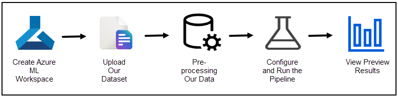 

### Task 1: Create Azure ML Workspace

In this task you will set up an Azure Machine Learning workspace where all your machine learning assets and experiments will be organized and run. You will learn how to create a workspace in the Azure ML Studio, select the appropriate region and resource group, and navigate to the Designer interface to start building your pipeline.

1. Open a new tab in the browser, right-click on the following link [Azure Machine Learning Studio](https://ml.azure.com/), then **Copy link** and paste it in a new browser tab to log in to **Azure Machine Learning Studio**.

1. If prompted, provide the credentials below:

   - **Email/Username:** <inject key="AzureAdUserEmail"></inject>

   - **Password:** <inject key="AzureAdUserPassword"></inject>
   
1. On the **Create a new workspace to get started with Azure ML** fill in the following fields:

   - **Name**: **`Logistics_Prediction`**  
   - **Friendly Name**: *(Optional)*  
      Azure will auto-fill this based on the name.
   - **Hub (Optional)**: Leave this as “None” unless instructed otherwise.
   - **Advanced Settings**:
   - **Subscription**: Select the appropriate Azure subscription from the dropdown. 
   - **Resource Group**: **ODL-SREB-<inject key="DeploymentID" enableCopy="false"/>** 
   - **Region**: Select **<inject key="Region" enableCopy="false" />** for better performance.
   - After filling out all the required fields, click the **“Create”** button.

         

    >**Note**: If you **did not** see the page like Figure 1, simply click **“Create Workspace”** on your dashboard and fill out the fields as described in Step 2.

1. Now navigate to your newly created workspace. On the **left-hand menu**, click **Workspaces**. Locate the workspace you just created **`Logistics_Prediction`**.

     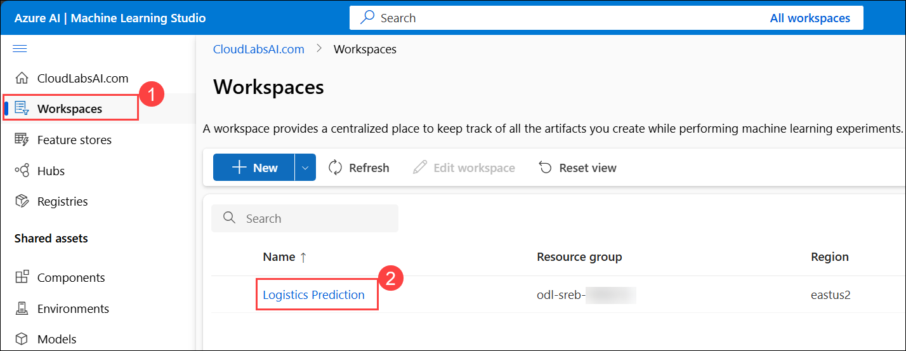 
   
1. Click on its name to open it. This will take you inside the workspace where you can build and run machine learning experiments.

    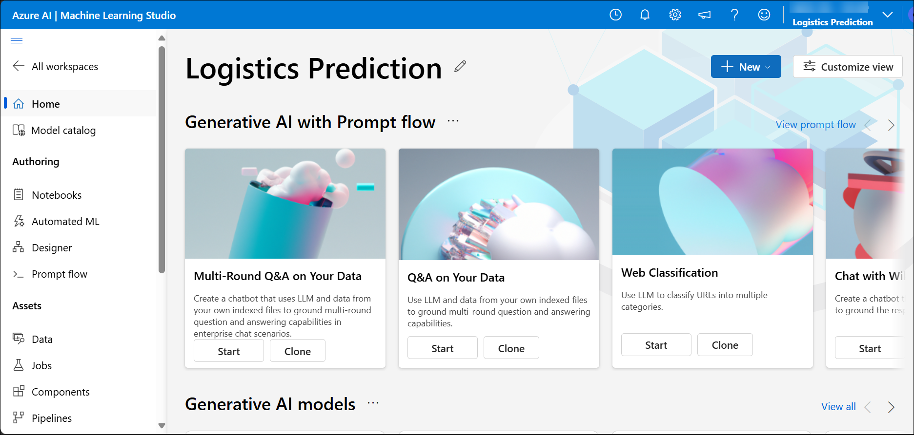 

> **Congratulations** on completing the task! Now, it's time to validate it. Here are the steps:
> - Hit the Validate button for the corresponding task. If you receive a success message, you can proceed to the next task. 
> - If not, carefully read the error message and retry the step, following the instructions in the lab guide.
> - If you need any assistance, please contact us at cloudlabs-support@spektrasystems.com. We are available 24/7 to help.

<validation step="08db0e5e-b474-4492-88bc-52c544e935d9" />

### Task 2: Upload the Dataset 

In this task you will upload the US Manufacturing Logistics data to your Azure ML workspace. You will create a tabular dataset from a local CSV file, configure the data source, and add it to your pipeline canvas for further processing.

You begin by uploading the logistics_dataset_manufacturing file to your Azure ML Workspace. This dataset includes details such as distance, ETA, vehicle type, and shipment status. 

**Why this step matters:** 
Before any machine learning can be done, you need to bring in real-world data. Uploading the dataset teaches you how cloud systems manage inputs and prepares you to think about which features might influence delay prediction. 

1. Once you are inside your workspace **`Logistics_Prediction`**, look at the left hand side menu to find the **Designer** tab under the **Authoring** section. Click on 
this tab.

     

   >**Note**:  This will open the Azure Machine Learning Designer interface where you can  begin creating your machine learning pipeline by dragging and dropping 
components.

1. Once the **Designer** page is loaded, make sure that you’re on the **Classic prebuilt** tab under the **New pipeline** section. From here, click on the box with a plus sign 
that says, **Create a new pipeline using classic prebuilt components**.

     

1. Once you click it, you’ll be taken to a blank canvas where you can start building your machine learning pipeline using components such as:
    - Dataset input
    - Data cleaning
    - Model training 
    - Custom script execution
    - Scoring and evaluation

1. On the **left panel**, under the **Data (1)** tab, click the **➕ (plus icon) (2)** to upload a dataset.  

     

1. On **Create a new workspace to get started with Azure ML** page enter the following data.

   - Name the dataset: **`logistics_dataset_manufacturing`** **(1)** 
   - Select type: **Tabular (2)**
   - Click **Next (3)**  

    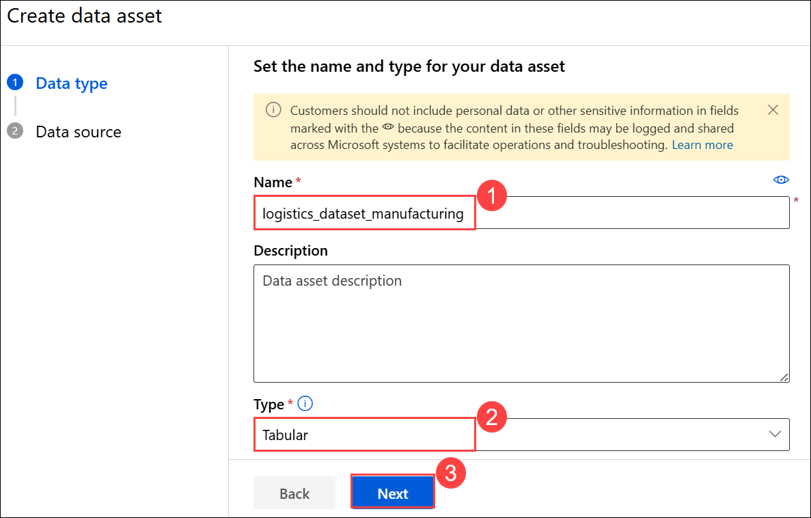 

1. On the **Choose a source for your data asset** page, choose **From local files** the click on **Next**. 

     

1. On the **Select a datastore** page select the following option:  
   - Under **Datastore type**, select **Azure Blob Storage (1)**  
   - Choose the datastore named: **`workspaceblobstore` (2)**  
   - Click **Next (3)**  

    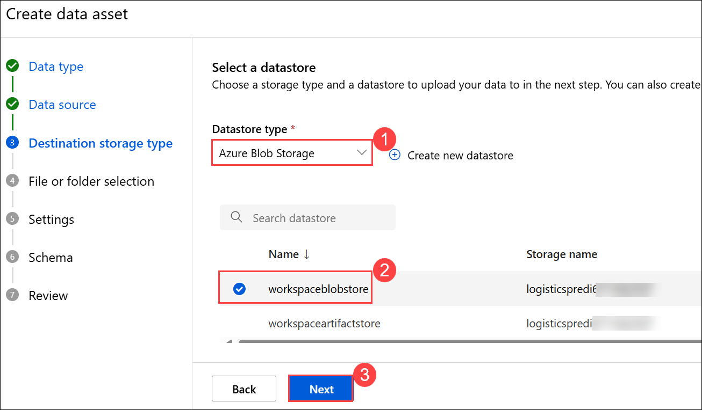 

1. On the **Choose a file or folder** page, select **Upload files or folder (1)** from the dropdown, then select **Upload files (2)**.

     

1. **File or Folder Selection**  
   - In the file browser, navigate to `C:\mslearn-ai-fundamentals\mslearn-ai-fundamentals\Labs\Allfiles\unit4-lesson7` and then select the file: **`US_Manufacturing_Logistics_Dataset`**  
   - Wait for the file to appear under Upload list  
   - Click **Next**  

    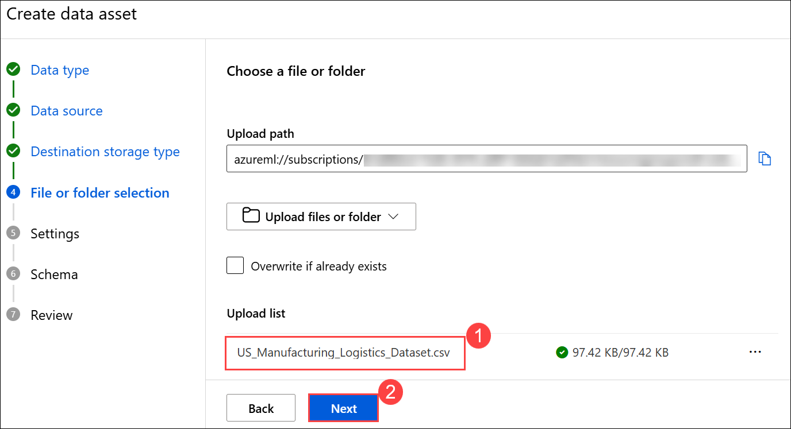 

1. On the **Settings** page, review the fields and ensure they match the expected format then click **Next**  

    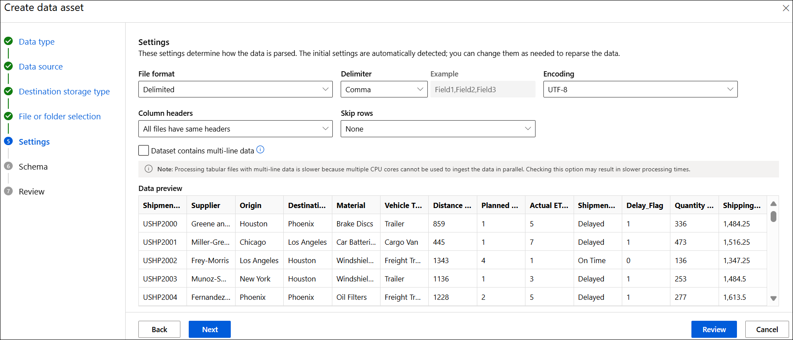 

1. On the **Schema** page, ensure the schema fields are correctly recognized then click **Next**  

    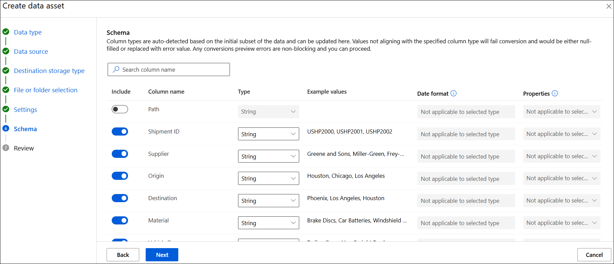 

1. On the **Review** page, click **Create** to finalize the dataset upload

    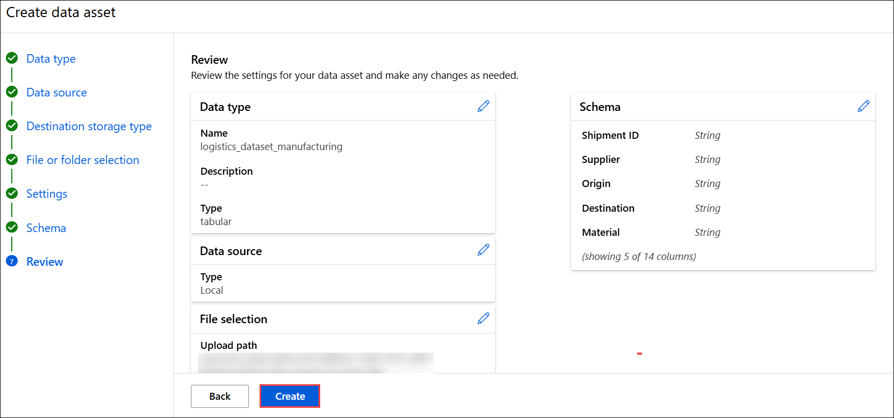 

1. Under the **Data** tab, locate the uploaded dataset named **`logistics_dataset_manufacturing`**.  

    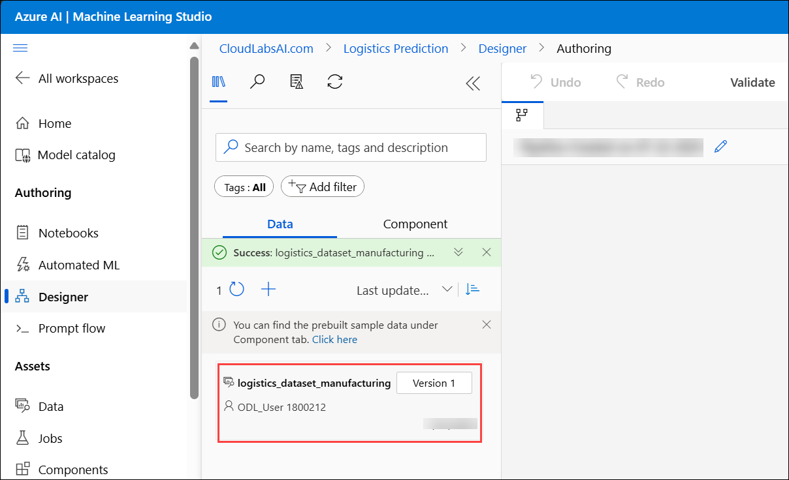 

1. Click on the dataset card then select **Use data** to **drop it onto the pipeline canvas** on the right. Verify the data placed in the canvas, and click 'Save' to avoid losing progress.

     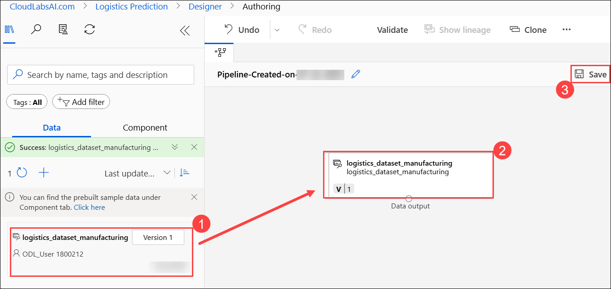 

### Task 3: Configure Clean Missing Data   

In this task, you will add the “Clean Missing Data” module to handle any incomplete values in the dataset. You configure it to either remove or fill missing fields. 

**Why this step matters:** 
Inaccurate or missing data can break machine learning models or give unreliable results. Cleaning the data helps you understand why data quality is a core part of real-world AI projects. 

1. Switch to the **Component** tab and search for **Clean Missing Data** by Microsoft.  
    
    

1. Click on the **Clean Missing Data** data component, then drag it from the left panel and drop it below the **Dataset card** in the pipeline canvas on the right.

    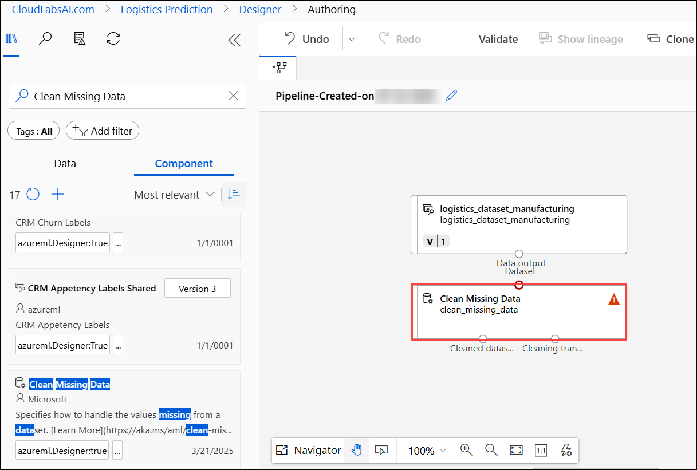
   
1. Now connect the Dataset to the **Cleaning** Component, hover over the small **circle at the bottom** of the dataset block labeled **Data output**. Click and **drag a line** to the **left circle** of the Clean Missing Data component labeled **Dataset**. **Save** your progress by clicking **Save** at the top right of the canvas.

    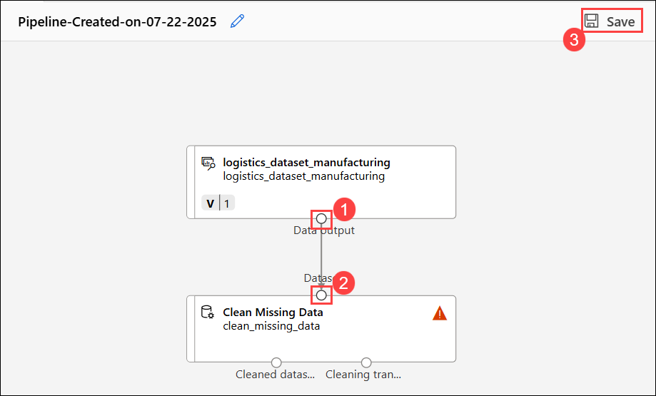 

1. Now you will Configure the **Clean Missing Data** component. Double-click the **Clean Missing Data** block on the canvas. Then click the blue **Edit column** link next to **Columns to be cleaned**. This will open a pop-up window.  

    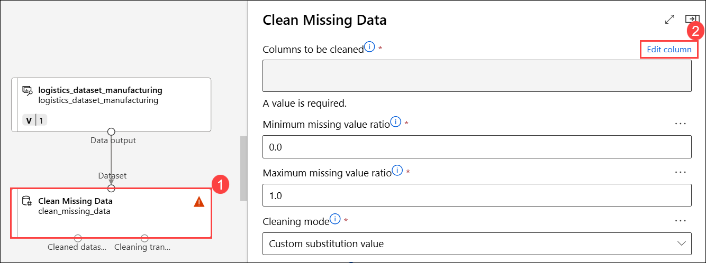 

1. Select only **Panned ETA Days and Distance_Miles** - **Do not** include columns like  Actual ETA, Shipment_ID, Delay_Flag, Material  Click **Save** in the pop-up,

    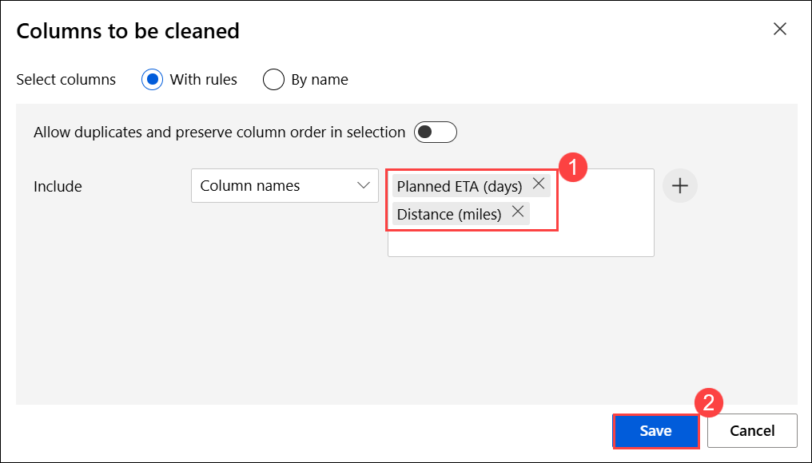 

1. On the **Clean Missing Data** window under **Cleaning mode**, make sure to select **Replace with mean**. Click **Save** again on the main screen.  

    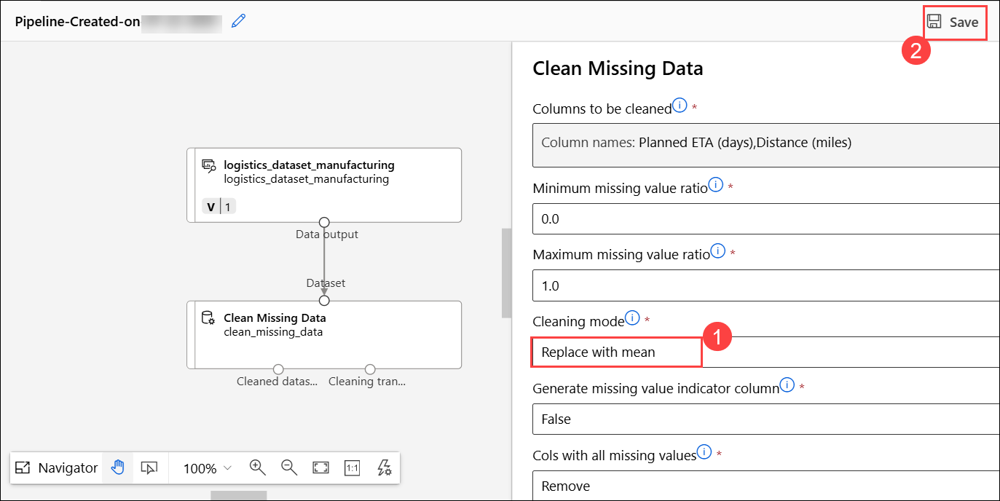 

### Task 4: Configure the Split Data Component 

In this task you will add **Split Data** and it divides the dataset into two parts: 70% for training and 30% for testing. The split is based on a random seed. 

**Why this step matters:** 

By splitting the data, you will create a fair way to test how well your model works on new, unseen cases. This reinforces the concept of training vs. testing in machine learning. 

1. In the **Component tab**, search for **Split Data**, Confirm that it says: "Partitions the rows of a dataset into two distinct sets.... Drag the component into your canvas, placing it below the **Clean Missing Data** block.

   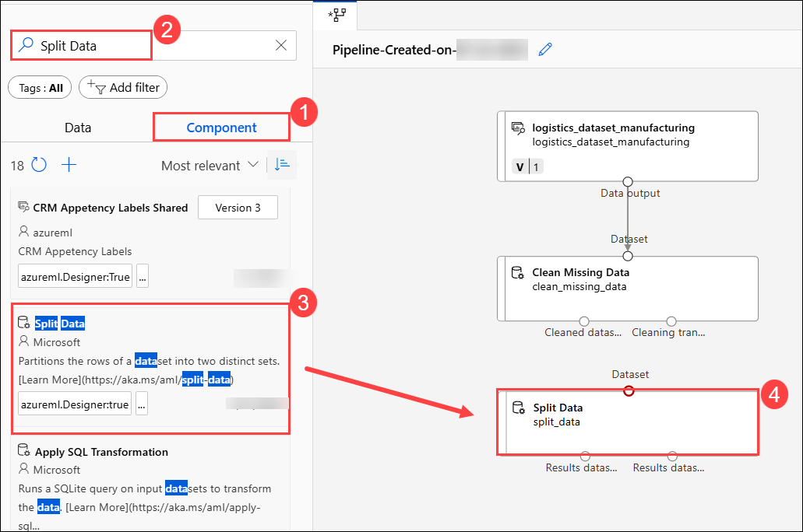 
    
1. Hover over the Cleaned data output port at the bottom of the **Clean Missing Data** component. Click and drag a line from this port to the input port of the **Split Data** block
   (This tells Azure to split the cleaned dataset).

    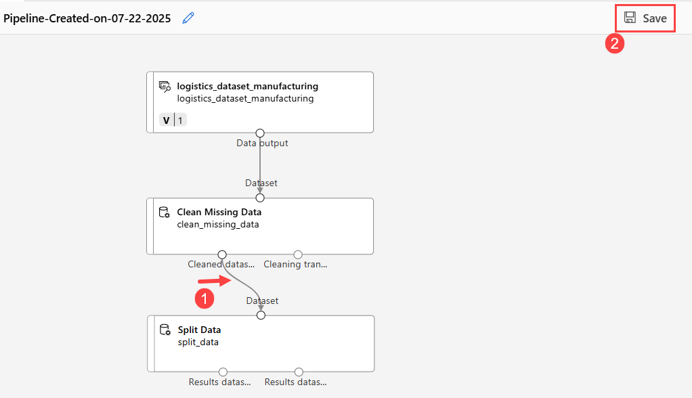

1. Double-click the **Split Data** block on your canvas. The settings panel will appear on the right-hand side specify the below settings.

    - **Set the Splitting Mode**

       - Under Splitting mode, make sure **Split Rows** is selected (This means the data will be divided by rows, not by columns).
    
    - **Set the Split Ratio**

       - In the field labeled Fraction of rows in the first output dataset, type: **0.7** (This means 70% of your data will be used for training, and the remaining 30% for testing).
    
    - **Turn On Randomization**

       - Ensure Randomized split is set to: **True** (This ensures a random and fair mix of rows in each set)
    
    - **Set a Random Seed**

       - In the Random seed field, type: **42** (This ensures that every time you run the pipeline, the data is split the same way. This is useful for consistency across student runs).
    
    - **Leave Stratified Split as False**

       - Confirm Stratified split is set to: **False** (Stratified splits are more useful in imbalanced datasets like medical diagnosis— not necessary here) Refer to Figure 29 below.

   -  Click **Save** at the top of the page to lock in your configuration

       

     
### Task 5: Add the Two-Class Decision Forest Model

After preparing your data, the next step is selecting a machine learning algorithm. In Azure ML Designer, you will find the Two-Class Decision Forest under Machine Learning > Initialize Model > Classification. Drag it onto the canvas—this model will later connect to the Train Model module.

**What Is It?**
The Two-Class Decision Forest is an ensemble model made up of many decision trees. Each tree sees different data, and predictions are made by majority vote across all trees. This approach improves accuracy, reduces overfitting, and handles both numeric and categorical data well.

**Real-World Relevance**
In logistics, models like this help predict delays, saving time and costs while improving service. It’s widely used for its robustness and reliability.

**Why It Matters for Students**

- Not all models fit every problem—choosing the right one is key.
- This is a supervised learning model trained on labeled data.
- It introduces ensemble methods, which are popular in real-world ML applications.

1. In the Component tab, search for **Two-Class Decision Forest**. Drag the component into your canvas, placing it below the **Split Data** component. Find the result titled: Two-Class Decision Forest Description: **“Creates a two-class classification model using the decision forest algorithm…”**

     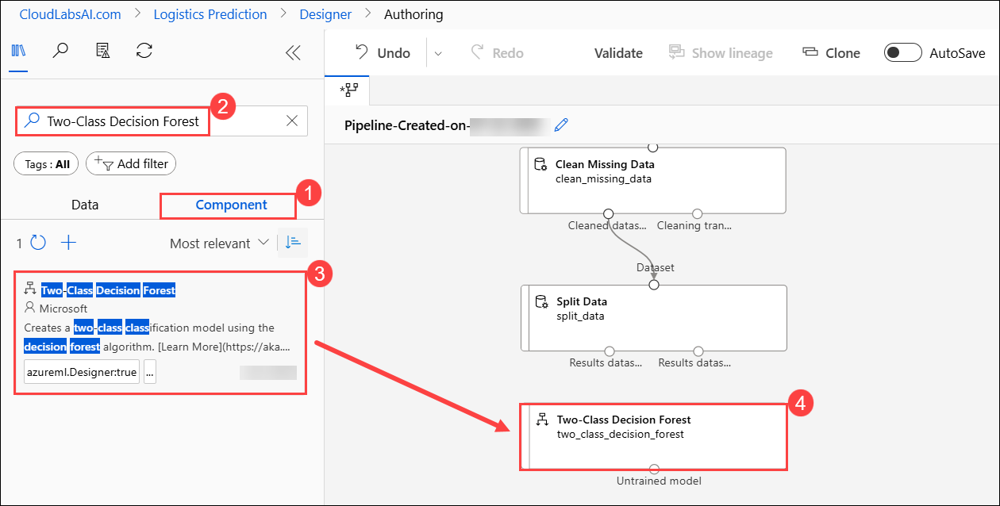

1. Click the **Save** button in the top right corner of the interface

     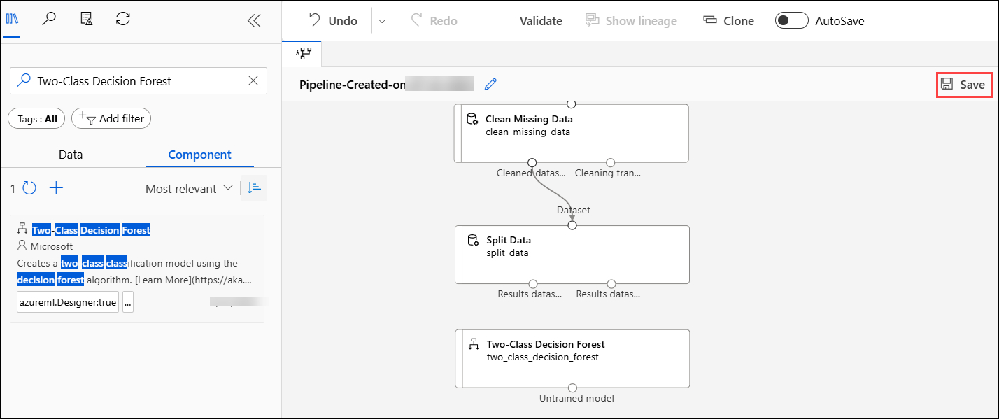

### Task 6: Add and Connect the Train Model Component

In this task you will add **Train Model** module and you will connect to both the training dataset and the chosen algorithm. You specify the column to predict (e.g., “Shipment Status”). 

**Why this step matters:** 
This step is where the model actually learns. You will understand that training involves feeding past data to the model so it can recognize patterns and make future predictions.

1. In the Component tab, search for **Train Model**. Drag the component into your canvas, placing it below the **Two-Class Decision Forest** component. Find the result titled: **“Trains a classification or regression model in a supervised manner…”**

     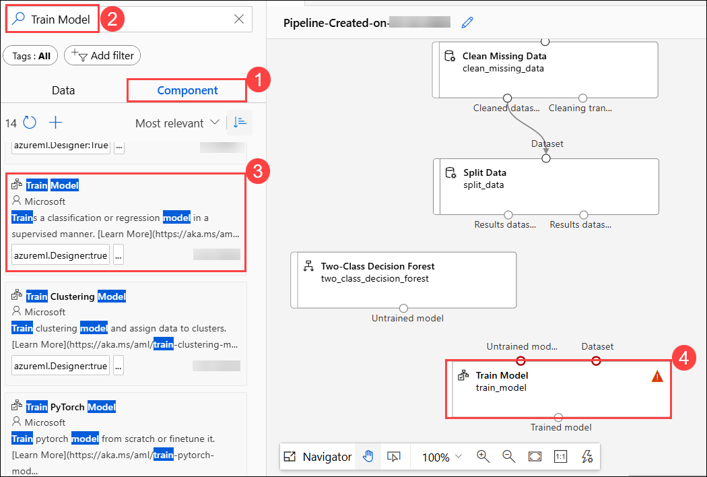
   
1. Before proceeding with the next step, please drag the **Two-Class Decision Forest** component toward the left to align it properly

1. Connect the Model and the Data

    - From the Two-Class Decision Forest, drag a line from the output port to the left input of the Train Model component (This provides the model to be trained)

    - From the Split Data component, drag a line from the left output port (Results dataset 1 / 70%) to the right input of the Train Model block (This provides the training dataset)

      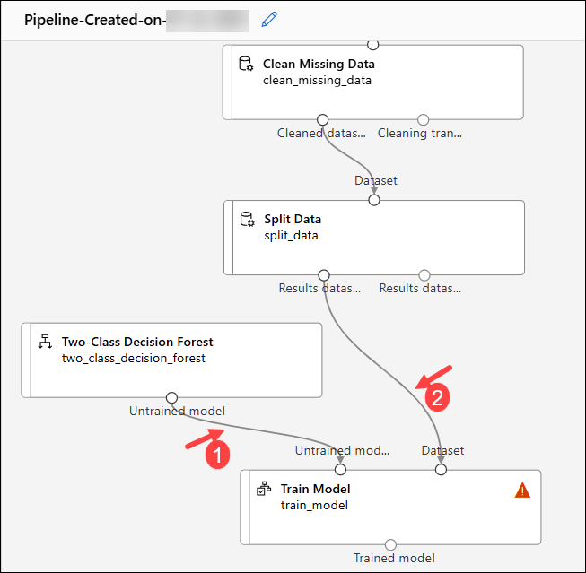

1. Confirm the Train Model Block

   - The block should now display:

     - Left input = Untrained model
     - Right input = Dataset
     - Output = Trained model
    
   >This confirms it’s correctly wired to perform training. 

1. Save your pipeline by clicking the **Save** button at the top right of your screen.

1. Why This Step Matters- Training is where the machine learning actually happens. The model uses the training dataset to recognize patterns (like how distance and material relate to delay). After this, the model will be ready to make predictions on unseen data.

1. Set the Label Column in Train Model **Goal:** You will specify that the column Delay_Flag is the label—the value your model is trying to predict. This tells Azure ML which column contains the correct answer during training.

1. Double-click the Train Model block on your canvas. The settings panel will open on the right-hand side. In the settings panel, find the option labeled Label column. Click the blue Edit column link next to it.

    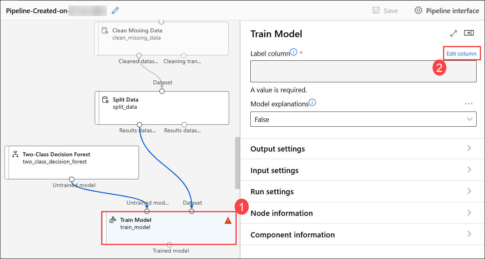

1. Choose the Correct Label:

    - In the pop-up that appears, scroll through the list of columns
    - Select: Delay_Flag
    - Click **Save** in the pop-up window.

   This is the binary column where 1 = delayed and 0 = on time.

   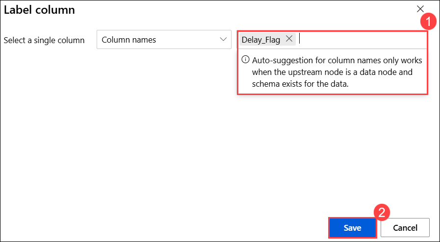

1. Confirm that **Delay_Flag** now appears as the selected label in the settings panelSave Your Pipeline. Click **Save** at the top right corner of Azure ML Designer.

      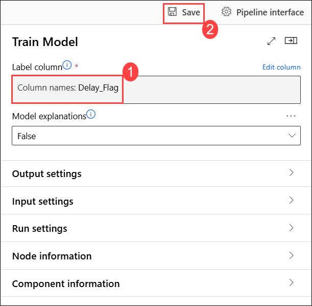

    >**Add and Connect the Score Model Component**: You will use the Score Model component to apply your trained Decision Forest  model to the test dataset (30% of your original data). This generates predicted outcomes   for evaluation.

### Task 7: Add and Connect the Score Model Component 

In this task you will add a **Score Model** module and connect the trained model and test dataset. This module generates prediction results. 

**Why this step matters:**
Scoring lets you test the model’s performance by applying it to new data. It simulates how prediction systems are used in industry, such as predicting if a shipment will arrive late. 

1. In the Component tab, search for **Score Model**. Drag the component into your canvas, placing it below the **Train Model** component.

    

1. Connect the Components:

   - Connect the output of **Train Model** to the left input port of the **Score Model** (This is the trained model)

   - From the **Split Data** component, connect the right output port (30% test data) to the right input port of the **Score Model**. 

1. Confirm the Setup. The Score Model component should now be connected like this:

    - Left input = Trained model.

    - Right input = Test dataset.

    - Click **Save** at the top right of the screen.

      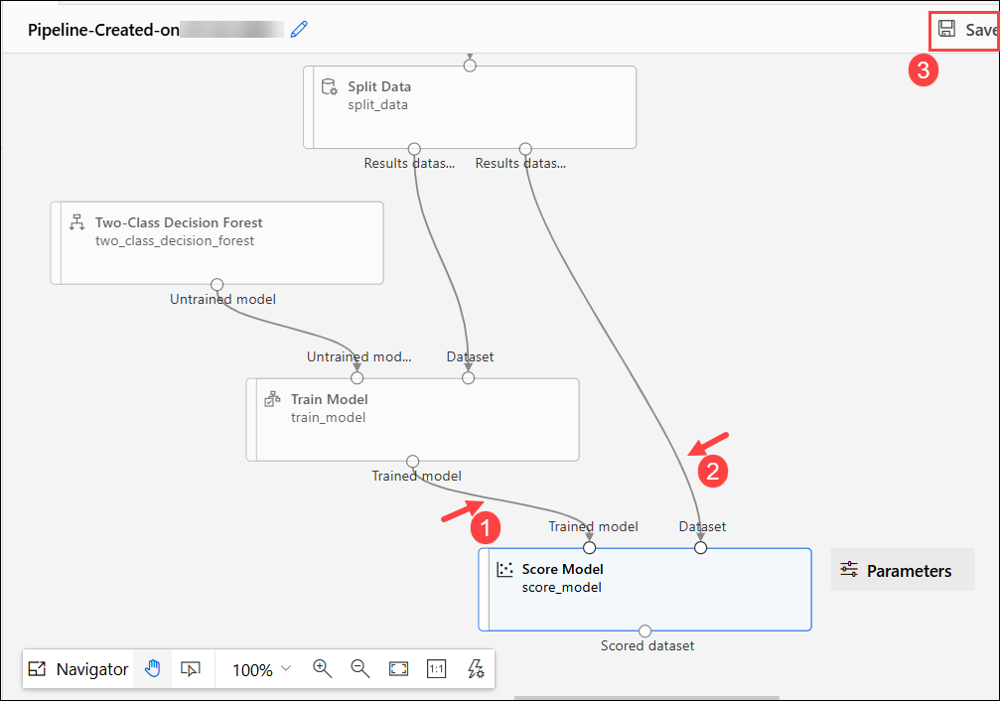

1. This will let you measure how well your model performed using standard metrics like:
    - Accuracy
    - Precision
    - Recall
    - AUC (Area Under Curve)

1. Add and Connect the Evaluate Model Component 
    **Goal:** Use the Evaluate Model component to analyze how well your trained model performed on the test data.

### Task 8: Add and Configure the Evaluate Model Component

In this task you will add **Evaluate Model** module at the end of the pipeline to assess the predictions. It displays metrics like accuracy, precision, recall, and F1 score. 

**Why this step matters:**
Evaluation teaches you how to measure success in machine learning. You’ll learn that a model is not useful unless we understand how well it performs. 

1. In the Component tab, search for **Evaluate Model**. Drag the component into your canvas, placing it below the Score Model block.

1. Connect the Component. From the **Score Model** output, drag a connection to the left input port of the **Evaluate Model** block.

1. Click **Save** at the top right.
   
   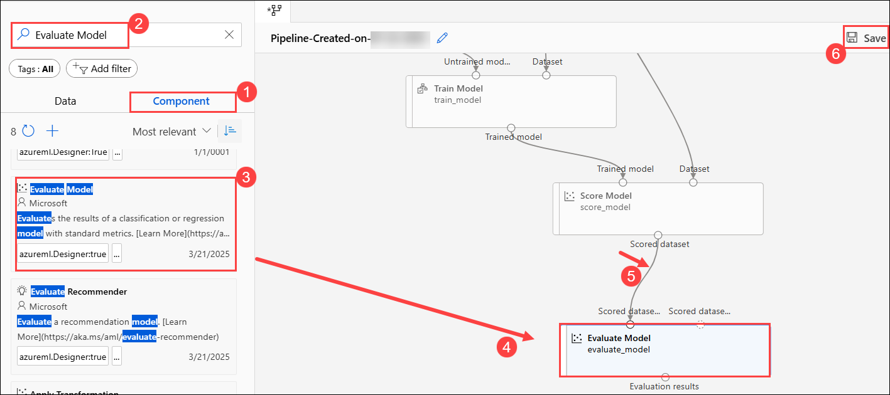

1. Now that your pipeline is fully built with all the components connected—from data ingestion to anomaly scoring—you’re ready to run it.

### Task 9: Running the Pipeline: Configure and Submit

In this task you will create or choose a compute cluster and click “Submit” to run the pipeline. This executes all modules in the correct order. 

**Why this step matters:** 
This step simulates a real AI workflow in cloud environments. You will experience how models are trained and tested at scale in modern ML platforms like Azure. 

1. Click the **Configure & Submit** button in the top-right corner.

    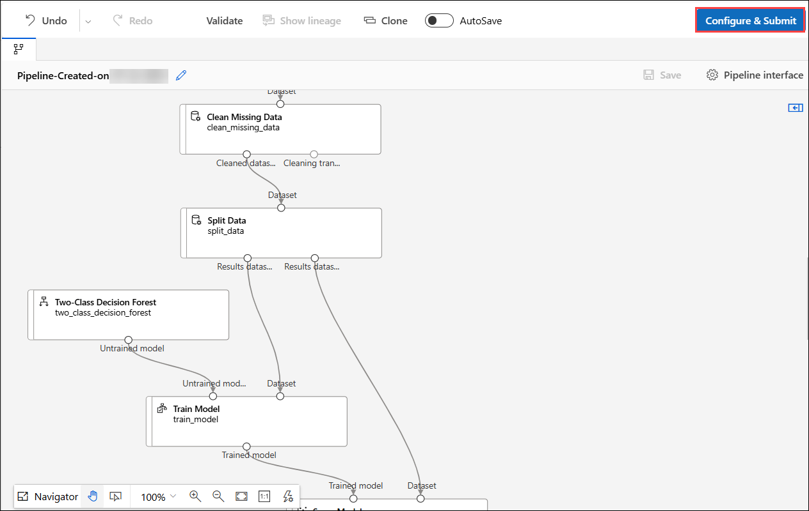

1. On the **Basics** page, perform the steps as mentioned below:

   - In the Experiment name select **Create new**
   - In **New experiment name** filed provide **`Test_Logistics_Manufacturing`**
   - Click the blue **Next** button at the bottom-right corner of the screen

      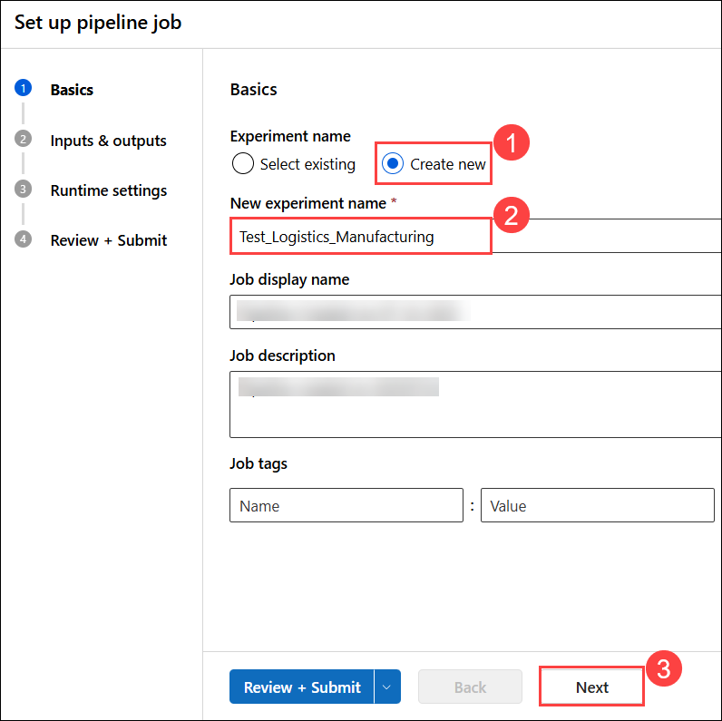

1. On the **Inputs & outputs** page, click on **Next** to skip.

1. On the **Runtime Settings** page, from the dropdown of the **Select Compute Type** section, click on **Compute Cluster**. Since no cluster is currently available, we’ll need to create one. Click on **Create Azure ML Compute Cluster**.

1. On the **Select virtual machine** page, specify the following then click on **Next** :
  
    - Location: Confirm that the selected region is the same as your workspace (**<inject key="Region" enableCopy="false" />**).
    
    - Virtual Machine Tier: Leave as default. 
    
    - Virtual Machine Type: Keep this as **CPU** (sufficient for our anomaly detection task).

    - Virtual Machine Size: Choose **Standard_DS11_v2**.
  
        

1. On the **Configure Settings** page, provide Compute name **Compute-cluster-<inject key="DeploymentID" enableCopy="false"/>** then click on **Create**

    

1. Back on the **Runtime Settings** page, select the newly created Azure ML compute cluster from the dropdown in the **Select Azure ML compute cluster** field, then click on **Review + Submit**.

     

1. On **Review + Submit** page, click on **Submit**. 

     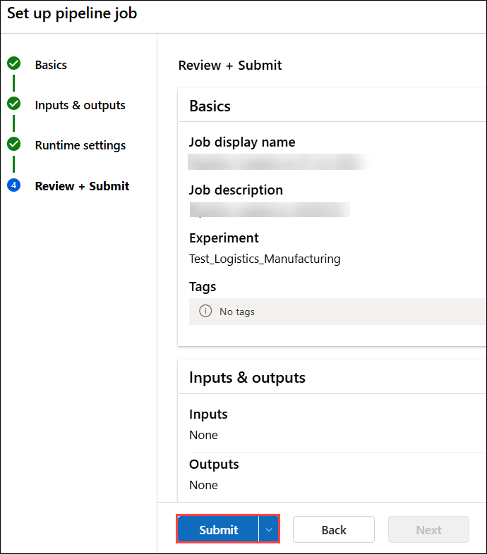

1. Once submitted, a success notification appears at the top of the page. Click on **View details** to monitor the pipeline. It may take some time for the pipeline to complete.

      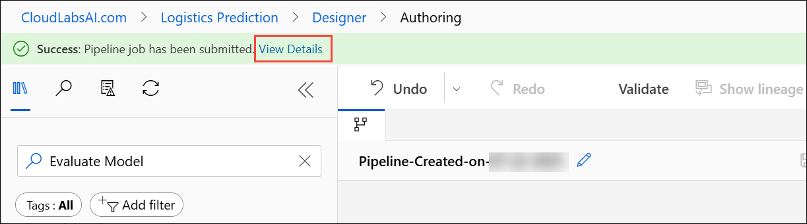

1. Once the Pipeline is run, you can see the similar result.

     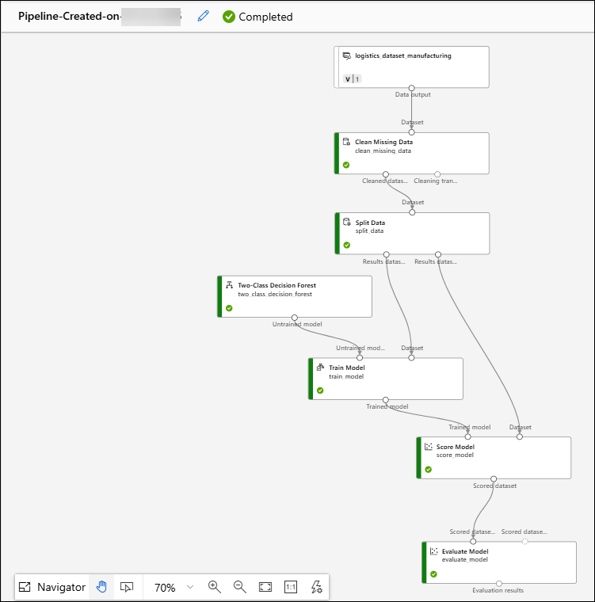

### Task 10: Preview Evaluation Results in Azure ML Designer 

In this task you will review the confusion matrix, ROC curve, and other evaluation charts. 

**Why this step matters:** 
This gives you visual feedback on how accurate your model was. You will begin interpreting real ML metrics and making decisions based on your—skills that directly transfer to professional AI work.

1. Right-click on the **Evaluate Model** component, hover over **Preview data** to click on **Evaluation results**.

     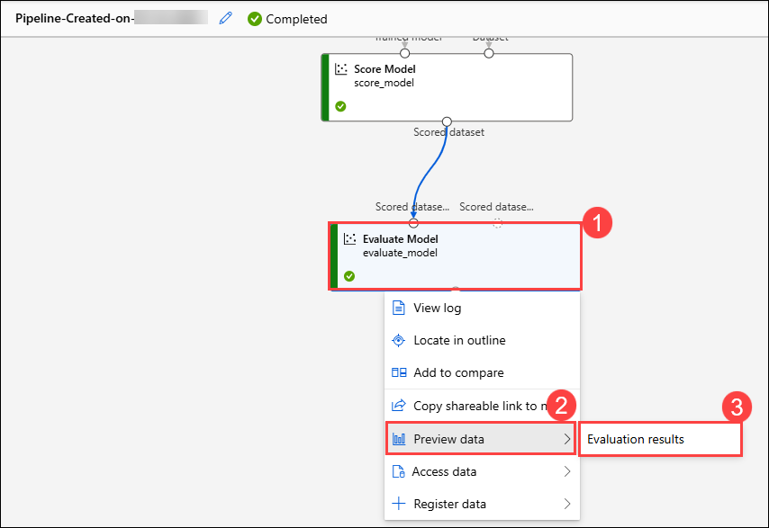

1. This will open the evaluation window where you can view:
    - Confusion matrix
    - ROC curve
    - Precision-Recall curve
    - Lift curve
    - Key metrics such as Accuracy, Precision, Recall, F1 score, and AUC
    
    Model Evaluation Results (Azure ML Designer)

1. This screenshot shows the evaluation results of a machine learning model trained to predict a logistics-related outcome.

      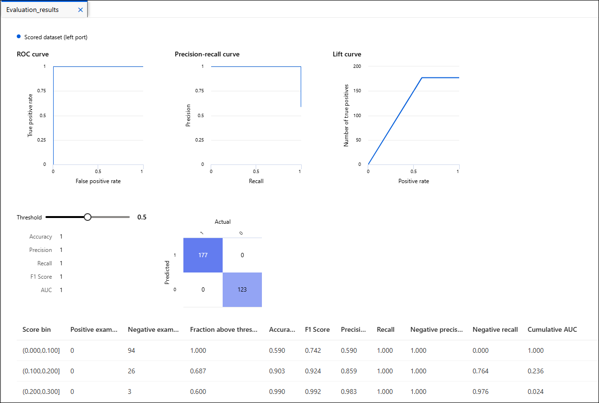

   >**Note**: Click on **Maximize panel** icon to review result in full screen.

      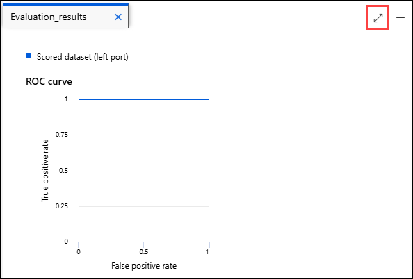
      
1. After training a model, it’s important to evaluate how well it performs. The evaluation results include charts and metrics that show how accurately the model made predictions 
on test data. 

1. **ROC Curve** - The ROC (Receiver Operating Characteristic) curve helps us see how well the model separates positive and negative cases.

    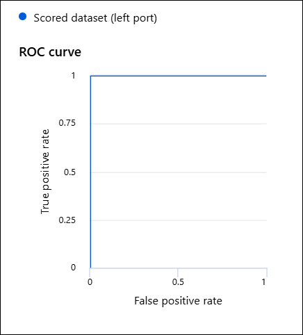
    
    - The horizontal axis shows the false positive rate (wrongly predicting "yes").
    - The vertical axis shows the true positive rate (correctly predicting "yes").

   A perfect model would have a curve that reaches the top-left corner — which this model does. That means the model never confused a negative example for a positive one.

1. **Precision-Recall Curve** - This chart explains how well the model identifies positive cases.

   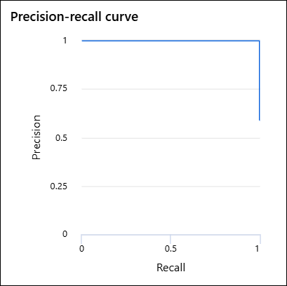

    - Precision is how many of the model’s positive predictions were correct.
    - Recall is how many of the actual positive cases the model found.

   A curve that reaches the top-right corner means the model found all positives without making any mistakes — which is exactly what we see here.

1. **Lift Curve**- The lift curve shows whether the model ranks the most important predictions (true positives) higher than others.

    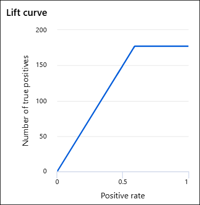
   
   - A steep curve means the model successfully puts the most important cases at the top.

   In this case, the curve rises sharply, showing that the model ranks positive examples very effectively.

1. **Threshold Slider**- The threshold is the cutoff point the model uses to decide between predicting "yes" or "no."**For example**, if a prediction score is above 0.5, the model predicts "yes."Here, the model is still performing perfectly at the 0.5 threshold, meaning it’s confident and accurate in its decisions.

    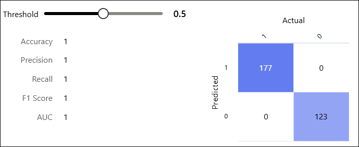

5. **Confusion Matrix:** This matrix shows how many predictions the model got right or wrong:
    - 177 true positives: predicted "yes" and it was actually "yes"
    - 123 true negatives: predicted "no" and it was actually "no"
    - 0 false positives: never predicted "yes" when it was "no"
    - 0 false negatives: never predicted "no" when it was "yes"
    
    >**Note**: The absence of any incorrect predictions makes this a perfect confusion matrix.

6. **Summary Metrics**:

    - Accuracy: 1.0 – the model predicted everything correctly
    - Precision: 1.0 – every "yes" prediction was right
    - Recall: 1.0 – the model found all the "yes" cases
    - F1 Score: 1.0 – a balance of precision and recall
    - AUC: 1.0 – the model completely separates the two classes

    >**Note**: These are the highest possible scores and indicate perfect performance.

> **Congratulations** on completing the task! Now, it's time to validate it. Here are the steps:
> - Hit the Validate button for the corresponding task. If you receive a success message, you can proceed to the next task. 
> - If not, carefully read the error message and retry the step, following the instructions in the lab guide.
> - If you need any assistance, please contact us at cloudlabs-support@spektrasystems.com. We are available 24/7 to help.

<validation step="ace2f744-042b-4f87-b587-5fdfbb2f4c68" />

# Review 

In this lab, you have completed the following tasks:

- Created Azure ML Workspace
- Uploaded the Dataset 
- Configured Clean Missing Data
- Configured the Split Data Component
- Added the Two-Class Decision Forest Model
- Added and Connect the Train Model Component
- Added and Connect the Score Model Component
- Added and Configure the Evaluate Model Component
- Running the Pipeline: Configureed and Submitted
- Previewed Evaluation Results in Azure ML Designer

## You have successfully completed the lab  
