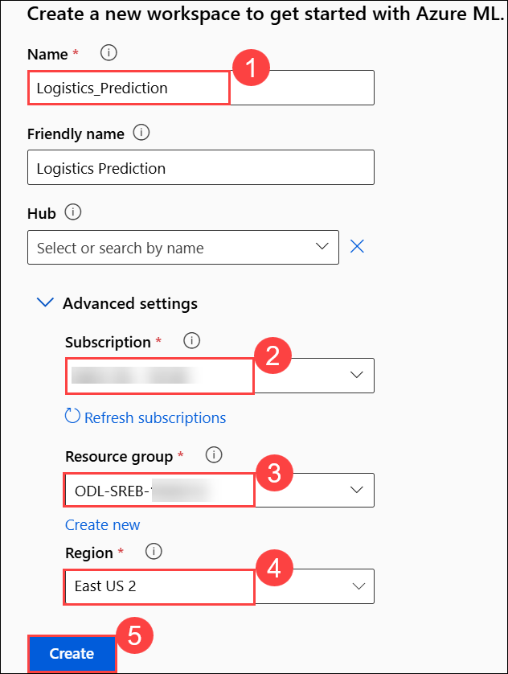

# Optimizing Inventory with Logistics Data: A Supply 
Chain Simulation

### Task 1: Create Azure ML Workspace

In this task you will set up an Azure Machine Learning workspace where all your machine learning assets and experiments will be organized and run. You will learn how to create a workspace in the Azure ML Studio, select the appropriate region and resource group, and navigate to the Designer interface to start building your pipeline.

1. **Log in** to [Azure Machine Learning Studio](https://ml.azure.com/) when prompted provide below credentials.

    - **Email/Username:** <inject key="AzureAdUserEmail"></inject>

    - **Password:** <inject key="AzureAdUserPassword"></inject>
   
1. On the **Create a new workspace to get started with Azure ML** fill in the following fields:

   - **Name**: `Logistics_Prediction`  
   - **Friendly Name**: *(Optional)*  
      Azure will auto-fill this based on the name.
   - **Hub (Optional)**: Leave this as “None” unless instructed otherwise.
   - **Advanced Settings**:
   - **Subscription**: Select the appropriate Azure subscription from the dropdown. 
   - **Resource Group**: Choose an existing one 
   - **Region**: Select **East US 2** for better performance.
   - After filling out all the required fields, click the **“Create”** button.

         

    >**Note**: If you **did not** see the page like Figure 1, simply click **“Create Workspace”** on your dashboard and fill out the fields as described in Step 2.

1. Now navigate to your newly created workspace. On the **left-hand menu**, click **“Workspaces”**. Locate the workspace you just created `PCA Anomaly Model`.

      
   
1. Click on its name to open it. This will take you inside the workspace where you can build and run machine learning experiments.

     

1. Once you are inside your workspace PCA Anomaly Model, look at the left hand side menu to find the **Designer** tab under the Authoring section. Click on 
this tab.

     

   >**Note**:  This will open the Azure Machine Learning Designer interface where you can  begin creating your machine learning pipeline by dragging and dropping 
components.

1. Once the **Designer** page is loaded, make sure that you’re on the Classic prebuilt tab under the “New pipeline” section. From here, click on the box with a plus sign 
that says, **Create a new pipeline using classic prebuilt components**.

     

1. Once you click it, you’ll be taken to a blank canvas where you can start building your machine learning pipeline using components such as:
    • Dataset input
    • Data cleaning
    • Model training 
    • Custom script execution
    • Scoring and evaluation

### Task 2: Add a dataset to your Azure ML pipeline in the Designer:

In this task you will upload the manufacturing sensor data to your Azure ML workspace. You will create a tabular dataset from a local CSV file, configure the data source, and add it to your pipeline canvas for further processing.

1. On the **left panel**, under the **Data (1)** tab, click the **➕ (plus icon) (2)** to upload a dataset.  

     

1. On **Create a new workspace to get started with Azure ML** page enter the following data.

   - Name the dataset: **`logistics_dataset_manufacturing`**  
   - Select type: **Tabular**  
   - Click **Next**  

     

1. On the **Choose a source for your data asset** page, choose **From local files** the click on **Next**. 

     

1. On the **Select a datastore** page select the following option:  
   - Under **Datastore type**, select **Azure Blob Storage**  
   - Choose the datastore named: **`workspaceblobstore`**  
   - Click **Next**  

     

1. On the **Choose a file or folder** page, select **Upload files or folder (1)** from the dropdown, then select **Upload files (2)**.

     

1. **File or Folder Selection**  
   - In the file browser, select the file: `US_Manufacturing_Logistics_Dataset`  
   - Wait for the file to appear under “Upload list”  
   - Click **Next**  

     

1. On the **Settings** page, review the fields and ensure they match the expected format then click **Next**  

     

1. On the **Schema** page, ensure the schema fields are correctly recognized then click **Next**  

     

1. On the **Review** page, click **Create** to finalize the dataset upload

     

1. Under the **Data** tab, locate the uploaded dataset named **`logistics_dataset_manufacturing`**.  

     

1. Click on the dataset card then select **Use data** to **drop it onto the pipeline canvas** on the right. Verify the data placed in the canvas, and click 'Save' to avoid losing progress.

      

### Task 3: Preprocessing Our Data

In this task you will prepare your dataset for modeling by cleaning missing values. You will add and configure the Clean Missing Data component to handle incomplete or missing sensor readings, ensuring the dataset is reliable for training your anomaly detection model.

1. Switch to the **Component** tab and search for **Clean Missing Data** by Microsoft.  
    
    

1. Click on the **Clean Missing Data** data component, then drag it from the left panel and drop it below the **Dataset card** in the pipeline canvas on the right.

    
   
1. Now connect the Dataset to the Cleaning Component, hover over the small **circle at the bottom** of the dataset block labeled **Data output**. Click and **drag a line** to the **left circle** of the Clean Missing Data component labeled **Dataset**. **Save** your progress by clicking **Save** at the top right of the canvas.

     

1. Now you will Configure the Clean Missing Data component. Double-click the **Clean Missing Data** block on the canvas. Then click the blue **Edit column** link next to **Columns to be cleaned**. This will open a pop-up window.  

     

1. Select only **Days Planned ETA Days and Distance_Miles** - Do **not** include columns like  Actual ETA, Shipment_ID, Delay_Flag, Material  Click **Save** in the pop-up,

     

1. On the **Clean Missing Data** window under **Cleaning mode**, make sure to select **Replace with mean**. Click **Save** again on the main screen.  

     

1. In the **Component tab**, search for **Split Data**, Confirm that it says: "Partitions the rows of a dataset into two distinct sets.... Drag the component into your canvas, placing it below the Clean Missing Data block.

    
    
1. Hover over the Cleaned data output port at the bottom of the Clean Missing Data component. Click and drag a line from this port to the input port of the Split Data block
    (This tells Azure to split the cleaned dataset).

    

### Task 4: Configure the Split Data Component

1. Double-click the Split Data block on your canvas. The settings panel will appear on the right-hand side specify the below settings

    - Set the Splitting Mode

       • Under Splitting mode, make sure **Split Rows** is selected (This means the data will be divided by rows, not by columns)
    
    - Set the Split Ratio

       • In the field labeled Fraction of rows in the first output dataset, type: **0.7** (This means 70% of your data will be used for training, and the remaining 30% for testing).
    
    - Turn On Randomization

       • Ensure Randomized split is set to: **True** (This ensures a random and fair mix of rows in each set)
    
    - Set a Random Seed

       • In the Random seed field, type: **42** (This ensures that every time you run the pipeline, the data is split the same way. This is useful for consistency across student runs).
    
    - Leave Stratified Split as False

       • Confirm Stratified split is set to: **False** (Stratified splits are more useful in imbalanced datasets like medical diagnosis— not necessary here) Refer to Figure 29 below.

   -  Click **Save** at the top of the page to lock in your configuration

       

1. Why This Step Matters - Splitting data ensures the model is tested on unseen examples, just like a final exam tests what you've really learned—not just what you memorized. A 70/30 split is a common practice in machine learning to keep both the training and testing sets balanced and informative.

   - Add the Two-Class Decision Forest Model

      **Goal:** You will add the Two-Class Decision Forest component to your pipeline. This model will be trained to predict whether a shipment will be delayed or on time based on historical shipping data.

1. In the Component tab, search for **Two-Class Decision Forest**. Drag the component into your canvas, placing it below the **Split Data** component. Find the result titled: Two-Class Decision Forest Description: **“Creates a two-class classification model using the decision forest algorithm…”**

     

1. Click the **Save** button in the top right corner of the interface

     

1. Why This Step Matters - This is the model that will learn patterns in your data. It builds multiple decision trees and combines them into one strong prediction tool. It's especially effective for your logistics dataset because it can handle both numerical and categorical features like ETA, distance, and material type.

   - Add and Connect the Train Model Component

     **Goal:** You will connect the Two-Class Decision Forest model and the training dataset to the Train Model component. This enables Azure ML Designer to train your model on       historical shipment data.

1. In the Component tab, search for **Train Model**. Drag the component into your canvas, placing it below the **Two-Class Decision Forest** component. Find the result titled: **“Trains a classification or regression model in a supervised manner…”**

     
   
1. Before proceeding with the next step, please drag the Two-Class Decision Forest component toward the left to align it properly

1. Connect the Model and the Data

    • From the Two-Class Decision Forest, drag a line from the output port to the left input of the Train Model component (This provides the model to be trained)
    • From the Split Data component, drag a line from the left output port (Results dataset 1 / 70%) to the right input of the Train Model block (This provides the training dataset)

      

1. Confirm the Train Model Block
    • The block should now display:

          Left input = Untrained model
          Right input = Dataset
          Output = Trained model

    • This confirms it’s correctly wired to perform training. 

1. Save your pipeline by clicking the **Save** button at the top right of your screen.

1. Why This Step Matters- Training is where the machine learning actually happens. The model uses the training dataset to recognize patterns (like how distance and material relate to delay). After this, the model will be ready to make predictions on unseen data.

1. Set the Label Column in Train Model **Goal:** You will specify that the column Delay_Flag is the label—the value your model is trying to predict. This tells Azure ML which column contains the correct answer during training.
