# Hands-On-Lab: Spot the Flaw - Detecting Defective Products with Image Classification

In this hands-on lab, you will explore how artificial intelligence can support quality control in manufacturing by detecting defective parts. You will work with real product images, train a machine learning model using Azure Custom Vision, and evaluate its accuracy and performance. Through guided activities, you will also reflect on when to trust a model’s predictions and how combining multiple data sources can enhance reliability and safety in automated systems.

## Lab Objectives

In this lab, you will be able to complete the following tasks:

- Task 1: Create a Custom Vision resource
- Task 2: Creating a New Project in Custom Vision
- Task 3: Upload and Tag Images
- Task 4: Training the Model
- Task 5: Test the Model with New Images
- Task 6: Exporting Capabilities

## Architecture diagram

.png)

### Task 1: Create a Custom Vision resource

In this task, you will create a Custom Vision resource in the Azure portal. This resource will be used to train and deploy your image classification model for detecting casting defects.

1. On the **Azure portal**, search for **Azure AI Services (1)** and selct **Azure AI Foundry (2)**.

   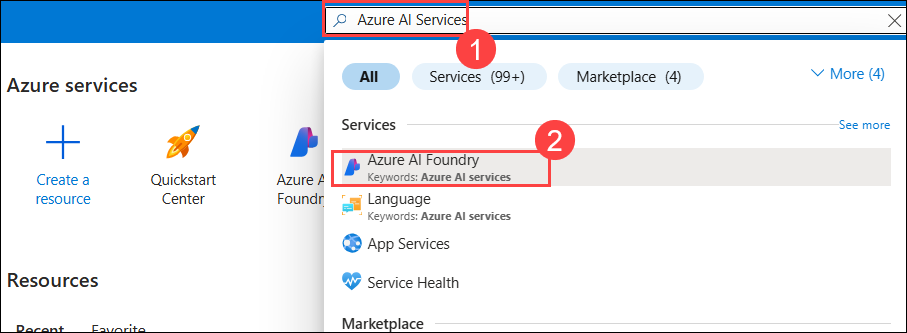 

1. Expand **More Services (1)**, select **Custom vision (2)** and then click on **+ Create (3)**.

   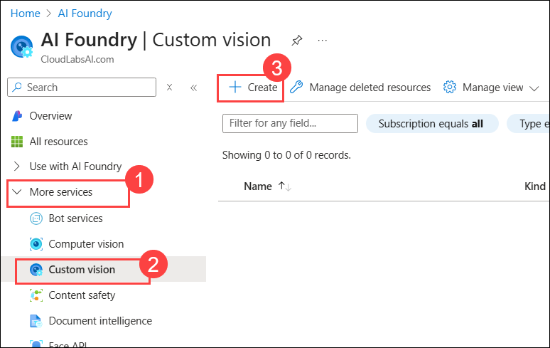 

1. On the **Create Custom Vision** page, provide the following details and then **Review+Create (7)**.

   - Subscription: Leave the deafult one **(1)**
   - Resource group: Select **ODL-SREB-U4L08 (2)**
   - Region: **<inject key="Region" enableCopy="false"/>** **(3)**
   - Name: Enter **customvision-casting (4)**
   - Training pricing tier: Select **Free F0** (2 Transactions per second, 2 Projects) **(5)**
   - Prediction pricing tier: Select **Free F0 (6)** 

     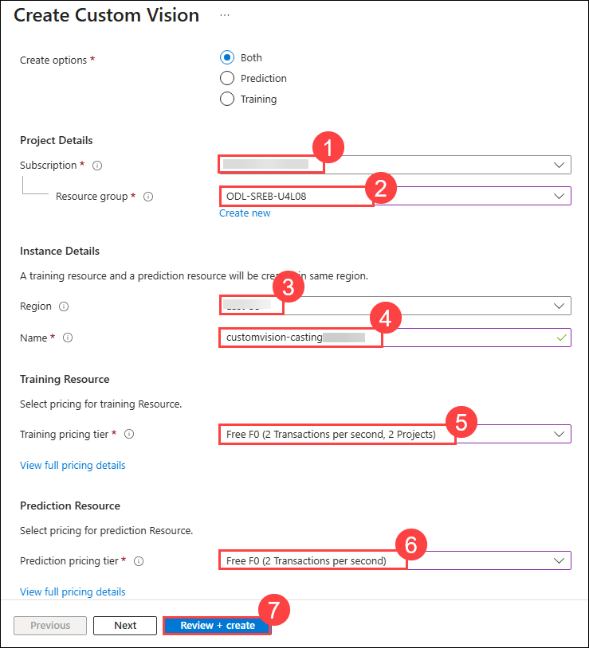

1. Click on **Create**.

   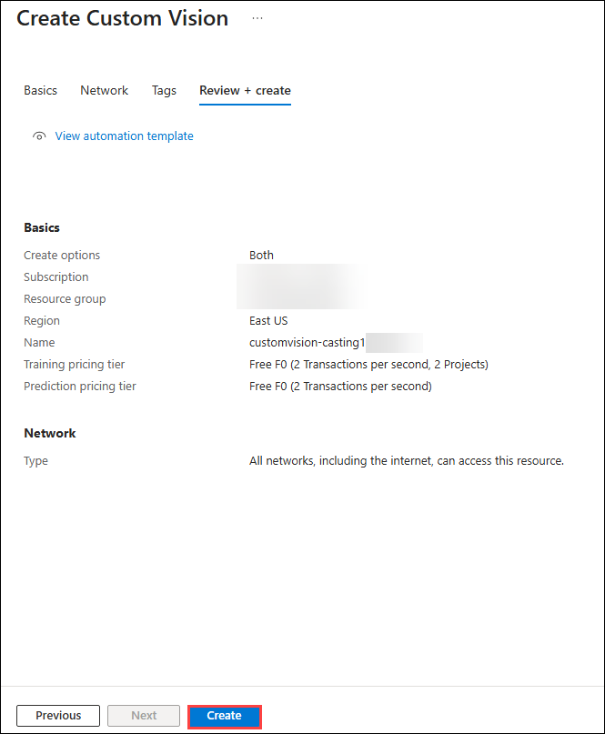 

1. Wait for the deployment to complete.

   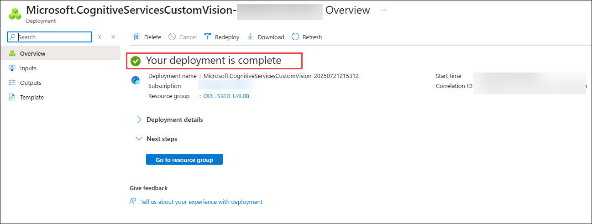 

> **Congratulations** on completing the task! Now, it's time to validate it. Here are the steps:
>
> - Hit the Validate button for the corresponding task. If you receive a success message, you can proceed to the next task.
> - If not, carefully read the error message and retry the step, following the instructions in the lab guide.
> - If you need any assistance, please contact us at cloudlabs-support@spektrasystems.com. We are available 24/7 to help.

<validation step="d59e98f0-5614-4e26-b82c-18374ffffb6c" />

---   

### Task 2: Creating a New Project in Custom Vision

In this task, you will sign in to the Custom Vision portal and create a new image classification project. You’ll configure the project settings to classify casting images as either defective or non-defective.

1. Login to **Custom Vision portal** by copy and paste the following link [Custom Vision portal](https://customvision.ai/) in the new tab of the LabVM browser.

1. Click on **Sign in**.

   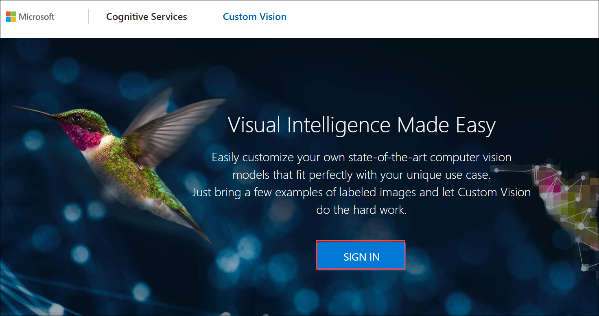 

1. If prompted, login with the below credentials:

    - **Email/Username:** <inject key="AzureAdUserEmail"></inject>

    - **Password:** <inject key="AzureAdUserPassword"></inject>

1. Select the Terms of Service checkbox **(1)**  and then click on **I Agree (2)**.

   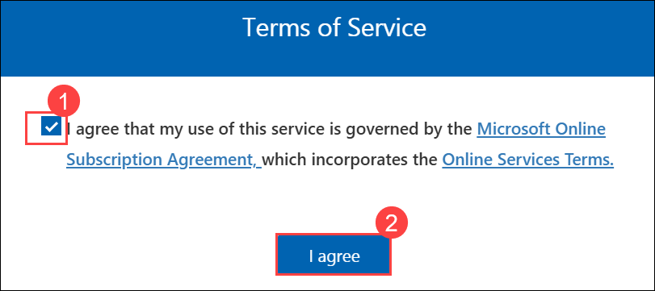 

1. Click on **NEW PROJECT**.

   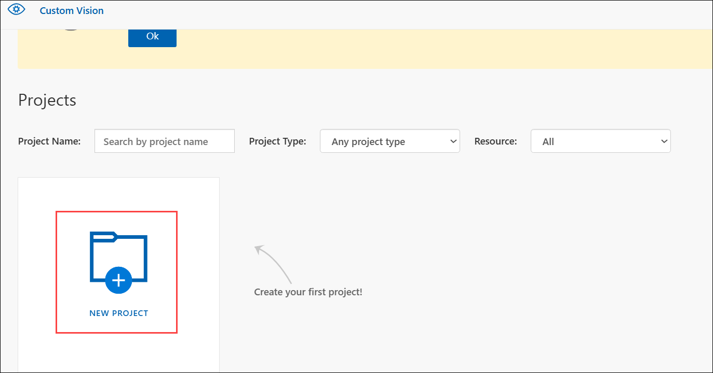 

1. On the **Create New Project** page, provide the following details:

    - Name: Enter **Casting Defect Detection (1)**
    - Description: **Classifying casting images as ok or defective (2)**
    - Resource: **customvisioncasting [F0] (3)**
    - Project Types: Ensure **Classification** is selected (not Object Detection), as 
you're identifying overall labels for entire images **(4)**
    - Classification Types: Choose **Multiclass** (Single tag per image) because each image belongs to only one category: either Defect or Non-Defective **(5)**

   - Domains: Choose **General (compact) (6)**
    - Export Capabilities: Leave **Basic platforms (Tensorflow, CoreML, ONNX, 
…)** selected **(7)**

    - Then select **CREATE PROJECT (8)**

      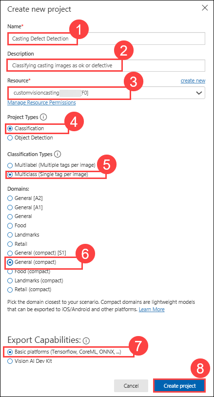 

> **Congratulations** on completing the task! Now, it's time to validate it. Here are the steps:
>
> - Hit the Validate button for the corresponding task. If you receive a success message, you can proceed to the next task.
> - If not, carefully read the error message and retry the step, following the instructions in the lab guide.
> - If you need any assistance, please contact us at cloudlabs-support@spektrasystems.com. We are available 24/7 to help.

<validation step="0b268237-4be0-4453-a6ac-5603f697a1a9" />

---      

### Task 3: Upload and Tag Images

Once your project has been created, you'll land on the Training Images tab of your Custom Vision workspace. This is where you'll upload and tag the images your model will learn from. The main panel is empty because no images have been uploaded yet, which is where we’ll start off at in this part!

#### Task 3.1: Adding Training Images for Non-Defective Parts

In this task, you will upload and tag images of non-defective casting parts in your Custom Vision project. These images will be used to train the model to recognize defect-free components.

1. Click on the **Add Images** button.

   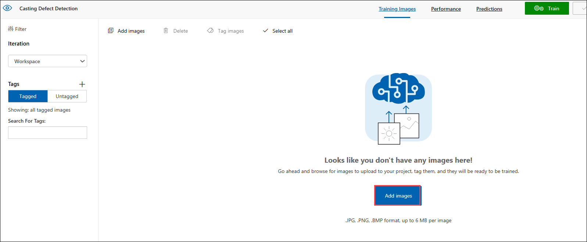 

1. Navigate to the `C:\srebdatafiles\Dataset\casting_512x512\casting_512x512\ok_front` folder. Click on one image and press **Ctrl+A** to select all the images **(1)** and then **Open (2)**.   

   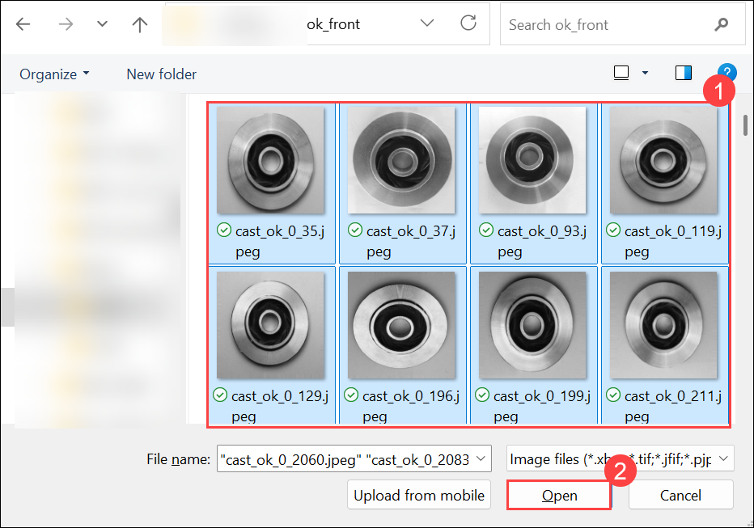

1. On the **Image Upload** screen, enter **Non Defective (1)** as **My Tags** and then select **Upload 519 files (2)**.

   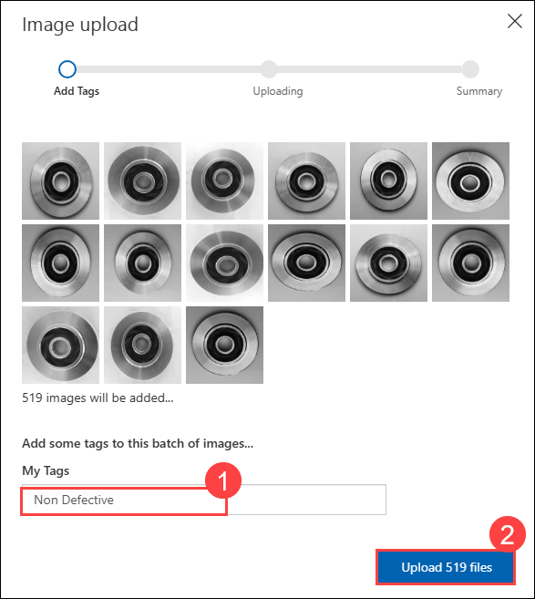

1. Once uploaded, select **Done**.

     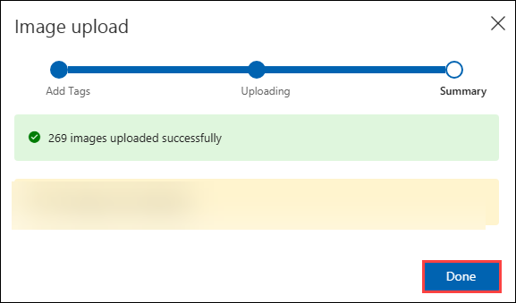

1. Briefly wait for the images to be uploaded. Once it’s complete, you’ll see a screen like the one below. Navigate to **Tagged (1)** there you can see the **Non Defective (2)** tag.

   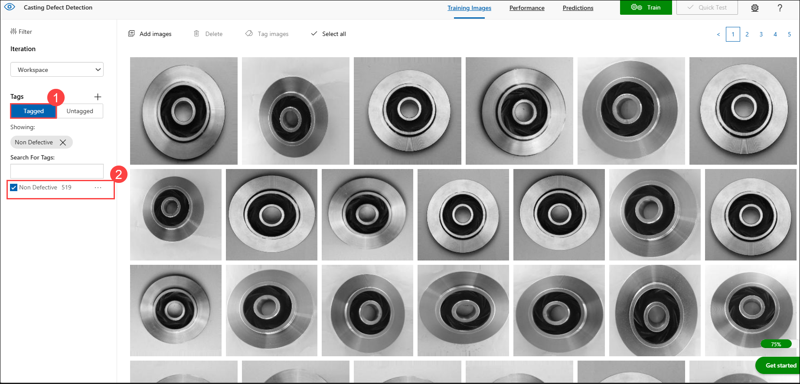

#### Task 3.2: Adding Training Images for Defective Parts

In this task, you will upload and tag images of defective casting parts in your Custom Vision project. This will help train the model to distinguish between defective and non-defective components.

1. Click on the **Add Images** button.

     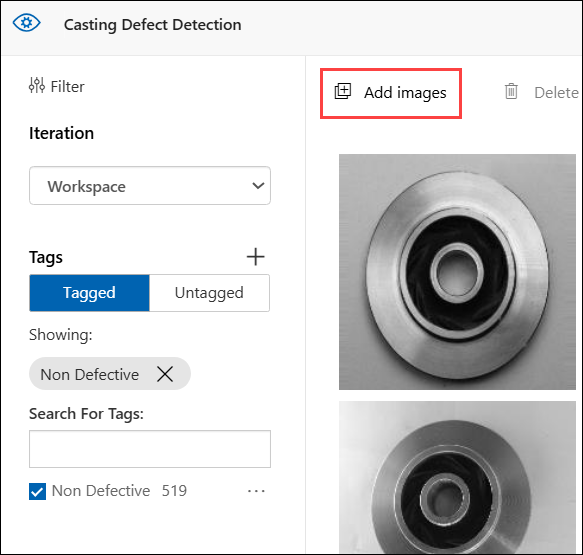

1. Navigate to `C:\srebdatafiles\Dataset\casting_512x512\casting_512x512\def_front` folder and select all the images within this folder **(1)** and Click **Open (2)** to upload these images.     

     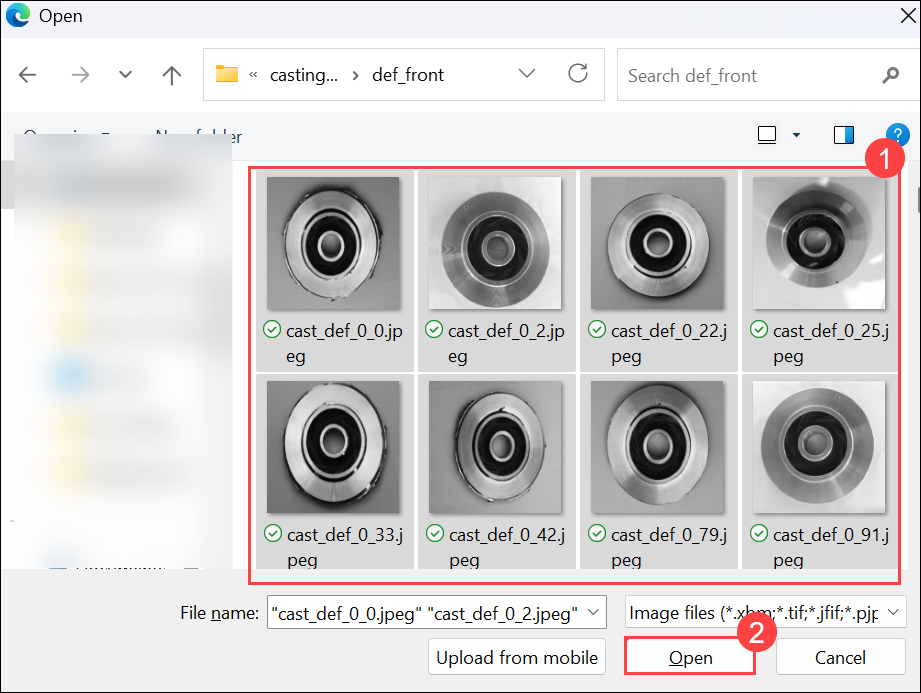

1. On the **Image Upload** screen, enter **“Defect (1)** as **My Tags** and then select **Upload files (2)**.

     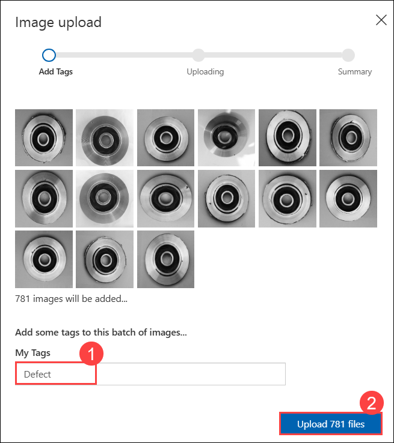  

1. Once uploaded, select **Done**.

      

1. Under **Tagged (1)**, now you can see both `Defect` and `Non Defective` tagged images **(2)**.

     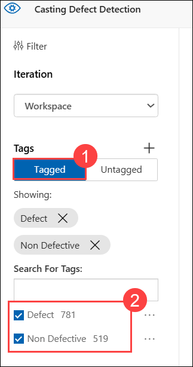 

### Task 4: Training the Model

In this task, you will train your image classification model using the uploaded images of defective and non-defective parts. You will initiate a quick training session and observe the model’s performance metrics upon completion.

1. To get started, click the green **Train** button at the top of screen.

     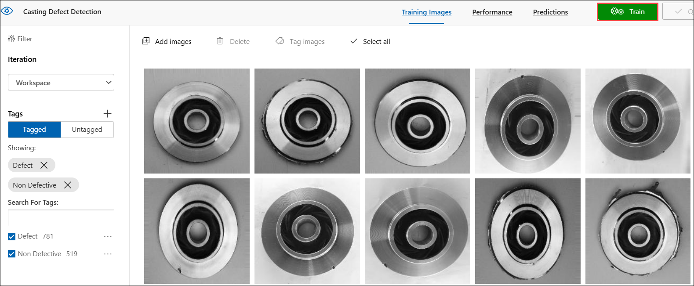

1. On the Choose Training Type page, select **Quick Training (1)** and then **Train (2)**.

     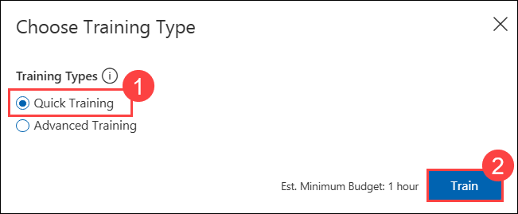

1. You will be redirected to the **Performance (1)** tab, where we see the training in action.

     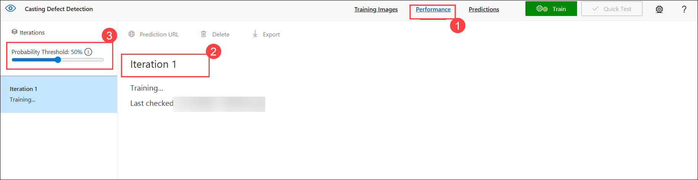

     - `Iteration [Number]`: This indicates the current training run
     - `Probability Threshold`: A slider where we can set the cutoff confidence level the model uses when classifying images. It’s set at 50%, which means the model must be at least 50% confident in its classification. 

1. Once your training finishes, you’ll automatically see the Performance tab update.

     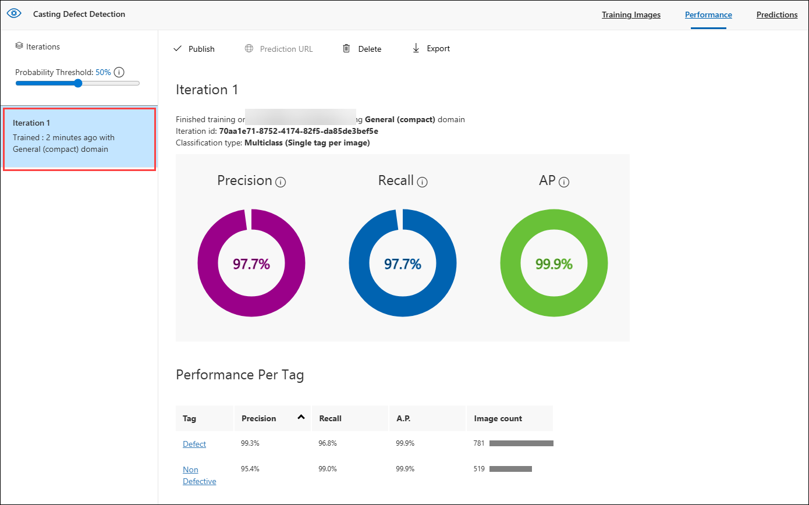

     We can understand the overall model scores as follows:

    - Precision: Out of all the times the model predicted a specific class (Defect or NonDefective), how many were actually correct?
    - Recall: Out of all actual images of a specific class, how many did the model 
correctly identify?
    - AP (Average Precision): A comprehensive score that combines both precision and recall over different thresholds.
    - False Negative: When the model predicts “non-defective” but the item is defective.

Performance Per Tag shows separate precision and recall values for the Defect and Non-Defective tags respectively.

The high numbers seen in the figure above suggest that the model is performing very well on the training dataset!  

### Task 5: Test the Model with New Images

In this task, you will evaluate your trained model’s performance by testing it with new images of defective and non-defective parts using the Quick Test feature.

#### Task 5.1 Testing the Model with New Defective Images

In this task, you will use the Quick Test feature to test your trained model with a new image of a defective part and observe the prediction results.

1. Click on the **Quick Test** button located in the top right corner of the screen.

     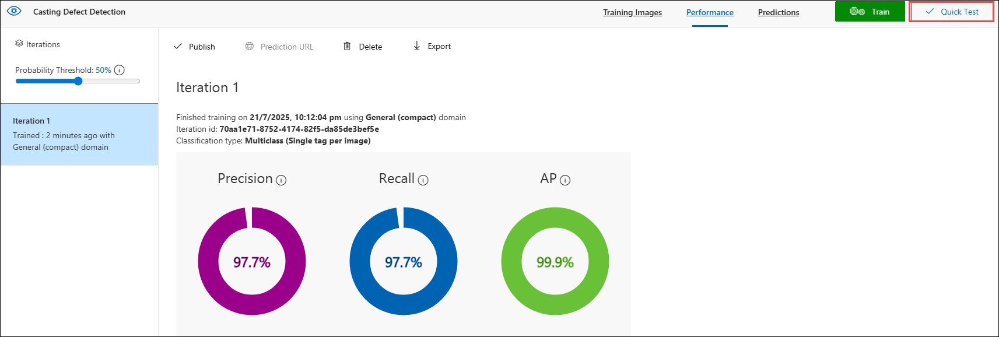

1. In the Quick Test Panel that opens, click on **Browse Local Files (1)**. Within the file explorer that opens, navigate to `C:\srebdatafiles\Dataset\casting_512x512\casting_512x512\def_front` folder. Select any **one image** to perform a quick test **(3)** and then **Open (4)**.

     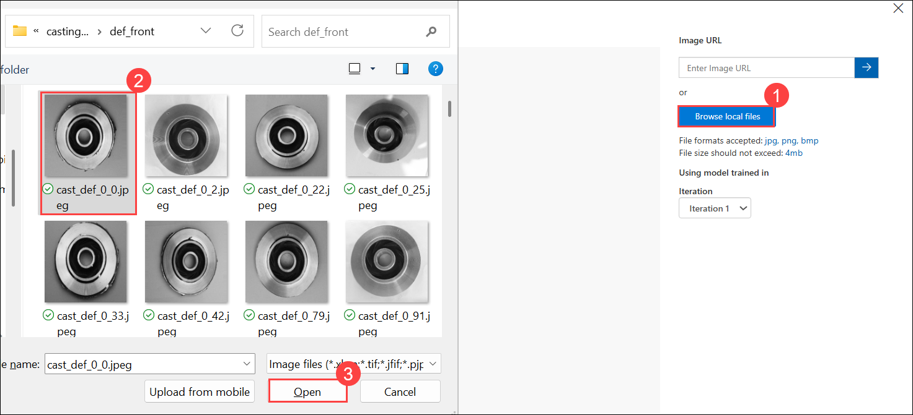

1. Once uploaded, you’ll see prediction results as shown in the figure below. The 
percentages next to the tags **Defect and Non Defective** let us know the model’s selection between the two. With a `99.9%` confidence rating, this tells us that the model is highly confident that the image is a `Defective` part.    

     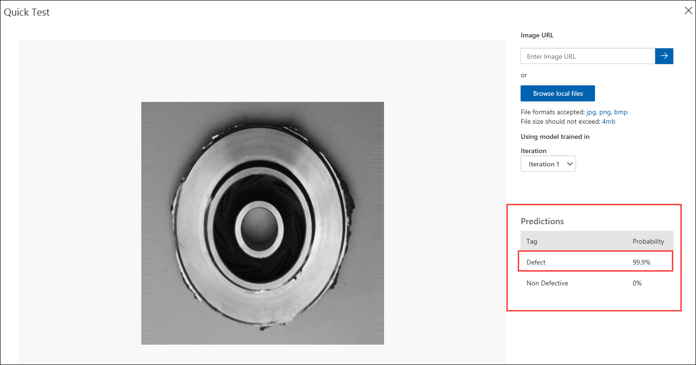

#### Task 5.2: Testing the Model with New Non-Defective Images

In this task, you’ll take the same steps over to test the model’s capabilities with new images. However, instead of picking from the def_front folder, you’ll pick one image from the ok_front folder under test.

1. In the Quick Test Panel that opens, click on **Browse Local Files (1)**. Within the file explorer that opens, navigate to `C:\srebdatafiles\Dataset\casting_512x512\casting_512x512\ok_front`
folder. Select any **one image** to perform a quick test **(3)** and then **Open (4)**.

     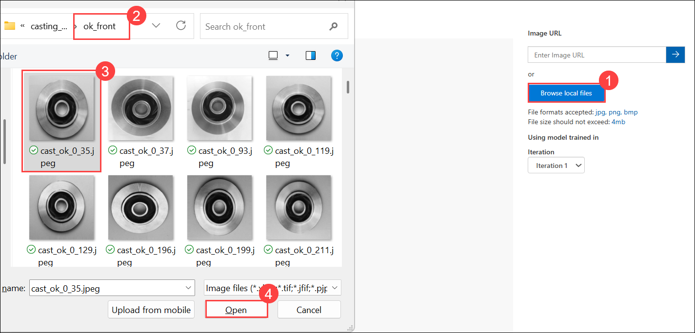 

### Task 6: Exporting Capabilities

In this task, you will explore the export options available for deploying your trained model to different platforms such as TensorFlow, CoreML, and ONNX—though no export action is required.

1. Once everything is done with testing the model with new images, let’s take a look at the export functionality. To do so, we’ll click on the **Export** button seen below.

     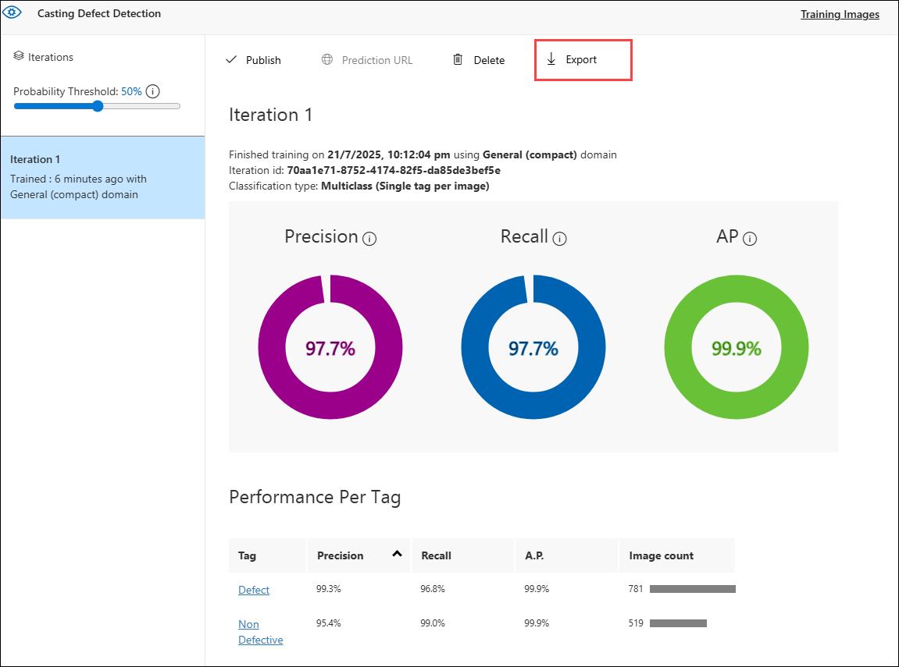 

1. A list of available platforms will be shown. **You do not need to proceed with using these options**, we’re simply just exploring!

     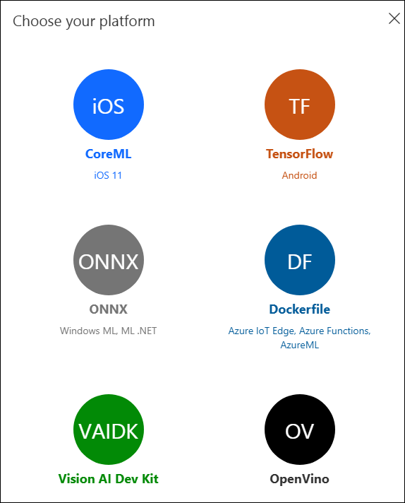

## Review

In this lab, you have completed the following tasks:     
     
- Created a Custom Vision resource
- Created a New Project in Custom Vision
- Uploaded and Tag Images
- Trained the Model
- Tested the Model with New Images
- Exporting Capabilities

## You have successfully completed the lab

     

