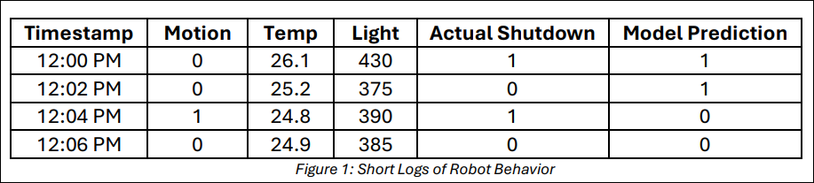
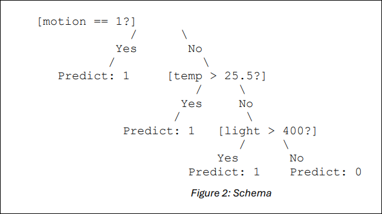
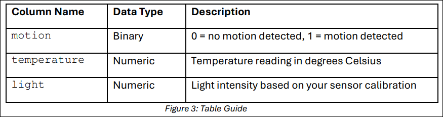

# Lesson 9: Training Makes It Smarter

## Lesson Description:

In this lesson, students will collect and use real sensor data from their Arduino-based robot to train a machine learning model in Azure. They will analyze how different data conditions—such as low volume or corrupted readings—affect model performance. The lesson emphasizes workflow design, data preparation, and accuracy evaluation in a 
project-based capstone experience.

## Main Learning Goal:

Students will evaluate how the quality and quantity of training data influence the accuracy and reliability of a machine learning model.

## Essential Question:

How does the training data I collect and prepare affect the accuracy and safety of my 
model?

## Standards:

- 4.4: Describe the role of training data in determining the accuracy and margin of 
error of the model

## Objectives:

- Students will collect and label real sensor data from their robot.
- Students will sketch and plan a machine learning workflow before building in Azure.
- Students will train and test a binary classification model to predict robot shutdown behavior.
- Students will evaluate model performance using accuracy, precision, and confusion matrix, and reflect on how training data impacts results

### Shutdown Signals – Can You Trust the Robot?

Is This Robot Safe?

You’ve just been hired as a machine learning engineer for a smart robotics company. The robot you helped build has three sensors: motion, light, and temperature. It shuts down automatically when any of those conditions become unsafe. Your job now is to train a model to recognize when that shutdown should happen — and when it shouldn’t.

Consider Figure 1, which shows short logs of robot behavior below.

 

Analize and discuss the following questions:

- Q1: Which of these predictions seems wrong?

- Q2: What could happen if the robot shuts down too early?

- Q3: What if it fails to shut down when it should?

Identify the risks of false positives and false negatives, and discuss the following 
questions:

- Q1: What do you think caused these mistakes?

- Q2: Could bad or incomplete training data be the reason?

Recognize that even real-world robots can make errors — and those errors often trace 
back to the data they were trained on.

#### What Is a Machine Learning Model Doing?

A model like this doesn’t just memorize past shutdowns.

It learns patterns — like:

- “If temperature > 25.5, there’s a good chance of shutdown.”

- “If motion == 1, that usually means shut down.”

Take a look at the next simple logic diagram shown in Figure 2 below.

 

This is similar to what a decision tree or decision forest does — it creates yes/no checks based on sensor values.

The more accurate and complete your training data, the more confident and reliablethese predictions become.

**Why “Training Data” Matters**

A machine learning model is only as good as the data you feed it. If your training data is too small, too noisy, or missing examples, the model can make dangerous or costly mistakes.

**Relatable examples:**

- If your data has only low temperatures, your model won’t know how to react to heat.
- If your sensor failed and didn’t detect motion properly, your model might miss a 
**shutdown trigger.**

Let’s analyze these two questions:

- **Q1: Would you trust this model to control a real robot in your factory?**

- **Q2: What kind of data would you want to collect to make the model safer?**

### Draw Your Smart Robot Pipeline

Before you build your model in Azure, take a moment to think like an engineer. What steps do you need to go from sensor data to a trusted prediction?

**Instructions:**

Sketch your pipeline on page 2 of your `SREB_U4_L9_Handout`, and consider these 
questions:

- Q1: Where the data comes from? (Arduino)
- Q2: What’s cleaned or fixed (missing data, errors)
- Q3: What features are used?
- Q4: Where the model is trained and evaluated?

Then, answer the following questions in your `SREB_U4_L9_Handout`:

- Q1: What is your label column? Why is it important? 
- Q2: Which features will the model learn from? 
- Q3: What module will you use to handle missing values? 
- Q4: What part of your pipeline trains the model? 
- Q5: Where do you test if your model works correctly?

Challenging Questions:

- Q1: Where do you define the label (shutdown)?
- Q2: Which module is responsible for training?
- Q3: How will you measure if the model is working?

### Discussion Prompt:
- Q1: If you forget to clean bad sensor data, what could happen?
- Q2: If you only give the model 10 rows of data, how would that affect accuracy?

In the next phase, you’ll upload your own sensor data into Azure ML Designer. You’ll train a model to predict shutdowns — then test how well it performs with different kinds of training data. Let us see if your robot can make smart, safe decisions under pressure.

### From Arduino to AI

In this project-based activity, you will take full ownership of the machine learning pipeline. Using data collected from the Arduino robot you programmed and tested earlier in the unit, you will prepare, train, and evaluate a classification model to predict when the robot should shut down.

### Upload and Inspect Your Dataset
Prepare your real-world robot sensor data for use in Azure ML Designer. This step is 
essential to ensure your model has meaningful, clean, and complete data to learn from.

### What You’re Uploading

You will upload the dataset you collected from your Arduino-based robot. Your dataset 
should include one row per time reading and contain the following required input columns. Refer to Figure 3 below

These columns will serve as your model's input features.

Common Mistake to Avoid

Many students make mistakes at this step by:

- Uploading files with missing data
- Using inconsistent or mislabeled column names
Before uploading, open your dataset and verify the following:
- All required columns are present and correctly named: motion, temperature, 
light
- File format is .csv or .xlsx and opens cleanly in Excel or Sheets

If your dataset contains additional columns (such as timestamps or comments), that is 
acceptable — but ensure the core features are clean and usable.

**Creating the Label Column: shutdown**

If your dataset does not already contain a column for shutdown, you must add one based 
on the same safety rules you programmed into your robot.

**Example Label Logic:**

If your robot was coded to stop under the following conditions:

- Motion is detected
6
- Temperature exceeds 25.5°C
- Light intensity exceeds 400

Then, create a new column called shutdown using this logic:

- shutdown = 1 if motion == 1 OR temperature > 25.5 OR light > 400

- shutdown = 0 otherwise

This column tells the machine learning model what it is trying to learn — whether or not to shut down in a given situation.

**How to Add the shutdown Column**

You can add this column using either Excel or Google Sheets.

- Add a new column titled shutdown
- Use logical formulas to apply the condition row by row
- Example (in Excel): `=IF(OR(A2=1, B2>25.5, C2>400), 1, 0)`

### Why This Step Matters
This is where machine learning and engineering come together. You are defining the ground truth — the rule your robot followed — and giving the model the examples it needs to learn from. If your shutdown label is incorrect or incomplete, your model’s predictions will be flawed or even unsafe.

**Final Checklist Before Moving to Azure
Use this checklist to make sure your dataset is ready:**

- I have the following columns: motion, temperature, light
- All rows are filled (no missing values)
- I created a shutdown column using logic that matches my robot’s real behavior
- My file is saved as .csv or .xlsx and formatted consistently

Once your dataset passes these checks, you are ready to move into Azure ML Designer and begin building your machine learning pipeline.

