# Hands-On-Lab: Training Makes It Smarter – Understanding the Role of Data in Machine Learning

In this hands-on lab, you will collect real sensor data from your Arduino-based robot and use it to train a machine learning model in Azure. You will prepare and clean the dataset, paying close attention to issues such as low data volume or corrupted sensor readings. By experimenting with different data conditions, you will observe how these factors affect model accuracy and performance. Throughout the lab, you will follow a structured workflow that emphasizes data preparation, model training, and evaluation—providing a practical, project-based experience in building reliable machine learning solutions.

## Lab Objectives

In this lab, you will be able to complete the following tasks:

- Task 1: Create Azure ML Workspace
- Task 2: Upload Our Dataset
- Task 3: Run the Pipeline
- Task 4: Evaluate Model Performance

### Task 1: Create Azure ML Workspace

In this task you will set up an Azure Machine Learning workspace where all your machine learning assets and experiments will be organized and run. You will learn how to create a workspace in the Azure ML Studio, select the appropriate region and resource group, and navigate to the Designer interface to start building your pipeline.

1. **Log in** to [Azure Machine Learning Studio](https://ml.azure.com/) when prompted provide below credentials.

    - **Email/Username:** <inject key="AzureAdUserEmail"></inject>

    - **Password:** <inject key="AzureAdUserPassword"></inject>
   
1. On the **Create a new workspace to get started with Azure ML** fill in the following fields:

    - **Name**: Enter `Training_data`  **(1)**
    - **Friendly Name**: *(Optional)*  
      Azure will auto-fill this based on the name.
    - **Hub (Optional)**: Leave this as **None** unless instructed otherwise **(2)**
    - **Advanced Settings**:
    - **Subscription**: Select the appropriate Azure subscription from the dropdown **(3)**
    - **Resource Group**: Select **ODL-SREB-U4L09** **(4)**
    - **Region**: Select **East US 2 (5)** for better performance.
    - After filling out all the required fields, click the **Create (6)** button.

      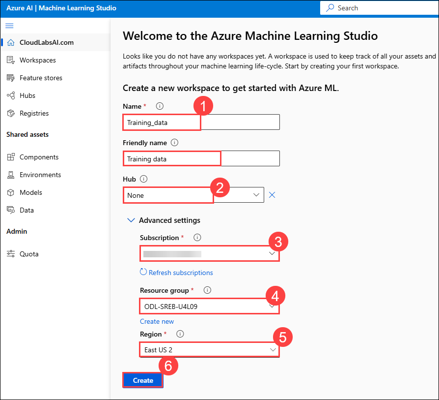 

       >**Note**: If you **did not** see the page like Figure 1, simply click **“Create Workspace”** on your dashboard and fill out the fields as described in Step 2.

1. Wait for the workspace to create, it may take around 2-3 minutes.       

1. Now navigate to your newly created workspace. On the **left-hand menu**, click **Workspaces (1)**. Select the workspace you just created `Training_data` **(2)**.

     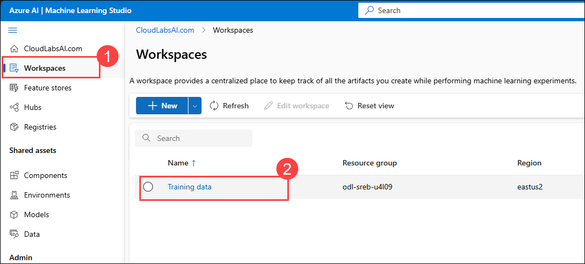 
   
1. This will take you inside the workspace where you can build and run machine learning experiments.

     

1. Once you are inside your workspace PCA Anomaly Model, look at the left hand side menu and select the **Designer** tab under the **Authoring** section. 

     

     >**Note**:  This will open the Azure Machine Learning Designer interface where you can  begin creating your machine learning pipeline by dragging and dropping components.

1. Once the **Designer** page is loaded, make sure that you’re on the **Classic prebuilt (1)** tab under the “New pipeline” section. From here, click on the box with a plus sign that says, **Create a new pipeline using classic prebuilt components** **(2)**.

     

### Task 2: Upload the Dataset

In this task you will upload the Sensor_data_with_shutdown dataet to your Azure ML workspace. You will create a tabular dataset from a local CSV file, configure the data source, and add it to your pipeline canvas for further processing.

1. On the **left panel**, under the **Data (1)** tab, click the **➕ (plus icon) (2)** to upload a dataset.  

     

1. On **Create data asset** page enter the following data.

    - Name: Enter **`Sensor_Data` (1)**  
    - Select type: **Tabular (2)**  
    - Click **Next (3)**  

      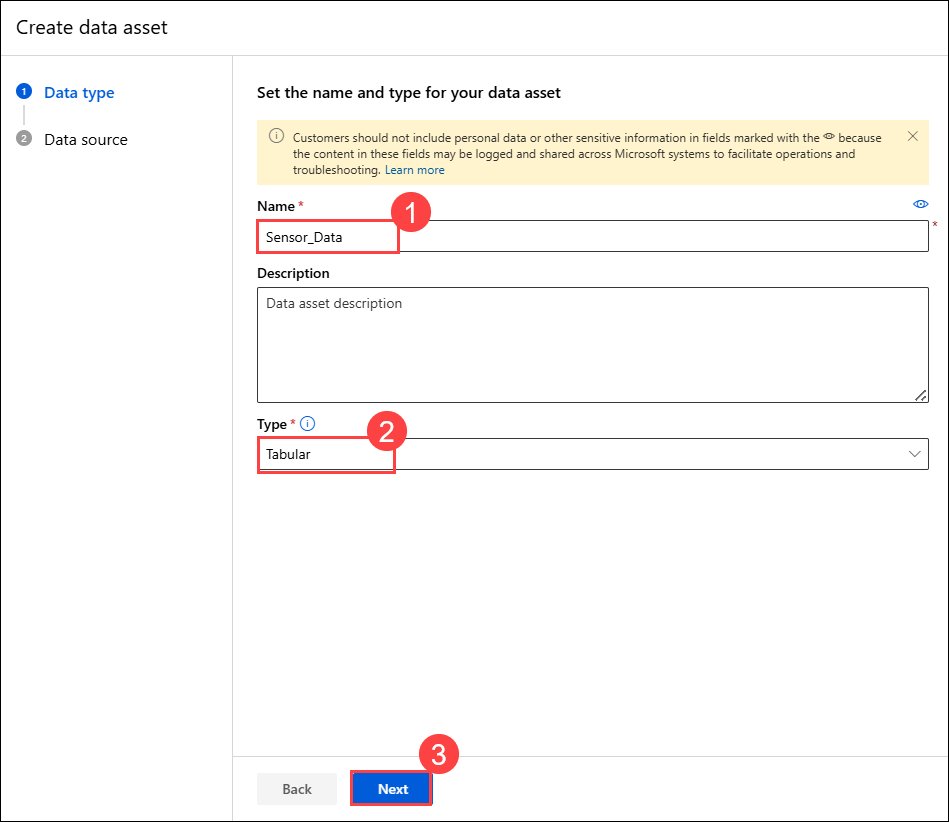     

1. On the **Choose a source for your data asset** page, choose **From local files (1)** the click on **Next (2)**. 

     

1. On the **Select a datastore** page select the following option:  
    
    - Under **Datastore type**, select **Azure Blob Storage (1)**  
    - Choose the datastore named: **`workspaceblobstore` (2)**  
    - Click **Next (3)**  

       

1. On the **Choose a file or folder** page, select **Upload files or folder (1)** from the dropdown, then select **Upload files (2)**.

      

1. **File or Folder Selection**  

    - In the file browser, select the file: `Sensor_data_with_shutdown.csv` **(1)** 
    - Wait for the file to appear under “Upload list”  
    - Click **Next (2)**  

      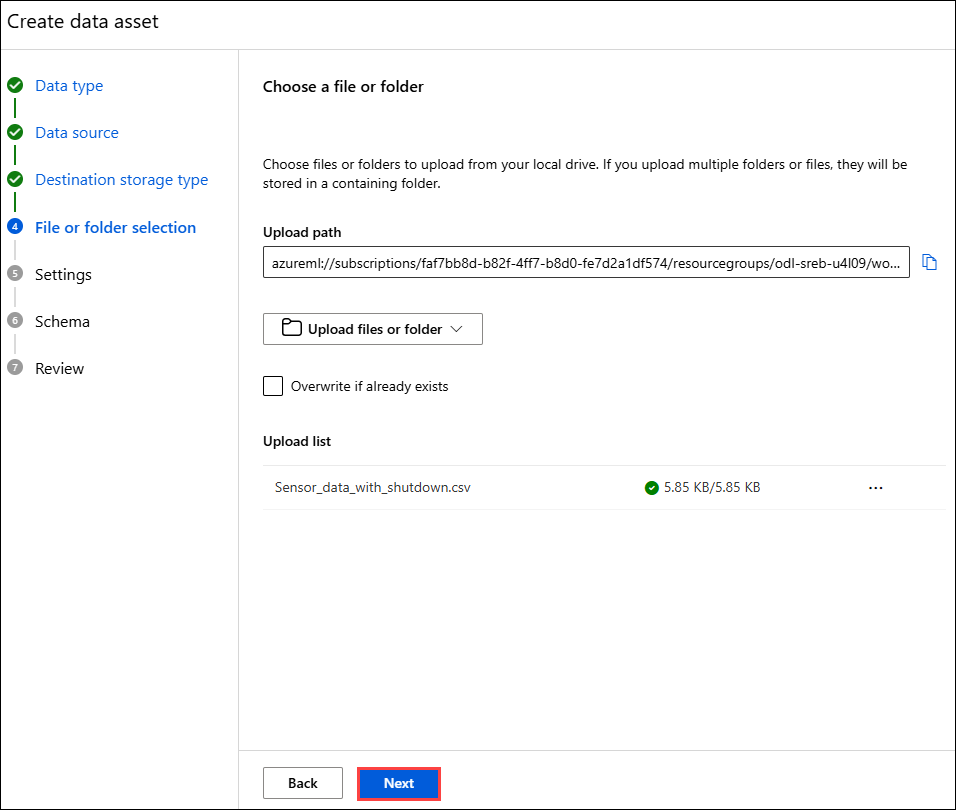 

1. On the **Settings** page, review the fields and ensure they match the expected format then click **Next**  

    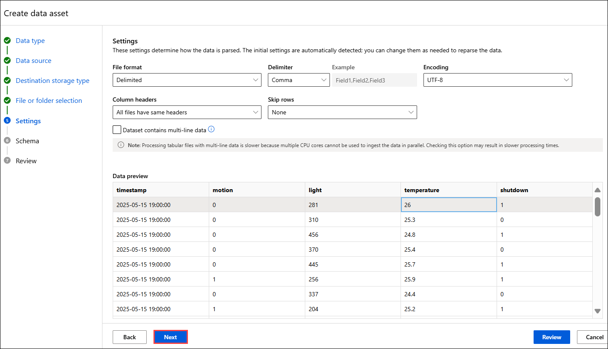 

1. On the **Schema** page, ensure the schema fields are correctly recognized then click **Next**  

    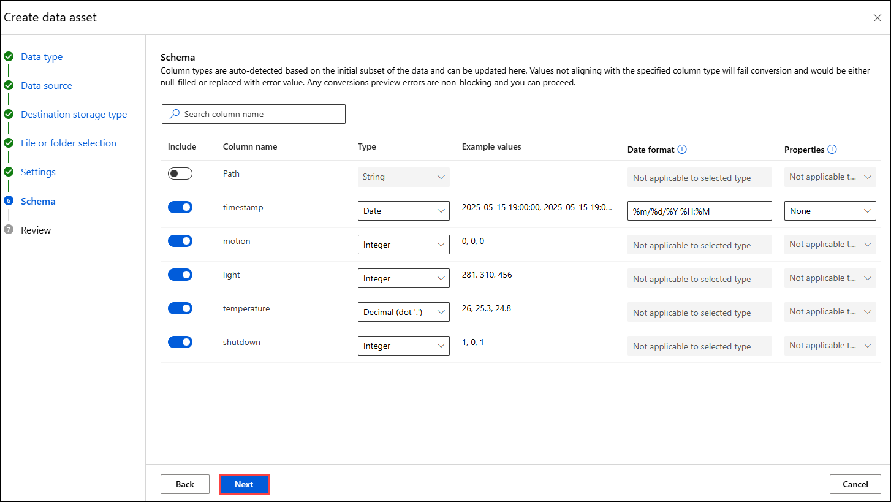 

1. On the **Review** page, click **Create** to finalize the dataset upload.

    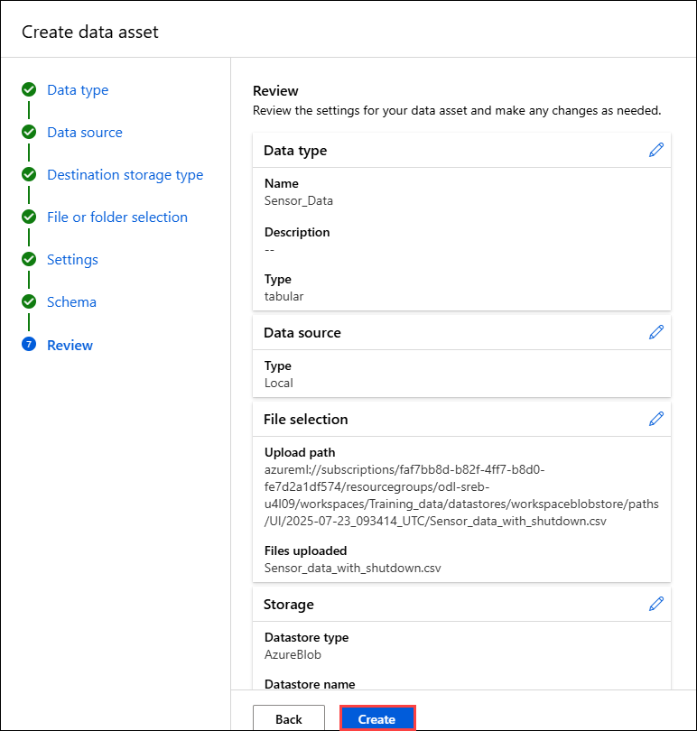 

### Task 3: Run the Pipeline    

1. Under the **Data** tab, locate the uploaded dataset named **`Sensor_Data`** and drag it to the canvas **(1)** and then **Save (2)**.  

    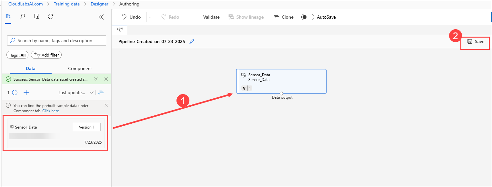  

1. Switch to the **Component (1)** tab and search for **"Clean Missing Data" (2)** by Microsoft. Drag the **Clean Missing Data** data component to the canvas **(3)**.

    - Connect **Sensor_Data** component to **Clean Missing Data** **(4)**

    - Click on **Save (5)**  
    
      

1. Double click on **Clean Missing Data (1)** and then select **Edit Coloumn (2)** under Columns to be cleaned.

    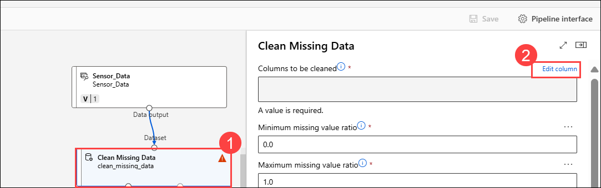 

1. Select **shutdown (1)** column and then **Save (2)**.

    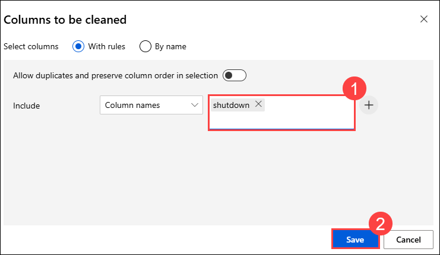 

1. Select **Save**.

    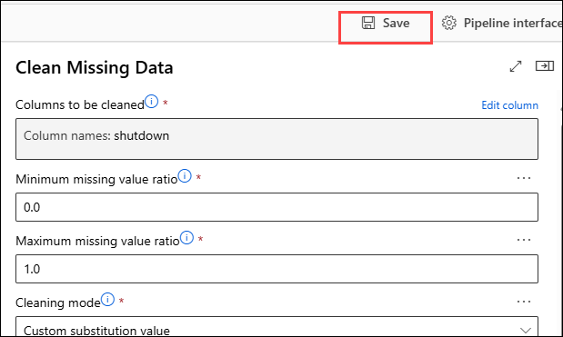 

1. Switch to the **Component (1)** tab and search for **Split Data (2)** by Microsoft. Drag the **Split data (3)** data component into the canvas.

    - Connect left output of **Clean Missing Data** to **Dataset** of **Split Data** **(4)**

     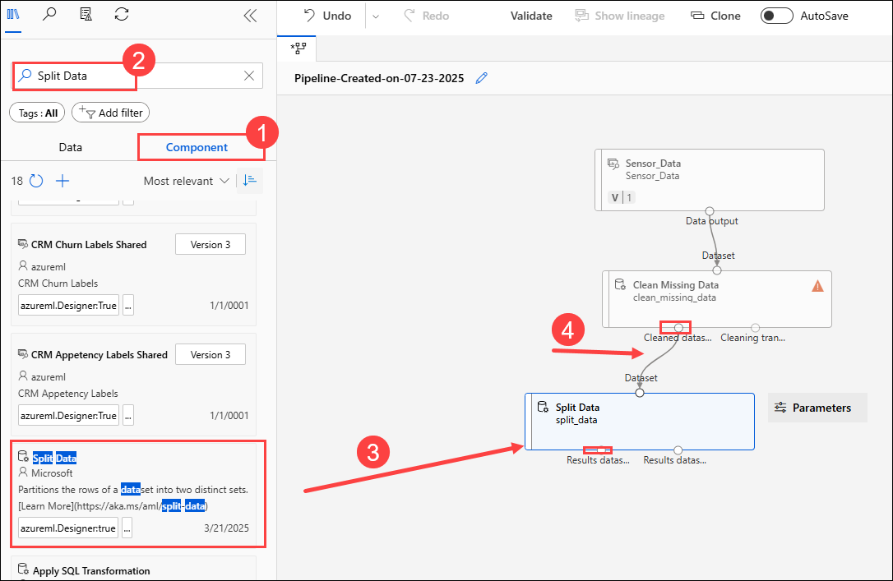  

1. Double-click the **Split Data block (1)** on your canvas. The settings panel will appear on the right-hand side.

    - Under **Splitting mode**, make sure **Split Rows** is selected. (This means the data will be divided by rows, not by columns)
    - In the field labeled **Fraction of rows in the first output dataset**, type: `0.8` **(2)**
    - In the **Random seed** field, type: `42` **(3)**
    - Then **Save (4)**

      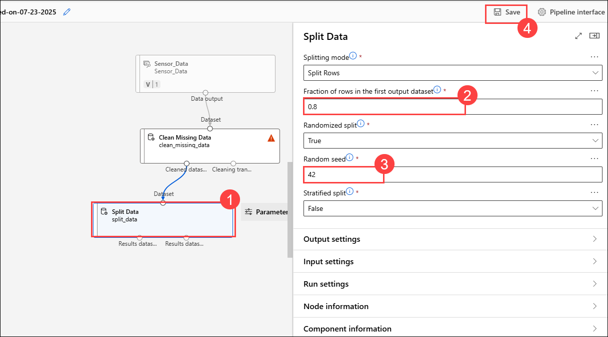

1. Switch to the **Component (1)** tab and search for **Two-Class Logistic Regression (2)** by Microsoft. Drag the **Clean Two-Class Logistic Regression** data component to the canvas **(3)**.

    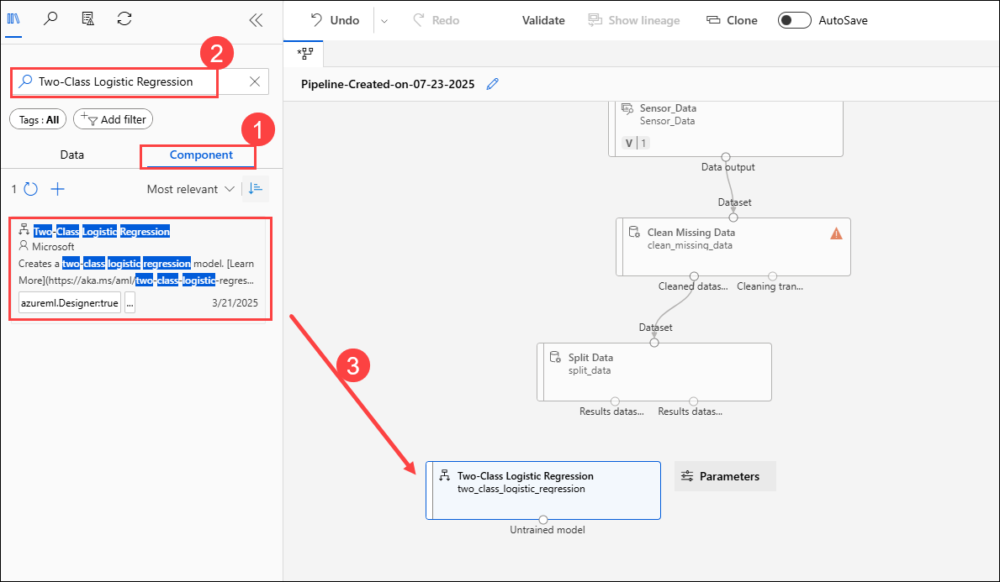 

1. Switch to the **Component (1)** tab and search for **Train model(2)** by Microsoft. Drag the **Train model** data component to the canvas **(3)**.

    - Connect **Output** of **Two-Class Logistic Regression** to **left** input of **Train model** **(4)**

    - Connect **left output** of **Split data** to **right** input of **Train model** **(5)**

    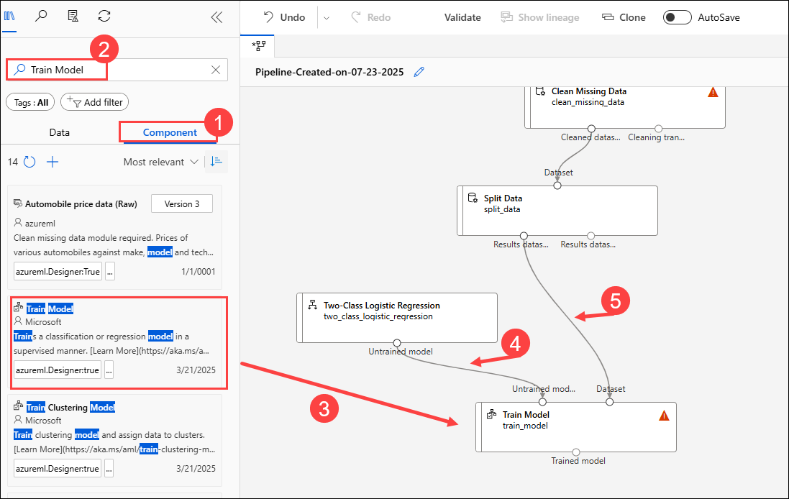    

1. Double click on **Train Model (1)**, select **Edit Column** under `Label Column` **(2)**.

    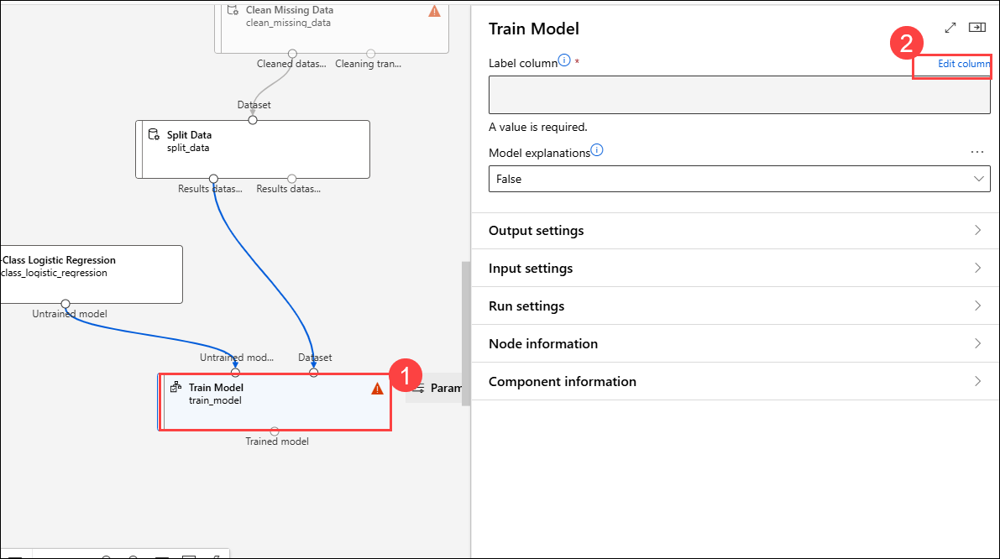

1. Enter **shutdown (1)** and then **Save (2)**.

    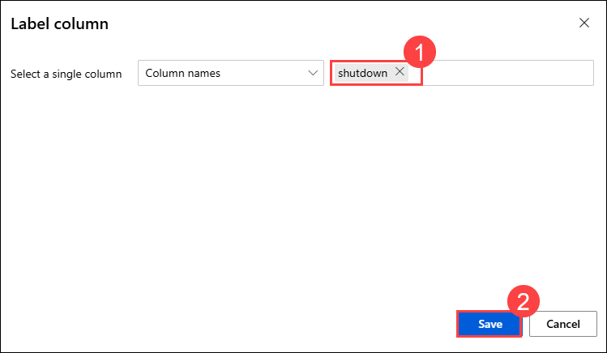

1. Select **Save**.

    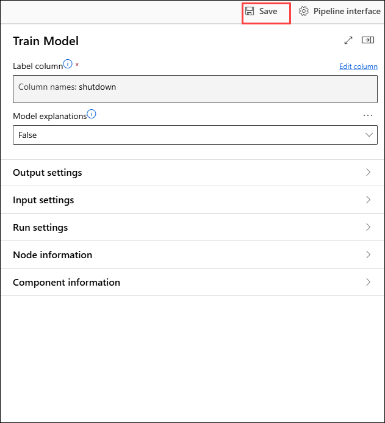

1. Switch to the **Component (1)** tab and search for **Score model(2)** by Microsoft. Drag the **Score model** data component to the canvas **(3)** under `Train Model`.

    - Connect **Output** of **Train Model** to **left** input of **Score model** **(4)**

    - Connect **Right output** of **Split data** to **right** input of **Score model** **(5)**

    - Then **Save (6)**

      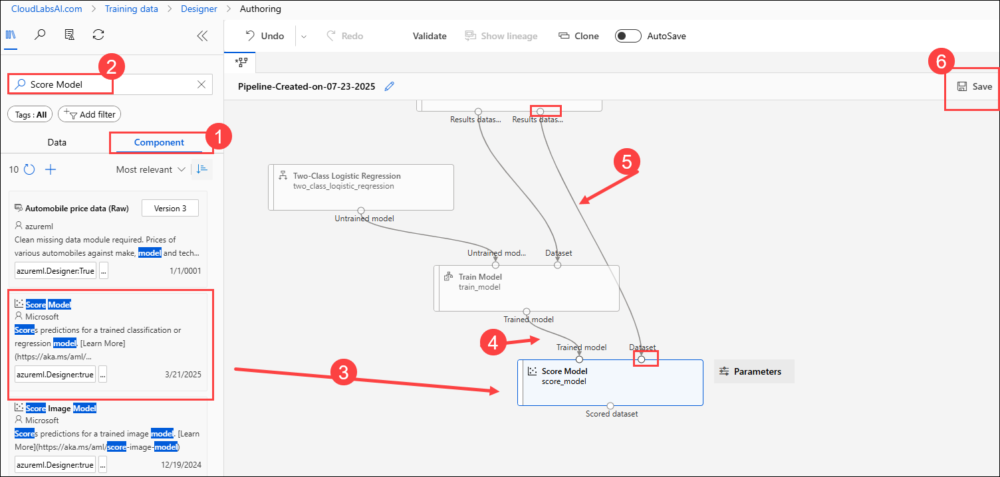

1. Switch to the **Component (1)** tab and search for **Evaluate Model (2)** by Microsoft. Drag the **Evaluate Model** data component to the canvas **(3)** under `Score Model`.

    - Connect **Output** of **Score Model** to **left** input of **Evaluate Model** **(4)**
    - Then **Save (5)**

      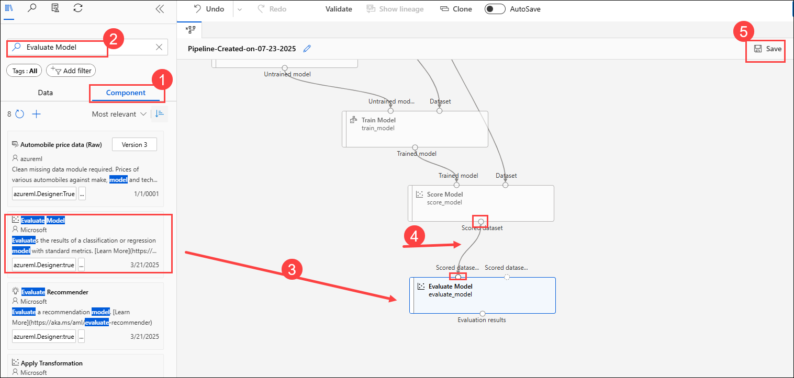

1. Select **Configure & Submit**.

    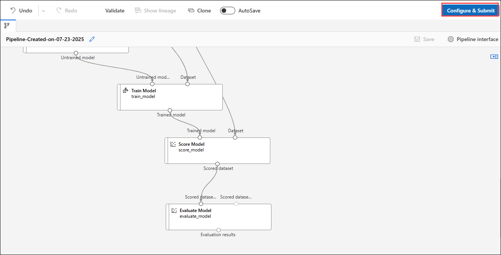

1. On the **Basics**: First, for easy tracking, we’ll set up a new experiment.

    - Under **Experiment name**, select **Create new** **(1)**
    - In the field labeled **“New experiment name”**, type **Training_pipeline (2)**
    - The **Job Display Name** is automatically generated based on today’s date.
    - You may skip the Optional Fields section.
    - Click the blue **Next (3)** button at the bottom-right corner of the screen

      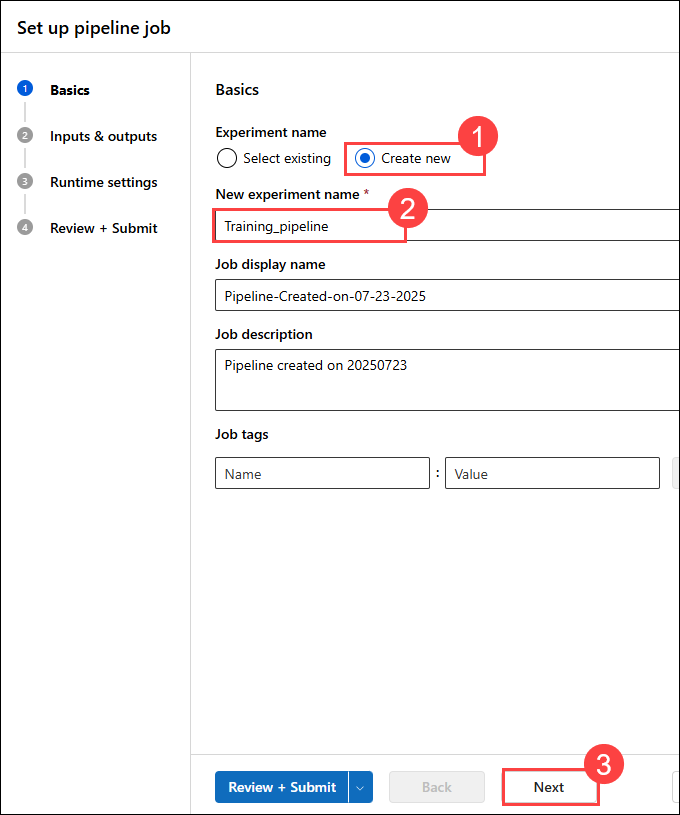    

1. **Inputs & Outputs**: We'll skip the section by clicking **Next**.

     

1. On the **Runtime Settings**, provide the following details:

    - **Select Compute Type** section, select **Compute 
Cluster** from the drop down **(1)**

    - Since no cluster is currently available, we’ll need to create one. Click on **Create Azure ML Compute Cluster (2)**.        

      >**Note**: This will open a new pane or pop-up for you to configure your compute cluster

        

1. **Virtual Machine**: 

    - **Location**: Confirm that the selected region is the same as your workspace (**East US 2**) **(1)**
    - **Virtual Machine Tier**: Leave as default. (do not select "Dedicated" or "Low priority" unless specified otherwise for cost-saving purposes) **(2)**
    - **Virtual Machine Type**: Keep this as **CPU (3)** 
    - **Virtual Machine Size**: Choose **Standard_DS11_v2 (4)**
    - Click **Next (5)**  

           

1. **Advanced Settings**: Give a Compute Name as **Test (1)** and leave everything default. Then click **Create (2)**.

     

1. Select the Compute Created **Test (1)** and click **Next (2)**.   

     

     >**Note**: It may take a few attempts to get selected. Please keep trying — you'll be able to proceed once the **Test** status turns **green**.

1. Once on the **final** page, click **Submit**.     

     

1. Once submitted, a success notification appears at the top of the page. Click on **'View details'** to monitor the pipeline. It may take some time for the pipeline to complete.

        

1. Please wait for the pipeline to complete, which may take approximately `10–15 `minutes. Once it's finished successfully, the status will show as **Completed**.

    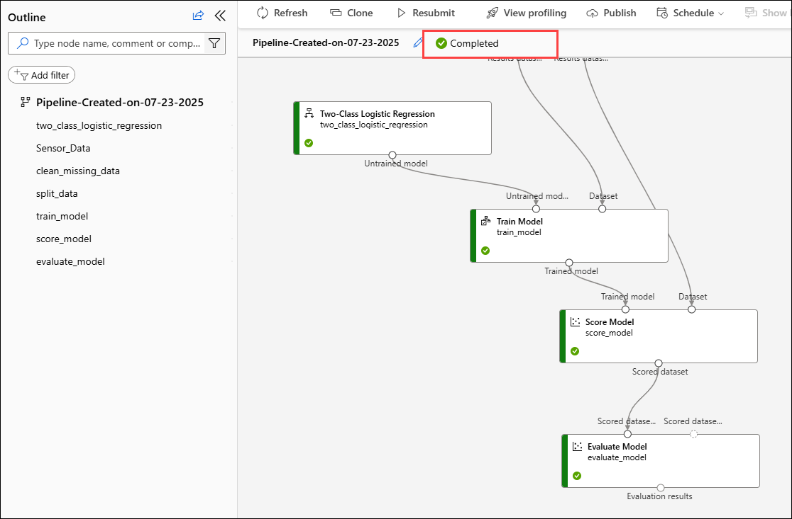 

### Task 4: Evaluate Model Performance    

1. Right click on the **Score Model (1)** and Select **Preview Data (2)-> Scored Dataset (3)** to compare Scored Labels and actual shutdown

    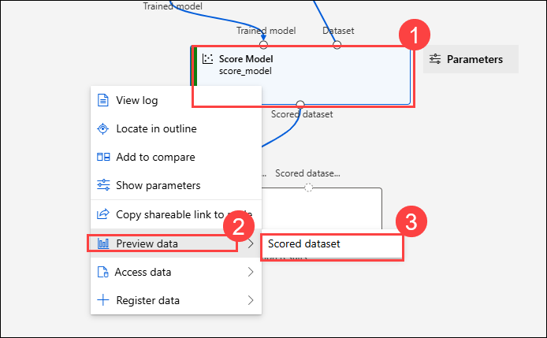 
    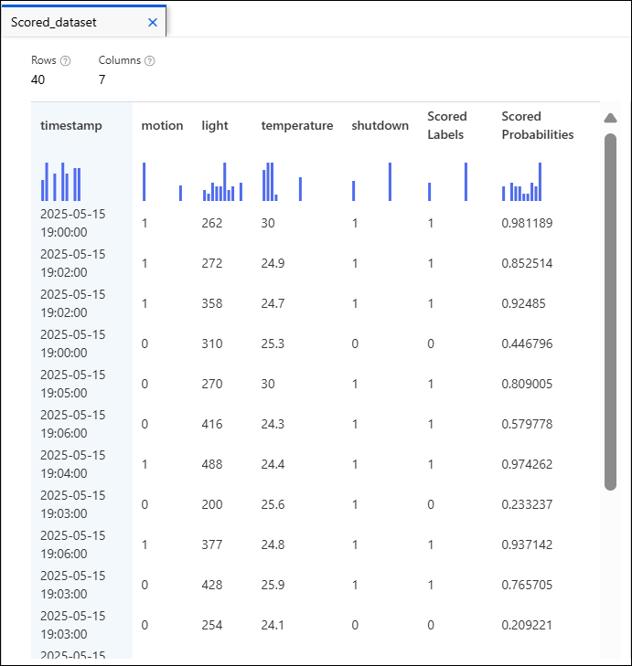     

1. Right click on the **Evaluate Model (1)** and then on **Preview Data (2) -> Evaluation Results (3)**.

    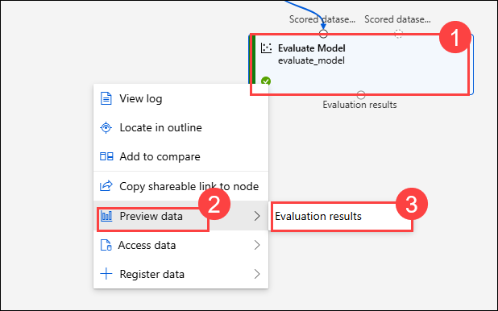 

1. Record the  **accuracy**, **precision, false positives,** and **false negatives** to understand how your model’s performance changes.    

    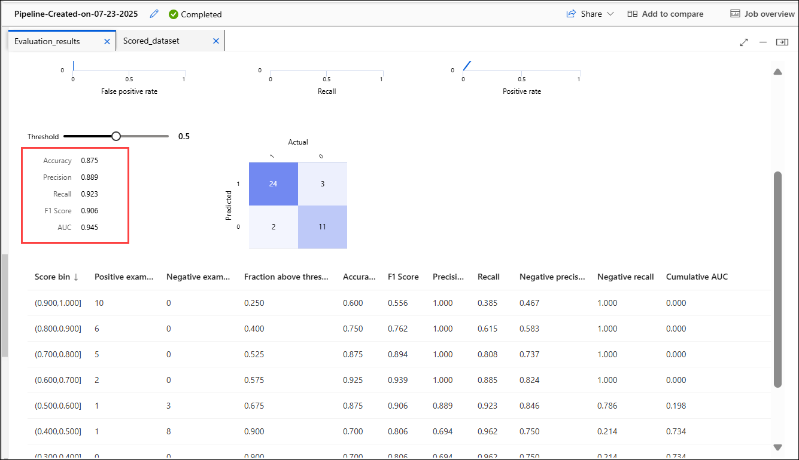 

#### Limited Dataset (10–20 Rows) – Low Data Volume

Upload your training dataset that contains only 10–20 rows.

1. Navigate back to the Pipeline designer, by switching the previous tab.

1. On the **left panel**, under the **Data (1)** tab, click the **➕ (plus icon) (2)** to upload a dataset.  

    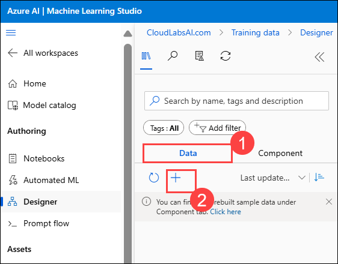

1. On **Create a new workspace to get started with Azure ML** page enter the following data.

    - Name: Enter **`Sensor_Data_1` (1)**  
    - Select type: **Tabular**  
    - Click **Next (3)**  

      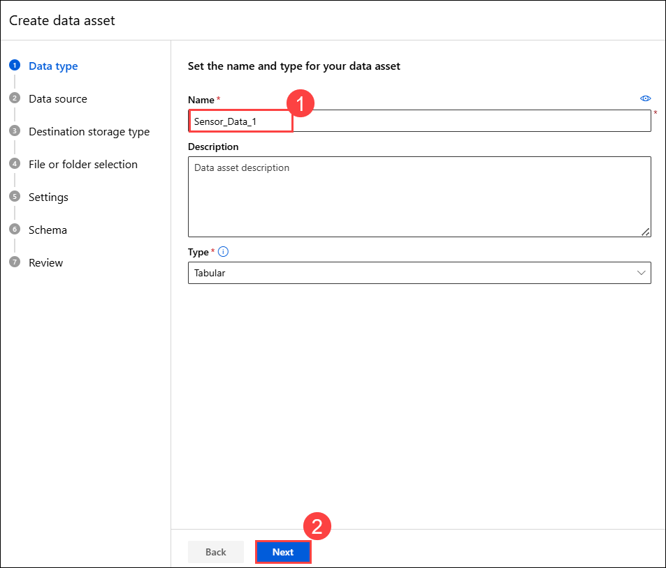     

1. On the **Choose a source for your data asset** page, choose **From local files (1)** the click on **Next (2)**. 

     

1. On the **Select a datastore** page select the following option:  
    
    - Under **Datastore type**, select **Azure Blob Storage (1)**  
    - Choose the datastore named: **`workspaceblobstore` (2)**  
    - Click **Next (3)**  

       

1. On the **Choose a file or folder** page, select **Upload files or folder (1)** from the dropdown, then select **Upload files (2)**.

      

1. **File or Folder Selection**  

    - In the file browser, select the file: `Sensor_data_with_shutdown_1.csv` **(1)** 
    - Wait for the file to appear under “Upload list”  
    - Click **Next (2)**  

       

1. On the **Settings** page, review the fields and ensure they match the expected format then click **Next**  

     

1. On the **Schema** page, ensure the schema fields are correctly recognized then click **Next**  

     

1. On the **Review** page, click **Create** to finalize the dataset upload.

     

1. From the canvas delete the existed `Sensor_Data` Component. Right click on the **Sensor_Data (1)** and then **Delete (2)**.

    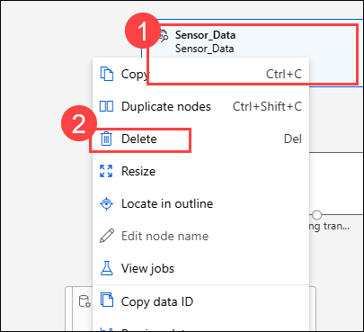

1. Drag the newly created **Sensor_Data_1 (1)**  into the canvas and then connect to **Clean missing data** component **(2)** then **Save (3)** and then **Configure & Submit (4)**.

    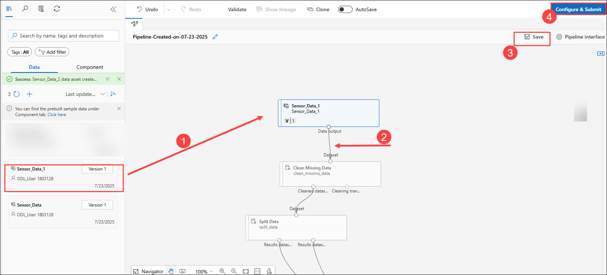

1. Select the Compute Created **Test (1)** and click **Next (2)**.   

     

     >**Note**: It may take a few attempts to get selected. Please keep trying — you'll be able to proceed once the **Test** status turns **green**.

1. Once on the **final** page, click **Submit**.     

     

1. Once submitted, a success notification appears at the top of the page. Click on **'View details'** to monitor the pipeline. It may take some time for the pipeline to complete.

        

1. Please wait for the pipeline to complete, which may take approximately `10–15 `minutes. Once it's finished successfully, the status will show as **Completed**.

     

1. Right click on the **Score Model (1)** and Select **Preview Data (2)-> Scored Dataset (3)** to compare Scored Labels and actual shutdown

     
    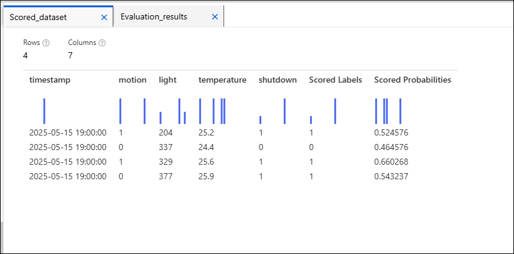     

1. Right click on the **Evaluate Model (1)** and then on **Preview Data (2) -> Evaluation Results (3)**.

     

1. Record the  **accuracy**, **precision, false positives,** and **false negatives** to understand how your model’s 
performance changes.    

    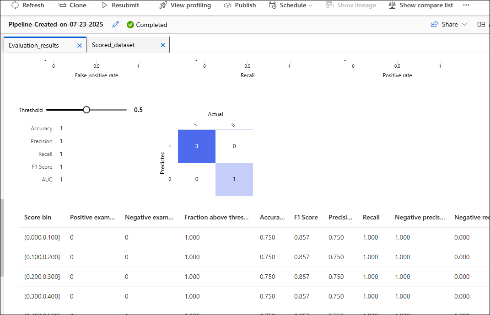     

#### Corrupted Dataset – Noisy or Incomplete Data

Here you will be uploading a dataset file thats containes noisy or incomplete Data

Introduce noise or errors into your dataset. You can:

- Flip some motion or light values randomly
- Delete a few temperature readings
- Add contradictory shutdown labels

This run helps you test how your model reacts when trained on inaccurate or inconsistent 
data.    

1. Navigate back to the Pipeline designer, by switching the previous tab.

1. On the **left panel**, under the **Data (1)** tab, click the **➕ (plus icon) (2)** to upload a dataset.  

    

1. On **Create a new workspace to get started with Azure ML** page enter the following data.

    - Name: Enter **`Sensor_Data_2` (1)**  
    - Select type: **Tabular**  
    - Click **Next (3)**  

      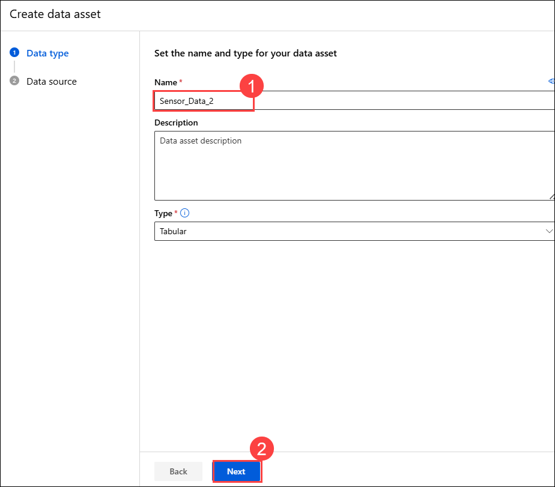     

1. On the **Choose a source for your data asset** page, choose **From local files (1)** the click on **Next (2)**. 

     

1. On the **Select a datastore** page select the following option:  
    
    - Under **Datastore type**, select **Azure Blob Storage (1)**  
    - Choose the datastore named: **`workspaceblobstore` (2)**  
    - Click **Next (3)**  

       

1. On the **Choose a file or folder** page, select **Upload files or folder (1)** from the dropdown, then select **Upload files (2)**.

      

1. **File or Folder Selection**  

    - In the file browser, select the file: `Sensor_data_with_shutdown_2.csv` **(1)** 
    - Wait for the file to appear under “Upload list”  
    - Click **Next (2)**  

       

1. On the **Settings** page, review the fields and ensure they match the expected format then click **Next**  

     

1. On the **Schema** page, ensure the schema fields are correctly recognized then click **Next**  

     

1. On the **Review** page, click **Create** to finalize the dataset upload.

     

1. From the canvas delete the existed `Sensor_Data` Component. Right click on the **Sensor_Data_1 (1)** and then **Delete (2)**.

    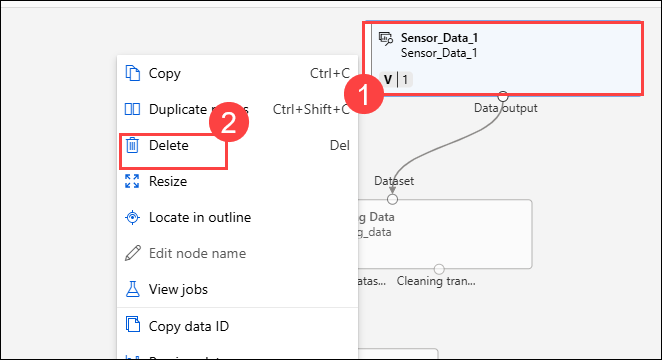

1. Drag the newly created **Sensor_Data_2 (1)**  into the canvas and then connect to **Clean missing data** component **(2)** then **Save (3)** and then **Configure & Submit (4)**.

    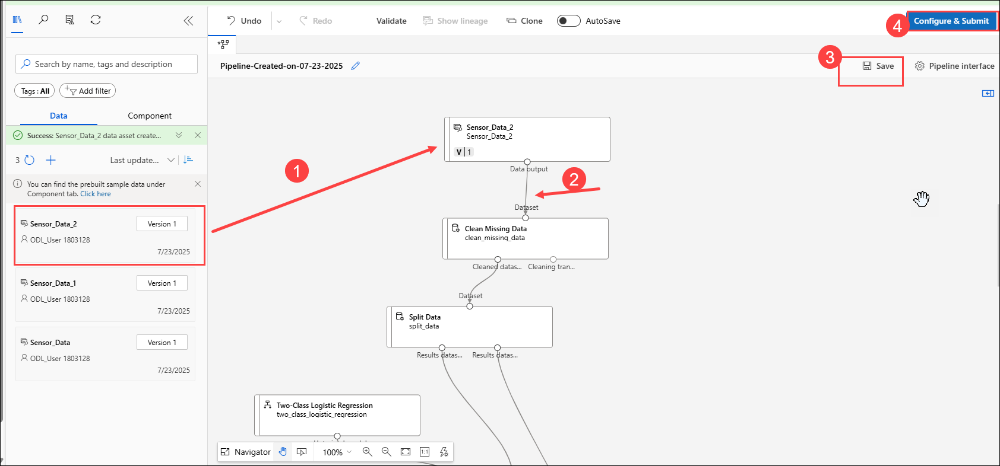

1. Select the Compute Created **Test (1)** and click **Next (2)**.   

     

     >**Note**: It may take a few attempts to get selected. Please keep trying — you'll be able to proceed once the **Test** status turns **green**.

1. Once on the **final** page, click **Submit**.     

     

1. Once submitted, a success notification appears at the top of the page. Click on **'View details'** to monitor the pipeline. It may take some time for the pipeline to complete.

        

1. Please wait for the pipeline to complete, which may take approximately `10–15 `minutes. Once it's finished successfully, the status will show as **Completed**.

     

1. Right click on the **Score Model (1)** and Select **Preview Data (2)-> Scored Dataset (3)** to compare Scored Labels and actual shutdown

     
    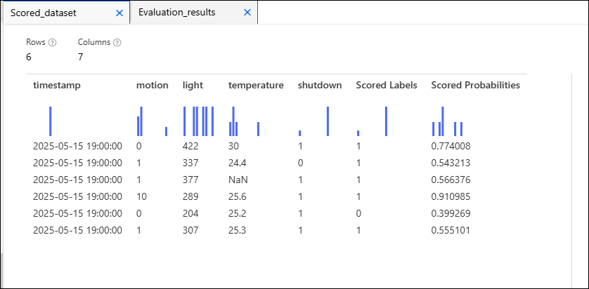     

1. Right click on the **Evaluate Model (1)** and then on **Preview Data (2) -> Evaluation Results (3)**.

     

1. Record the  **accuracy**, **precision, false positives,** and **false negatives** to understand how your model’s performance changes.    

    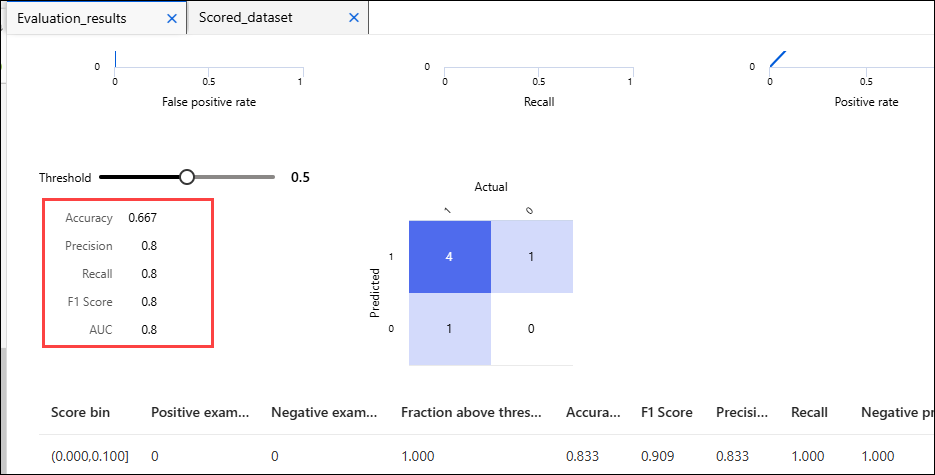     

    >**Note:** Here you can see less Accuracy, precision values due to Corrupted Dataset 

## Review

In this lab, you have completed the following tasks:

- Created Azure ML Workspace
- Uploaded the Dataset
- Run the Pipeline
- Evaluated Model Performance

## You have successfully completed the lab

 
