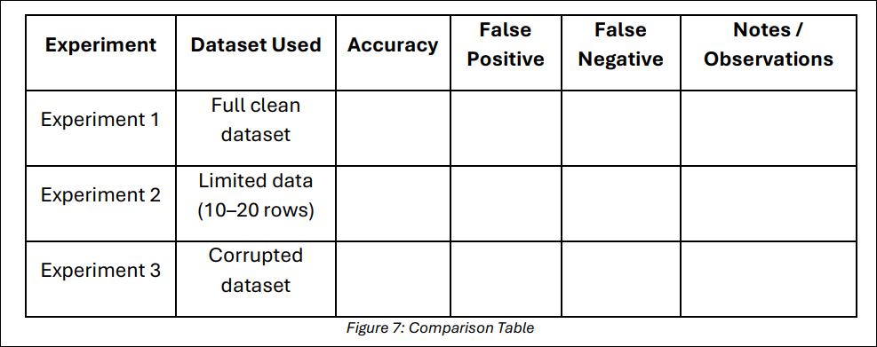

# Final Instructions:

After each run, go to the **Evaluate Model** module.

Visualize the output and record:

- **Accuracy**
- **False Positives** (model predicted shutdown, but it was not needed)
- **False Negatives** (model missed a shutdown when it should have occurred)
  
Write a short observation for each run:

- **Q1: What changed and why?**

### Why This Matters:

This experiment directly supports Standard 4.4 by helping you understand the answers to these questions:

- Q1: How the amount and quality of training data influence a model’s accuracy?
- Q2: Why bad or insufficient data can lead to dangerous mistakes?
- Q3: What kind of model you would trust — or not trust — in a real manufacturing system?

Optional Guidance & Scaffolds:

If you are stuck, please check these questions:

- Q1: Was shutdown selected as the label in the Train Model module?

- Q2: Did you connect training and test data correctly?

- Q2: Was missing data handled early in the pipeline?

### What Did My Model Learn?
Now that you have trained, tested, and evaluated your model under three different data conditions, it is time to reflect like engineers. This phase focuses on helping you interpret your model’s behavior, connect it to training data quality, and consider whether the model is safe and trustworthy.

### Compare Your Experiments

Complete or review the results table provided in your `SREB_U4_L9_Handout`, like the one shown in Figure 7 below. 

 

**Accuracy is just one part of the picture**. A model with 90% accuracy could still make critical shutdown mistakes if the errors are false negatives.

### Discuss

Answer these questions:

- Q1: Which experiment produced the most reliable results — and why?
- 
- Q2: Which type of error is more dangerous in this project:

    i. False Positives (shuts down when it should not)?

    ii. False Negatives (keeps running when it should shut down)?

- Q3: What happened when you gave your model:
- 
    i. Less data?

    ii. Noisy or inconsistent data?

- Q4: What did you learn about the importance of data preparation and label accuracy?

Think about your engineering work and answer these questions:

- Q1: Did the model understand your robot’s shutdown logic?

- Q2: What could you improve in the next version of the dataset?

### Individual Reflection & Exit Ticket

Complete the following individually:

- Q1: Describe one way your data impacted the accuracy of your model.

Consider missing values, label mistakes, sensor noise, or dataset size.

- Q2: Would you trust your model to control your robot in the real world? Why or why not?

Support your answer using evidence from the Evaluate Model output.

Ensure you complete all the questions provided in your `SREB_U4_L9_Handout`.

