# Hands-On-Lab: Sports Data

In this hands-on lab, you will work with sports-related data to prepare it for analysis using Azure tools. You will start by creating a workspace and uploading raw data, then clean and structure the data for better accessibility and performance. The lab will guide you through storing the processed data and running a pipeline to automate the workflow. Finally, you will visualize the results to uncover patterns and trends that can support predictive analytics in sports.

## Lab Objectives

In this lab, you will be able to complete the following tasks:

- Task 1: Creating Your Workspace
- Task 2: Uploading the Data
- Task 3: Cleaning the Data
- Task 4: Storing the Data
- Task 5: Running the Pipeline
- Task 6: Visualizing the Data

### Task 1: Creating Your Workspace

1. Open a new tab in the browser, right-click on the following link [Azure Machine Learning Studio](https://ml.azure.com/), then **Copy link** and paste it in a new browser tab to log in to **Azure Machine Learning Studio**.

1. If prompted, provide the credentials below:

   - **Email/Username:** <inject key="AzureAdUserEmail"></inject>

   - **Password:** <inject key="AzureAdUserPassword"></inject>
   
1. On the **Create a new workspace to get started with Azure ML** fill in the following fields:

    - **Name**: Enter `NASCAR-Data`  **(1)**
    - **Friendly Name**: Leave default **(2)**
    - **Hub (Optional)**: Leave this as **None** unless instructed otherwise **(3)**
    - **Advanced Settings**:
    - **Subscription**: Select the appropriate Azure subscription from the dropdown **(4)**
    - **Resource Group**: Select **nascar-rg** **(5)**
    - **Region**: Select **East US 2 (6)** for better performance.
    - After filling out all the required fields, click the **Create (7)** button.

      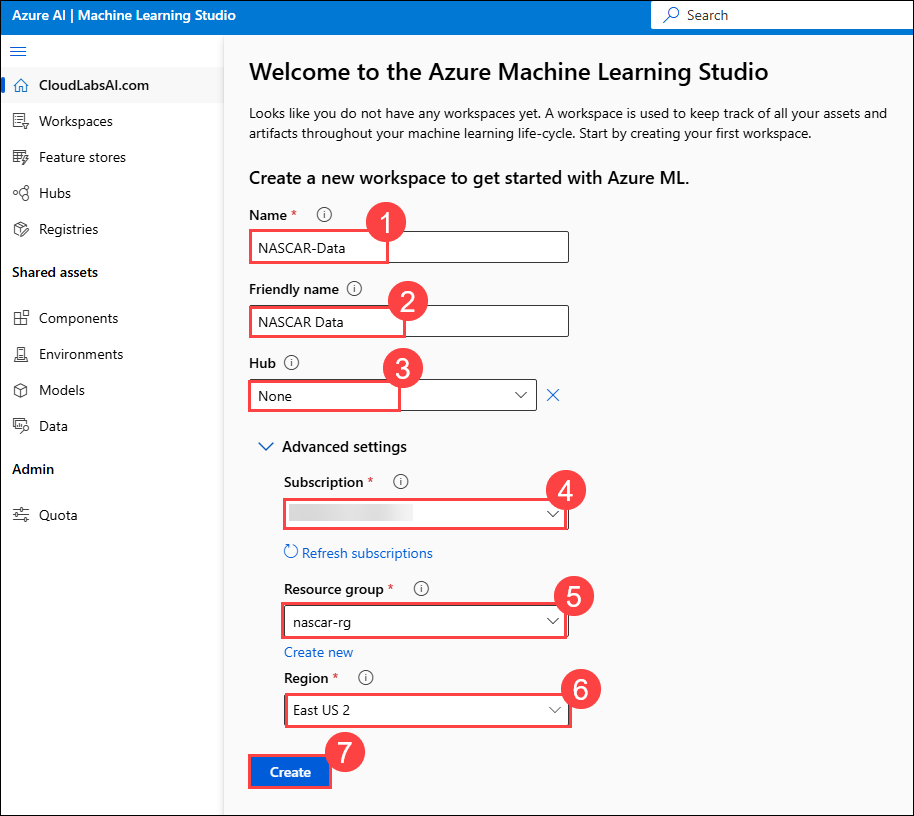 

       >**Note**: If you **did not** see the page like Figure 1, simply click **“Create Workspace”** on your dashboard and fill out the fields as described in Step 2.

1. Wait for the workspace to create, it may take around 2-3 minutes.

1. Now navigate to your newly created workspace. On the **left-hand menu**, click **Workspaces (1)**. Select the workspace you just created `NASCAR Data` **(2)**.

     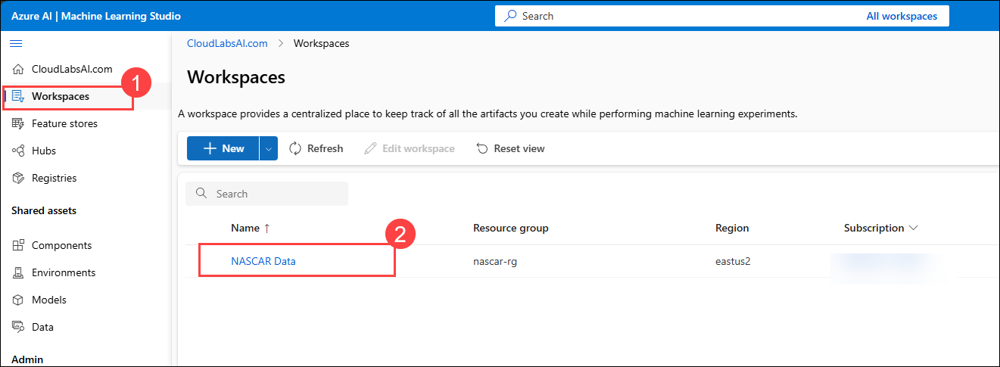 

1. In the side menu of your workspace, select **Designer (1)**. Click **Create a new pipeline using classic prebuilt components (2)**.     

     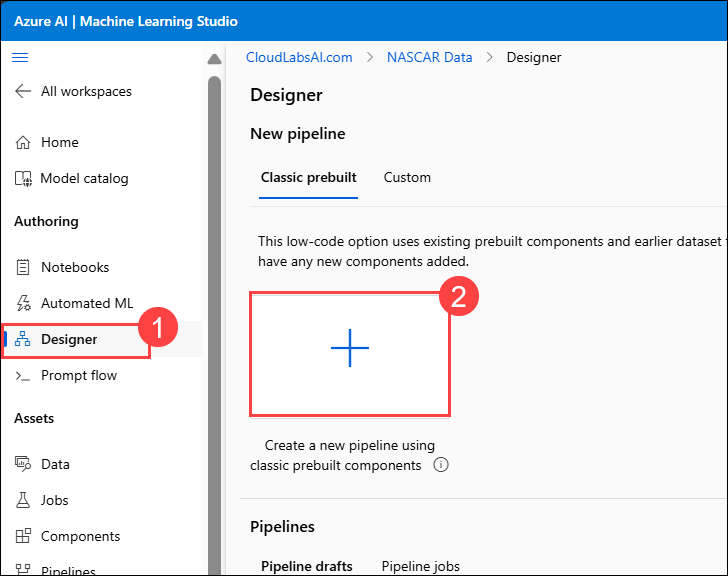 

1. Once the pipeline editor opens, click the **pencil icon (1)** at the top and rename your pipeline to **NASCAR Pipeline (2)** and then **Save (3)**.  

     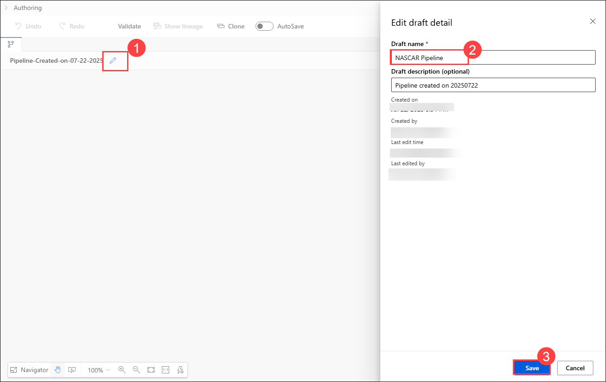

> **Congratulations** on completing the task! Now, it's time to validate it. Here are the steps:
>
> - Hit the Validate button for the corresponding task. If you receive a success message, you can proceed to the next task.
> - If not, carefully read the error message and retry the step, following the instructions in the lab guide.
> - If you need any assistance, please contact us at cloudlabs-support@spektrasystems.com. We are available 24/7 to help.

<validation step="95a7b102-161c-4b14-9756-80ba9a3c752a" />

---
### Task 2: Uploading the Data

1. On the **left panel**, under the **Data (1)** tab, click the **➕ (plus icon) (2)** to upload a dataset.  

   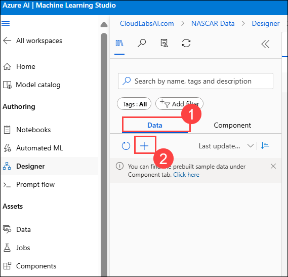 

1. On **Create data asset** page enter the following data.

    - Name: Enter **`NASCAR_Season_History` (1)**  
    - Description: `This dataset tracks the victorious drivers and 
cars throughout NASCAR’s history.` **(2)**
    - Select type: **Tabular (3)**  
    - Click **Next (4)**  

      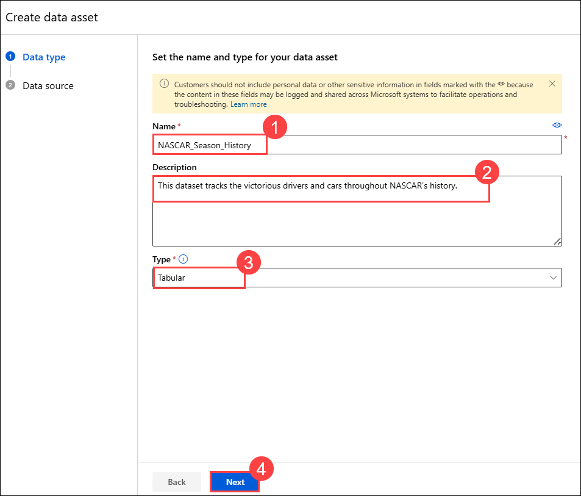     

1. On the **Choose a source for your data asset** page, choose **From local files (1)** the click on **Next (2)**. 

     

1. On the **Select a datastore** page select the following option:  
    
    - Under **Datastore type**, select **Azure Blob Storage (1)**  
    - Choose the datastore named: **`workspaceblobstore` (2)**  
    - Click **Next (3)**  

       

1. On the **Choose a file or folder** page, select **Upload files or folder (1)** from the dropdown, then select **Upload files (2)**.

      

1. **File or Folder Selection**  

    - In the file browser, navigate to avigate to `C:\LabFiles` and then select the file: `NASCAR Champions History Dataset.csv` **(1)** 
    - Wait for the file to appear under “Upload list”  
    - Click **Next (2)**  

      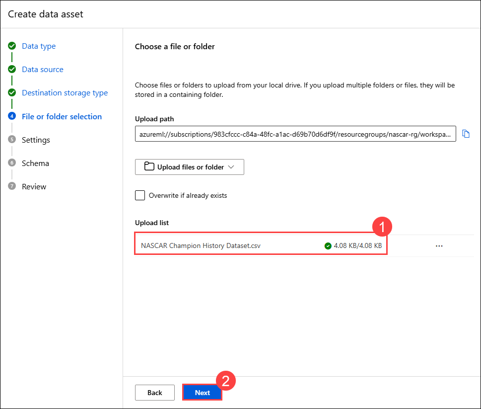 

1. On the **Settings** page, review the fields and ensure they match the expected format then click **Next**  

    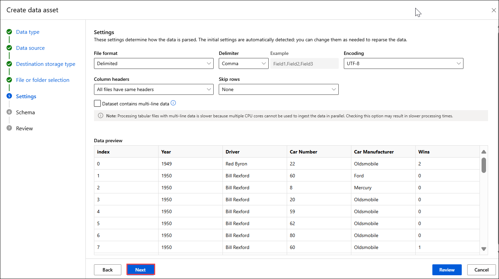 

1. On the **Schema** page, ensure the schema fields are correctly recognized then click **Next**  

    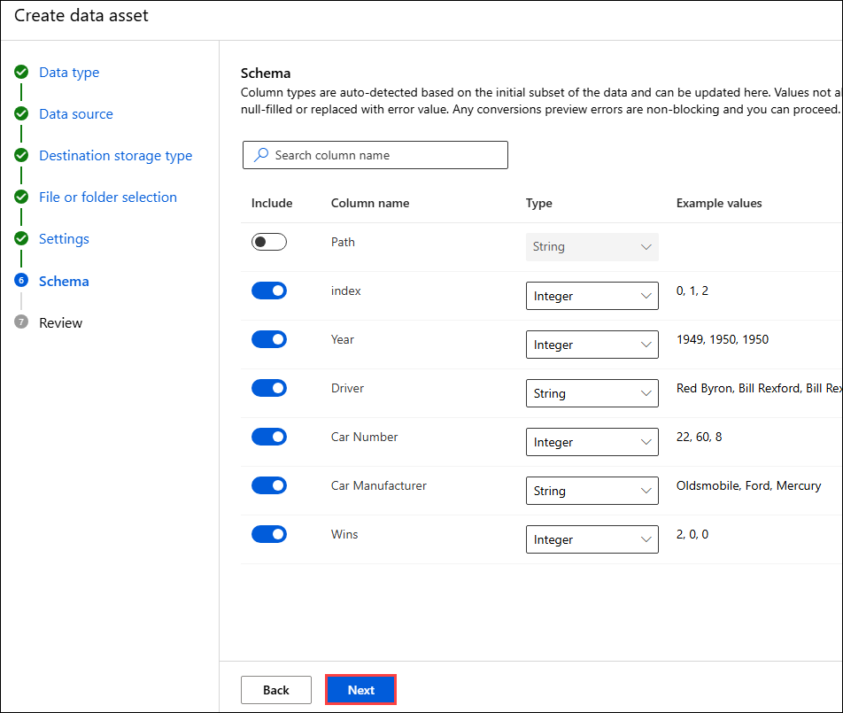 

1. On the **Review** page, click **Create** to finalize the dataset upload

    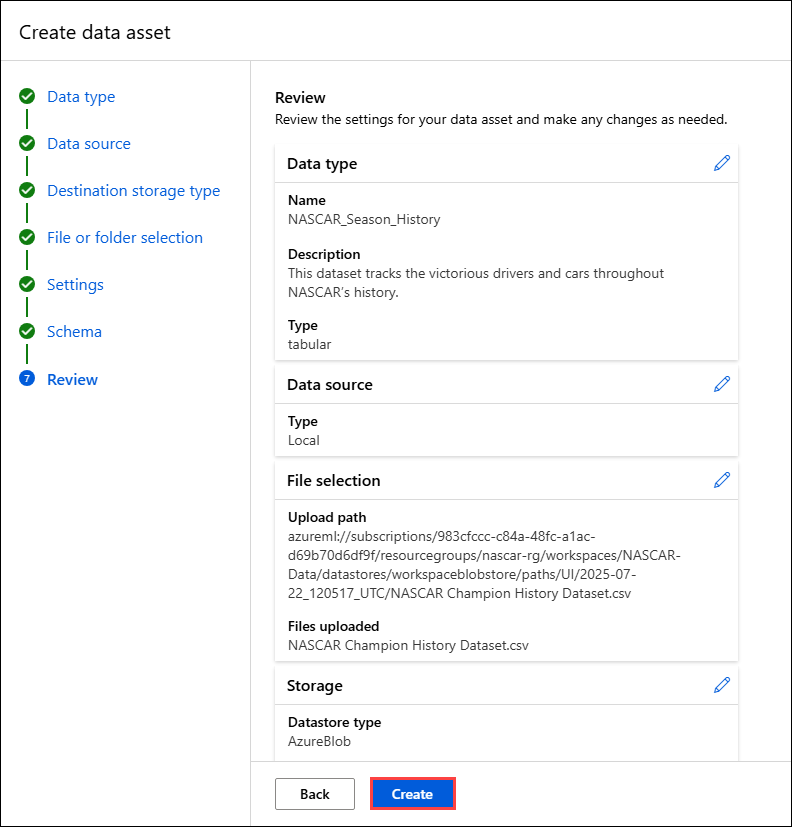
> **Congratulations** on completing the task! Now, it's time to validate it. Here are the steps:
>
> - Hit the Validate button for the corresponding task. If you receive a success message, you can proceed to the next task.
> - If not, carefully read the error message and retry the step, following the instructions in the lab guide.
> - If you need any assistance, please contact us at cloudlabs-support@spektrasystems.com. We are available 24/7 to help.

<validation step="124d18fa-11fd-4ecf-8a8b-ab68e555ccea" />

---
 
### Task 3: Cleaning the Data

Azure provides many prebuilt components that simplify data preprocessing. Now let us walk through how to clean and prepare the NASCAR dataset using Azure ML Designer.  

1. From the left panel, drag your **NASCAR_Season_History** dataset onto the canvas.

   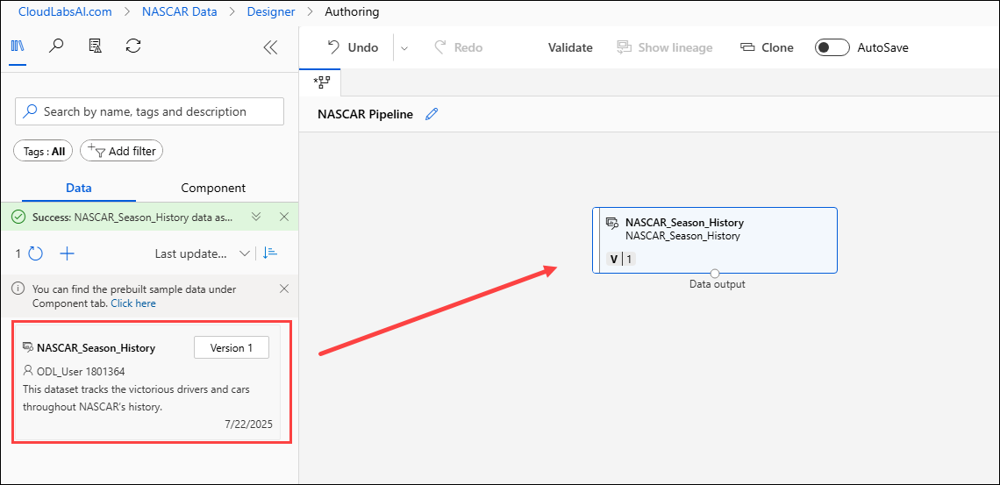

1. Switch to the **Component** tab in the left panel **(1)** and search for **Clean Missing Data (2).** Drag that component onto the canvas **(3)**.   

   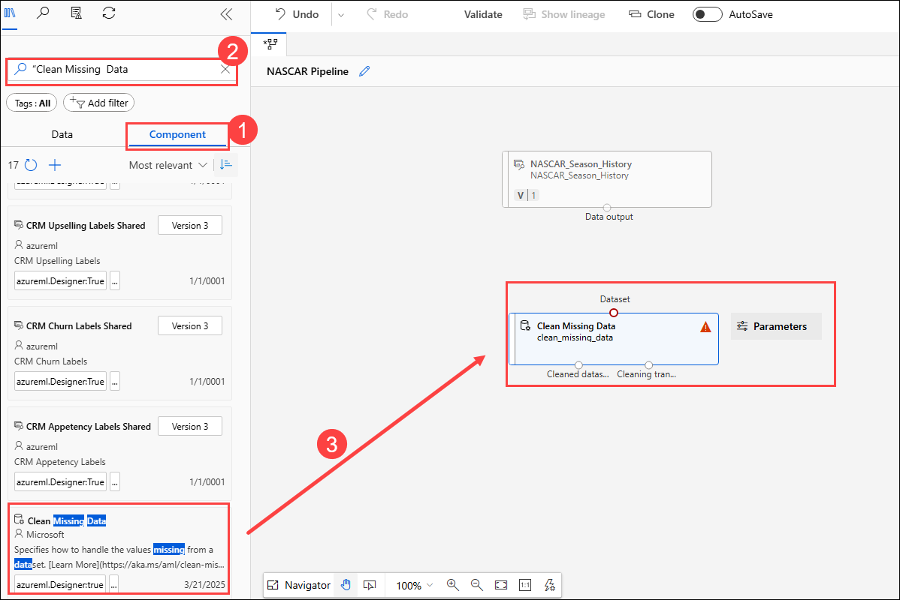

1. Connect your dataset to the component by clicking and dragging from **Data output** on the **dataset block** to **Dataset** on the **Clean Missing Data** component.    

   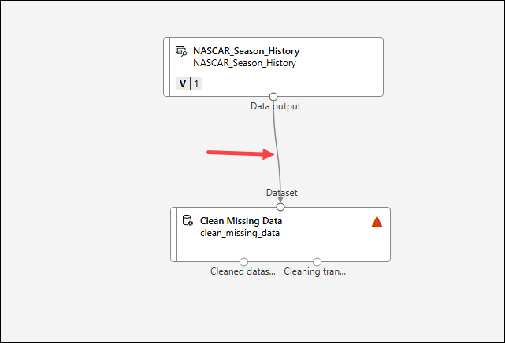

    >**Note**: This component helps us remove or handle any missing or improperly formatted data in the dataset.

1. Double-click the **Clean Missing Data (1)** component to open its settings. Under **Columns to be cleaned**, click **Edit column (2).**     

   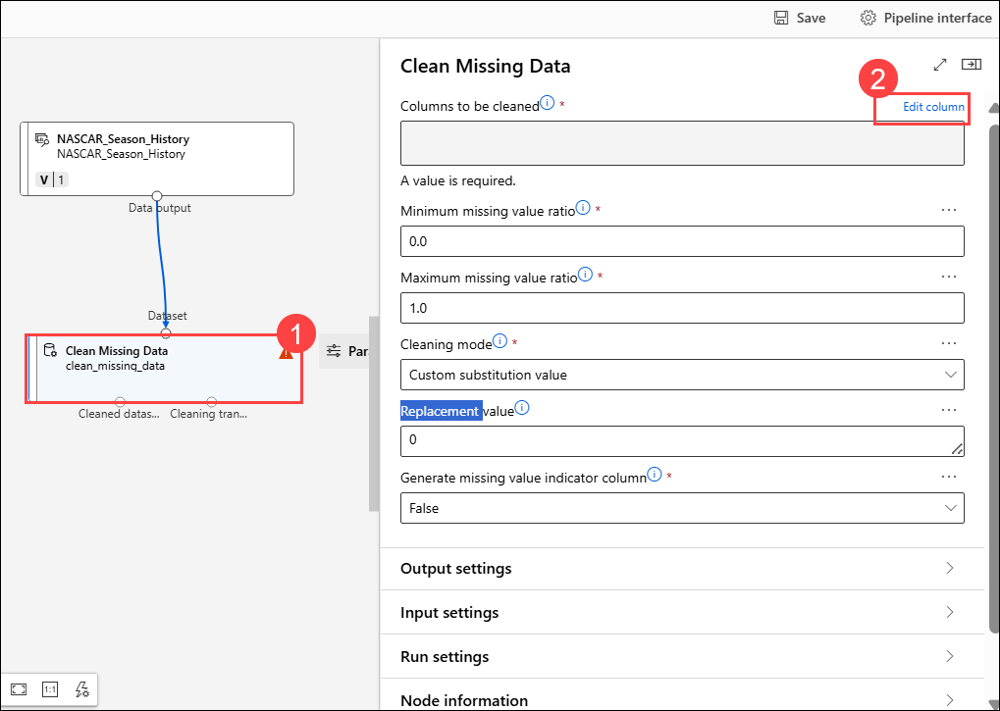

1. Choose **“By name” (1)**, From the `Available columns` click on `+` corresponding to `Year`, `Driver`, `Car Manufacturer`, and `Wins` **(2)** and then **Save (3)**.

    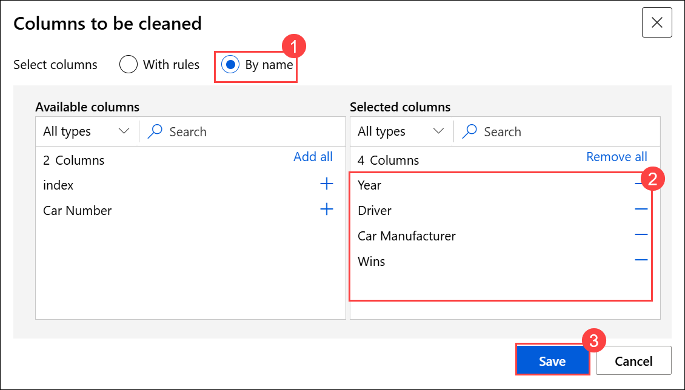

     >**Note**: We are selecting the features most relevant for identifying topperforming athletes. Columns like Index and Car Number are not helpful for our analysis and are excluded.

     - This is the **eliminating unnecessary features** step.

1. Click on **Save**.

    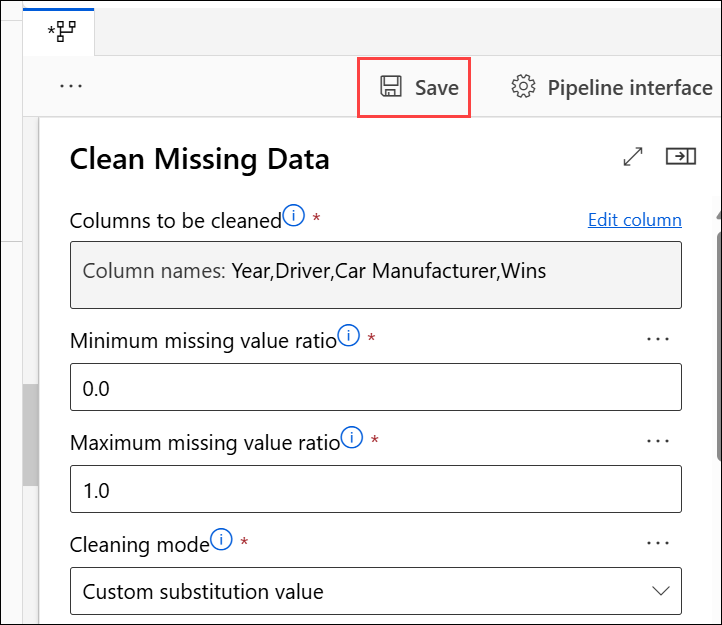

1. In the **Component (1)** tab, search for **Remove Duplicate Rows (2)**. Drag it into the canvas **(3)**.

1. Connect left **Cleaned Dataset** output from the previous component to **Dataset** input on this component. 

   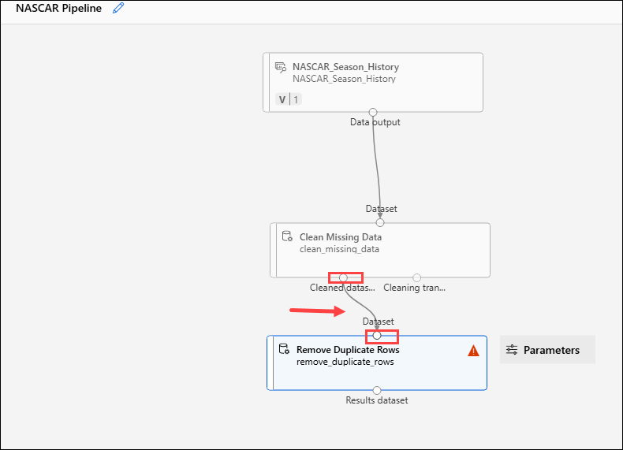

1. Double-click on the component to open the settings **(1)**. Click on **Edit Cloumn** under **Select Key columns selection filter expression**.

   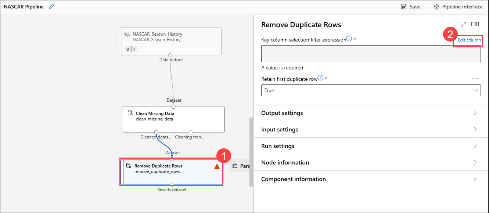

1. Select **“With rules,”** then choose `All columns.` **(1)** and **Save (2)**.    

   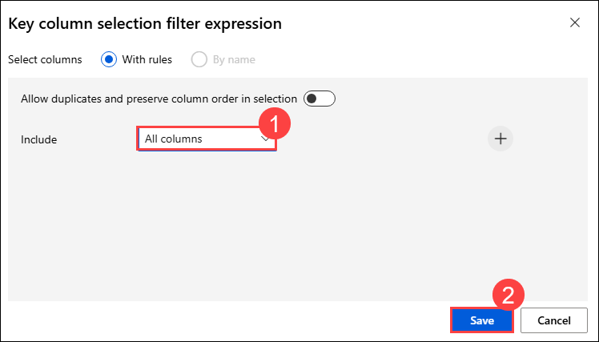

1. Set “Retain first duplicate row” to **True (1)** and then click on **Save (2)**.

   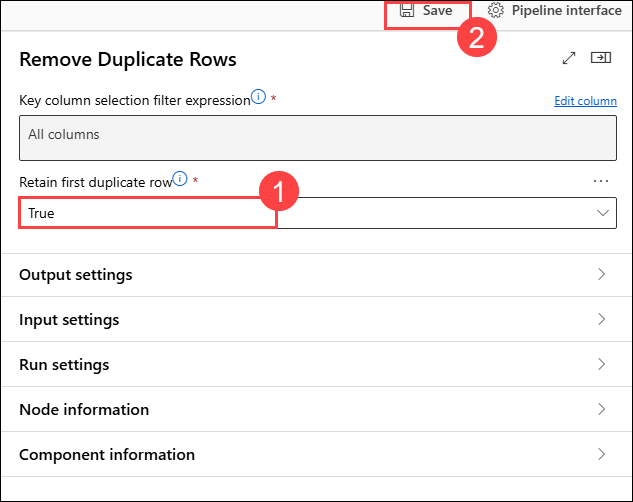

### Task 4: Storing the Data

1. In the **Component (1)** tab, search for **Export Data (2)** and drag the component into the canvas **(3)**. Connect the **Result dataset** from the last component into the **Input path** for the **Export Data** component **(4)**.

    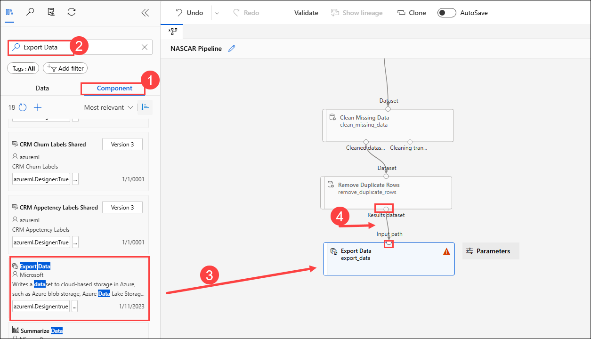

1. Double-click the **Export Data** component to open its settings **(1)**. Specify the following details and then **Save (7)**:

    - Datastore Type:  Select **Azure Blob Storage (2)**
    - Datastore: Select **workspaceblobstore (3)**
    - Output path: **Processed-Data (4)**
    - File format: **CSV (5)**
    - Number of rows per operation: **50 (default) (6)**

      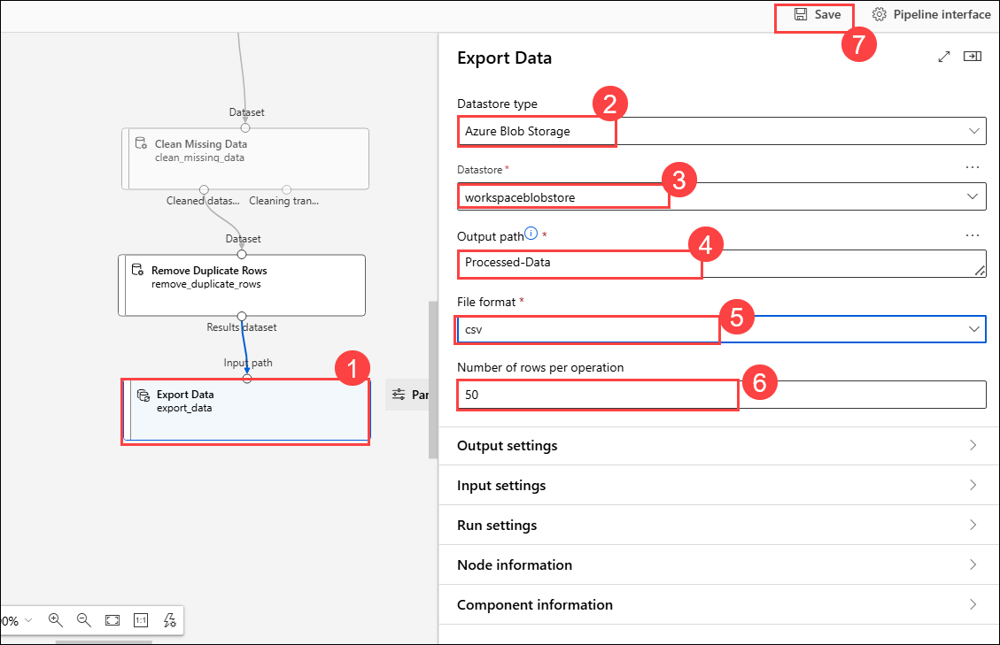

By exporting the dataset this way, you are moving your cleaned, prepared data into cloud storage, where it can be accessed again later, shared with others, or used in new pipelines and experiments.   

### Task 5: Running the Pipeline

1. Make sure your pipeline is saved, then click **Configure & Submit** at the top of the screen. 

    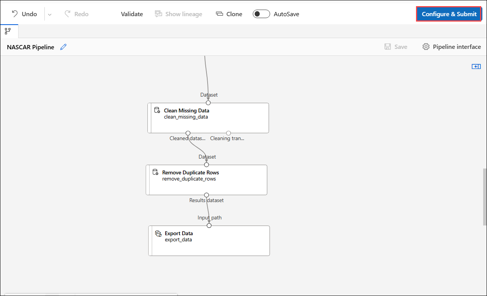

1. You will now walk through a few configuration steps, then click **Next (3)**:
  
   - Experiment name: **Create new (1)**
   - New experiment name: **NASCAR-Preprocessing (2)**

       

1. Leave Inputs & Outputs as is, there is nothing to configure for this step. Click **Next.**      

    

1. Now we’re on the **Runtime settings** step of the pipeline submission process. This is where you choose the **computer (called a compute cluster)** that Azure will use to run your pipeline.

    - Select Compute Type: From the dropdown, select **Compute cluster (1)**.

    - Click on **Create Azure ML compute cluster (2)**

        

1. You are now in the **Virtual Machine** tab for setting up a compute cluster. This step helps Azure decide which kind of machine to use for running your pipeline.

    - **Location**: Confirm that the selected region is the same as your workspace (**East US 2**)
    - **Virtual Machine Tier**: Leave as default. (do not select "Dedicated" or "Low priority" unless specified otherwise for cost-saving purposes)
    - **Virtual Machine Type**: Keep this as **CPU** 
    - **Virtual Machine Size**: Choose **Standard_DS11_v2 (1)**
    - Click **Next (2)**  

      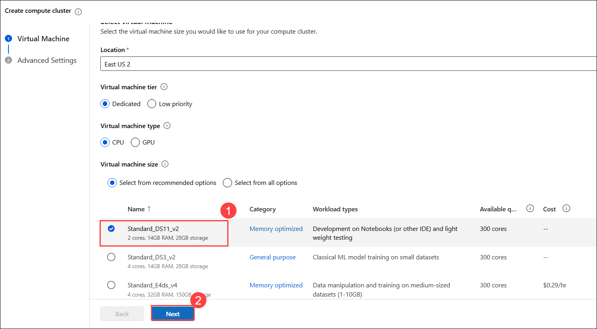  

1. **Advanced Settings**: Give a Compute Name as **Small-Cluster (1)** and leave everything default. Then click **Create (2)**.

    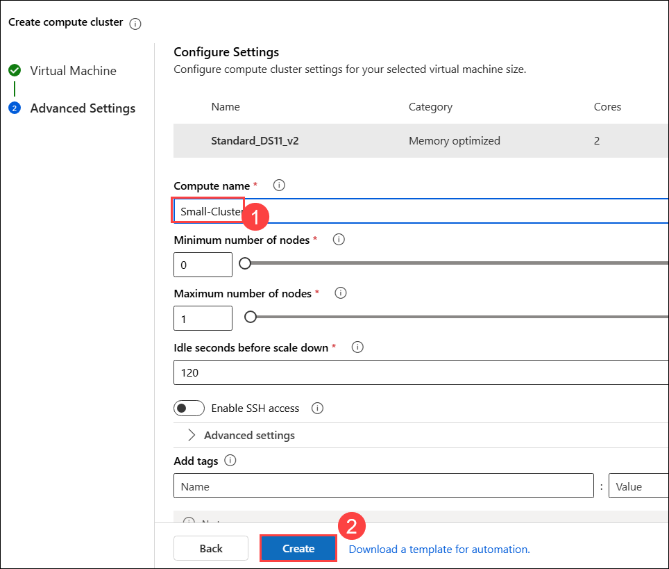 

1. Select the Compute Created **Small-Cluster (1)** and click **Next (2)**.   

    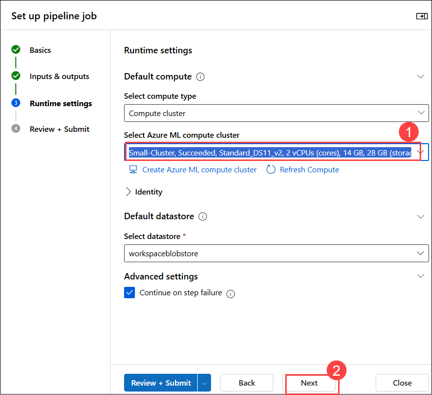 

     >**Note**: The creation of the compute cluster takes approximately 3–5 minutes. You’ll be able to select the cluster only after it’s fully created. Please wait until the process is complete, and keep refreshing the cluster.

1. Once on the **final** page, click **Submit**.     

    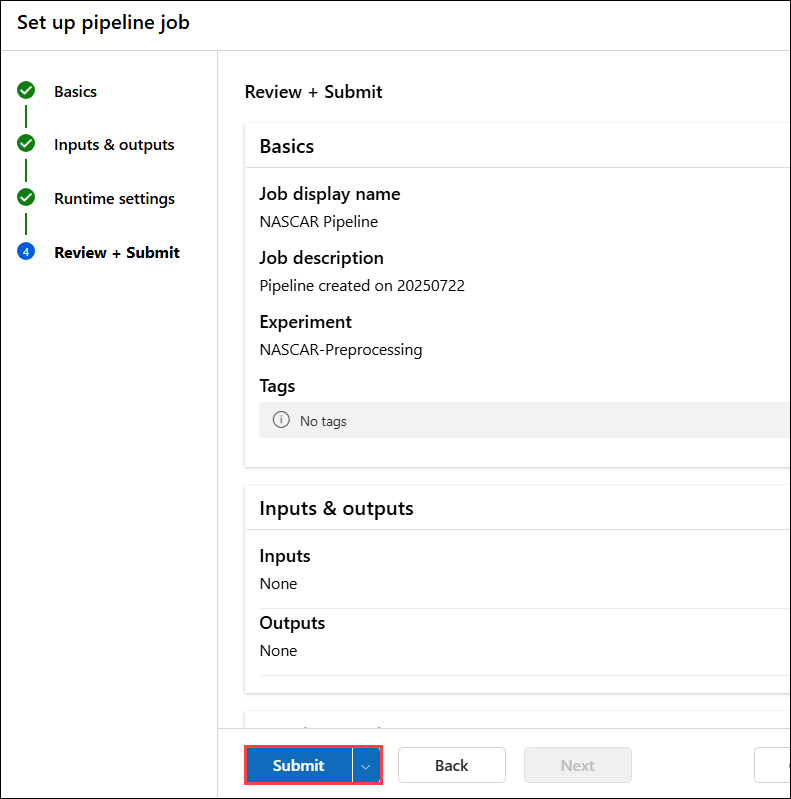 

1. Once submitted, a success notification appears at the top of the page. Click on **'View details'** to monitor the pipeline. It may take some time for the pipeline to complete.

    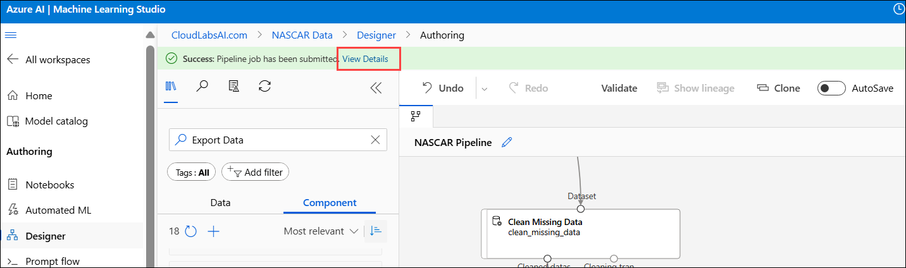      

1. Please wait for the pipeline to complete, which may take approximately `10–15 `minutes. Once it's finished successfully, the status will show as **Completed**.

    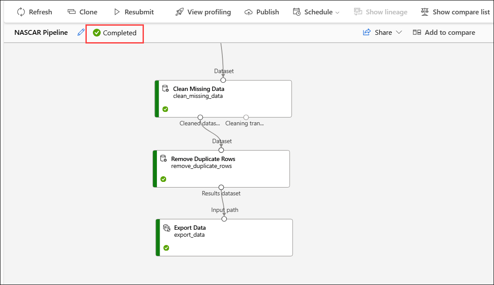     

1. Navigate to **Data (1)** from the left navigation pane, then select the **Datastores (2)** tab. From there select our default **workspaceblobstorage(Default) (3)**.

    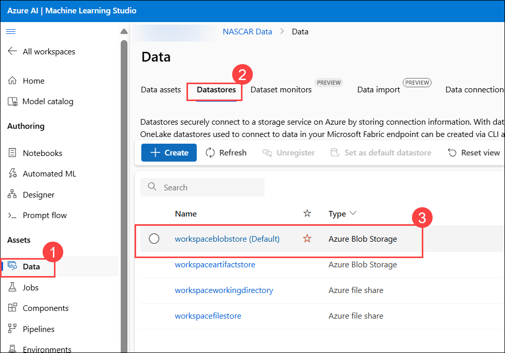 

1. There, you can see our **Processed Data** file, which was the output path we designated earlier during “Export Data.”     

    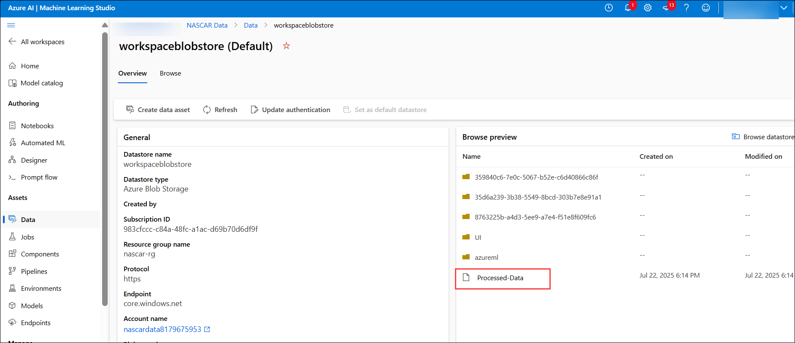

1. Click the **file** to view the cleaned, de-duplicated version of your dataset. The file will appear as raw **CSV**, which is ideal for machine learning models to 
read and learn from.

    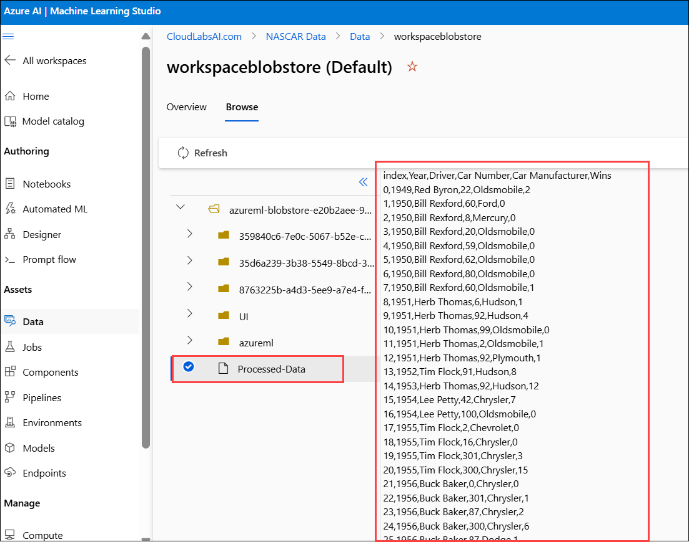

### Task 6: Visualizing the Data

One of the powerful features of Azure Machine Learning Designer is the ability to visualize the data at different stages of your pipeline. This allows you to see exactly how your data changes as it moves through each preprocessing step.

1. Right-click the **NASCAR_Season_History (1)** component (your input dataset). Then select **Preview Data (2)**.

    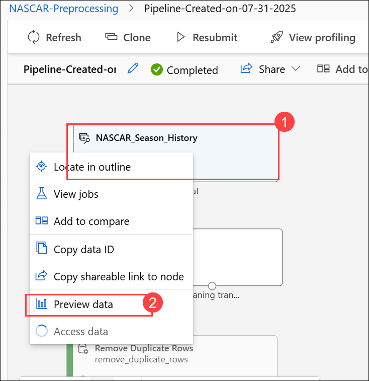

1. In the preview window, switch to the **“Profile”** tab. Azure will automatically generate a summary visualization for each column in the dataset, based on its data type.    

    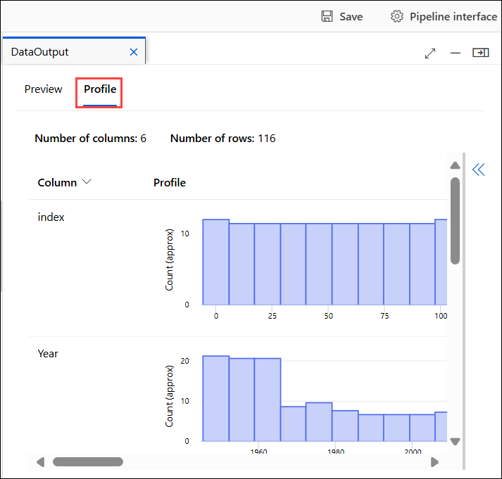

1. Azure offers different chart types depending on the type of data (numerical, categorical, etc.). Some examples include:

   - **Box and Whisker plot**: Shows the distribution of numerical data by displaying the median, quartiles, and outliers. Useful for spotting spread and anomalies in values like Wins or Year.

     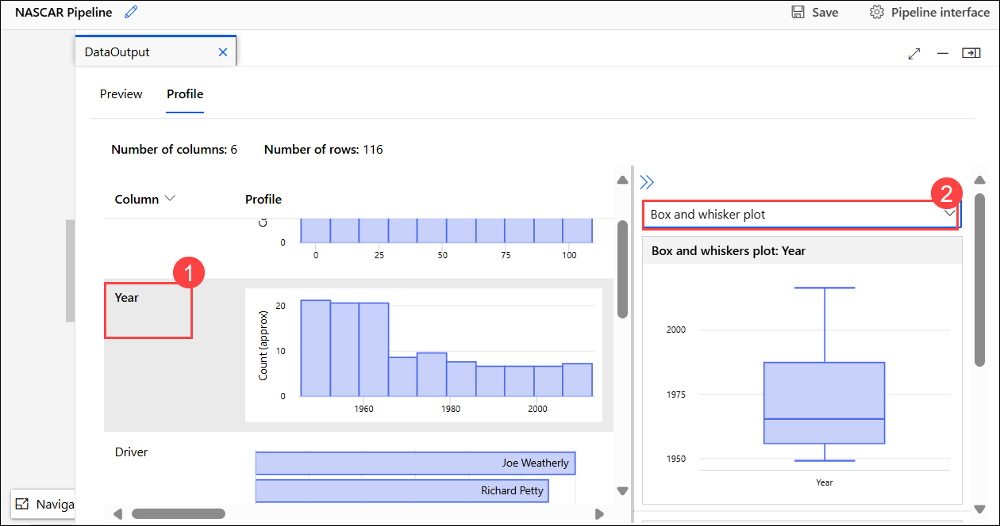

    - **Histogram**: Groups numeric data into bins to show frequency distribution. Great for visualizing how often certain values appear.

      

    - **Value counts**: Displays the total number of occurrences of each unique value. Helpful for categorical columns like Driver or Car
 

## Review

In this lab, you have completed the following tasks:

- Created Your Workspace
- Uploaded the Data
- Cleaned the Data
- Stored the Data
- Running the Pipeline
- Visualized the Data

## You have successfully completed the lab
    

