# Hands-On-Lab: Training, Validation, and Testing Data in Sports Analytics

In this hands-on lab, you will build and evaluate a machine learning pipeline using Azure ML Designer to predict basketball players’ points per game. You'll explore how different train/test split ratios affect model performance by experimenting with 70/30, 90/10, and 60/40 partitions. As you train and evaluate the model, you'll gain an understanding of how training data size influences learning accuracy and the model's ability to generalize. This lab provides practical experience in model training, pipeline execution, and performance evaluation within a sports analytics context.

## Lab Objectives

In this lab, you will be able to complete the following tasks:

- Task 1: Set Up the Azure ML Workspace
- Task 2: Add a dataset to your Azure ML pipeline in the Designer
- Task 3: Add the Dataset to Your Pipeline Canvas
- Task 4: Train the Model
- Task 5: Run the Pipeline and Submit the Job
- Task 6: Model Evaluation Results (Azure ML Designer)

### Task 1: Set Up the Azure ML Workspace

1. Open a new tab in the browser, right-click on the following link [Azure Machine Learning Studio](https://ml.azure.com/), then **Copy link** and paste it in a new browser tab to log in to **Azure Machine Learning Studio**.

1. If prompted, provide the credentials below:

   - **Email/Username:** <inject key="AzureAdUserEmail"></inject>

   - **Password:** <inject key="AzureAdUserPassword"></inject>
   
1. On the **Create a new workspace to get started with Azure ML** fill in the following fields:

    - **Name**: Enter `Sports_Analytics`  **(1)**
    - **Friendly Name**: Leave default
    - **Hub (Optional)**: Leave this as **None** unless instructed otherwise **(2)**
    - **Advanced Settings**:
    - **Subscription**: Select the appropriate Azure subscription from the dropdown **(3)**
    - **Resource Group**: Select **ODL-SREB-U5L06** **(4)**
    - **Region**: Select **East US 2 (5)** for better performance.
    - After filling out all the required fields, click the **Create (6)** button.

      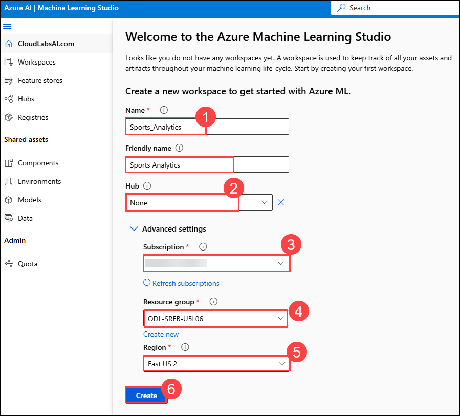 

       >**Note**: If you **did not** see the page like Figure 1, simply click **“Create Workspace”** on your dashboard and fill out the fields as described in Step 2.

1. Wait for the workspace to create, it may take around 2-3 minutes.

1. Now navigate to your newly created workspace. On the **left-hand menu**, click **Workspaces (1)**. Select the workspace you just created `Sports_Analytics` **(2)**.

      

1. This will take you inside the workspace where you can build and run machine learning experiments.

         

1. In the side menu of your workspace, select **Designer (1)**. Click **Create a new pipeline using classic prebuilt components (2)**.     

     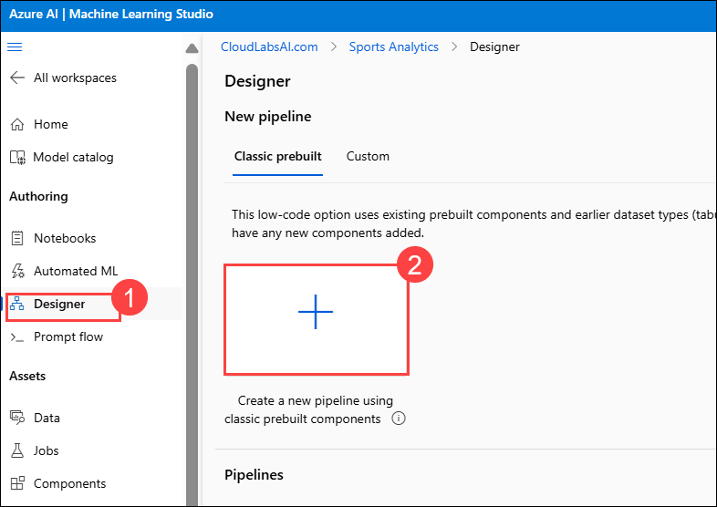

> **Congratulations** on completing the task! Now, it's time to validate it. Here are the steps:
>
> - Hit the Validate button for the corresponding task. If you receive a success message, you can proceed to the next task.
> - If not, carefully read the error message and retry the step, following the instructions in the lab guide.
> - If you need any assistance, please contact us at cloudlabs-support@spektrasystems.com. We are available 24/7 to help.

<validation step="919e7555-d1b6-4705-afa7-0ee3e2ffab3d" />

---   
  
### Task 2: Add a dataset to your Azure ML pipeline in the Designer

1. On the **left panel**, under the **Data (1)** tab, click the **➕ (plus icon) (2)** to upload a dataset.  

   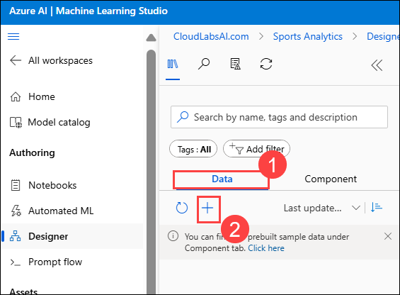

1. On **Create data asset** page enter the following data.

    - Name: Enter **`Train_Test_Validation_dataset` (1)**  
    - Select type: **Tabular (2)**  
    - Click **Next (3)**  

      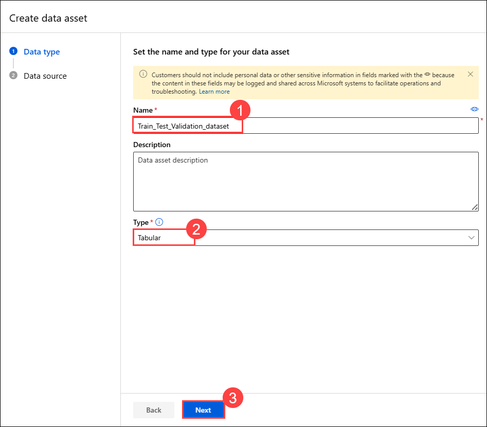     

1. On the **Choose a source for your data asset** page, choose **From local files (1)** the click on **Next (2)**. 

     

1. On the **Select a datastore** page select the following option:  
    
    - Under **Datastore type**, select **Azure Blob Storage (1)**  
    - Choose the datastore named: **`workspaceblobstore` (2)**  
    - Click **Next (3)**  

       

1. On the **Choose a file or folder** page, select **Upload files or folder (1)** from the dropdown, then select **Upload files (2)**.

      

1. **File or Folder Selection**  

    - In the file browser, navigate to  `C:\LabFiles` and then select the file: `SC_Basketball_Enhanced.csv` **(1)** 
    - Wait for the file to appear under “Upload list”  
    - Click **Next (2)**  

      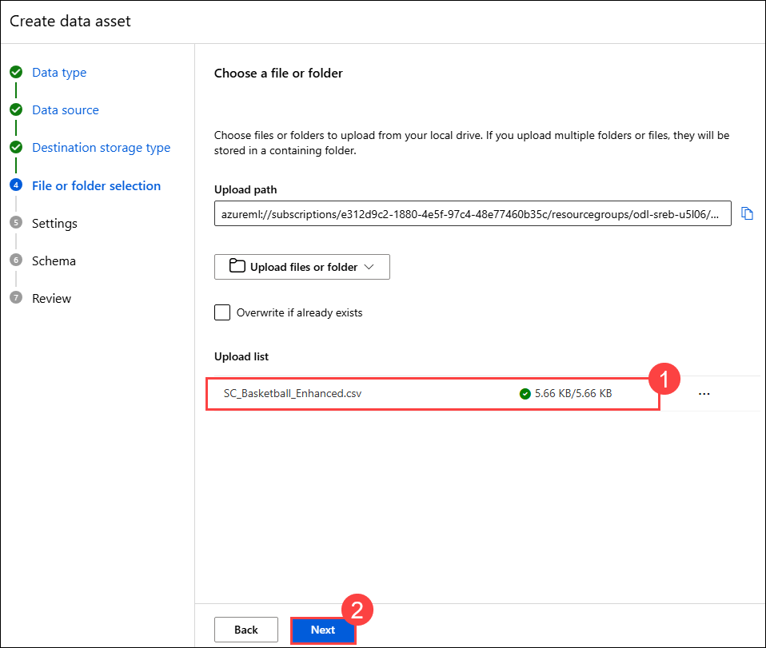 

1. On the **Settings** page, review the fields and ensure they match the expected format then click **Next**  

    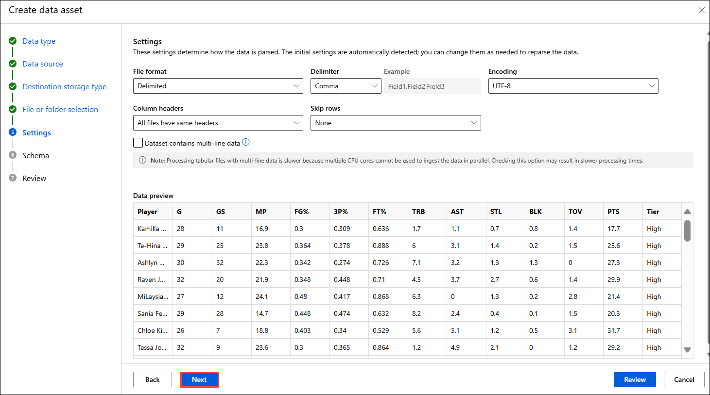 

1. On the **Schema** page, ensure the schema fields are correctly recognized then click **Next**  

    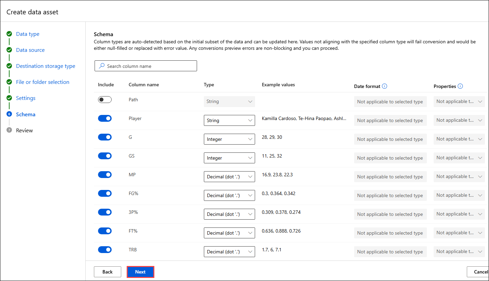 

1. On the **Review** page, click **Create** to finalize the dataset upload

    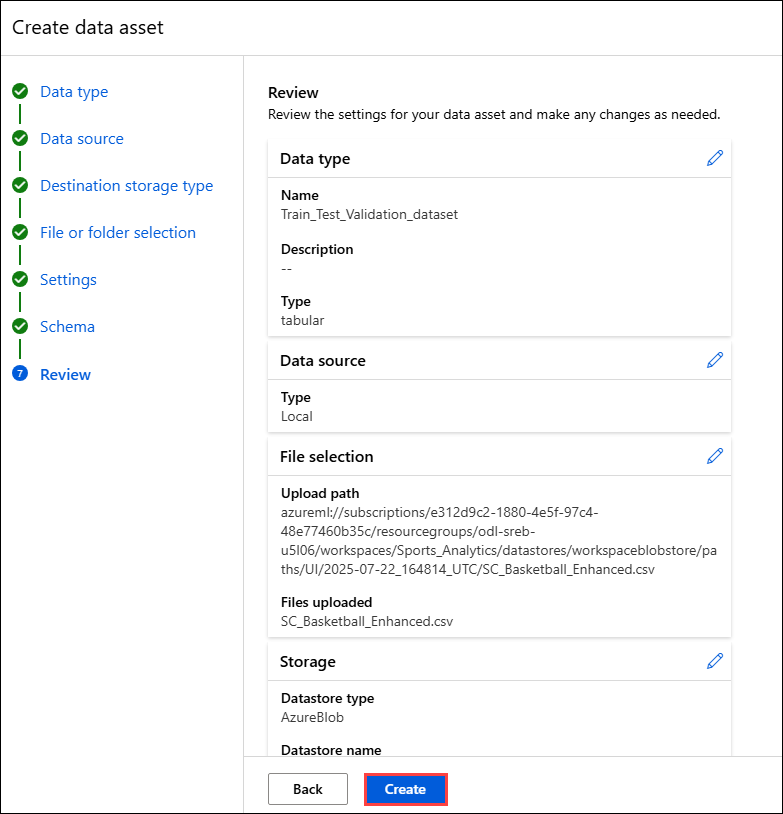

> **Congratulations** on completing the task! Now, it's time to validate it. Here are the steps:
>
> - Hit the Validate button for the corresponding task. If you receive a success message, you can proceed to the next task.
> - If not, carefully read the error message and retry the step, following the instructions in the lab guide.
> - If you need any assistance, please contact us at cloudlabs-support@spektrasystems.com. We are available 24/7 to help.

<validation step="a975c32b-812e-49d7-be44-8b2d62057066" />

---      
 
### Task 3: Add the Dataset to Your Pipeline Canvas

1. From the left panel, drag your **Train_Test_Validation_Dataset** dataset onto the canvas.

   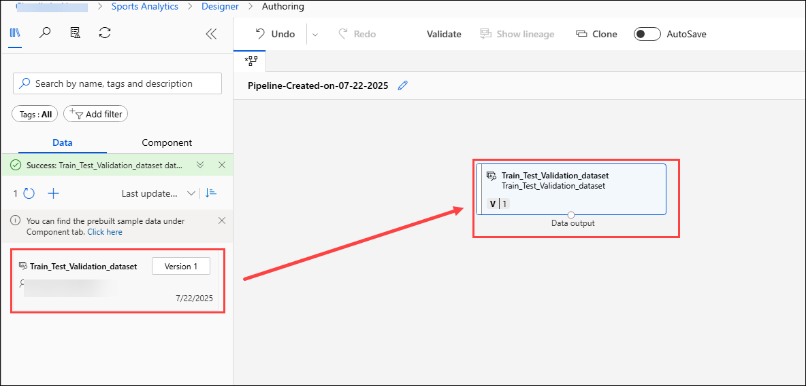 

1. Click the **Save** button at the top of the canvas to avoid losing progress. 

   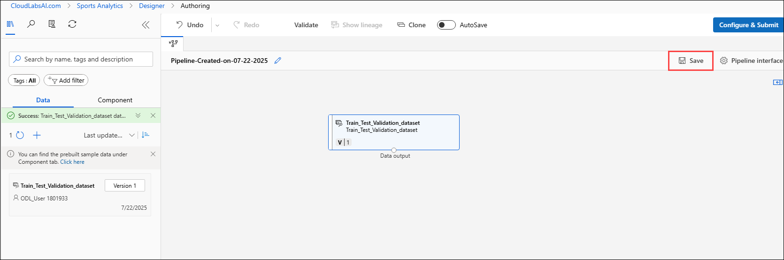

1. Switch to the **Component** tab in the left panel **(1)** and search for **Split Data (2).** Drag that component onto the canvas **(3)**.   

    - Connect your dataset to the **Split Data** module **(4)**
    - Select **Save (5)**

      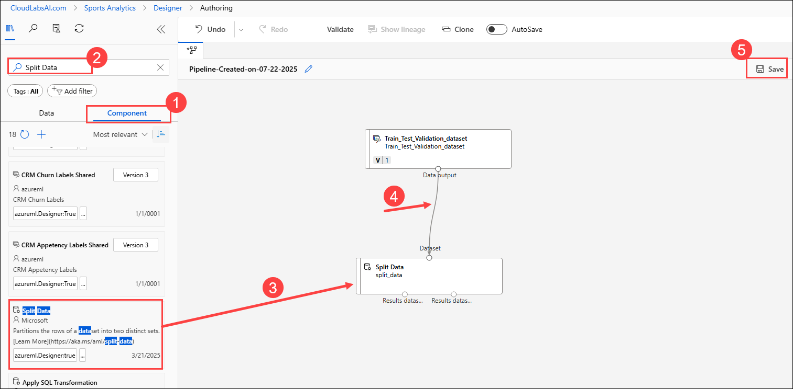  

1. Double-click the **Split Data (1)** component to open its settings. Specify the following and then **Save (7)**:

    - Splitting mode: Make sure **Split Rows** is selected **(2)**
    -  Fraction of rows in the first output dataset: Enter `0.7` **(3)** (*This means **70%** of your data will be used for **training**, and the remaining 30% for testing*)
    - Randomized split is set to **True (4)**
    - Random seed field, type **42 (5)**
    - Confirm Stratified split is set to **False (6)**

      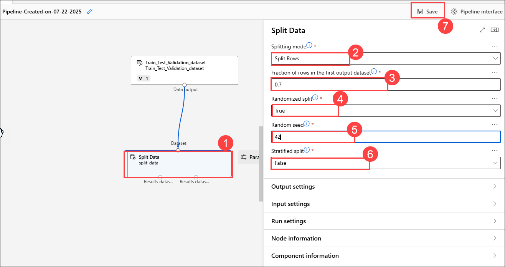     

### Task 4: Train the Model

1. Switch to the **Component** tab in the left panel **(1)** and search for **Linear Regression (2).** Drag that component onto the canvas **(3)**.   

    

1. Switch to the **Component** tab in the left panel **(1)** and search for **Train Model (2).** Drag that component onto the canvas **(3)**.   

    

1. Connect:

    - The **output of Linear Regression** to the **left input of Train Model** (this is the 
untrained model) **(1)**
    - The **left output of Split Data** to the **right input of Train Model** (this is your 70% 
training data) **(2)**  

      

1. Double Click on the **Train Model** module **(1)**, Click **Edit column (2)** under **Label column**.

    

1. Enter **PTS** and hit **Enter** as the target to predict **(1)** and the **Save (2)**.

    

1. Select **Save**.

    

1. Switch to the **Component** tab in the left panel **(1)** and search for **Score Model (2).** Drag that component onto the canvas **(3)**.   

    

1. Connect:

    - The **output of Train Model** to the **left input of Score Model** **(1)**
    - The **right output of Split Data** (test data) to the **right input of Score Model** **(2)**  
    - Select **Save (3)**

       

1. Switch to the **Component** tab in the left panel **(1)** and search for **Evaluate Model (2).** Drag that component onto the canvas **(3)**.   

    - Connect the **output from Score Model** to **left input of Evaluate Model (4)**
    - Select **Save (5)**

      

### Task 5: Run the Pipeline and Submit the Job
      
1. Make sure your pipeline is saved, then click **Configure & Submit** at the top of the screen. 

    

1. You will now walk through a few configuration steps, then click **Next (3)**:
  
   - Experiment name: **Create new (1)**
   - New experiment name: **PTS_Split_70_30(2)**

       

1. Leave Inputs & Outputs as is, there is nothing to configure for this step. Click **Next.**      

         

1. Now we’re on the **Runtime settings** step of the pipeline submission process. This is where you choose the **computer (called a compute cluster)** that Azure will use to run your 
pipeline.

    - Select Compute Type: From the dropdown, select **Compute cluster (1)**.

    - Click on **Create Azure ML compute cluster (2)**

        

1. You are now in the **Virtual Machine** tab for setting up a compute cluster. This step helps Azure decide which kind of machine to use for running your pipeline.

    - **Location**: Confirm that the selected region is the same as your workspace (**East US 2**) **(1)**
    - **Virtual Machine Tier**: Leave as default. (do not select "Dedicated" or "Low priority" unless specified otherwise for cost-saving purposes) **(2)**
    - **Virtual Machine Type**: Keep this as **CPU (3)** 
    - **Virtual Machine Size**: Choose **Standard_DS11_v2 (4)**
    - Click **Next (5)**  

         

1. **Advanced Settings**: Give a Compute Name as **Test (1)** and leave everything default. Then click **Create (2)**.

       

1. Select the Compute Created **Test (1)** and click **Next (2)**.   

     

     >**Note**: The creation of the compute cluster takes approximately 3–5 minutes. You’ll be able to select the cluster only after it’s fully created. Please wait until the process is complete, and keep refreshing the cluster.

1. Once on the **final** page, click **Submit**.     

      

1. Once submitted, a success notification appears at the top of the page. Click on **'View details'** to monitor the pipeline. It may take some time for the pipeline to complete.

           

1. Please wait for the pipeline to complete, which may take approximately `10–15 `minutes. Once it's finished successfully, the status will show as **Completed**.

         

### Task 6: Model Evaluation Results (Azure ML Designer)

1. Right-click on the **Evaluate Model (1)** module. Choose **Preview Data (2) > Evaluation results (3)** to view how well your model predicted PTS.

     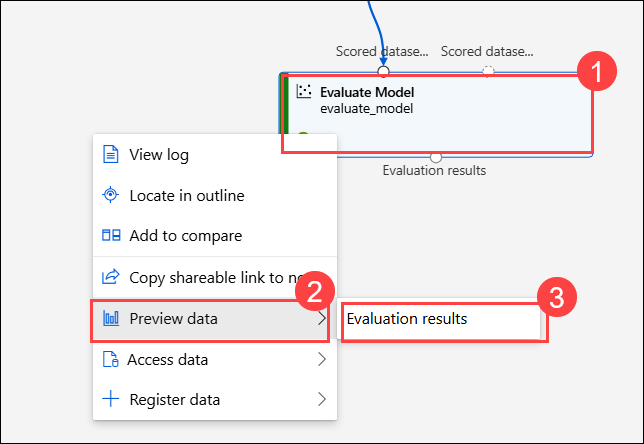

1. Record the **Mean Absolute Error (MAE)** and **Root Mean Squared Error (RMSE)** in your worksheet table. These two metrics will help you compare how accurate your model was across different data splits.  

     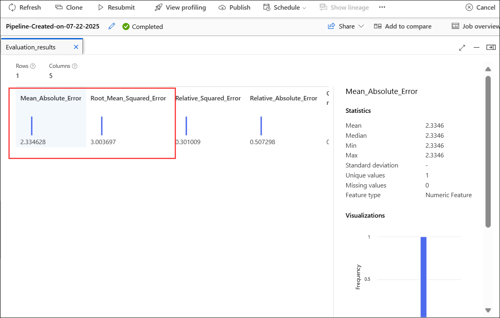

1. Go back to the **Designer** and select your pipeline. Double click on the **Split Data (1)** and Change the Split Data fraction to **0.9 2()** for a 90/10 split. Click on **Save (3)**.

     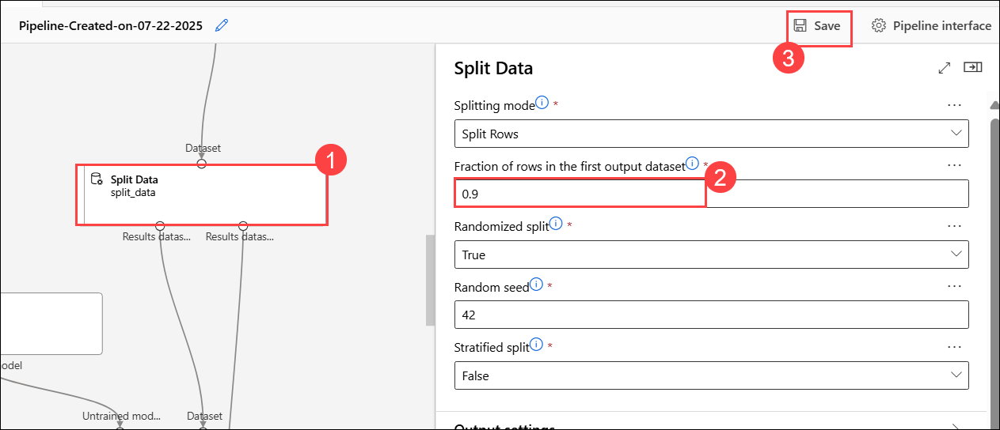

1. Select **Configure & Submit**.

     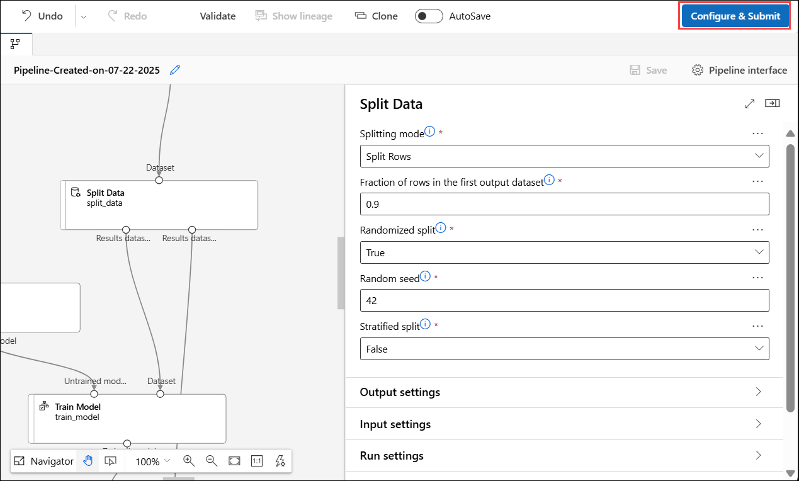

1. Select **Submit**.

     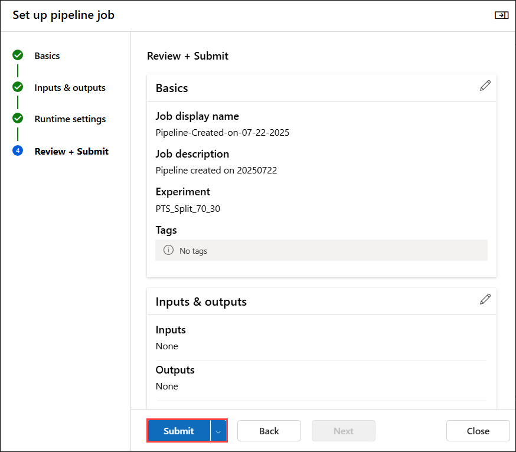

1. Once submitted, a success notification appears at the top of the page. Click on **'View details'** to monitor the pipeline. It may take some time for the pipeline to complete.

           

1. Please wait for the pipeline to complete, which may take approximately `10–15 `minutes. Once it's finished successfully, the status will show as **Completed**.

       

1. Right-click on the **Evaluate Model (1)** module. Choose **Preview Data (2) > Evaluation results (3)** to view how well your model predicted PTS.

      

1. Record the **Mean Absolute Error (MAE)** and **Root Mean Squared Error (RMSE)** in your worksheet table.     

     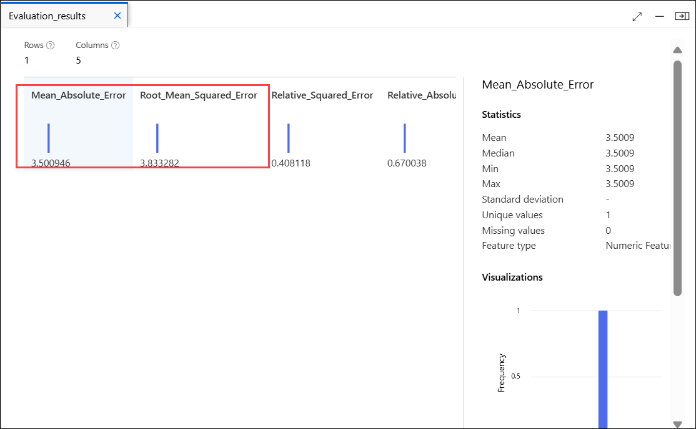

1. Go back to the **Designer** and select your pipeline. Double click on the **Split Data (1)** and Change the Split Data fraction to **0.6 2()** for a 90/10 split. Click on **Save (3)** and select **Configure & Submit (4)**.

     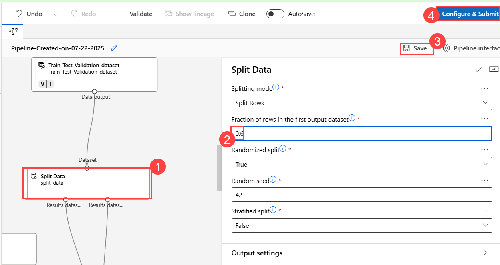

1. Select **Submit**.

     

1. Once submitted, a success notification appears at the top of the page. Click on **'View details'** to monitor the pipeline. It may take some time for the pipeline to complete.

       

1. Please wait for the pipeline to complete, which may take approximately `10–15 `minutes. Once it's finished successfully, the status will show as **Completed**.

       

1. Right-click on the **Evaluate Model (1)** module. Choose **Preview Data (2) > Evaluation results (3)** to view how well your model predicted PTS.

      

1. Record the **Mean Absolute Error (MAE)** and **Root Mean Squared Error (RMSE)** in your worksheet table.     

     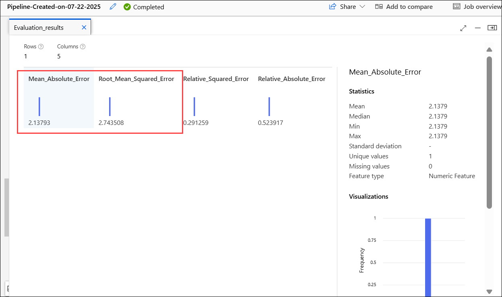    

1. After each run, evaluate the model and record your results for comparison. Use the recorded values to decide which split gives the best balance between learning and fair testing.

## Review

In this lab, you have completed the following tasks:

- Set Up the Azure ML Workspace
- Added a dataset to your Azure ML pipeline in the Designer
- Added the Dataset to Your Pipeline Canvas
- Trained the Model
- Run the Pipeline and Submitted the Job
- Task 6: Model Evaluation Results (Azure ML Designer)

## You have successfully completed the lab
