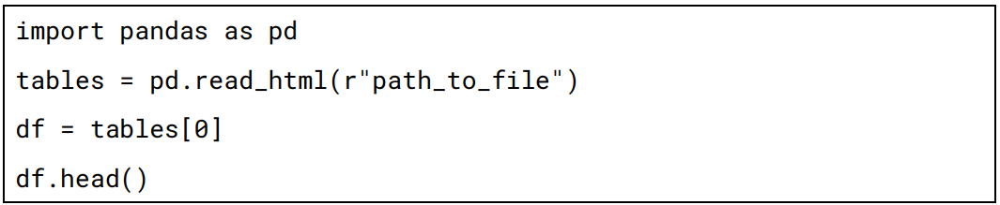
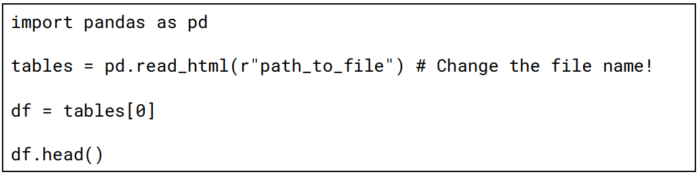
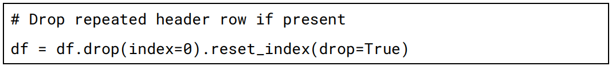
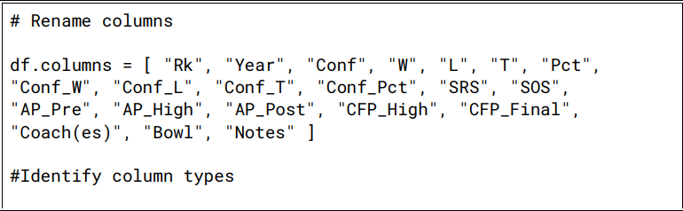
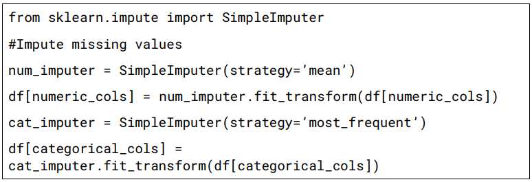
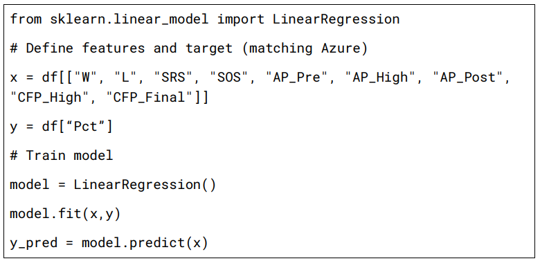

# Lesson 8: Exploring AI libraries and Tools 

## Lesson Description:
In this lesson, students will explore software libraries and platforms used in artificial intelligence and machine learning, focusing on tools available in Python and Azure ML 
Studio. 

Using the Clemson Tigers Football School History dataset, students will develop a simple 
regression model to predict team performance metrics. They will implement this model 
using both code-based and no-code environments — specifically, Jupyter Notebooks 
(Python with scikit-learn) and Azure ML Studio Designer. 

This hands-on comparison helps students understand how the same machine learning 
task can be performed in different environments and supports critical thinking about tool 
selection based on project needs and data context.

### Main Learning Goal:
Students will explore and utilize AI and machine learning libraries in Python and Azure ML 
Studio and reflect on the strengths of each platform in performing data-driven tasks on 
real-world sports data.

### Essential Question:
Which libraries and platforms are used to develop machine learning models, and how do 
we determine the right one for our project?

### Standards:
- CS1.2 – Identify applications, libraries, and software packages utilized within AI and machine learning industries.

### Objectives:
- Identify key Python-based libraries (e.g., scikit-learn) and cloud-based tools (e.g., Azure ML Studio Designer).
- Implement and evaluate a machine learning regression model in both code-based and no-code environments.
- Use the Clemson Tigers School History dataset to explore model training, evaluation, and prediction.
- Reflect on how different platforms (e.g., Jupyter vs. Azure) approach the same task and determine which is best suited for their goals.

**Introduction to the Dataset** 

Today, you're going to explore historical football statistics for the Clemson Tigers and use that data to predict how successful a season might be — all with the help of machine 
learning!

Let’s start by looking at the dataset. It includes season-level football stats for Clemson University across many years. Here's what some of the columns represent:

  - W and L – Wins and Losses in a season
    
  - SRS – Simple Rating System (how strong the team was)
    
  - SOS – Strength of Schedule (how tough the season was)
    
  - AP_Pre, CFP_High, AP_Post – National rankings at different times of the season
    
  - Pct – Win Percentage (this is what we’ll try to predict!)

**Before we continue, discuss the following questions with your class:**

   - What do you notice about how different seasons performed?
    
   - What types of stats might influence a team’s winning percentage?
    
   - Which stats would a coach or scout care most about?

Now, download the dataset and open up a Jupyter notebook. Type the following code into the first code block

**What’s happening here?**
  - pd.read_html() reads the data from an HTML table (even though the file ends in .xls, it’s not a real Excel file!)
  - tables[0] picks the first table from the file
  - df.head() shows the top five rows

In this lesson, you’ll experience how different AI tools work. You’ll get hands-on practice building a model in both Python and Azure and see how the same task can be done with and without code. You’ll also learn how to compare these tools and decide which one might be best for your future projects.

### Build and Evaluate a Machine Learning Model in Jupyter Notebook

In this part of the lesson, a regression model is implemented using Python code in Jupyter Notebook. The Clemson Tigers School History dataset is used to predict a team’s win percentage (Pct) based on multiple numerical performance indicators. The process involves loading the dataset, cleaning and preparing the data, selecting appropriate input features, training a linear regression model, and evaluating its accuracy using key performance metrics such as R², MAE, RMSE, Relative Absolute Error (RAE), and Relative Squared Error (RSE).

**Step 1: Load and Explore the Dataset Using Jupyter Notebook** 

Earlier, we saw that the original .xls file was HTML-formatted, so we used pd.read_html() to read it. Now, we’ll use the cleaned .csv version for modeling. If you haven’t already, type the following code into the first code block and run it:

**Step 2: Clean and Prepare the Data**
The raw dataset may contain repeated headers or unnecessary rows. We drop any such rows (like extra rank rows) and rename the columns to make them usable.

In the second code cell, type in the following and run it afterwards:

**What it does:** 
  
  • Drops the top row, which repeats column headers. 
  
  • Resets the index so rows start at 0.

**Step 3: Rename Columns**

Now we’ll need to rename the columns and make sure that any numeric columns are represented that way in pandas. To do so, type the following code in cell 3. Make sure to run it afterwards!

 

**What it does:** 
   
   • Renames the default column headers to descriptive names that match the data in each column. 
   
   • Creates a list of column names that contain numerical data used for modeling and analysis. 
   
   • Creates a list of column names that contain categorical or text data for identification and imputation. 
   
   • Converts all values in the numeric columns to number format and replaces any non-numeric entries with NaN (not a number).

**Step 4: Handle Missing Data**

Now, we’ll write some code to fill in any blanks based on the data we have already. To do so, type and then run the following code in cell block 4 of your notebook.

**What it does:** 
   
   • Fills missing numeric values using the mean. 
   
   • Fills missing categorical values using the most frequent entry. 
   
   • Ensures the dataset is complete and model-ready.

**Step 5: Define Features and Target for Modeling**

Before we dive into the code for this step, let’s review linear regression. Linear Regression is a machine learning algorithm that models the relationship between input variables (features) and continuous output. It learns a straight-line equation:

  **𝑦 = 𝑚1𝑥1  + 𝑚2𝑥2  + … + 𝑏**

In this case, it tries to estimate how W, L, SRS, etc. contribute to Pct. We’re going to use it in our case because:
  
  • The dataset is numeric 
  
  • We’re predicting a continuous value 
  
  • It’s interpretable and easy to understand

Now, type the following code in cell block 5:

**What it does:** 
   
  • x includes selected features we believe impact win percentage.

  • y is the target column Pct or win percentage.

  • Trains a Linear Regression model using scikit-learn. 

  • model.fit() learns the best-fit line based on training data. 
    
  • model.predict() generates predictions.

**Step 6: Evaluate Model Performance**

**What it calculates:** 

  • R² - How well the model explains the variation in data (closer to 1 is better) 

  • MAE - Average error between actual and predicted values 
  
  • RMSE - Root of squared error — punishes large errors more heavily 
  
  • RAE - Ratio of total absolute error to the baseline error 
  
  • RSE - Ratio of total squared error to baseline squared error
