# Hands-On-Lab: Exploring AI libraries and Tools

### Task 1: Create Azure ML Workspace

In this task you will set up an Azure Machine Learning workspace where all your machine learning assets and experiments will be organized and run. You will learn how to create a workspace in the Azure ML Studio, select the appropriate region and resource group, and navigate to the Designer interface to start building your pipeline.

1. **Log in** to [Azure Machine Learning Studio](https://ml.azure.com/) if prompted provide below credentials.

    - **Email/Username:** <inject key="AzureAdUserEmail"></inject>

    - **Password:** <inject key="AzureAdUserPassword"></inject>
   
1. On the **Create a new workspace to get started with Azure ML** fill in the following fields:

   - **Name**: `ClemsonWinPredictor`  
   - **Friendly Name**: *(Optional)*  
      Azure will auto-fill this based on the name.
   - **Hub (Optional)**: Leave this as “None” unless instructed otherwise.
   - **Advanced Settings**:
   - **Subscription**: Select the appropriate Azure subscription from the dropdown. 
   - **Resource Group**: **ODL-SREB-<inject key="DeploymentID" enableCopy="false"/>** 
   - **Region**: Select **East US 2** for better performance.
   - After filling out all the required fields, click the **“Create”** button.

         

    >**Note**: If you **did not** see the page like Figure 1, simply click **“Create Workspace”** on your dashboard and fill out the fields as described in Step 2.

1. Now navigate to your newly created workspace. On the **left-hand menu**, click **Workspaces**. Locate the workspace you just created **`ClemsonWinPredictor`**.

      
   
1. Click on its name to open it. This will take you inside the workspace where you can build and run machine learning experiments.

    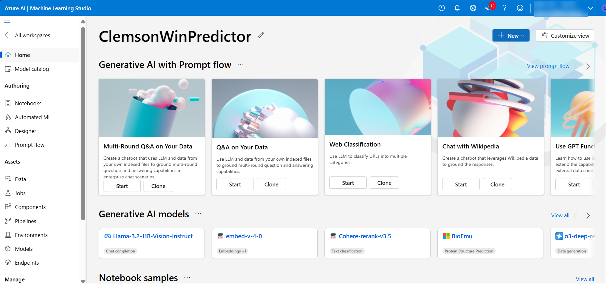 

> **Congratulations** on completing the task! Now, it's time to validate it. Here are the steps:
> - Hit the Validate button for the corresponding task. If you receive a success message, you can proceed to the next task. 
> - If not, carefully read the error message and retry the step, following the instructions in the lab guide.
> - If you need any assistance, please contact us at cloudlabs-support@spektrasystems.com. We are available 24/7 to help.

<validation step="edbc0978-37e1-4c4f-86b3-c450ca55b053" />

### Task 2: Upload the Dataset

In this task you will upload the manufacturing sensor data to your Azure ML workspace. You will create a tabular dataset from a local CSV file, configure the data source, and add it to your pipeline canvas for further processing.

1. Once you are inside your workspace PCA Anomaly Model, look at the left hand side menu to find the **Designer** tab under the **Authoring** section. Click on 
this tab.

     

   >**Note**:  This will open the Azure Machine Learning Designer interface where you can  begin creating your machine learning pipeline by dragging and dropping 
components.

1. Once the **Designer** page is loaded, make sure that you’re on the **Classic prebuilt** tab under the **New pipeline** section. From here, click on the box with a **➕ (plus icon)** that says, **Create a new pipeline using classic prebuilt components**.

     

1. On the **left panel**, under the **Data (1)** tab, click the **➕ (plus icon) (2)** to upload a dataset.  

     

1. On **Create a new workspace to get started with Azure ML** page enter the following data then click on **Next (2)**.

   - Name the dataset: **`Clemson_Dataset`** **(1)** 
  
    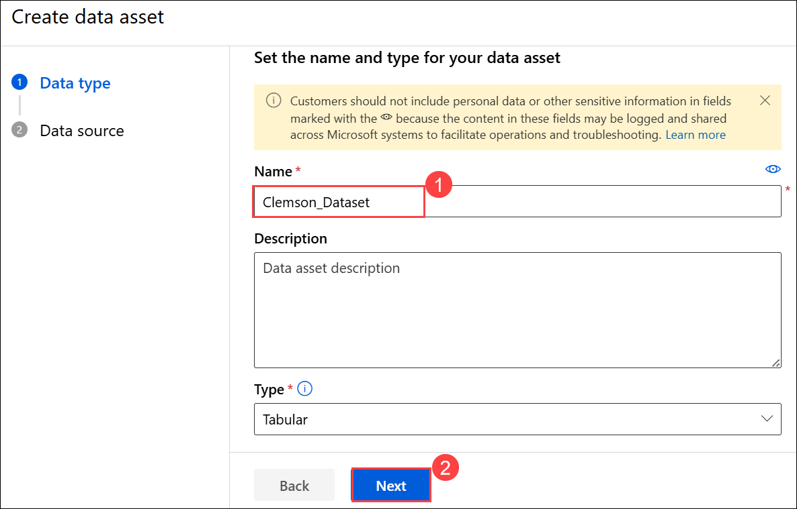 

1. On the **Choose a source for your data asset** page, choose **From local files (1)** the click on **Next (2)**. 

     

1. On the **Select a datastore** page select the following option:  
   - Under **Datastore type**, select **Azure Blob Storage (1)**
   - Choose the datastore named: **`workspaceblobstore` (2)**
   - Click **Next (3)**  

   

1. On the **Choose a file or folder** page, select **Upload files or folder (1)** from the dropdown, then select **Upload files (2)**.

     

1. **File or Folder Selection**  
   - In the file browser, select the file: `SREB_U5_L8_CleanedDataset`  
   - Wait for the file to appear under Upload list  
   - Click **Next**  

    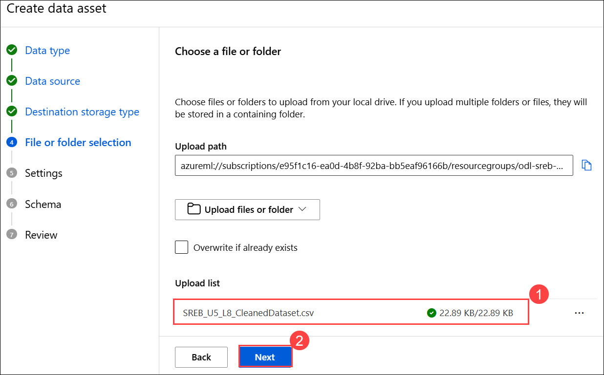 

1. In **Settings** page, Click on **Next** Button **Twice** and then click on **Create** Button

   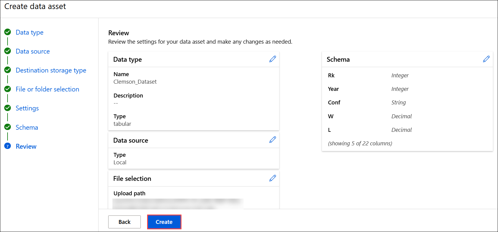 

> **Congratulations** on completing the task! Now, it's time to validate it. Here are the steps:
> - Hit the Validate button for the corresponding task. If you receive a success message, you can proceed to the next task. 
> - If not, carefully read the error message and retry the step, following the instructions in the lab guide.
> - If you need any assistance, please contact us at cloudlabs-support@spektrasystems.com. We are available 24/7 to help.

<validation step="ec9fb2a9-f6d8-4715-af1c-733319e81e12" />

## Task 3: Preprocessing Our Data

In this task you will prepare your dataset for modeling by **Clemson_Dataset** values. You will add and configure the **Clemson_Dataset** component to handle incomplete or missing sensor readings, ensuring the dataset is reliable for training your anomaly detection model.

1. Under the **Data** tab, locate the uploaded dataset named **Clemson_Dataset**.

   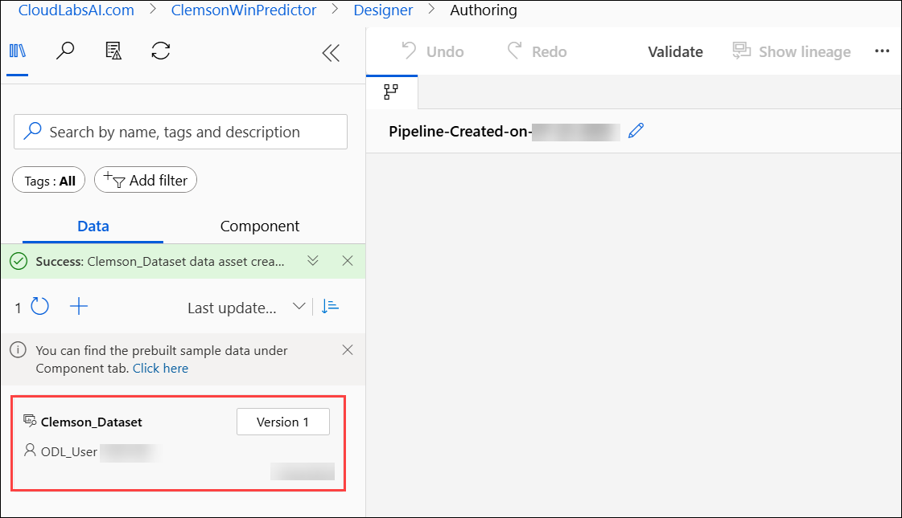

1. Drag **Clemson_Dataset** onto the canvas

    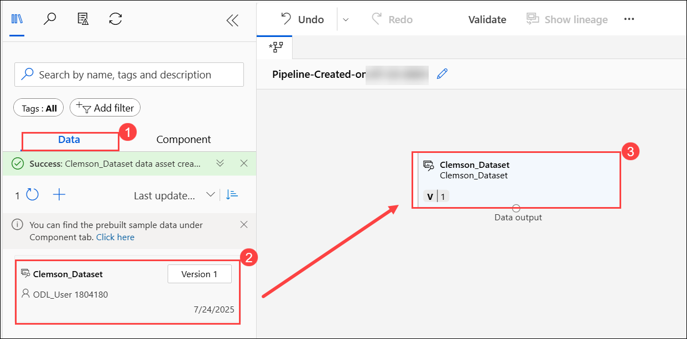

### Task 4: Add Select Columns in Dataset Component

In this task, you will add Select Columns in Dataset Component that filter your dataset to include only the columns (features) relevant to your machine learning model. This helps improve model performance and reduces unnecessary complexity.

1. Switch to the **Component** tab and search for **Select Columns in Dataset**. Then drag the component into your canvas, placing it below the **Clemson_Dataset**.

    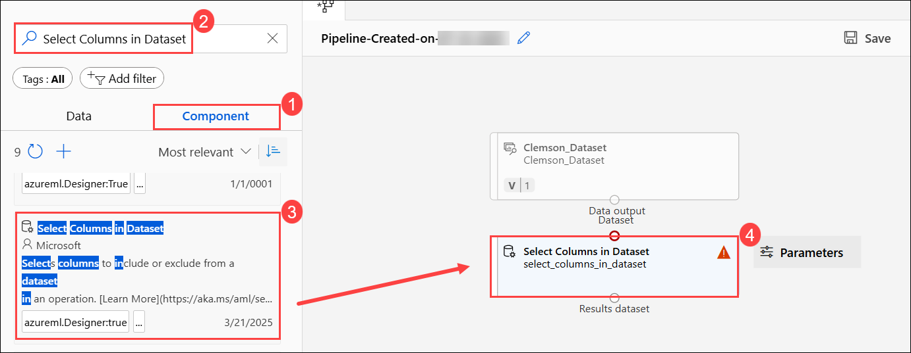

1. Connect the output circle of the dataset module to the input of this module

    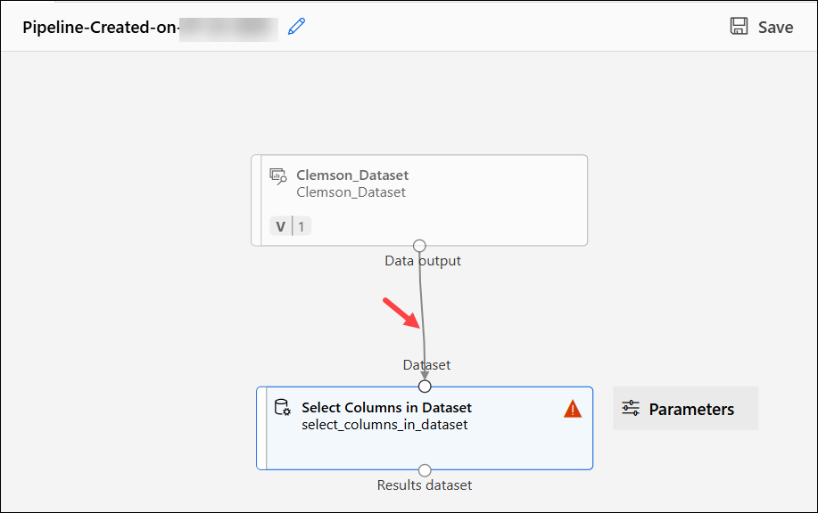

1. Double click on the **Select Columns in Dataset** module. In the right panel, click **Edit column** selection.

     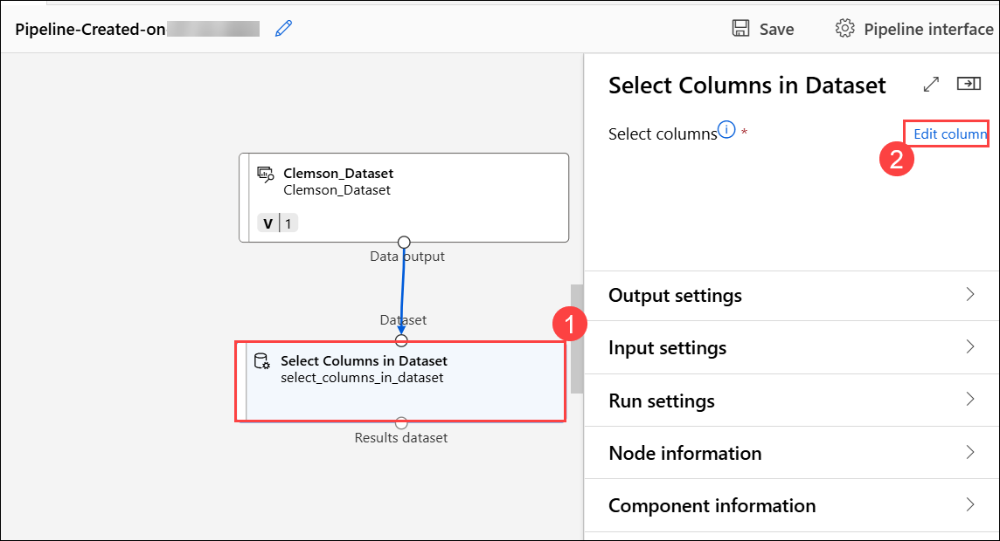

### Task 4: Choose Features and Target Column and Add Split Data Module

In this task, you will split your cleaned dataset into training and testing sets, choose a Linear Regression model, and train it using historical data to predict team performance.

1. Choose the following input features then click **Save**
    **a. Rk, Year, W, L, T, Conf_W, Conf_L, Conf_T, Conf_Pct, SRS, SOS, AP_Pre, 
    AP_High, AP_Post, CFP_High, CFP_Final**

    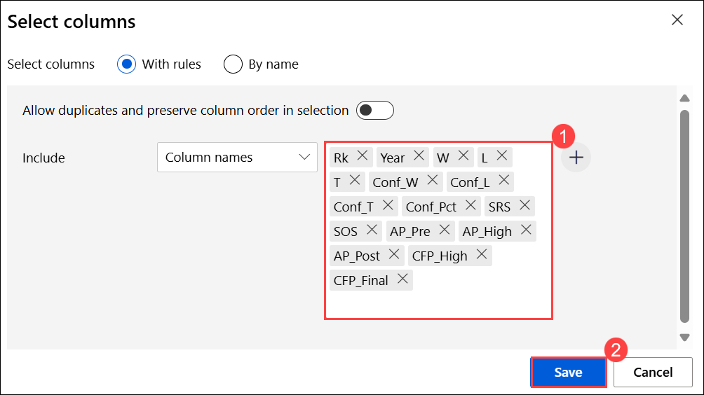
     
1. Click on **Save**.

    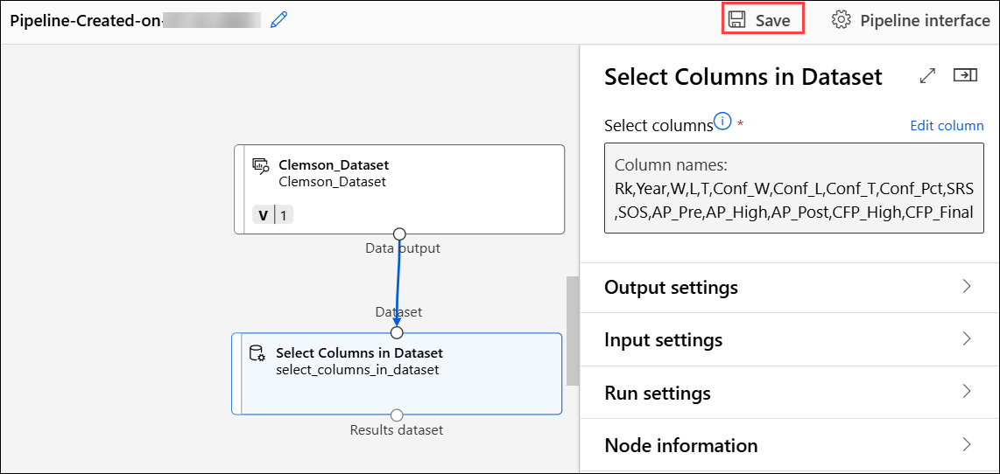

1. Switch to the **Component** tab and search for **Split Data**. Then drag the component into your canvas.

    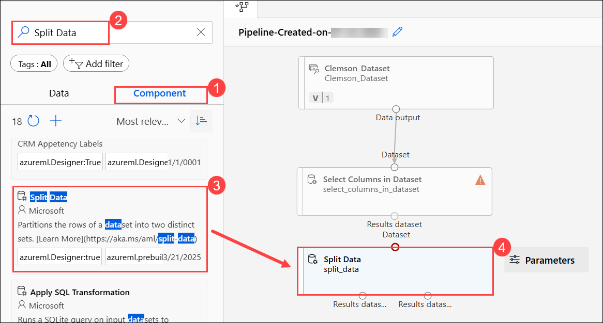

1. Connect it to the output of **Select Columns in Dataset** to **Split Data**.

     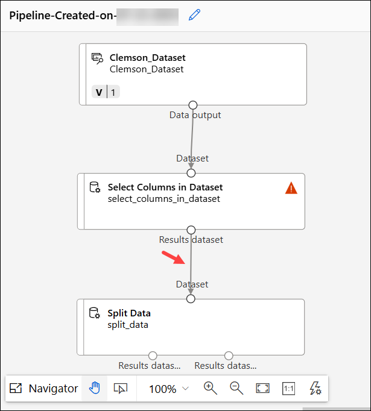

1. Double click on the **Split Data module** and configure the following then click on **Save**.

   a. Fraction of rows in the first output dataset: 0.8 (80% training)

   b. Leave Stratified split as default. 

      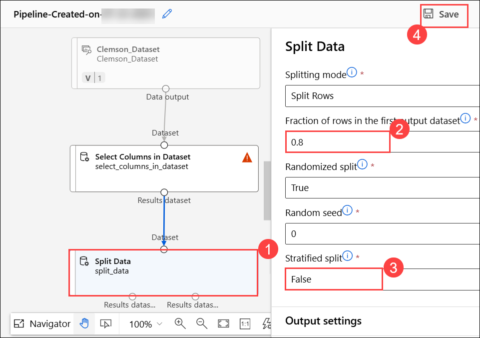

### Task 4: Add and Configure Linear Regression and Train Model Module

In this task, you will test your trained model on unseen data, evaluate its performance using scoring metrics, and run the full machine learning pipeline using Azure ML’s compute resources.

1. Switch to the **Component** tab and search for **Linear Regression**. Then drag the component into your canvas.
   
1. Drag the **Linear Regression** module onto the canvas as shown in the below image.

    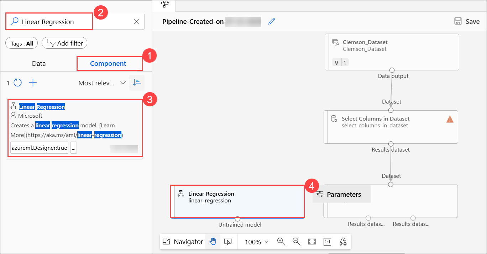

1. Search for **Train Model**. Then drag the component into your canvas. Drag the **Train Model** module onto the canvas as shown in the below image.

    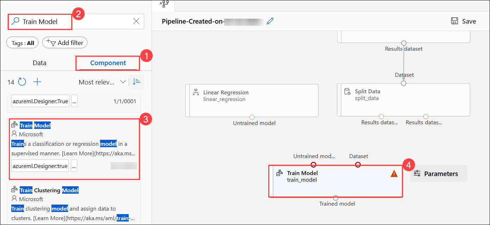

1. Connect:

   - Left input → output of Linear Regression
   - Right input → first output of Split Data

      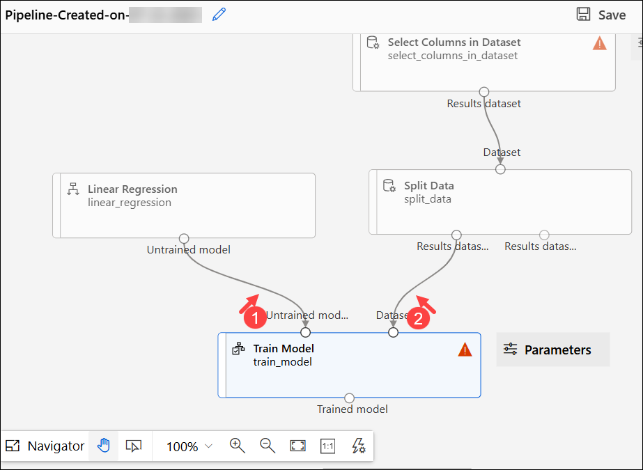

1. Double click on the **Train Model** module. In the right panel, click **Edit column** selection.

1. Set the Label column: Enter **Pct** then click **Save**.

    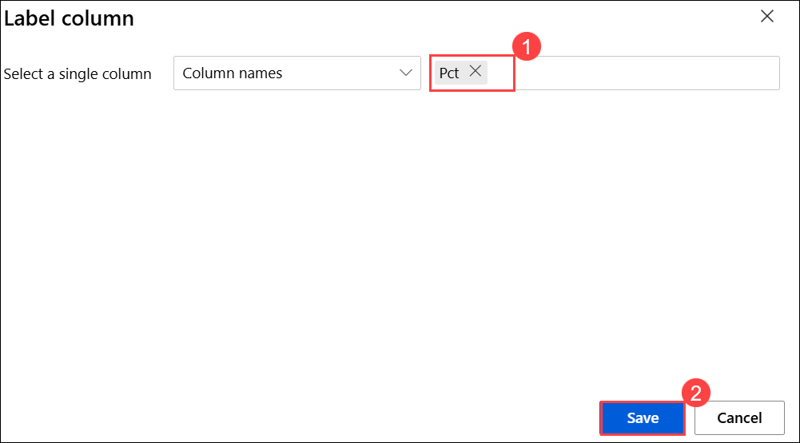

1. This step trains the regression model using the training portion of the data

### Task 4: Add and Configure Score Model and Evaluate Model

1. Search for **Score Model**. Then drag the component into your canvas. Drag the **Score Model** module onto the canvas as shown in the below image.

   **Connect:**

   a. Left input → output of Train Model

   b. Right input → second output of Split Data (test data)

      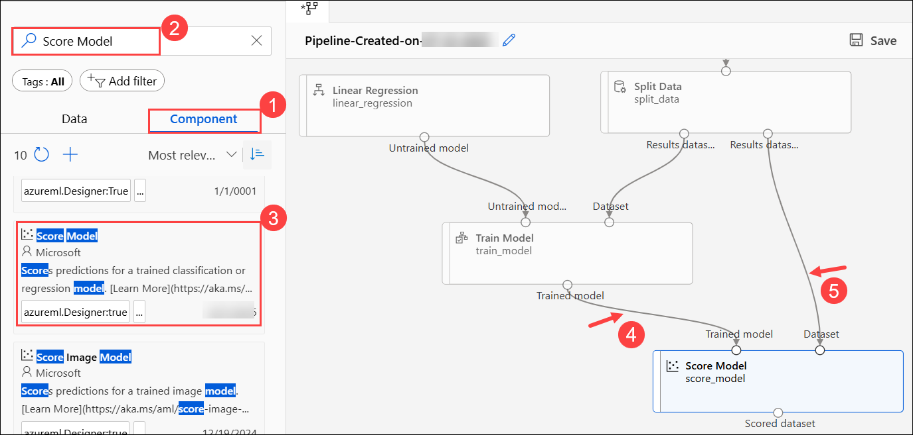

1. This module applies the trained model to the test dataset and generates 
predictions

1. Search for **Evaluate Model**. Then drag the component into your canvas. Drag the **Evaluate Model** module onto the canvas as shown in the below image.

   **Connect:**
    
    - Connect the output of Score Model to the left input of Evaluate Model. Leave the second (right) input empty, since only one model is being evaluated

      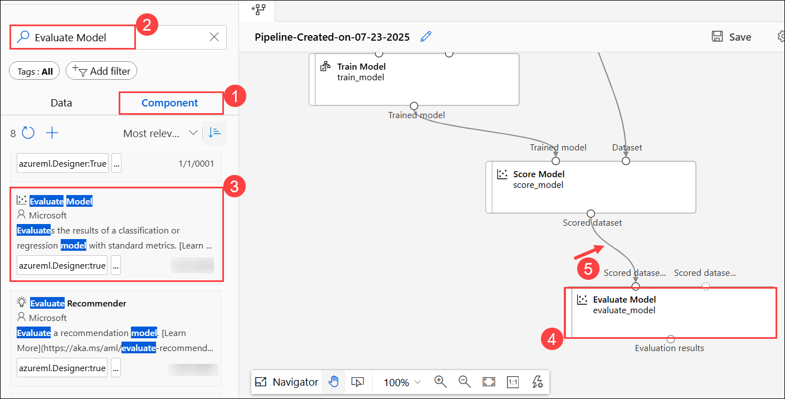

1. This module calculates performance metrics for the regression model.

1. Double click on the **Train Model** module. In the right panel expand **Run Settings**, under **Target**, select **Use other compute target**. Then, from the **Select Azure ML compute cluster** dropdown, choose **Compute-cluster-<inject key="DeploymentID" enableCopy="false"/>**.

    
   
1. Click **Save (1)** at the top right. Then select the **Configure & Submit (2)** button in the top-right corner.

     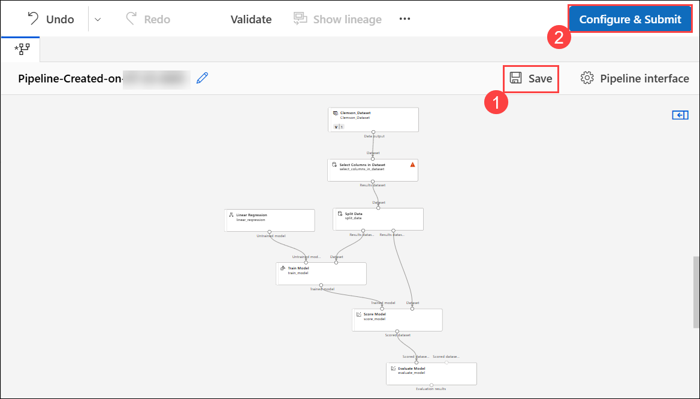 

1. Now that your pipeline is fully built with all the components connected—from data ingestion to anomaly scoring—you’re ready to run it.

### Task 5: Configure Pipeline Job Basics and Run the Pipeline

In this task you will configure the details needed to run your pipeline, including setting up a new experiment and creating a compute cluster. You will submit the pipeline job to Azure ML to execute your workflow.

1. On the **Basics** page, perform the steps as mentioned below:

   - In the Experiment name select **Create new (1)**
   - In **New experiment name** filed provide **`Test_ClemsonWinPredictor` (2)**
   - Click the blue **Next (3)** button at the bottom-right corner of the screen

      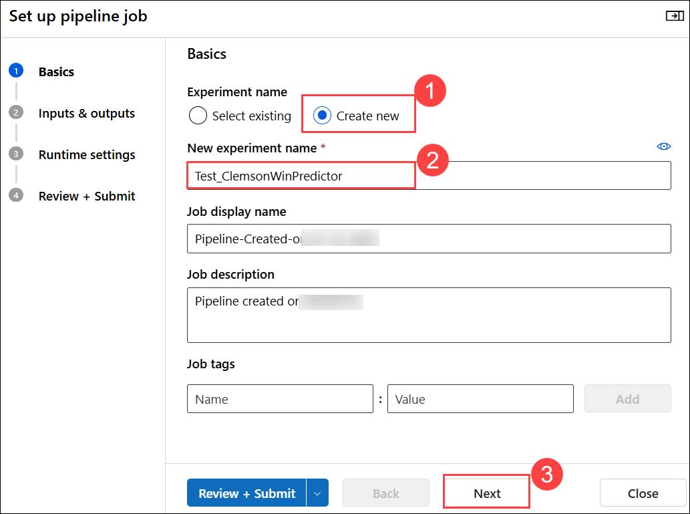 

1. On the **Inputs & outputs** page, click on **Next** to skip.

1. On the Runtime Settings page, from the dropdown of the **Select Compute Type** section, click on Compute Cluster. Since no cluster is currently available, we’ll need to create one. Click on **Create Azure ML Compute Cluster**.

1. On the **Select virtual machine** page, specify the following then click on **Next** :
  
    - Location: Confirm that the selected region is the same as your workspace.
    
    - Virtual Machine Tier: Leave as default. 
    
    - Virtual Machine Type: Keep this as **CPU** (sufficient for our anomaly detection task).

    - Virtual Machine Size: Choose **Standard_DS11_v2**.
  
        

1. On the **Configure Settings** page, provide Compute name **Compute-cluster-<inject key="DeploymentID" enableCopy="false"/>** then click on **Create**

    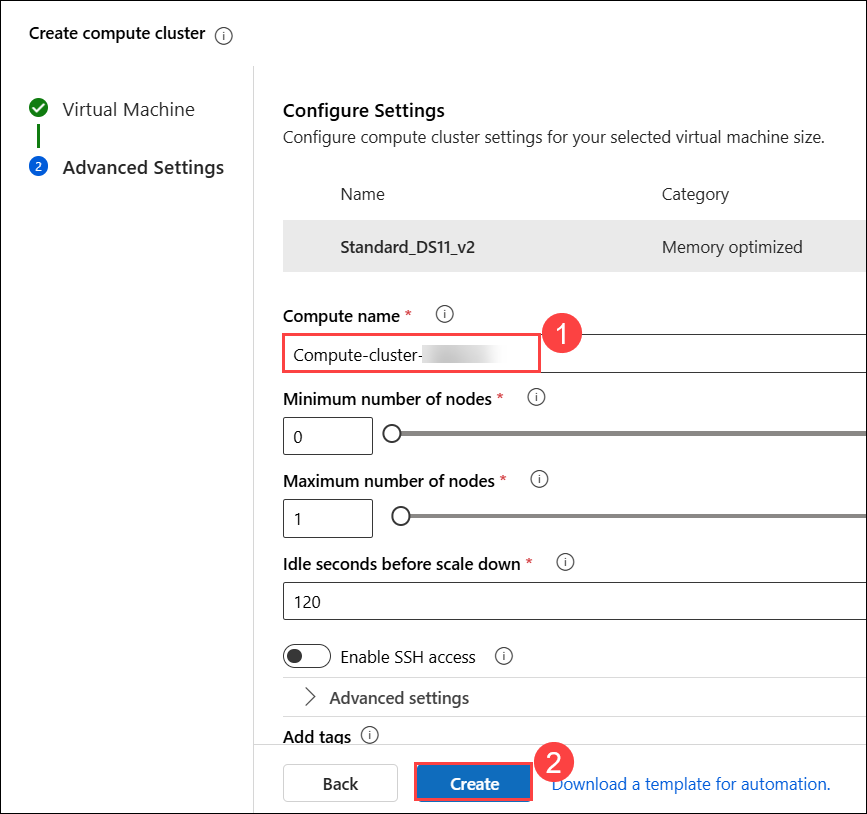

1. Back on the **Runtime Settings** page, select the newly created **Azure ML compute cluster** from the dropdown in the **Select Azure ML compute cluster** field, then click on **Review + Submit**.

     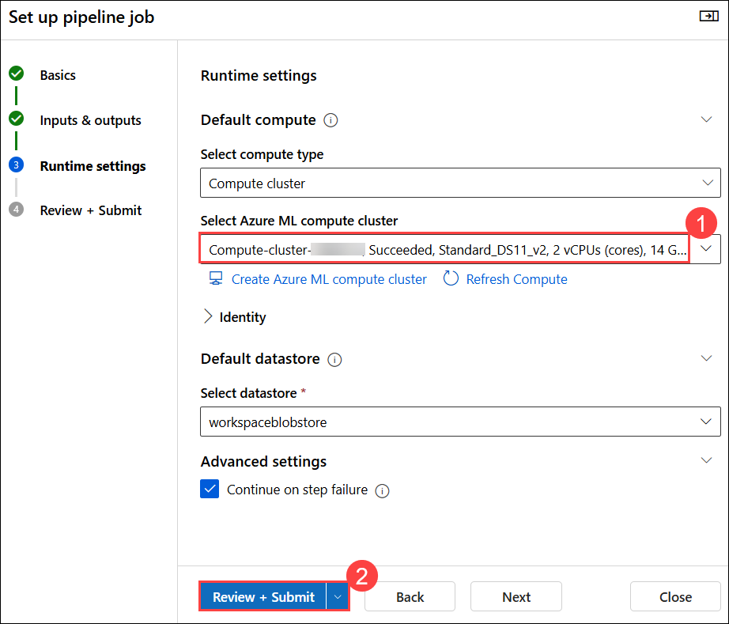

1. On **Review + Submit** page, click on **Submit**. 

     

1. Once submitted, a success notification appears at the top of the page. Click on **View details** to monitor the pipeline. It may take some time for the pipeline to complete.

      

1. Once the **Pipeline** is run, you can see the similar result.

     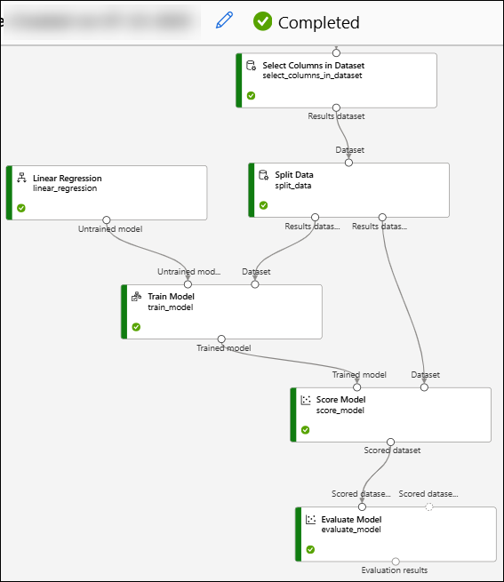 

1. Double click on **Evaluation metrics** review the evaluation metrics values in Azure.

   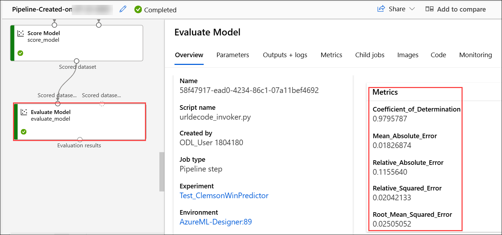 
    
   >**Note**: Both the Jupyter Notebook and Azure ML pipelines were used to train a Linear Regression model to predict team win percentage (Pct) using the same input features!

## Review

By the end of this lab, you have:

- **Created an Azure ML workspace** and set up a dedicated compute cluster for running ML experiments.

- **Uploaded and registered a dataset (Clemson_Dataset)** in Azure ML, preparing it for analysis and modeling.

- **Preprocessed the data** by selecting only relevant columns, reducing noise and improving model accuracy.

- **Split** the dataset into training and testing subsets to ensure a fair evaluation of the model’s performance.

- Built and trained a **Linear Regression model** to predict team win percentage (Pct) using historical sports data.

- Scored and evaluated the model on unseen data using modules like **Score Model** and **Evaluate Model**.

- **Configured and submitted** the pipeline, running it end-to-end using an Azure ML compute cluster.
