# Hands-On-Lab: Algorithms in Action

In this hands-on lab, you will work with core control structures such as sequencing, selection, iteration, and recursion—building blocks of computer and machine learning programs. Through guided exercises and interactive examples, you will observe how each control structure functions within an algorithm. You will then apply these concepts to create simple logic flows, helping you build a strong foundation for developing your own machine learning or programming projects.

## Lab Objectives

In this lab, you will be able to complete the following tasks:

- Task 1: Set Up the Azure ML Workspace
- Task 2: Setting Up Your Notebook

### Task 1: Set Up the Azure ML Workspace

1. **Log in** to [Azure Machine Learning Studio](https://ml.azure.com/) when prompted provide below credentials.

    - **Email/Username:** <inject key="AzureAdUserEmail"></inject>

    - **Password:** <inject key="AzureAdUserPassword"></inject>
   
1. On the **Create a new workspace to get started with Azure ML** fill in the following fields:

    - **Name**: Enter `Class_Workspace`  **(1)**
    - **Friendly Name**: Leave default
    - **Hub (Optional)**: Leave this as **None** unless instructed otherwise **(2)**
    - **Advanced Settings**:
    - **Subscription**: Select the appropriate Azure subscription from the dropdown **(3)**
    - **Resource Group**: Select **ODL-SREB-U5L09** **(4)**
    - **Region**: Select **East US 2 (5)** for better performance.
    - After filling out all the required fields, click the **Create (6)** button.

      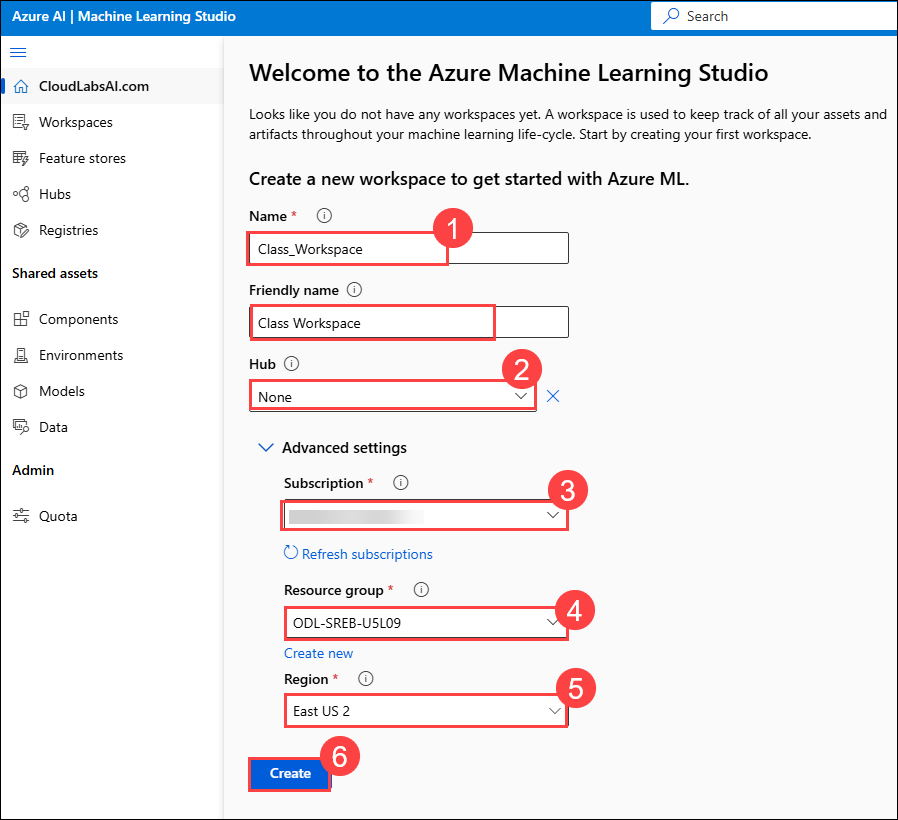 

       >**Note**: If you **did not** see the page like Figure 1, simply click **“Create Workspace”** on your dashboard and fill out the fields as described in Step 2.

1. Wait for the workspace to create, it may take around 2-3 minutes.

1. Now navigate to your newly created workspace. On the **left-hand menu**, click **Workspaces (1)**. Select the workspace you just created `Class_Workspac` **(2)**.

     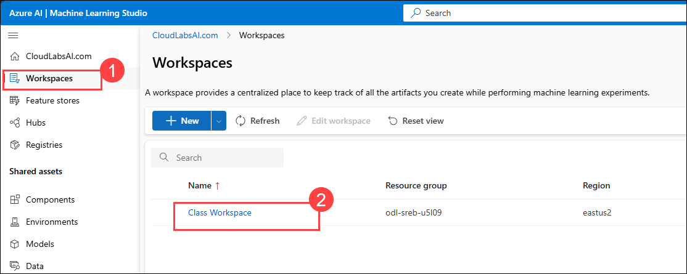 

1. This will take you inside the workspace where you can build and run machine learning experiments.

     

> **Congratulations** on completing the task! Now, it's time to validate it. Here are the steps:
>
> - Hit the Validate button for the corresponding task. If you receive a success message, you can proceed to the next task.
> - If not, carefully read the error message and retry the step, following the instructions in the lab guide.
> - If you need any assistance, please contact us at cloudlabs-support@spektrasystems.com. We are available 24/7 to help.

<validation step="693d578a-66ca-456c-a047-9ef4d99a68b5" />

---   

### Task 2: Setting Up Your Notebook

We will be using a notebook in Azure today to execute all our technical examples. We will be examining 2024 season statistics from the South Carolina Gamecocks football team.

1. Navigate to **Notebooks (1)** from the left menu and then **Close (2)** the pop up.

   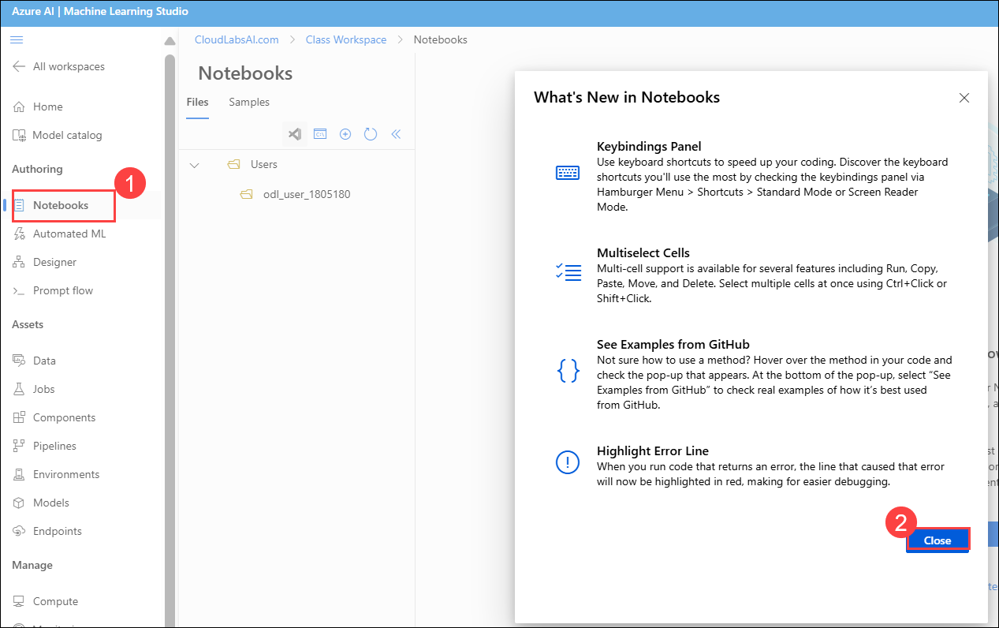 

1. Select **Add files (1) > Upload files (2)**. 

   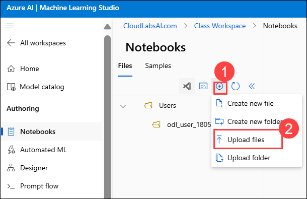 

1. Click **+** to upload the Notebook.

   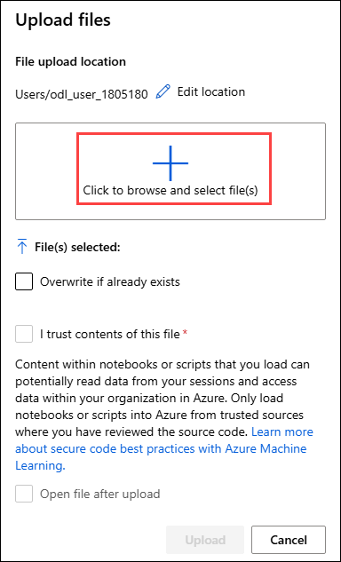 

1. Select the **L9_Notebook.ipynb**.

1. Once the notebook is uploaded, check the **I trust contents of this file** box **(1)** and then **Upload (2)**.

   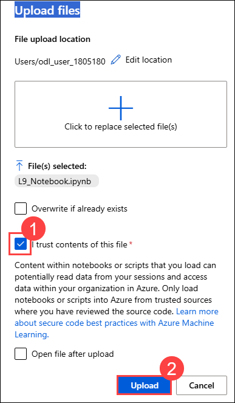 

1. Select **Add files (1) > Upload files (2)**. 

   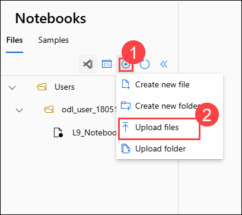

1. Click **+** to upload the Notebook.

   

1. Select **Gamecocks_Running_Stats.csv**.

1. Once the notebook is uploaded, check the **I trust contents of this file** box **(1)** and then **Upload (2)**.

   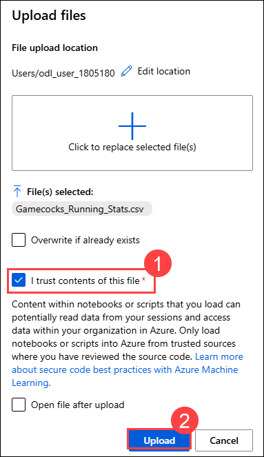 

1. Click on **L9_Notebook** to open it. 

   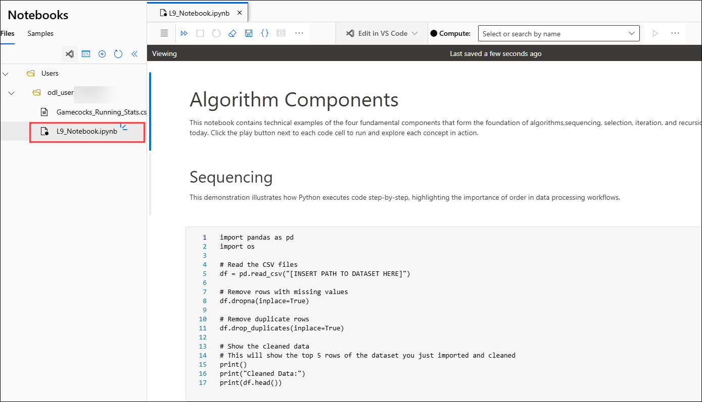

1. On the top of the notebook, select **“Select compute”**  dropdown **(1)** and then select the available compute instance **(2)**.

   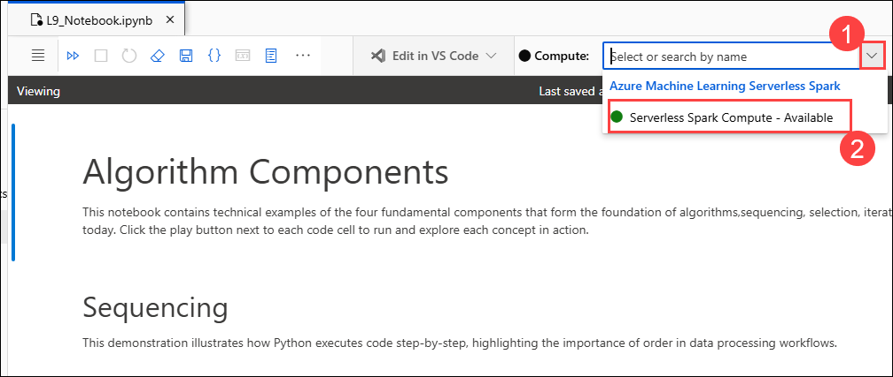

1. Click on **Confirm** to **Confirm switch compute**.

   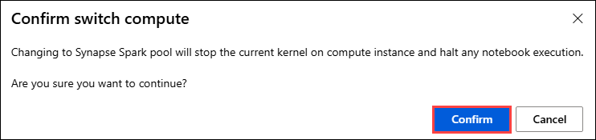

1. Copy the path of your dataset by clicking the three dots to the right of it **(1)** and selecting **“Copy file path” (2)**.

   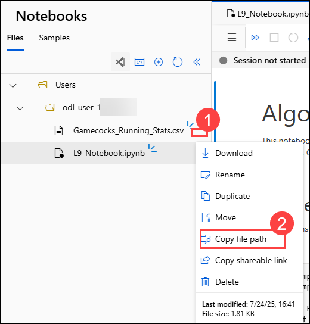

1. Paste the file path in the first code block in the notebook where it says `[INSERT FILE PATH HERE]` as shown below. 

   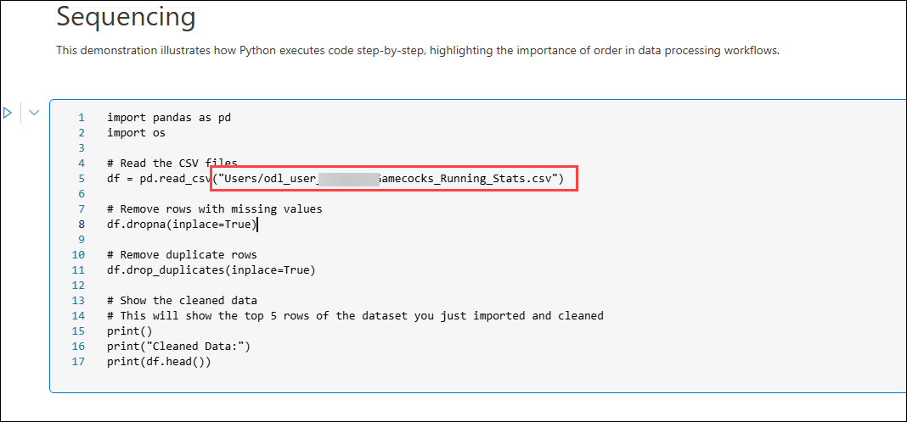

1. Press the **play** button to the left of the first code block. This will start the session, which may take `3-5 minute`s, of which you can move ahead with the lesson while it loads.
   
   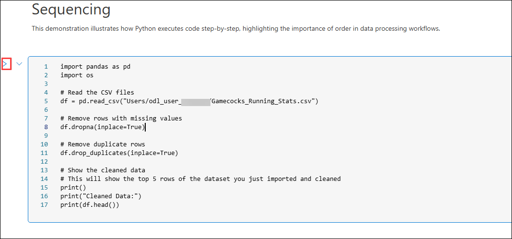

1. This will show the top 5 rows of the dataset you just imported and cleaned.

   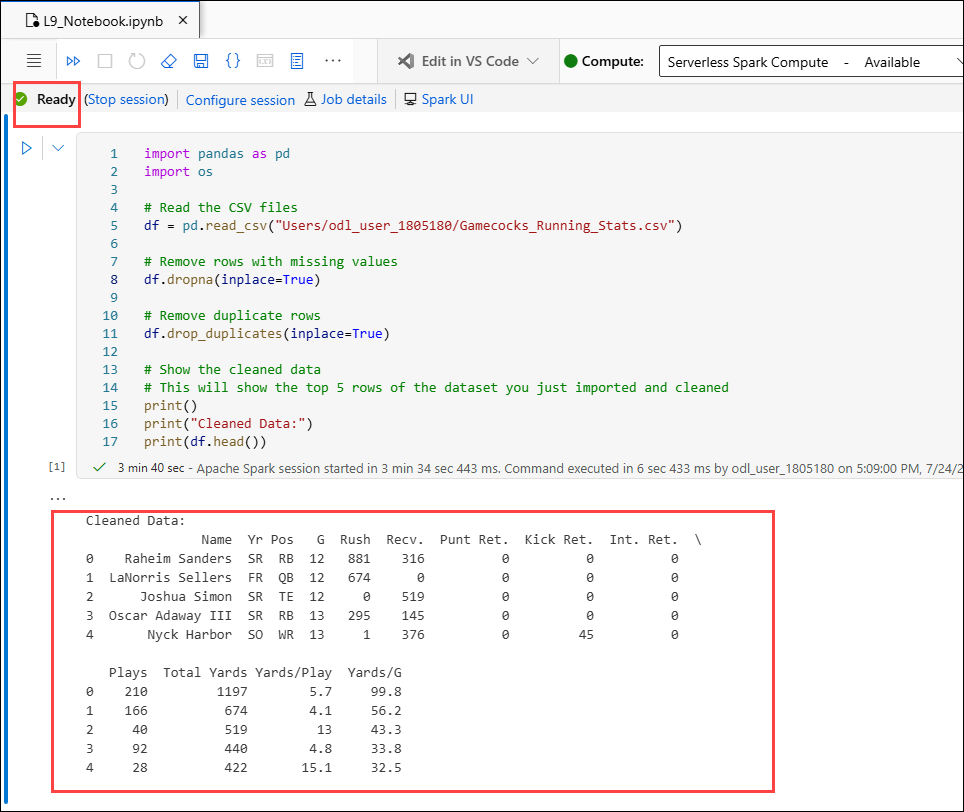

### Task 3: Explore different sections of the Notebook (Read only)

#### Sequencing

Sequencing is the specific order in which instructions are performed in an algorithm.

**Examples**

Some examples we’ve discussed in class are the data processing cycle and the steps in 
our Azure pipelines. These both demonstrate sequencing because each step must be 
performed in a specific order. If the sequence is broken, such as training a model before 

cleaning the data, the entire process can fail or lead to inaccurate results.
For instance, you must upload the dataset before cleaning it, clean it before training, and train before evaluating. Skipping or reordering any of these steps can make the model unusable or misleading.

**Use in ML/AI**

In machine learning and AI, sequencing is critical because models are built through a step by-step pipeline. Algorithms require a specific workflow that is executed in order: input data must be prepared, features engineered, models trained, and predictions evaluated. 
This structured sequence ensures the machine learning model is built on accurate, usable data and produces reliable outputs.

**Interactive Demo**

Work together to rearrange the steps to bake a cake shown on the board into the correct sequence.

This activity demonstrates the importance of sequencing, where steps must be carried out in a specific order to achieve the desired result. Just like in programming or machine learning pipelines, if the steps are out of order, the outcome won’t be successful, even if all the steps are technically correct.

**Technical Demo**

Navigate to the **“Sequencing”** section in the **notebook** which you have executed in previous task.

#### Selection

Selection is a decision or question. At some point in an algorithm there may need to be a question because the algorithm has reached a step where one or more options are available. Depending on the answer given, the algorithm will follow certain steps and ignore others.

**Examples**

A great example we’ve used in class is the **decision tree**. At each branch point in a decision tree, there's a question that leads to a specific path depending on the answer. 

This allows the program to follow different execution routes based on prior decisions. Each path is determined by a condition, sometimes simple, sometimes combining multiple criteria, that helps the model decide which step to take next.

**Use in ML/AI**

In machine learning and AI, selection plays an important role in helping systems make 
decisions based on conditions in the data, resulting in different outcomes. This logic is essential for tasks like **filtering input, choosing between models, or labeling 
predictions**. By embedding conditional decisions into the workflow, selection gives machine learning models the flexibility to adapt to complex, real-world scenarios.

**Interactive Demo**

For each scenario, **stand if the statement applies to you** and remain standing or sit as the conditions are added.

This activity illustrates how selection works by producing outcomes based on specific conditions. These conditions can be combined using logical operators like "and" or "or" to **control the flow of decisions in a program**.

**Technical Demo**

Navigate to the **“Selection”** section in the **notebook** and follow the instructions there.

#### Iteration

Iteration is the process of repeating steps, or instructions. This is often called a “loop.” 

**Examples**

An example of iteration we’ve encountered is during model training. As the model learns, it loops through the dataset multiple times, these are called iterations, each time adjusting 
its parameters to reduce error and improve performance.

A simpler, real-world example of iteration is doing push-ups. Just like in programming, there’s usually a **stopping condition**. You might do 20 push-ups **(a set number of repetitions**) or keep going until you’re too tired to continue (**a condition-based stop**).

**Use in ML/AI**

In machine learning and AI, iteration is essential for training models. During each iteration, the model adjusts its internal parameters based on the error from previous predictions. 

This process continues until the model reaches an acceptable level of accuracy or another stopping condition is met, such as reaching a maximum number of iterations or when improvements become minimal.

**Interactive Demo**

Imagine you're sitting somewhere in a long row of seats, but you don’t know your seat 
number, and you’re not allowed to look. How would you figure it out?

This activity models iteration by **repeating the same action**, incrementing the seat 
number, until the condition is met. It's a clear example of how loops work in algorithms to solve a problem step by step.

**Technical Demo**

Navigate to the **“Iteration”** section in the **notebook** and follow the instructions there.

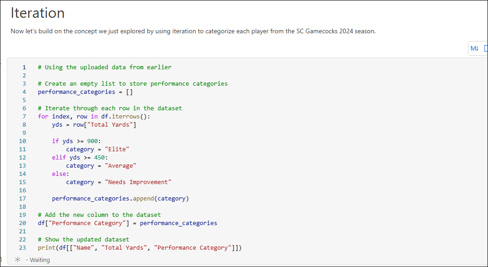

#### Recursion

Recursion is breaking a component down into smaller components using the same 
function. This function calls itself either directly or indirectly over and over until the base problem is identified and solved. 

**Examples**

We haven’t explored recursion in class yet, but here’s a classic example to help illustrate the concept: calculating 5 factorial, or **5!**.

To find 5!, we break it down as follows

**5! = 5 × 4!**

But we don’t know 4! yet, so we break that down:

**4! = 4 × 3!**, and so on until we reach 1!, which equals 1.

So, the full breakdown becomes:

**5! = 5 × 4 × 3 × 2 × 1**

This process of solving a problem by breaking it into smaller versions of the same problem is the essence of recursion. It continues until it hits a **base case**, in this case 1!, which provides a stopping point and allows the calculation to resolve backward.

**Use in ML/AI**

Recursion isn’t commonly used in core machine learning model training, but it plays a valuable role in supporting tasks within computer science and AI. Specifically, recursion is useful for:

- **Traversing data structures** like trees and graphs (e.g. decision trees, game trees in 
AI planning)
- **Divide-and-conquer algorithms**, such as quicksort or mergesort, are used in data 
preprocessing and feature selection
- **Backtracking algorithms**, used in optimization and constraint satisfaction 
problems

In AI, recursion is particularly relevant in areas like **natural language processing (NLP)** for parsing sentence structures, or in **game AI** when evaluating future moves.

**Interactive Demo**

Imagine you're sitting somewhere in a long row of seats, but you don’t know your seat 
number, and you’re not allowed to look. How would you figure it out **DIFFERENTLY** than 
how we did it before?

This models recursion, where each person depends on the result of the person before 
them, breaking the problem down until a stopping point is reached (no one on the left), then building the solution back up step by step.

**Technical Demo**

Navigate to the **“Recursion”** section in the **notebook** and follow the instructions there.

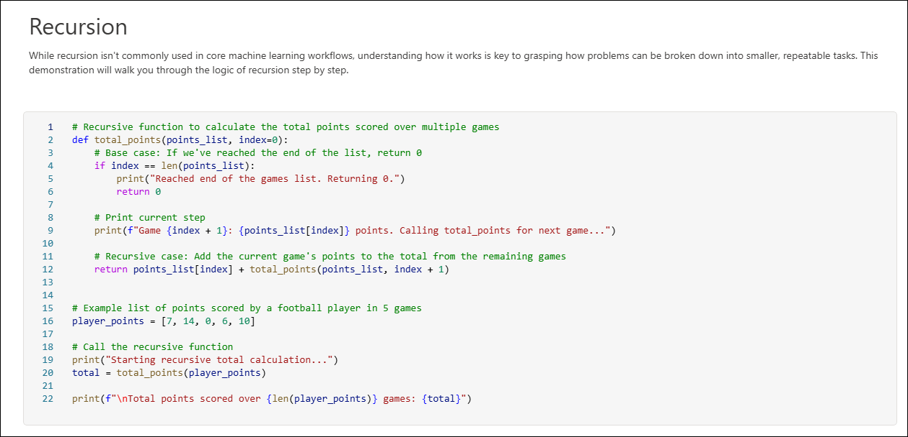

## Review

In this lab, you have completed the following tasks:

- Set Up the Azure ML Workspace
- Setting Up Your Notebook

## You have successfully completed the lab

