# Hands-On-Lab: Troubleshooting in Azure Machine Learning Designer

In this hands-on lab, you will step into the role of a junior data scientist tasked with diagnosing and fixing issues in a malfunctioning Azure Machine Learning pipeline. You will explore a pre-built pipeline containing common configuration errors, interpret system-generated error messages, and troubleshoot each problem step-by-step. By the end of the lab, you will have hands-on experience identifying and resolving real-world issues that can occur during model development, helping to reinforce your understanding of pipeline workflows and debugging techniques in Azure ML.

## Lab Objectives

In this lab, you will be able to complete the following tasks:

- Task 1: Set Up the Azure ML Workspace
- Task 2: Add a dataset to your Azure ML pipeline in the Designer
- Task 3: Add the Dataset to Your Pipeline Canvas
- Task 4: Train the Model
- Task 5: : Run the Pipeline and Submit the Job
- Task 6: Use existing pipeline and walk through real Azure ML Designer errors

### Task 1: Set Up the Azure ML Workspace

1. Open a new tab in the browser, right-click on the following link [Azure Machine Learning Studio](https://ml.azure.com/), then **Copy link** and paste it in a new browser tab to log in to **Azure Machine Learning Studio**.

1. If prompted, provide the credentials below:

   - **Email/Username:** <inject key="AzureAdUserEmail"></inject>

   - **Password:** <inject key="AzureAdUserPassword"></inject>
   
1. On the **Create a new workspace to get started with Azure ML** fill in the following fields:

    - **Name**: Enter `Sports_Analytics`  **(1)**
    - **Friendly Name**: Leave default
    - **Hub (Optional)**: Leave this as **None** unless instructed otherwise **(2)**
    - **Advanced Settings**:
    - **Subscription**: Select the appropriate Azure subscription from the dropdown **(3)**
    - **Resource Group**: Select **ODL-SREB-U5L10** **(4)**
    - **Region**: Select **East US 2 (5)** for better performance.
    - After filling out all the required fields, click the **Create (6)** button.

      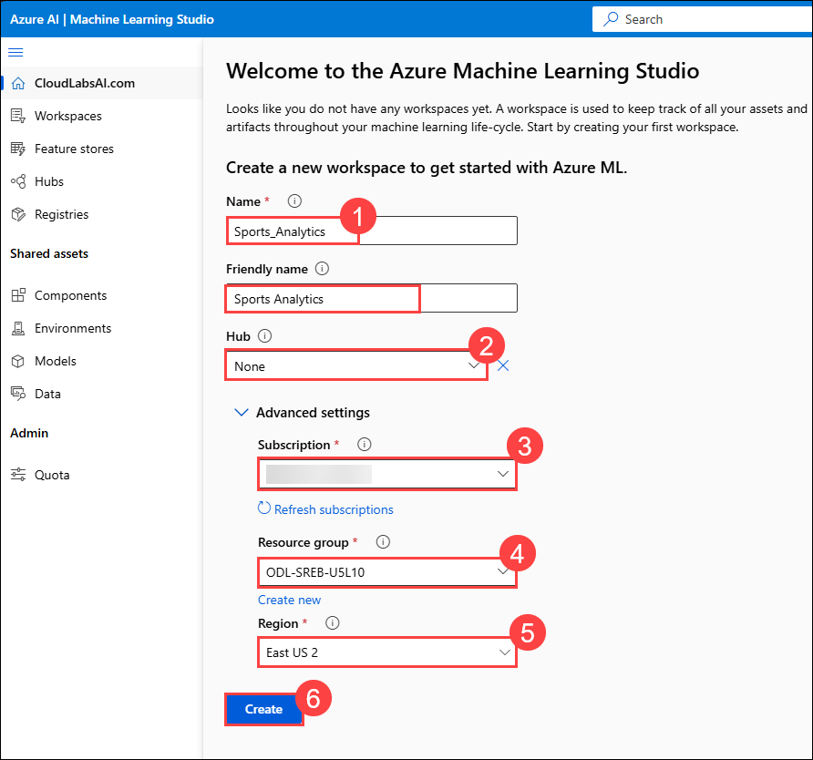 

       >**Note**: If you **did not** see the page like Figure 1, simply click **“Create Workspace”** on your dashboard and fill out the fields as described in Step 2.

1. Wait for the workspace to create, it may take around 2-3 minutes.

1. Now navigate to your newly created workspace. On the **left-hand menu**, click **Workspaces (1)**. Select the workspace you just created `Sports_Analytics` **(2)**.

     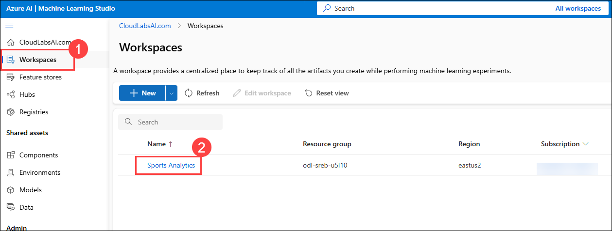 

1. This will take you inside the workspace where you can build and run machine learning experiments.

     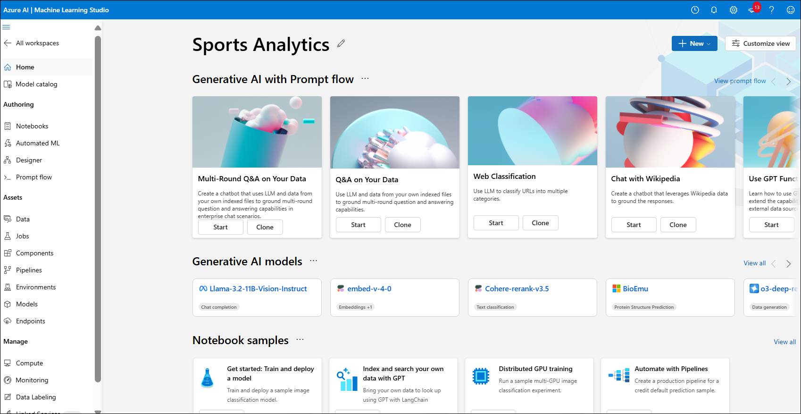  

1. In the side menu of your workspace, select **Designer (1)**. Click **Create a new pipeline using classic prebuilt components (2)**.     

     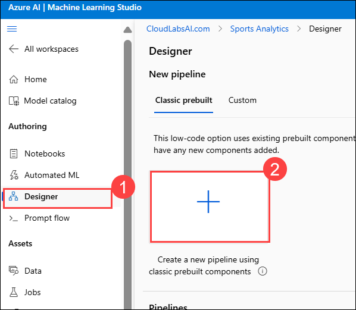 

> **Congratulations** on completing the task! Now, it's time to validate it. Here are the steps:
> - Hit the Validate button for the corresponding task. If you receive a success message, you can proceed to the next task. 
> - If not, carefully read the error message and retry the step, following the instructions in the lab guide.
> - If you need any assistance, please contact us at cloudlabs-support@spektrasystems.com. We are available 24/7 to help.

<validation step="d80779f4-17bd-44fe-a5b0-1ac36411b920" />

### Task 2: Add a dataset to your Azure ML pipeline in the Designer:

1. On the **left panel**, under the **Data (1)** tab, click the **➕ (plus icon) (2)** to upload a dataset.  

     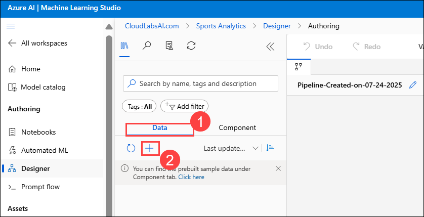

1. On **Create data asset** page enter the following data.

    - Name: Enter **`Train_Test_Validation_dataset` (1)**  
    - Select type: **Tabular (2)**  
    - Click **Next (3)**  

      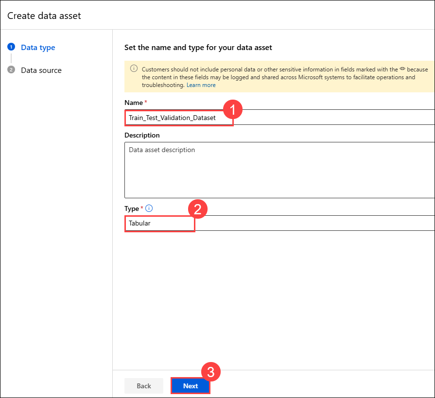   

1. On the **Choose a source for your data asset** page, choose **From local files (1)** the click on **Next (2)**. 

     

1. On the **Select a datastore** page select the following option:  
    
    - Under **Datastore type**, select **Azure Blob Storage (1)**  
    - Choose the datastore named: **`workspaceblobstore` (2)**  
    - Click **Next (3)**  

       

1. On the **Choose a file or folder** page, select **Upload files or folder (1)** from the dropdown, then select **Upload files (2)**.

      

1. **File or Folder Selection**  

    - In the file browser, navigate to `C:\mslearn-ai-fundamentals\Labs\Allfiles\unit5-lesson10` and  select the file: `SC_Basketball_Enhanced.csv` **(1)** 
    - Wait for the file to appear under “Upload list”  
    - Click **Next (2)**  

      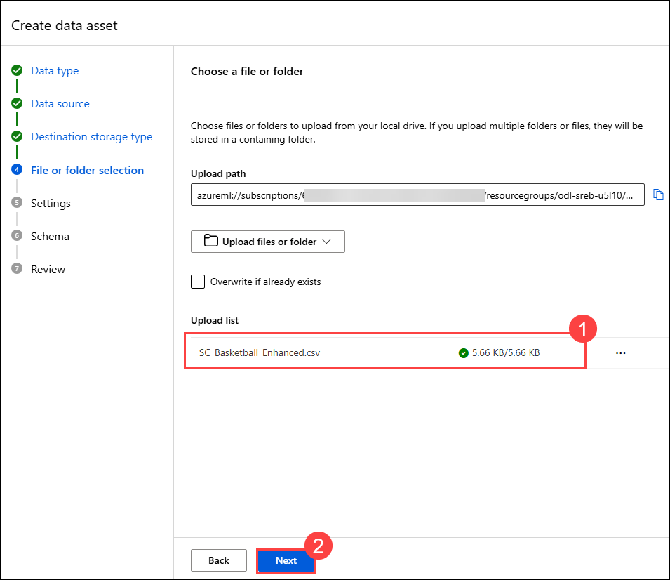

1. On the **Settings** page, review the fields and ensure they match the expected format then click **Next**  

     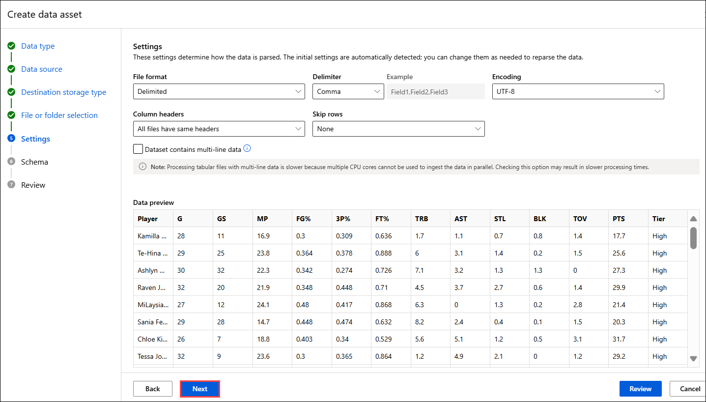

1. On the **Schema** page, ensure the schema fields are correctly recognized then click **Next**  

     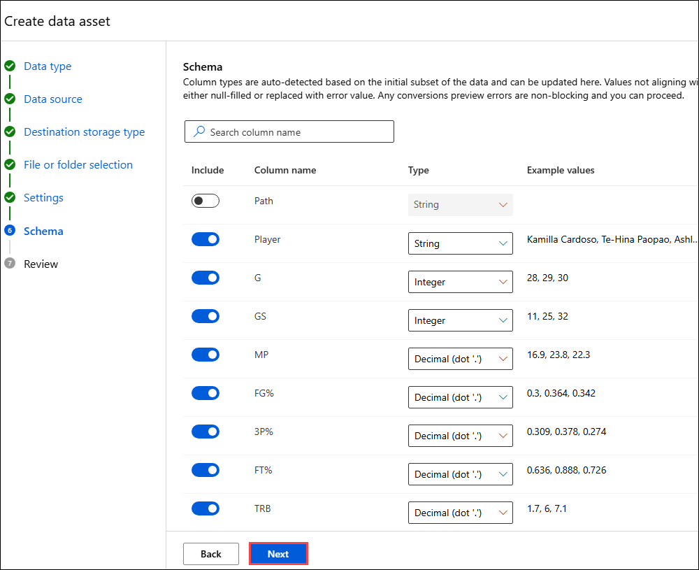 

1. On the **Review** page, click **Create** to finalize the dataset upload

     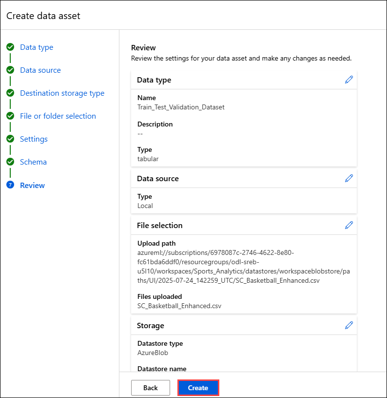   

> **Congratulations** on completing the task! Now, it's time to validate it. Here are the steps:
> - Hit the Validate button for the corresponding task. If you receive a success message, you can proceed to the next task. 
> - If not, carefully read the error message and retry the step, following the instructions in the lab guide.
> - If you need any assistance, please contact us at cloudlabs-support@spektrasystems.com. We are available 24/7 to help.

<validation step="b2ba89a5-c09a-446e-9208-e7319ede4bf5" />

### Task 3: Add the Dataset to Your Pipeline Canvas

1. From the left panel, drag your **Train_Test_Validation_Dataset** dataset onto the canvas and then **Save (2)** button at the top of the canvas to avoid losing progress.

     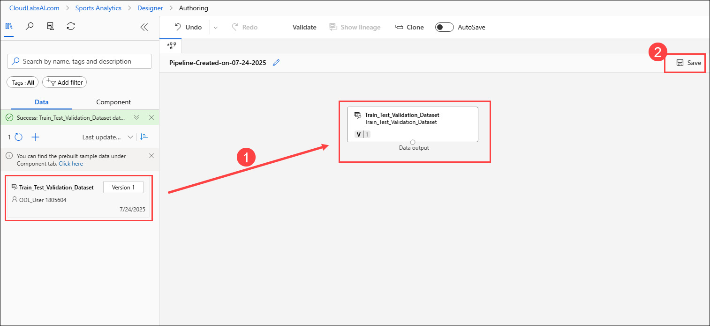  

1. Switch to the **Component** tab in the left panel **(1)** and search for **Split Data (2).** Drag that component onto the canvas **(3)**.   

    - Connect your dataset to the **Split Data** module **(4)**
    - Select **Save (5)**

        

1. Double-click the **Split Data (1)** component to open its settings. Specify the following and then **Save (7)**:

    - Splitting mode: Make sure **Split Rows** is selected **(2)**
    -  Fraction of rows in the first output dataset: Enter `0.7` **(3)**
    - Randomized split is set to **True (4)**
    - Random seed field, type **42 (5)**
    - Confirm Stratified split is set to **False (6)**

      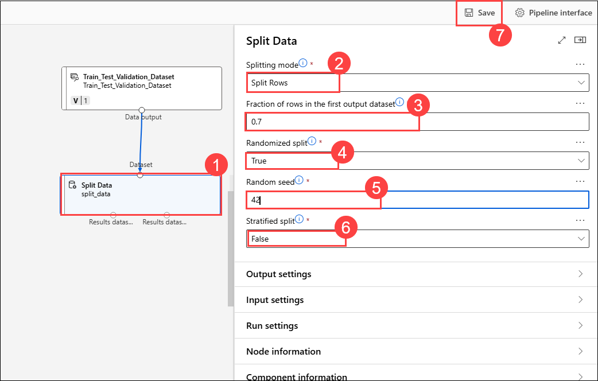  

### Task 4: Train the Model

1. Switch to the **Component** tab in the left panel **(1)** and search for **Linear Regression (2).** Drag that component onto the canvas **(3)**.   

    

1. Switch to the **Component** tab in the left panel **(1)** and search for **Train Model (2).** Drag that component onto the canvas **(3)**.   

    

1. Connect:

    - The **output of Linear Regression** to the **left input of Train Model** (this is the 
untrained model) **(1)**
    - The **left output of Split Data** to the **right input of Train Model** (this is your 70% 
training data) **(2)**  

      

1. Double Click on the **Train Model** module **(1)**, Click **Edit column** under **Label column**.

    

1. Enter **PTS** as the target to predict **(1)** and the **Save (2)**.

    

1. Select **Save**.

    

1. Switch to the **Component** tab in the left panel **(1)** and search for **Score Model (2).** Drag that component onto the canvas **(3)**.   

    

1. Connect:

    - The **output of Train Model** to the **left input of Score Model** **(1)**
    - The **right output of Split Data** (test data) to the **right input of Score Model** **(2)**  
    - Select **Save (3)**

       

1. Switch to the **Component** tab in the left panel **(1)** and search for **Evaluate Model (2).** Drag that component onto the canvas **(3)**.   

    - Connect the **output from Score Model to Evaluate Model (4)**
    - Select **Save (5)**

           

### Task 5: : Run the Pipeline and Submit the Job

1. Make sure your pipeline is saved, then click **Configure & Submit** at the top of the screen. 

    

1. You will now walk through a few configuration steps, then click **Next (3)**:
  
   - Experiment name: **Create new (1)**
   - New experiment name: **PTS_Split_70_30(2)**

       

1. Leave Inputs & Outputs as is, there is nothing to configure for this step. Click **Next.**      

         

1. Now we’re on the **Runtime settings** step of the pipeline submission process. This is where you choose the **computer (called a compute cluster)** that Azure will use to run your 
pipeline.

    - Select Compute Type: From the dropdown, select **Compute cluster (1)**.

    - Click on **Create Azure ML compute cluster (2)**

        

1. You are now in the **Virtual Machine** tab for setting up a compute cluster. This step helps Azure decide which kind of machine to use for running your pipeline.

    - **Location**: Confirm that the selected region is the same as your workspace (**East US 2**) **(1)**
    - **Virtual Machine Tier**: Leave as default. (do not select "Dedicated" or "Low priority" unless specified otherwise for cost-saving purposes) **(2)**
    - **Virtual Machine Type**: Keep this as **CPU (3)** 
    - **Virtual Machine Size**: Choose **Standard_DS11_v2 (4)**
    - Click **Next (5)**  

         

1. **Advanced Settings**: Give a Compute Name as **Test (1)** and leave everything default. Then click **Create (2)**.

       

1. Select the Compute Created **Test (1)** and click **Next (2)**.   

     

     >**Note**: It may take a few attempts to get selected. Please keep trying — you'll be able to proceed once the **Test** status turns **green**.

1. Once on the **final** page, click **Submit**.     

      

1. Once submitted, a success notification appears at the top of the page. Click on **'View details'** to monitor the pipeline. It may take some time for the pipeline to complete.

           

1. Please wait for the pipeline to complete, which may take approximately `10–15 `minutes. Once it's finished successfully, the status will show as **Completed**.

      

1. Once the Pipeline completed, right click on **Evaluate Model (1)** then select **Preview data (2)** and then **Evaluate results (3)**.    

     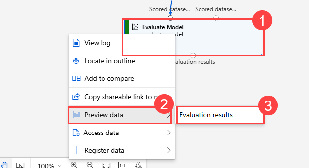 

1. Record the **Evaluation results**, you will be comparing this with the updated pipeline in the upcoming tasks.

     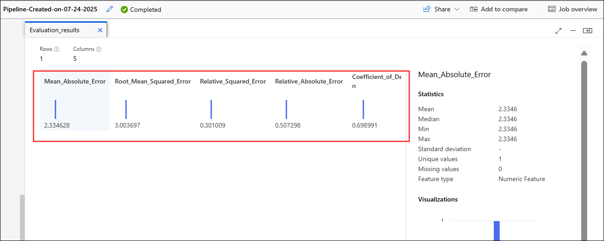 

### Task 6: Use existing pipeline and walk through real Azure ML Designer errors

- Intentionally break the pipeline
- Record the error message and observations
- Apply a fix using a structured process
- Rerun the pipeline and reflect

#### Error 1 – Missing Label Column in Train Mode

**Problem to Simulate:**

You will intentionally trigger the error:

`Label column in Train Model is invalid.`

1. Open the working pipeline in Designer.

1. Navigate to **Designer** from the left navigation pane.

     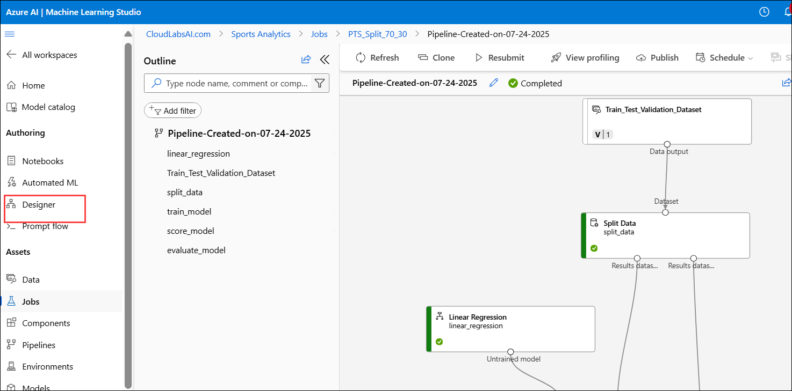

1. Select the Pipeline.

     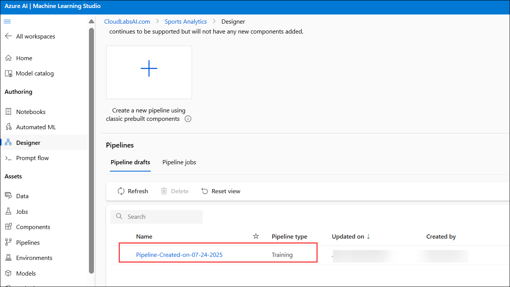

1. Right click on **Train Model** module **(1)** and then **Delete (2)**.   

     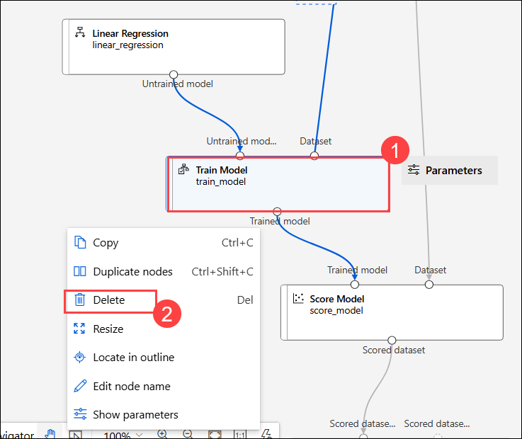

1. Switch to the **Component** tab in the left panel **(1)** and search for **Train Model (2).** Drag that component onto the canvas **(3)**.   

     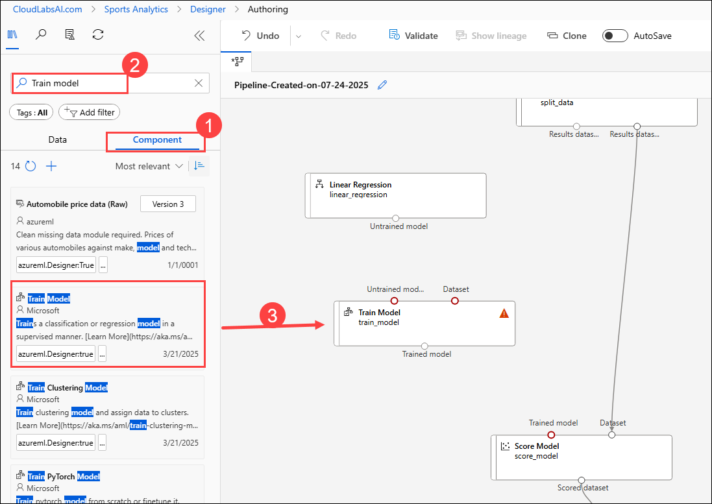

1. Connect it as follows:

    - Right input: connect to the **output of Split Data** (**left port = training data**) **(1)**
    - Left input: connect to the **Linear Regression module** **(2)**
    - Train model to score model **(3)**
    - Select **Save (4)**
    - Select **Configure & Submit (5)**

      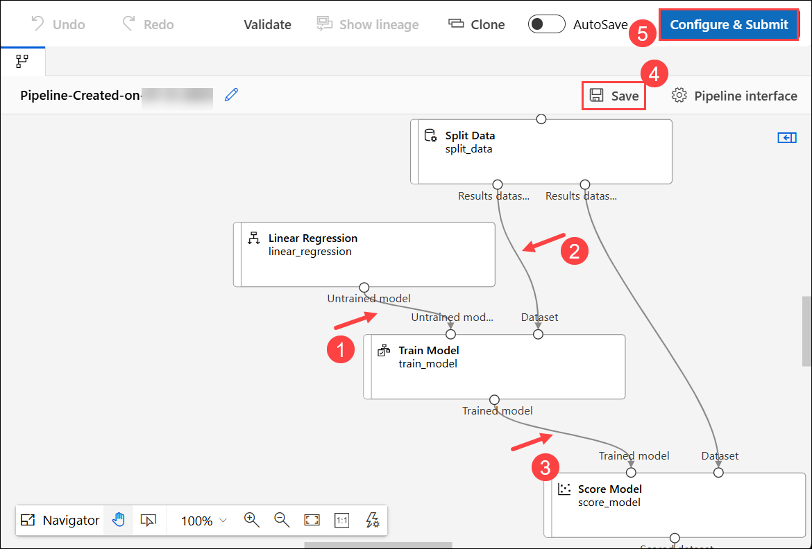    

1. You will now walk through a few configuration steps, then click **Review + Submit (3)**:
  
   - Experiment name: **Select existing  (1)**
   - Existing experiment: **PTS_Split_70_30(2)**

     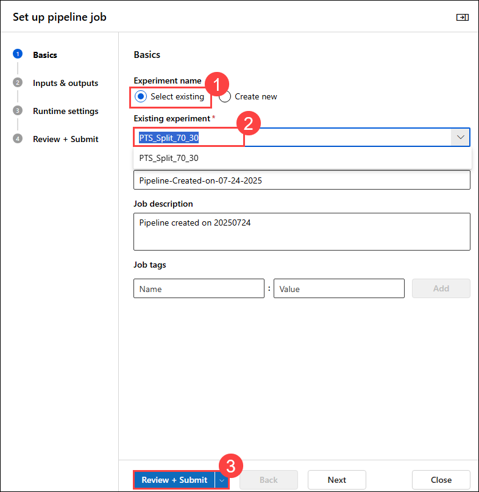

1. Select **Submit**.

1. What You Will See:

    - **Red warning triangle on the Train Model module (1)**
    - Error panel on the left says: **Label column in Train Model is invalid (2)**.

      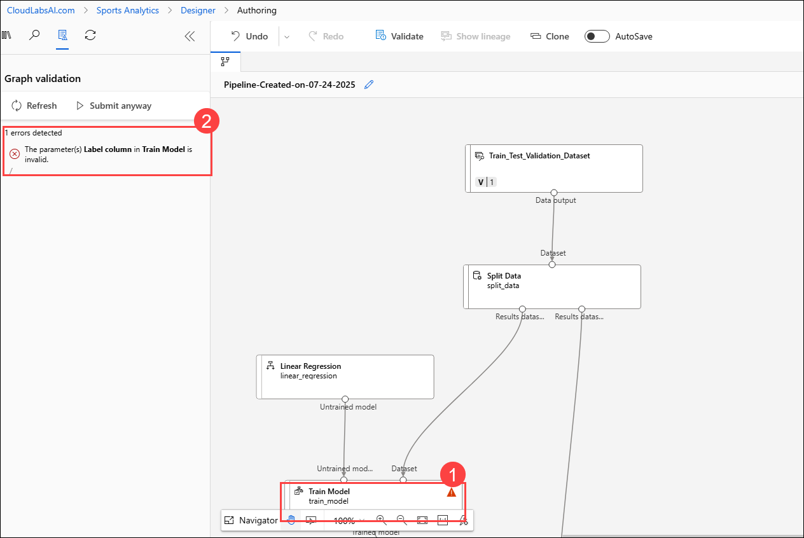

**`Fix Instructions:`**

1. Double Click on the newly added **Train Model (1)** module and then  Click **Edit column (2)** under **Label column**.

     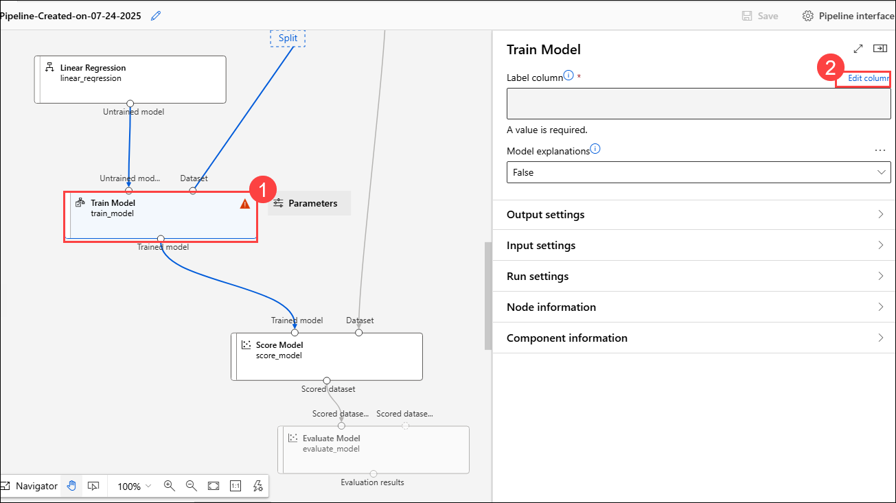

1. Enter **PTS** as the target to predict **(1)** and the **Save (2)**.

    

1. Select **Save (1)** and then after adding the necessary Label Column as, you can see that have fixed the error **(2)**.

    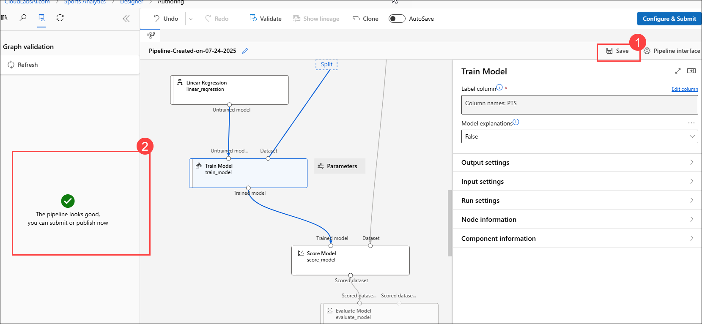

**Why This Is an Error:**

In machine learning, the label column is the column we want the model to learn to 
predict. It is the "answer" column during training.

If you do not tell Azure which column to use as the label, it does not know what you are 
trying to teach the model. That is like telling a student to "learn something from this dataset" without ever telling them what the correct answer is supposed to be.

In this case, we are trying to predict PTS (points per game), but the model cannot do that if we have not told it PTS is the column to learn.

**Why This Matters:**

This is a foundational concept in machine learning:

- Every model must have a target (the thing we want to predict).
- Selecting the correct label column ensures the model focuses on the right 
outcome.

If you do not understand this, you will continue to make errors in future lessons when working with classification, regression, and evaluation

#### Error 2 – Disconnected Module in Score Model

Problem to Simulate:

`You will intentionally trigger an error by disconnecting the inputs from the **Score Model** module.`

1. Right click on the **links to Score Model** and then **Delete**.

1. Disconnect the inputs:

     - A: Disconnect the trained model input (coming from Train Model) **(1)**

     - B: Disconnect the dataset input (coming from Split Data – right output) **(2)**

     - Then **Save (3)**

     - Select **Configure & Sumbit (4)**

       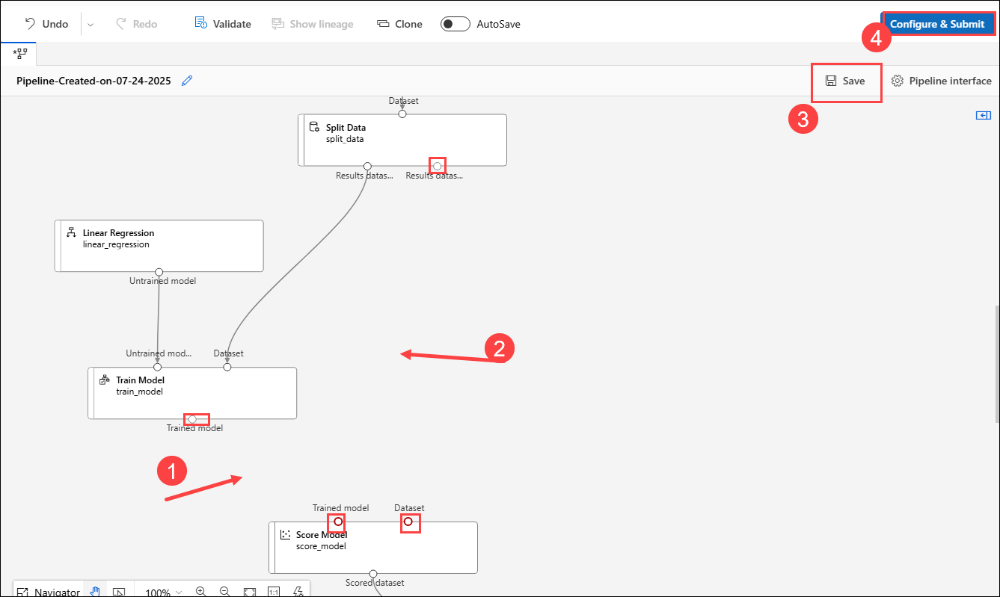

1. What You Will See:

     In the error panel:

     - **The port(s) Trained_model of Score Model are required to be connected.**

     - **The port(s) Dataset of Score Model are required to be connected**

       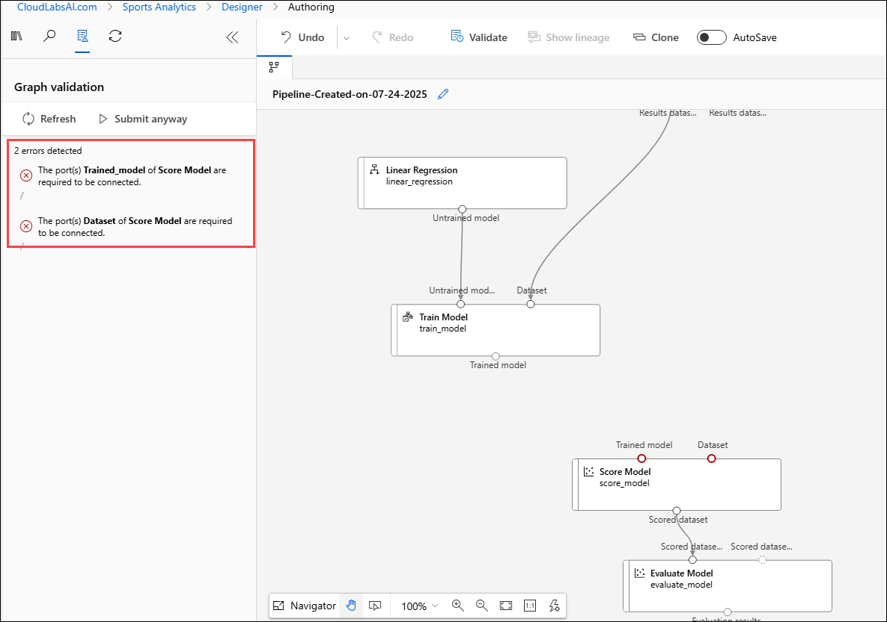

**Why This Is an Error:**

The Score Model module needs two inputs to work:

- A trained model from Train Model
- Test data from Split Data (right port)

If either is missing, the scoring process cannot begin. This is like trying to grade a test without either the answer key or the test paper.

**Why This Matters:**

This error helps to understand:

- How modules are dependent on upstream inputs
- That scoring is a comparison step — it needs both predictions and test data
- How to visually check and interpret Azure's pipeline wiring

This builds spatial reasoning and prepares you for more complex model layouts in later 
lessons       

**`Fix Instructions:`**

1. Reconnect both required inputs for Score Model:

     - **Left input (model): Connect from Train Model (1)**
     - Right input (dataset): **Connect from Split Data → right output (test data) (2)**
     - Then **Save (3)**
     - Select **Configure & Submit (4)**

       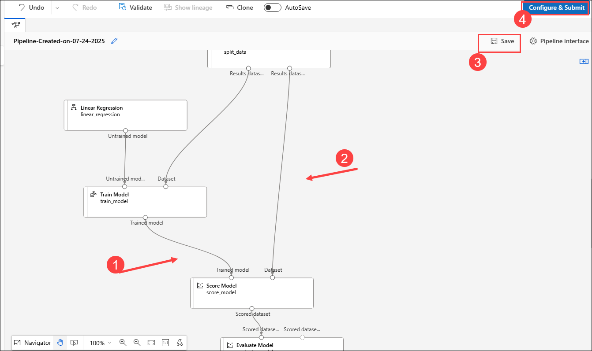  

1. Once you have fixed the error then the pipeline should be fixed and ready to submit.

    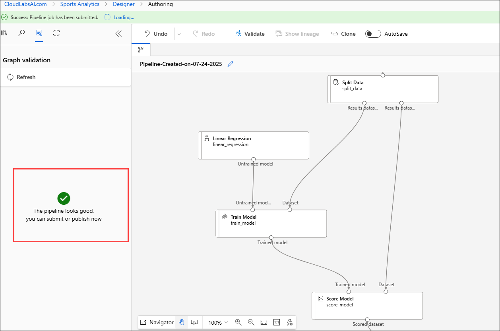

#### Error 3 – Wrong Output from Split Data Connected to Train Model

**Problem to Simulate:**

You will intentionally create a logic error by connecting the test output (right side) of the Split Data module into the Train Model instead of the training output (left side).

This may not throw a hard error, but it will lead to incorrect model behavior and poor evaluation results.

1. Right click on the Train  model connection to Split Data **(1)** and then **Delete (2)**.

    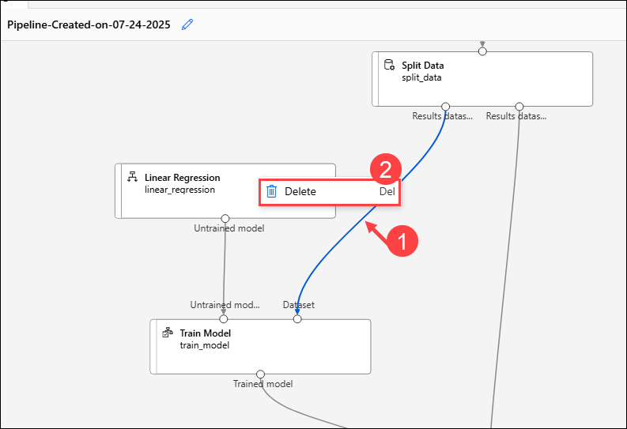

1. Instead of connecting it to the left output of Split Data (training set), connect it to the **right output (test set) (1)** then **Save (2)** and **Configure & Submit (3)**.    

    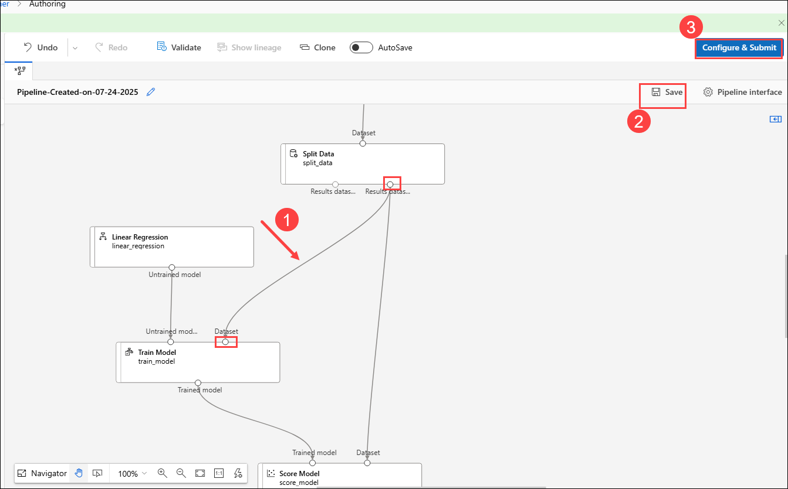

1. Select **Submit**.

    

1. What You Will See:

     - The pipeline will likely run without errors.
     - But the model will be trained on the wrong data (test set), leading to:
     - Poor performance in Score Model
     - Low accuracy or misleading results in Evaluate Model

1. Select **View Details**.

    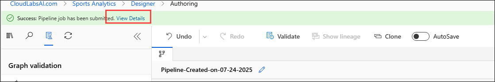

1. Wait for the Pipeline to complete, nce the Pipeline is completed **(1)** then right click on **Evaluate Model (2)** then select **Preview Data (3)** and then **Evaluate results (4)**.

    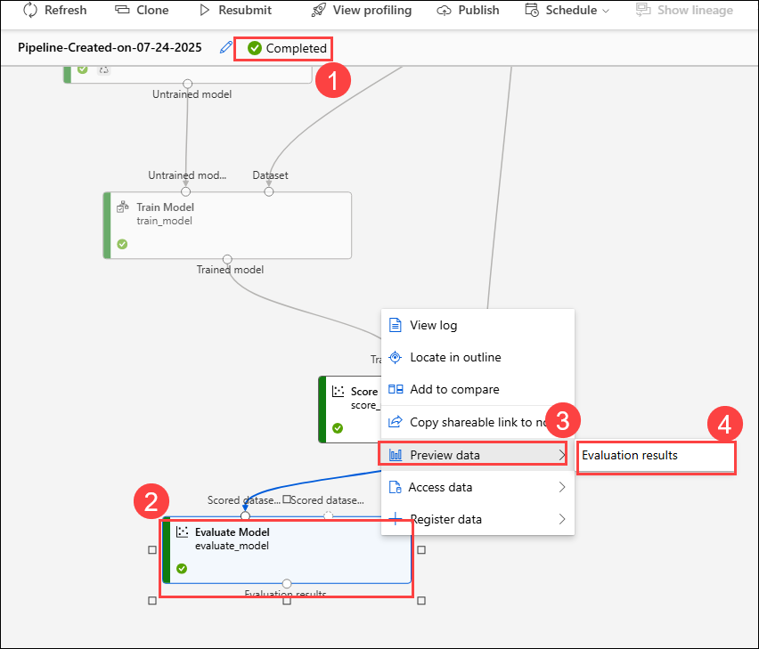

1. Review the Evaluate results with lower performance.

    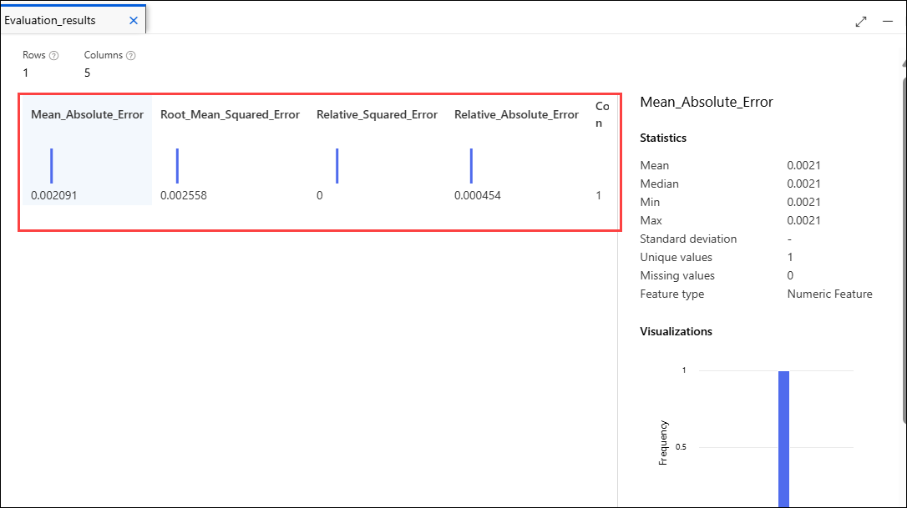

1. Compare the Evaluate results of the Original pipeline you have created in `Task 5` and the above modified one.

    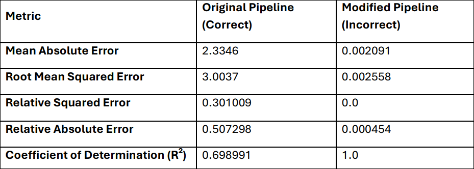

**Why This Is an Error:**

The Split Data module splits the dataset into two parts:

- Left output: training data (used to teach the model)
- Right output: test data (used to evaluate the model)

Training the model on test data defeats the purpose of evaluation. It is like practicing with the answers before taking the test—the results will not reflect how well the model generalizes to new data.

Why This Matters:

This explains:

- How to understand data flow direction
- The meaning of training vs. testing in machine learning
- That not all errors are blocked by Azure—some need human reasoning to spot

This is a foundational lesson for model integrity and trustworthiness.

**Fix Instructions:**

1. Navigate to **Designer (1)** from the left pane and then select the **Pipeline created (2)**.

    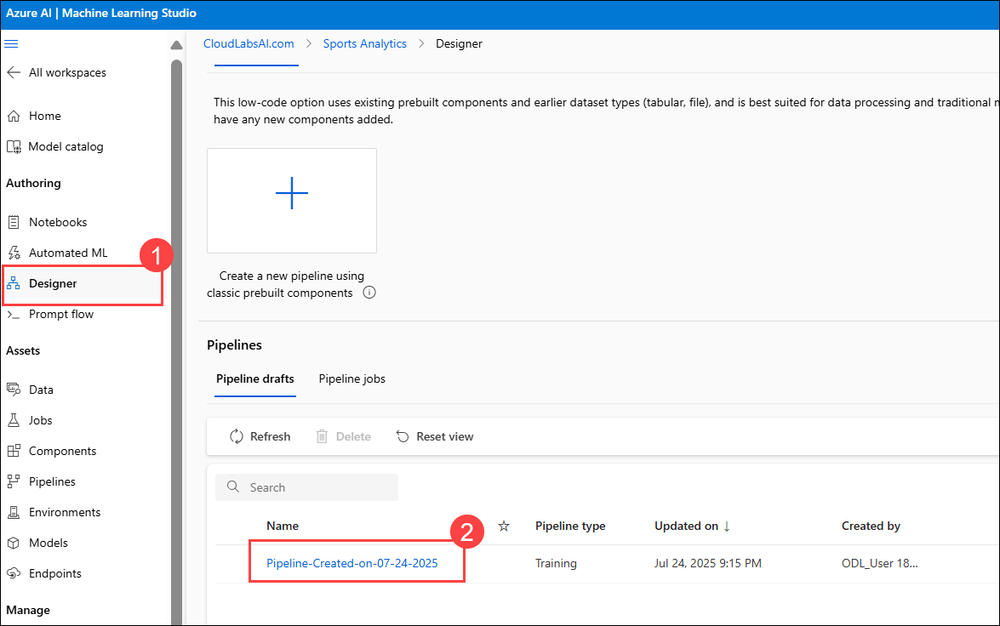

1. Disconnect the data input to **Train Model**.

1. Reconnect it to the **left output of the Split Data module (training set) (1)** and then **Save (2)**.

    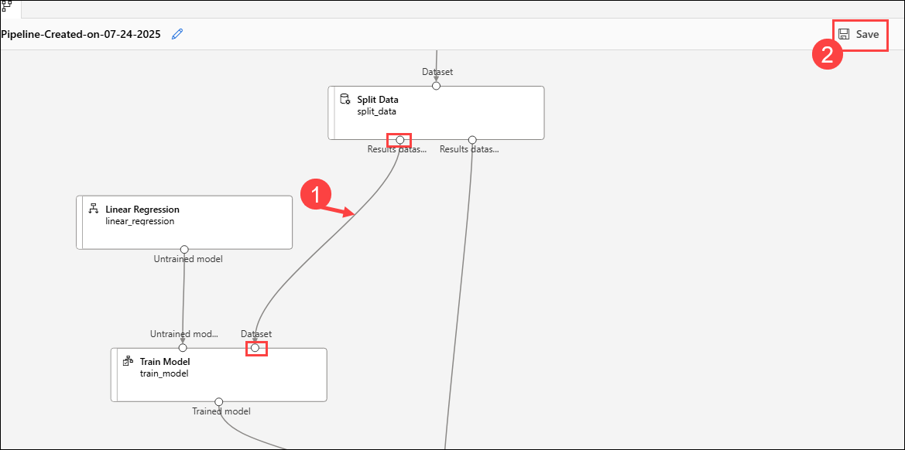

#### Error 4 – Dataset Missing Expected Label Column (PTS)

`Problem to Simulate:`

You will use a dataset that appears valid but is missing the target column (PTS). When configuring Train Model, Azure will show an error because it cannot find a column to use as the label.

1. Navigate **Data (1)** tab and then click on **+ (2)** to update the dataset.

    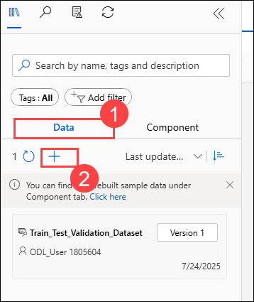

1. On **Create data asset** page enter the following data.

    - Name: Enter **`Train_Test_Validation_dataset_1` (1)**  
    - Select type: **Tabular (2)**  
    - Click **Next (3)**  

      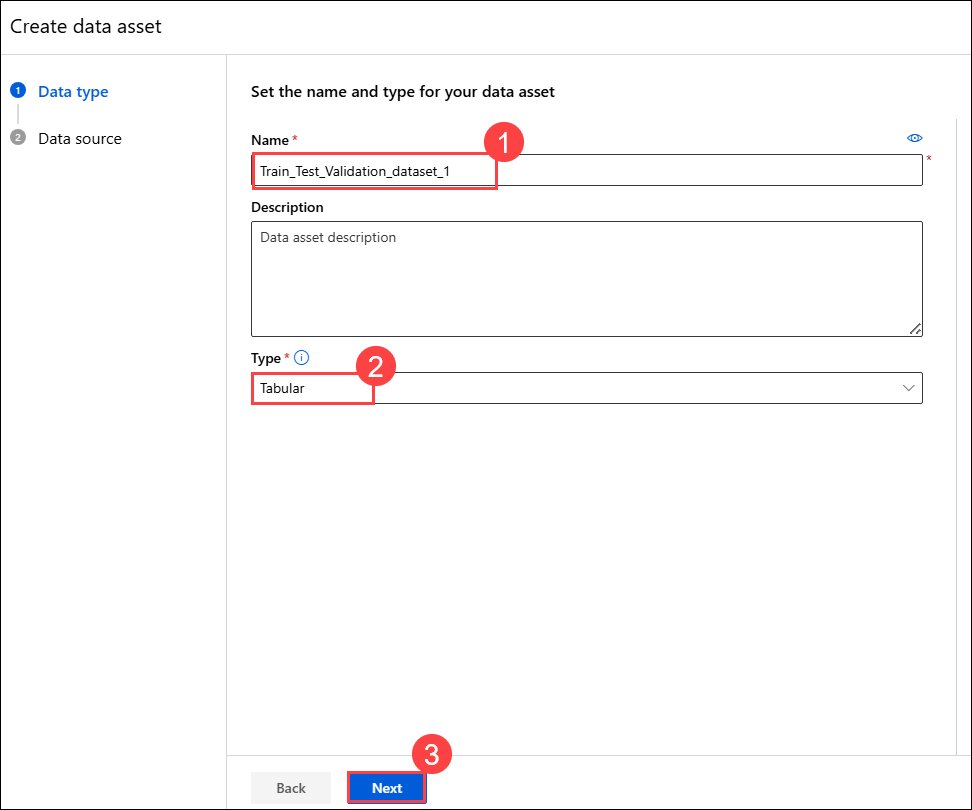   

1. On the **Choose a source for your data asset** page, choose **From local files (1)** the click on **Next (2)**. 

     

1. On the **Select a datastore** page select the following option:  
    
    - Under **Datastore type**, select **Azure Blob Storage (1)**  
    - Choose the datastore named: **`workspaceblobstore` (2)**  
    - Click **Next (3)**  

       

1. On the **Choose a file or folder** page, select **Upload files or folder (1)** from the dropdown, then select **Upload files (2)**.

      

1. **File or Folder Selection**  

    - In the file browser, navigate to `C:\mslearn-ai-fundamentals\Labs\Allfiles\unit5-lesson10` select the file: `SC_Basketball_Enhanced Without PTS Column.csv` **(1)** 
    - Wait for the file to appear under “Upload list”  
    - Click **Next (2)**  

      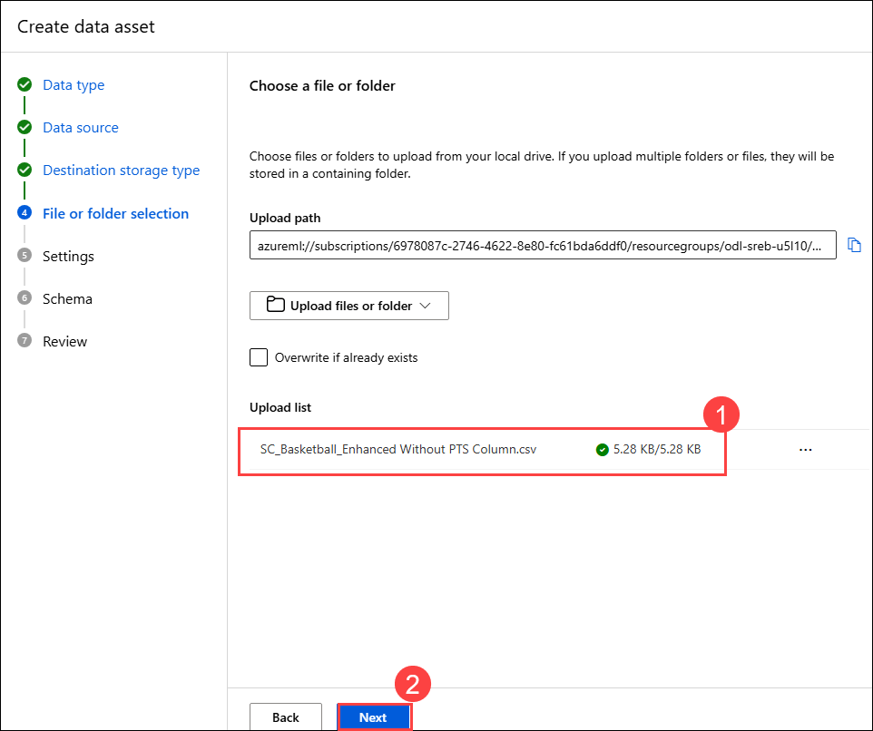

1. On the **Settings** page, review the fields and ensure they match the expected format then click **Next**  

     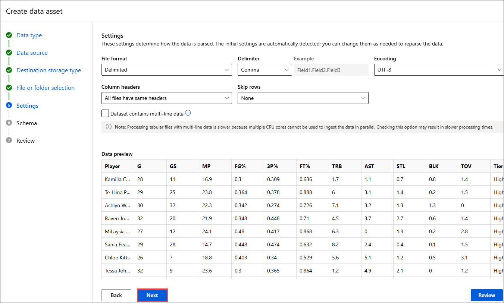

1. On the **Schema** page, ensure the schema fields are correctly recognized then click **Next**  

      

1. On the **Review** page, click **Create** to finalize the dataset upload

      

1. Replace the original dataset in the pipeline with this version.

1. Right click on **Train_Test_Validation_dataset (1)** and then **Delete (2)**.

     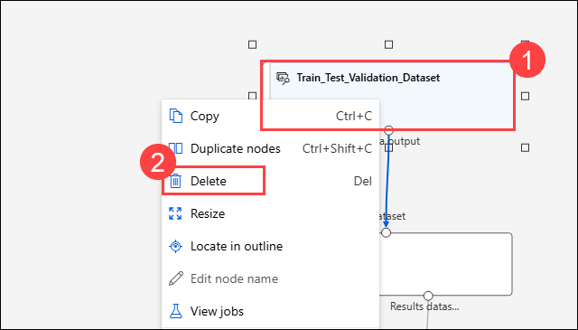

1. Drag **Train_Test_Validation_dataset_1** into the canvas **(1)** and then Connect it to **Split Data (2)**.

     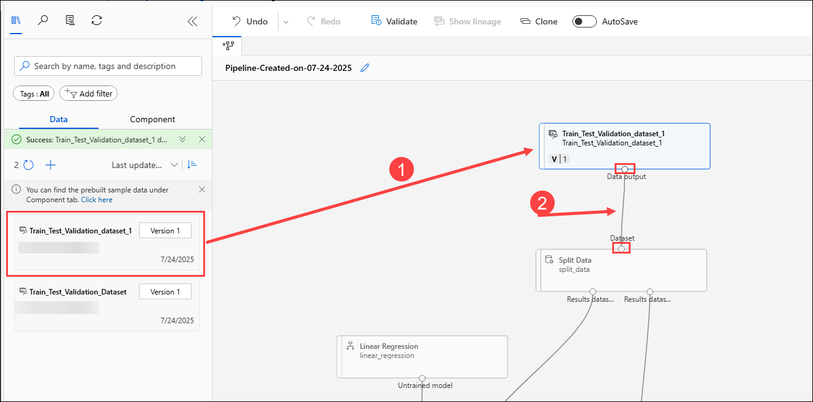

1. Double Click on the **Train Model** module **(1)** then  view the **PTS (2)** and select **Configure & Submit** **(3)**. 

     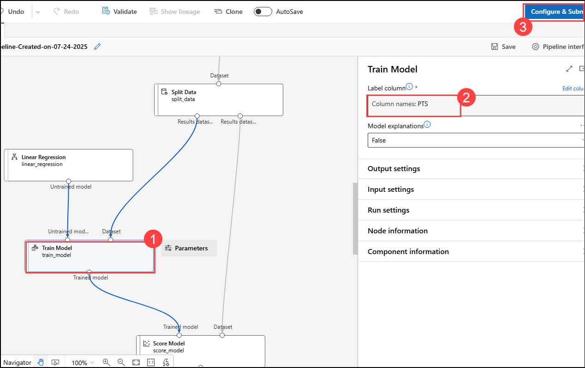

1. On the Pipeline setting page, provide the following details and then **Next (3)**:

    - Experiment name: **Select Existing (1)**
    - Existing experiment: Select **PTS_Split_70_30 (2)**

      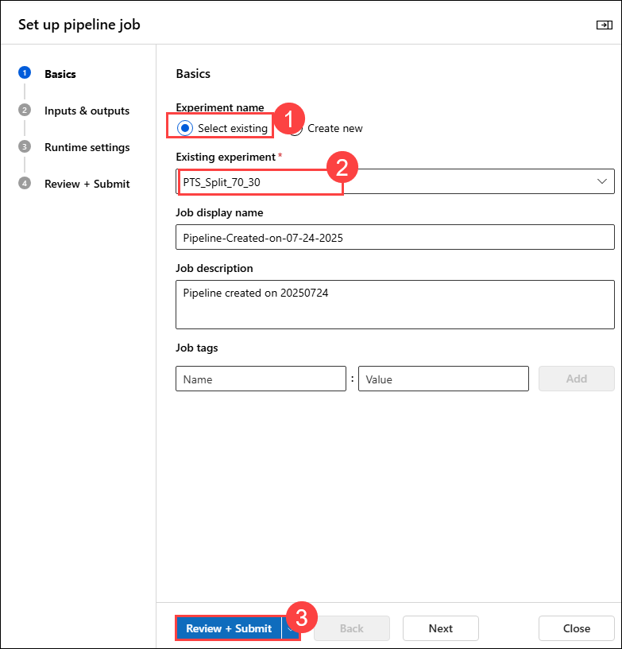

1. Select **View Details**.

     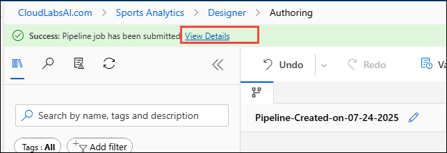

1. You can see that **Train Model** failed. Azure ML pipeline that fails due to a data 
schema issue: the dataset Test_dataset_without_Label does not contain the required target column (PTS).

     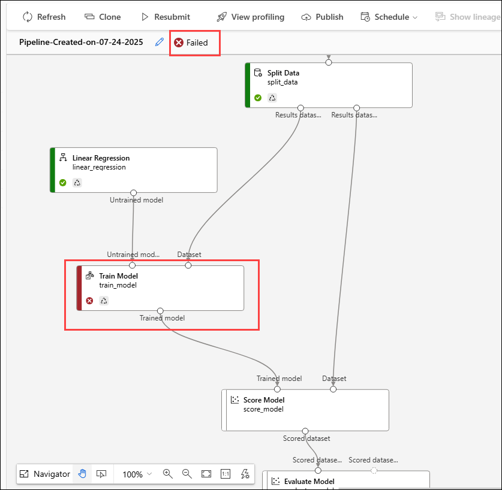

**Why This Is an Error**

In supervised learning, the model must know what it is trying to predict—this is the label column. If the dataset does not contain the label (PTS in this case), Azure cannot proceed with training.

This error highlights a schema issue: the pipeline wiring is fine, but the dataset is 
incomplete.

**Why This Matters**

This reinforces:

- You must check the dataset schema before building a model
- ML systems do not guess what is missing
- The label column is non-optional in supervised learning

This is a common and real-world issue in team workflows, file versioning, and working with live data.

**Troubleshoot: Finding the Real Error in Azure ML Designer**

1. Click **“Job Overview”** in the top-right after the failed run.

     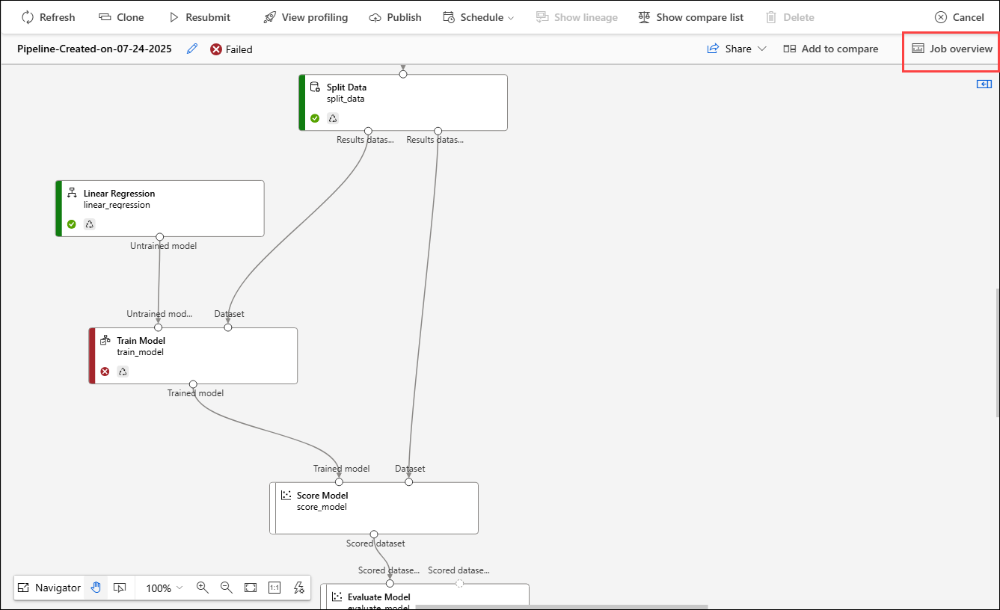

1. Select **Child jobs**.

     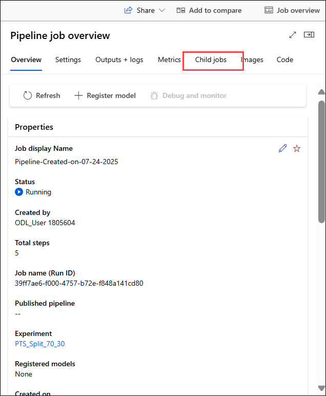

1. Click on the failed module — in this case, **train_model**.     

     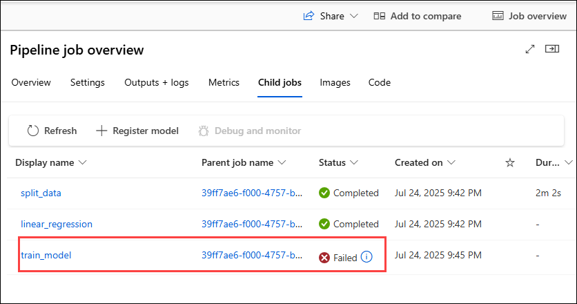

1. You will see a Status summary. Click **See more details**.

     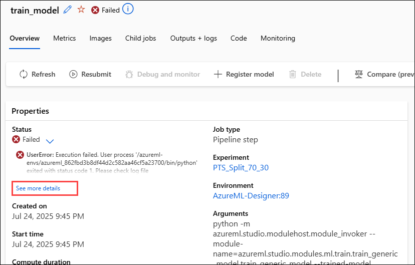

1. In the detailed view, scroll down until you reach the **UserError message**.

     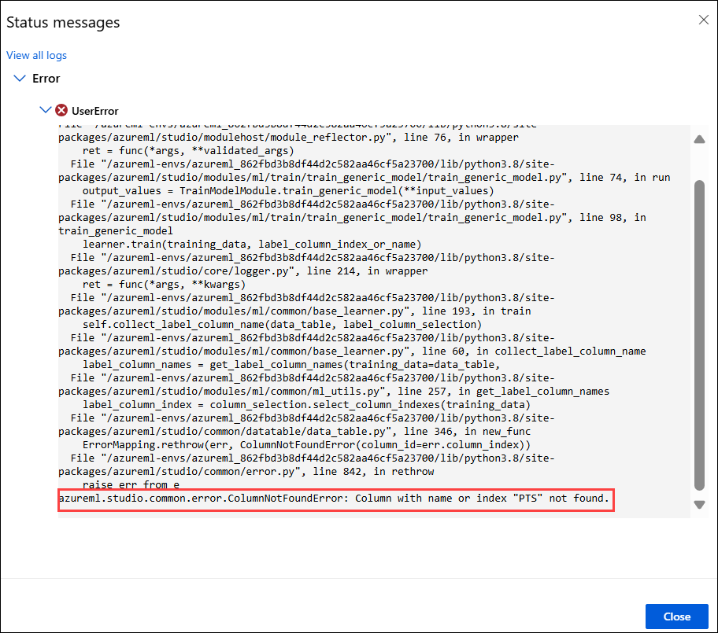

     There, Azure will show the actual reason the module failed. In the case of a missing label column, you will typically see an error like:

     - **UserError: ColumnNotFound**

       The label column specified `('PTS')` was not found in the dataset.

1. Once the review is complete, close the page. Then, go to the **Outputs + Logs** tab and Expand the **module_statistics** folder on the left. Click on the **error_info.json** file

     

     This will display a structured diagnostic output. In the example shown, Azure states:"Message": `"ColumnNotFound: Column with name or index \"PTS\" not found."`   

1. After a pipeline failure, you can navigate to the Train Model module and select the **Outputs + logs (1)** tab. From there, the **user_logs/std_log.txt (2)** file reveals the full traceback of what went wrong during execution **(3)**. This is often more detailed than the summary shown in **error_info.json**.

     

      >**Note**: The final message highlighted at the bottom is:azureml.studio.common.error ColumnNotFoundError: Column with name or index "PTS" not found.

1. Navigate to **Pipeline (1)** and then select the Pipeline created **(2)**.

     

1. Right click on **Train_Test_Validation_dataset_1 (1)** and then **Delete (2)**.

     

1. Drag **Train_Test_Validation_dataset** into the canvas **(1)** then connect to the split data **(2)** and then **Save (3)**.

     

1. Double click on **Train Model (1)** then view the Label column **(2)** and then **Configure & Submit (3)**.

     

1. Select **Review+Submit**.

     

1. Select **View+details**.

         

1. Confirm successful run.

     

       
## Review

In this lab, you have completed the following tasks:

- Set Up the Azure ML Workspace
- Added a dataset to your Azure ML pipeline in the Designer
- Added the Dataset to Your Pipeline Canvas
- Trained the Model
- Run the Pipeline and Submit the Job
- Used existing pipeline and walk through real Azure ML Designer errors

## You have successfully completed the lab

     

    

    

    

