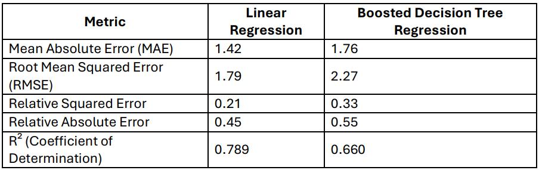
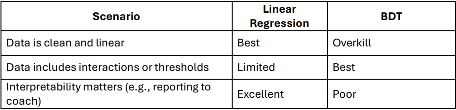
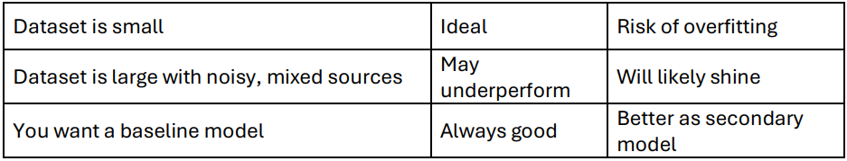

# Compare Both Models

### Overview
In this step, students analyze and compare the two regression models they built using Azure ML Designer:

 - Linear Regression
 - Boosted Decision Tree Regression (BDT)

Both models were trained on the same features:

- Minutes Played (MP)
- Assists (AST)
- Field Goal Percentage (FG%)
- Total Rebounds (TRB)

And both models were evaluated using the same dataset with the goal of predicting PTS (Points Scored).

### Evaluation Results

These values show that Linear Regression outperformed BDT across all evaluation metrics. Now let’s understand why.

### How Each Model Works

1. **Linear Regression**

    **How it works:**
    
     Linear Regression tries to draw a single line (or hyperplane in multiple dimensions) that best fits the training data by minimizing the sum of squared errors between predicted and  actual values.
    
    **Equation (Simplified Example):**
    
    PTS = (0.5 × MP) + (1.5 × AST) + (10 × FG%) + noise
    
    **This equation says:**
      
      - Every additional minute played adds roughly 0.5 points
      - Each assist contributes 1.5 points
      - Every percentage point increase in field goal accuracy has a strong positive effect
    
    **Behavior:**
      
      - Treats all features as contributing consistently
      - Assumes linear relationships
      - Cannot model “thresholds” (e.g., if AST > 5, then PTS jumps significantly)

2. **Boosted Decision Tree Regression (BDT)**

   **How it works:**

   BDT builds a series of decision trees, each one learning from the mistakes of the previous one. It uses if-then rules to divide data into segments and make separate predictions within each.

   **Example rules:**

  - If MP > 25 and FG% > 0.45, then predict PTS = 28
  - If AST < 3 and TRB < 5, then predict PTS = 18

    Each tree focuses on reducing error for the hardest-to-predict examples from the previous tree.
  
  **Behavior:**
    
  - Captures non-linear and interaction-based relationships
  - Can overfit when the dataset is small or very clean
  - Performs best when relationships are complex or uneven across subgroups

### Why Linear Regression Performed Better 

1. **The Relationship Between Features and PTS Is Truly Linear**
     - The dataset was engineered using a formula that linearly combines MP, AST, and FG%. Because of this:
          
         - Linear Regression naturally fits the relationship
         - It doesn't have to learn thresholds or adjust for noise
     - A model that assumes a straight-line fit will succeed when that’s exactly how the data behaves.

2. **BDT Is More Complex Than Necessary**

    - BDT is designed for situations where:
       - Relationships are non-linear
       - Interactions between features are important
       - There are many conditional branches (e.g., different types of players)
    
    - But on this dataset:
       - Those complexities aren’t present
       - BDT ends up building rules that don’t reflect true structure
       - It may “chase noise,” making it slightly less accurate

3. **Dataset Size and Simplicity Favor Simpler Models**

   - With only 120 rows, and no outliers or high variance:

      - Simpler models like Linear Regression are less prone to overfitting
      - BDT may over-segment the data and fail to generalize well

   - In contrast, if the dataset included more unpredictable players, non-linearity, or interactions (e.g., FG% being more important for some tiers), BDT might start to outperform.

### How to Interpret the Metrics

1. Root Mean Squared Error (RMSE)

    - Measures average prediction error
    - Penalizes larger mistakes more heavily
    - Linear Regression had a lower RMSE (1.79) vs BDT (2.27)

   This tells us Linear Regression produced fewer high-error predictions.

2. R² Score (Coefficient of Determination)

    - Measures how well the model explains the variance in the target (PTS)
    - An R² of 0.789 (Linear Regression) means it explains nearly 79% of what causes PTS to vary
    - BDT’s score (0.660) was weaker — it explained only about 66%
   
   In a real-world setting, that’s still decent, but not as reliable.

4. Relative Errors
    
    - Both Relative Squared Error and Relative Absolute Error were lower for Linear Regression
    - This reinforces that it predicted both the level and variation in PTS more accurately

### When to Use Each Model in the Future

### Teaching Students to Reason Like Data Scientists

“A more complex model isn’t always better. Your job as an analyst is to understand what kind of data you have and choose the tool that fits best.”

This encourages students to:
  
  - Think critically about model choice
  - Use evidence (metrics + structure) to justify decisions
  - Understand when models generalize well vs overfit

### Reflection Questions
    
  - Why did Linear Regression work better even though BDT is more powerful?
  - If the data had been more complex (e.g., including player tier, position, or fatigue), would BDT have done better?
  - What could you add to the dataset to challenge Linear Regression?
  - Which model was more accurate? Which made better predictions for specific players?

### Scouting Recommendation Task

Write a short paragraph answering:
  
  - Which player had the highest predicted score?
  - Did both models agree?
  - Which model do you trust more — and why?
  - Based on your analysis, who would you recommend the coach should start?

## Scenario-Based Reflection – Choosing the Right Model

This activity is optional and intended for students who complete the Azure modeling and comparison tasks early. It can also be assigned as homework for deeper reflection. 

Students are given real-world-style scenarios to help them reason through how regression models behave, what their outputs mean, and how to justify their choices in a practical context. 

The goal is to reinforce conceptual understanding by applying what they built to new, thoughtful situations. 

1. **Scenario: The Coach Doesn’t Trust the Model**

   - The coach looks at your Scored Labels column and says,“Some of these predicted scores seem off. Why should I trust this model at all?”

       - What does the RMSE value tell us in this case?
       - How much trust should we place in predictions that are, say, 2 points off?
       - Would you be more comfortable using the model as a ranking tool or a strict predictor of exact values?

     Defend the model based on what the metrics show, not just raw outputs.

2. **Scenario: You’re Asked to Explain the Model to Non-Data Experts**

   - Imagine you’re in a press conference and a reporter asks,“How does your model actually decide who’s going to score more?”

       - How Linear Regression uses a formula based on weights assigned to features like MP, AST, and FG%
       - How Boosted Decision Tree builds multiple layered rules to make predictions
       - Which explanation is easier to communicate?
       - Which model would you use if clarity was the top priority?

3. **Scenario: The Data Changes Next Season**

    - Suppose next season’s data includes new features like:
         
         - “Injury status”
         - “Travel distance before game”
         - “Game type: Home/Away/Playoff”
         - Would Linear Regression still be your first choice?
         - Would BDT now make more sense?
         - What would you need to consider before making a new model decision?

4. **Scenario: You’re Given a Noisy Dataset from Another School**

    - The dataset has some missing values, inconsistent entries, and many new players with little past data. Your job is to build a model again.

        - Would you still use Linear Regression?
        - What adjustments would you make?
        - Which model might be more forgiving when data is incomplete or less clean?
      
      Use this to highlight BDT’s ability to handle irregularities and non-linear relationships.

5. **Wrap-Up Question: What Would You Do Differently Next Time?**

     - Would they try a different algorithm?
     - Would they engineer new features (e.g., scoring per minute)?
     - Would they collect more data before modeling?

