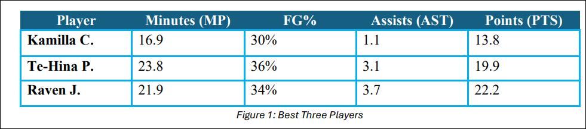
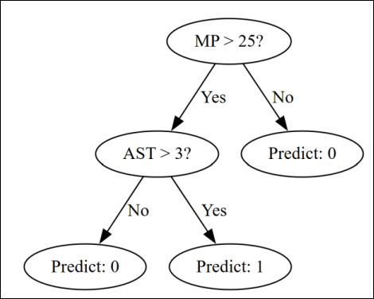
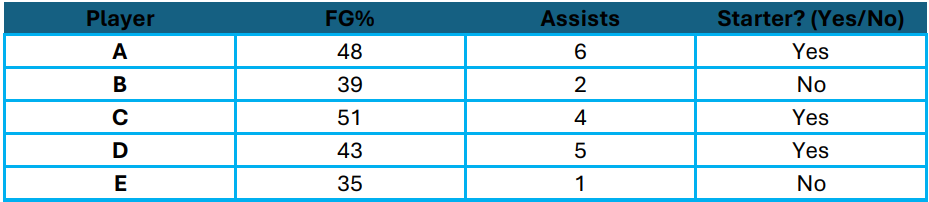
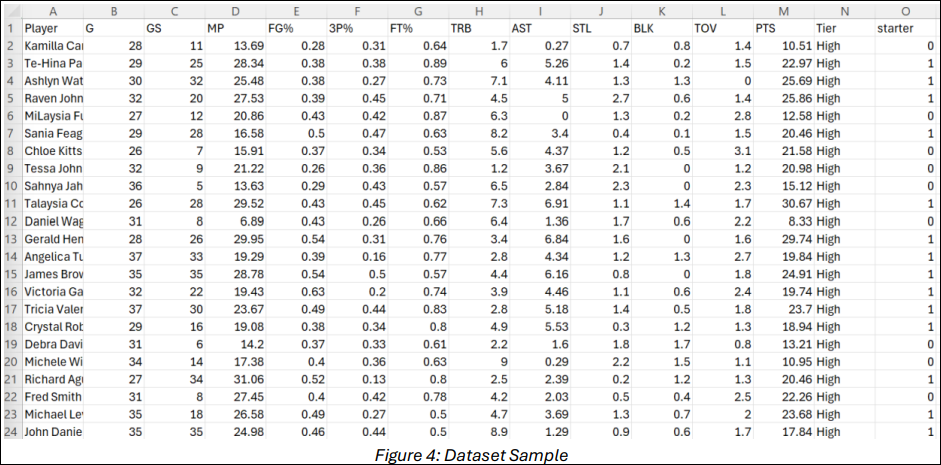

# Lesson 13: Classifying Players Using Decision Trees

## Lesson Description:
In this lesson, students will act as basketball scouting analysts and use real-world South Carolina sports data to classify players as starters or non-starters. They will build a decision tree classification model using Azure ML Designer and learn how the model “splits” data to make predictions. Students will select features, build a model using the Two-Class Decision Forest module, and interpret the model’s accuracy and decision process using Azure’s built-in evaluation tools.

## Main Learning Goal:
Students will use Azure ML Designer to train and evaluate a decision tree classifier and 
analyze how the model splits input features to predict player categories.

### Essential Question:
How can a decision tree help us recognize patterns in sports data and make accurate 
classification decisions?

### Standards:
- AP6.2 – Use decision trees and linear regression to make predictions and classifications. (Note: Linear regression is addressed in Lesson 11; this lesson focuses on decision 
tree classification)

### Objectives:

- Select relevant features from a dataset to train a classification model
- Use Azure ML Designer to build a decision tree pipeline
- Predict player classifications (starter vs. non-starter) using model output
- Evaluate model performance using Azure's scoring and evaluation tools
- Reflect on how the model splits input data and makes decisions

### Scouting with Data – Who Starts?

**Pick Your Starters**

**Imagine this scenario:**

You’ve been hired as the head analyst for a South Carolina high school basketball team preparing for the playoffs. Your job? Help the coach choose the best starting three players 
— using data, not gut instinct.

Refer to Figure 1 below for more information.

**Answer the following questions:**
   
   - Q1: Which of these players would you start — and why?
   
   - Q2: What patterns do you see that might suggest who’s a strong starter?
   
   - Q3: Could we create a rule based on minutes or assists to make this decision?

**Let’s brainstorm:**

- If you had to write a rule like: “Start the player if…,” Q1: what would it be?

    - There are many perspectives — you may value points, assists, FG%, or time played.

Now we understand that humans use pattern logic to classify — and that this logic can be learned by machines.

**What Is a Decision Tree?**

Let’s explore how a machine might learn to classify players like we just did — using something called a Decision Tree.

**Key points:**

- A decision tree is like a flowchart.
- It learns splits in the data — like “Is minutes per game greater than 25?” — to separate players into groups.
- Each branch leads to a prediction: Starter (1) or Non-Starter (0).
- The tree keeps splitting until it’s confident about its decisions.

**Real example:**
A decision tree might learn that:

- Players with MP > 25 and AST > 3 are often starters.
- Players with low minutes and low assists are usually not.

**Be the Algorithm**

**Imagine the following scenario:**

The coach is choosing a new starter and gives you stats for 5 players. Your job is to predict if a player should start or not using just two features: Field Goal Percentage (FG%) and 
Assists per game.

**Step 1: Review the Data**

  - Analyze Figure 3 below.

    

**Step 2: Build Your Decision Tree**
  
  - Start with all 5 players.
  - Ask yourself: Q1: What is the best first split? (e.g., “FG% > 45?” or “Assists > 3?”)
  - Create two branches based on that condition.
  - Repeat the process until each leaf ends with only “Yes” or “No.”

**Step 3: Draw and Explain**
**On a blank sheet:**

   1. Draw your tree structure
   2. Label your conditions at each split
   3. Write a 2–3 sentence explanation:

       • Q1: Why did you choose those splits?

       • Q2: Which feature seemed more important?

**What Is a Decision Forest? Why Are We Using It?**

You just learned how a decision tree works. It creates a flowchart by asking yes/no questions like:
   
   • Q1: Did the player average more than 25 minutes per game?
   
   • Q2: Did they have more than 3 assists?

Each question helps the model split the players into smaller and smaller groups, until it can predict whether a player should be a starter (1) or non-starter (0).

But instead of using just one decision tree, the model we’ll use in Azure ML Designer builds a whole group of trees. This is called a Decision Forest — and it works a little differently.

**What Is a Decision Forest?**

A Decision Forest is made up of many decision trees — sometimes 50 or 100 — all working together.
 
 - Each tree is trained on slightly different versions of the dataset.
 
 - Each tree creates its own flowchart with its own rules.
 
 - When a new player’s stats are given, each tree makes a prediction: starter or not.

**Then comes the important part:**

  - The forest collects the predictions from all the trees and votes.
  
  - The answer with the most votes is the final prediction.

**Example:**
  - 65 trees say “starter”
  - 35 trees say “non-starter”
  - The final answer is “starter” (because most trees said so)

This voting method makes the model stronger and more accurate than any single tree.

**Why Is a Forest Better Than One Tree?**

Let’s say one tree sees an unusual player who only played 10 minutes but scored 20 points. That might confuse the tree and lead to a bad rule.
**But in a forest:**
   
   - Other trees won’t be fooled by that one strange player.
   
   - They’ll focus on the overall patterns in the data.
   
   - The final vote balances out mistakes from individual trees.
**So a forest:**

   - Reduces mistakes from outliers or weird patterns

   - Finds better rules by combining many ideas

   - Makes more accurate predictions in most cases

**In conclusion:**

A Decision Forest is like having 100 different coaches vote on each player instead of just one. The result is more reliable — and better for making smart, data-based decisions.

**What Does “Two-Class” Mean?**

“Two-Class” means the model is predicting between two possible categories.
**In this case:**
 - 1 = Starter
 - 0 = Non-Starter

**Example:**

- The model will look at a new player’s stats — minutes, FG%, assists, etc. — and predict whether they should be classified as a starter or not. 

- It’s making a prediction, not a hard rule. And that prediction is based on patterns the model has learned from past data.

**Transition**
Answer to the following questions to check your understanding and share your thoughts with the class.
   
   - Q1: If I gave the model only points per game, would it be enough to make a decision?
   
   - Q2: What do you think will happen if we train the model with bad or incomplete data?
   
   - Q3: Would you trust a machine to make this decision — and why?

**Draw Your ML Pipeline Instructions:**

1. Use the second page of your SREB_U5_L13_Handout or a blank sheet.

2. Sketch your own pipeline diagram for building a model that predicts whether a player is a starter.

3. You must include and label all key components.

4. You should draw arrows showing how the components connect.

**Bonus Challenge:**
   - Highlight where the label column is selected
   - Circle which part of the pipeline is responsible for training
   - Mark which part does the evaluation

**After drawing, discuss the following questions:**

 - Q1: Did everyone include Split Data? Why is it important?
 
 - Q2: Where is the label used, and what happens if you forget it?
 
 - Q3: What happens in the “Score Model” stage?

> Let’s continue with the next part of the lesson. You’ll build a full machine learning pipeline in Azure ML Designer. You’ll select player stats, train a Two-Class Decision Forest, and 
evaluate how well it classifies new players as starters. Let’s find out how this model learns to think like a coach — or maybe even better.

### Training a Decision Tree to Classify Starters

#### Understanding the Dataset

Before you build your classification model, take time to understand the dataset you’re working with. The goal of this lesson is to use real basketball performance data to predict 
which players are most likely to be starters, based on key game statistics.

**Where the data came from**

We started with real team data from the 2024–25 South Carolina Gamecocks Women's Basketball Roster and Stats, which includes each player’s:
   - Games played (G)
   
   - Games started (GS)
   
   - Minutes per game (MP)
   
   - Field goal percentage (FG%)
   
   - Assists (AST)
   
   - Turnovers (TOV)
   
   - Points scored (PTS)
   
   - And more

A sample of the dataset is shown in Figure 4 below.
 

However, to train a supervised learning model, we needed a label column — something the model can learn to predict.

**Why we created a synthetic dataset**

We created a cleaned and enhanced version of the original data for learning purposes:

  - Added a label column: We created a new column called starter using a simple rule: if a player started at least 50% of the games they played, they are labeled 1 (starter), otherwise 0 (non-starter).
  - Removed identifying information: Player names and subjective ratings like Tier are not used for training, so you focus on measurable features.
  - Kept numeric features: Stats like MP, FG%, AST, and TOV are ideal for machine learning because they are consistent and meaningful inputs.
  - Ensured quality: The dataset is small enough to be manageable but large enough to support pattern recognition and evaluation.

This dataset is realistic but controlled — allowing you to focus on how decision trees learn patterns rather than struggling with missing or inconsistent data.

**What if some of your data is missing or blank?**

Answer the following questions:

  - Q1: Have you checked whether all your player stats (like minutes played or field goal percentage) are filled in?
  - Q2: What happens if some rows are missing values?

If your dataset has missing or null values, your model might not train correctly — or could give misleading results.

**What should you do?**

In Azure ML Designer, use the Clean Missing Data component right after importing your dataset.

This tool automatically fills in missing values using strategies like the mean, median, or most frequent value, helping your model stay consistent and accurate.

Now, answer the first question provided on the first page of your SREB_U5_L13_Handout. 

  -  Q1: What happens if player stats like minutes or assists are empty in your dataset?

**What are we trying to do?**

Your goal is to use a decision tree classifier to predict whether a player is a starter using the rest of their stats.

This is a classification problem, not regression, because the model is predicting categories (starter or not), not a number.

