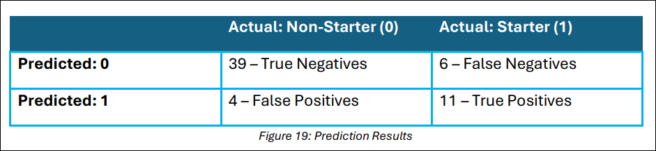
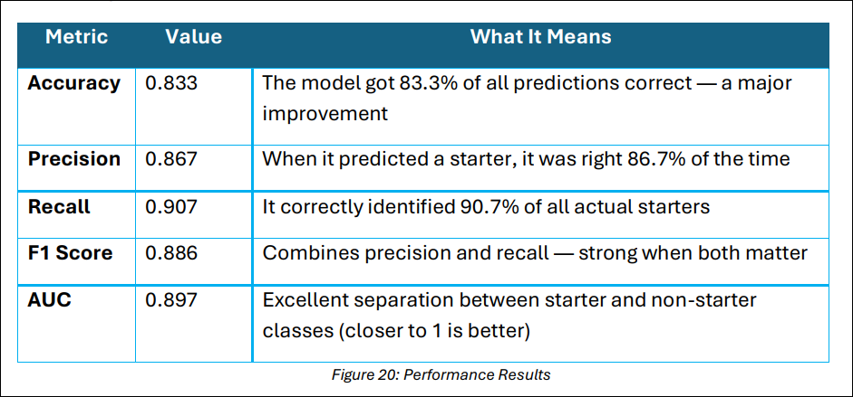

## Evaluation Results

How well did your decision tree model predict basketball starters?

After building and running your machine learning pipeline in Azure ML Designer, Figure 18above, shows how well your model classified players as **starters (1)** or **non-starters (0** )using real performance data.

Let’s explore what each part of the output means and how to use it in your technical memo

### Confusion Matrix

The matrix in the center shows how many predictions the model got right and wrong.Check Figure 19 below.

 

- True Positives (11): Model correctly predicted actual starters
- True Negatives (39): Model correctly predicted actual non-starters
- False Positives (4): Model incorrectly labeled non-starters as starters
- False Negatives (6): Model failed to identify real starters

This is a very strong result. The model made only 10 total mistakes out of 60+ predictions, showing both accuracy and balance.

### Performance Metrics (Left Panel)

Look at Figure 20 below.

 

### Why this matters:

These numbers show the model is confident and effective. It finds the most real starters and rarely makes incorrect guesses.

#### Curves – Visualizing Model Confidence

You’ll see three performance curves at the top. Here’s how to read them:

#### ROC Curve (left)

- Plots True Positive Rate vs. False Positive Rate
- The curve reaches near the top-left corner — a sign of excellent prediction power
- This means the model clearly separates starters from non-starters

#### Precision-Recall Curve (middle)

- Shows how the model balances catching real starters (recall) vs. making accurate picks (precision)
- The strong upward bend shows the model maintains high quality even when catching more players

#### Lift Curve (right)

- Compares your model to random guessing
- A steep upward line shows your model is much better than chance
- This means the model gives meaningful confidence scores when making predictions

#### Threshold Slider

The slider (set to 0.5) determines the cutoff:

- Any player with a prediction score above 0.5 is labeled a starter (1)

- Adjusting this would shift the balance between precision and recallWe kept the threshold at 0.5 for balanced performance, which matches most real-world use cases

### Score Bin Table (Bottom)
This table breaks the data into “confidence bins” based on the model’s predicted probability.

Each row tells you:

- How confident the model was (e.g., 0.7–0.8 range)
- How accurate and precise the predictions were at that level
- Where most predictions occurred

Key takeaways:

- The model performs well across many bins, especially 0.4–0.7
- Even at high confidence (0.8+), predictions are still strong
- The model isn't just guessing — it's making meaningful, accurate predictions based on player stats

### Final Verdict: Model Performance Summary

Refer to Figure 21 below.

### Interpret the Tree & Reflect

Now that you have trained and evaluated your decision tree model, this step focuses on helping you reflect on what the model learned, how it made predictions, and how 
trustworthy those predictions are. This reinforces both your technical understanding and critical thinking.

#### Group Discussion:

Form small groups (2–4 students) and discuss the following prompts

Use your Evaluate Model screen and Azure pipeline as evidence during this conversation.

### Individual Reflection:
Write a short reflection (3–4 sentences) responding to the questions mentioned below on your `SREB_U5_L13_Handout`.

- Q1: How did the model decide who is a starter?
Hint: Think about what stats it used most — and how trees make “yes/no” decisions.

- Q2: Do you trust the model’s decisions? Why or why not?

  **Hint:** Use your evaluation results — accuracy, precision, confusion matrix — to support your reasoning.

To finalize the lesson, complete these last three questions on your `SREB_U5_L13_Handout`.

- Q1: What evaluation metric best tells you if your model is making safe predictions? 
- Q2: Would you trust your model to make lineup decisions in a real tournament? Why or why not? 
- Q3: If your model made a mistake, would it be more harmful to miss a starter or to wrongly include a non-starter  

